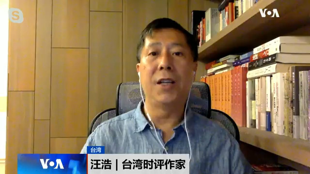
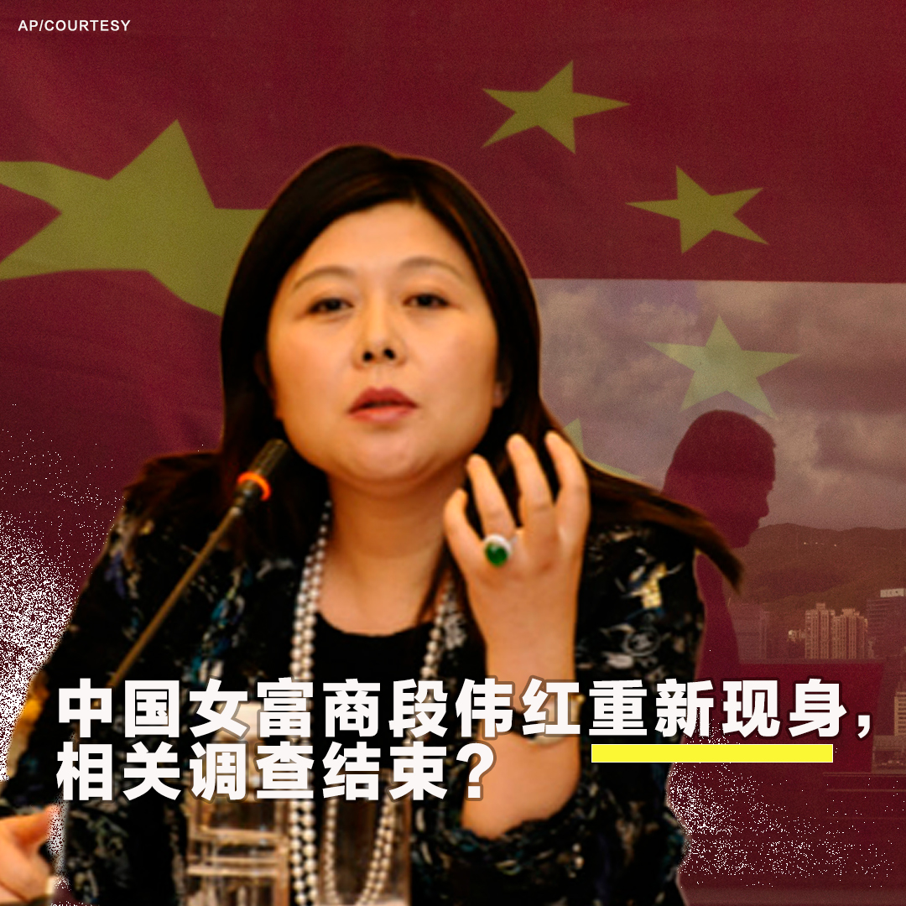
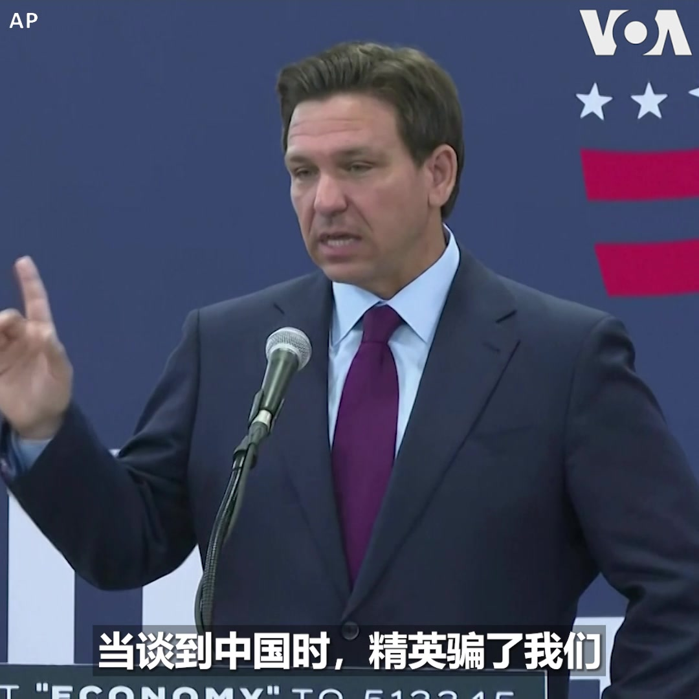
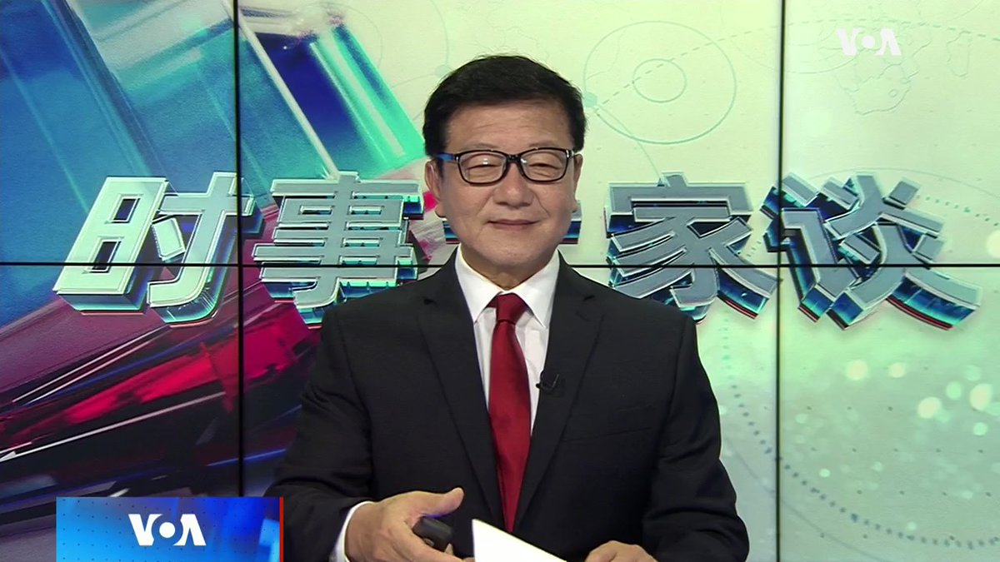
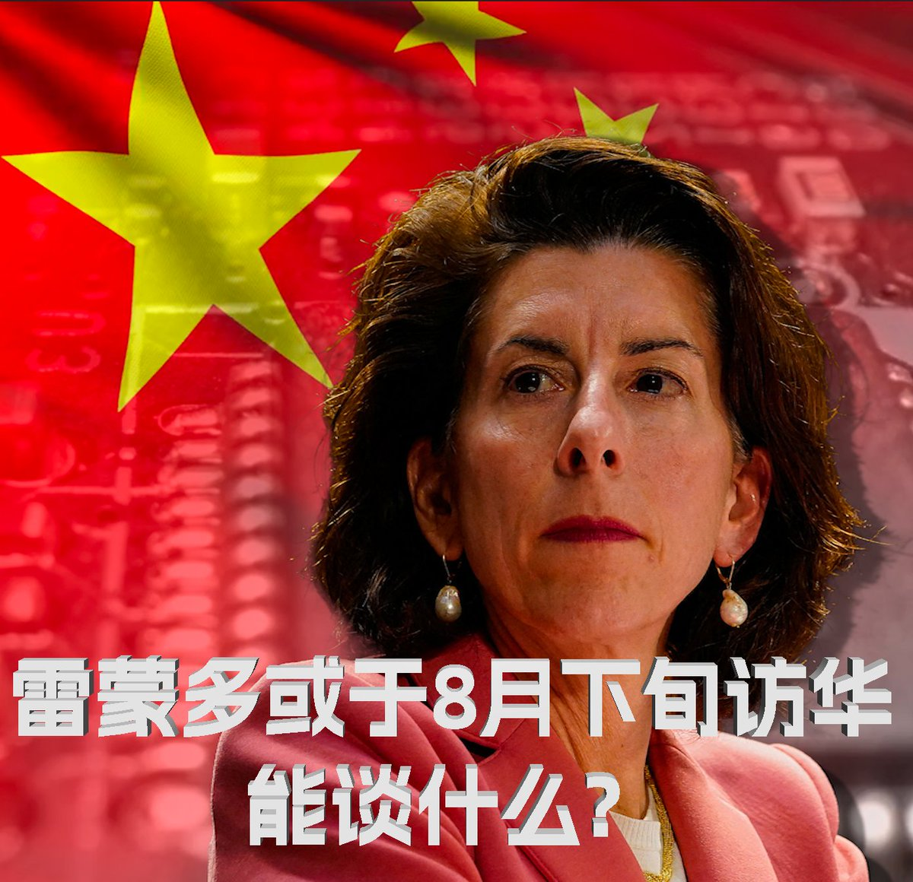

美国之音中文网 北京时间 2023-08-01T05:08:04Z 1686121572699172864 香港泛民建制政坛元老谈政局变化 关注“软对抗”及区议会选举改制 https://t.co/fM0nX7ecnb   美国之音中文网 北京时间 2023-08-01T05:54:03Z 1686133147636023301 美国与欧盟加入西共体的呼吁,要求尼日尔军政权终止政变 https://t.co/mMrjZBRHWe   美国之音中文网 北京时间 2023-08-01T06:00:00Z 1686134644494725120 习近平“新时代”开始后，中国频频举办国际体育盛会和大型国际会议，仅目前和今后几个月就有成都大运会、一带一路峰会和杭州亚运会。为什么“好客天朝”频频做东？“主场外交”成果知多少？台湾时评作家汪浩认为，习近平需要营造万邦来朝，盛世中国的景象。#时事大家谈 完整版：https://t.co/VQdFX9kBVJ https://t.co/LGY5F0DaVq   美国之音中文网 北京时间 2023-08-01T06:28:03Z 1686141703596756993 缅甸军政府延长紧急状态,迫使承诺的选举再次推迟 https://t.co/thGz9aYcrU   美国之音中文网 北京时间 2023-08-01T07:14:03Z 1686153278013534208 “脑雾”等长新冠症状是美国新研究的重点 https://t.co/l22iRxJE57   美国之音中文网 北京时间 2023-08-01T07:30:03Z 1686157306810286080 拜登总统决定将美国太空司令部留在科罗拉多 https://t.co/BaCljC20pI   美国之音中文网 北京时间 2023-08-01T07:30:05Z 1686157314250924034 “俄罗斯人在等我们”：乌克兰军人回顾反攻战斗 https://t.co/EV2RqFtvUX   美国之音中文网 北京时间 2023-08-01T08:00:02Z 1686164852644143108 中俄朝抱团越抱越紧，亚洲再现“新冷战”态势 https://t.co/WPzVWhuf9I   美国之音中文网 北京时间 2023-08-01T09:00:00Z 1686179942541725697 《南华早报》31日报道，中国女富商段伟红消失5年后最近公开现身。其前夫沈栋本月13日在美国国会就在华经商的风险与挑战作证，并曾出版《红色赌盘》一书曝光中国权钱交易内幕。段曾被称为温家宝家族财富的“白手套”，据称她是受中共落马高官孙政才牵连而被捕，她的现身是否显示相关调查已结束？您怎么看 https://t.co/wnhZdxZddq   美国之音中文网 北京时间 2023-08-01T09:30:02Z 1686187502040944640 民主党议员：亨特·拜登的同事描述了与老拜登的闲聊式通话 https://t.co/aPPHHhepap   美国之音中文网 北京时间 2023-08-01T04:39:03Z 1686114271095316481 美参议员里施：TikTok对健康、安全和隐私构成最大的长期威胁 https://t.co/5WRXvh0zlH   美国之音中文网 北京时间 2023-08-01T04:46:12Z 1686116071139598341 正在争取2024年总统大选共和党提名的佛罗里达州州长德桑蒂斯(Ron DeSantis) 7月31日在一个竞选活动上指出，25年前，美国精英阶层相信让中国加入世贸组织会让中国变得更民主，结果中国变得更专制、更强大、更具有野心。“在中国问题上，精英欺骗了我们，他们错了，我们有必要进行纠正，”他说。 https://t.co/PNVk6NmSW1   美国之音中文网 北京时间 2023-08-01T05:14:32Z 1686123203003850752 美国禁止香港特首李家超出席在旧金山举行的APEC峰会给习近平出了一个很大的难题。美中关系学者认为，习近平不会善罢甘休，必定报复美国，危及美中官员酝酿已久的拜习峰会。#时事大家谈 完整版：https://t.co/VQdFX9kBVJ https://t.co/LrxmGuD8Pa   美国之音中文网 北京时间 2023-08-01T05:24:04Z 1686125600606674944 西共体警告尼日尔政变领导人：必须恢复总统职务 https://t.co/ZbVvQHxOZN   美国之音中文网 北京时间 2023-08-01T05:37:23Z 1686128950077243395 彭博社31日报道，美国商务部长雷蒙多计划8月下旬访问中国。分析人士认为，访问时间点很微妙，因为拜登政府可能于8月中旬宣布对华投资限制举措，商务部也可能进一步收紧对华芯片技术出口管制。在这个时间点上，雷蒙多访华能否取得进展？美中经贸问题怎么谈？欢迎分享您的看法。 https://t.co/LzsYYn9Uut   美国之音中文网 北京时间 2023-08-01T05:38:03Z 1686129117614460928 拜登计划前往西部三州，谈论政府治理气候变化的努力 https://t.co/DSHhKyVwOC   美国之音中文网 北京时间 2023-08-01T01:11:06Z 1686061938495889408 中国宣布对较高性能无人机及相关设备强化出口管制 https://t.co/RUcDRZJ86U   美国之音中文网 北京时间 2023-08-01T01:11:08Z 1686061946263777280 VOA专访加州圣盖博市市长丁言愉: 扎根美国拥抱民主 https://t.co/9ljehJp3ad   美国之音中文网 北京时间 2023-08-01T01:53:32Z 1686072619798315031 葡萄牙首都里斯本正在为罗马天主教教宗方济各即将来访做最后准备。教宗方济各预计本星期三抵达里斯本，出席今年的天主教世界青年日大会。这是现年86岁的教宗在今年6月接受疝气手术后首次出访。天主教世界青年日大会每两到三年举办一次。 https://t.co/U0RUPiw6aL   美国之音中文网 北京时间 2023-08-01T02:54:53Z 1686088058691612673 拜登总统和第一夫人吉尔·拜登7月31日在特拉华州休假。两人在罗霍伯斯附近的戈登池塘公园骑自行车游园，并向现场民众挥手致意。白宫宣布，拜登总统下星期将前往亚利桑那、新墨西哥和犹他州，宣传本届政府的经济政策。亚利桑那和新墨西哥两州被认为是明年总统大选的关键州。 https://t.co/tVnn0QW2t0   美国之音中文网 北京时间 2023-08-01T00:31:05Z 1686051868655693826 习近平八一前夕再促军队反腐，火箭军高层换马 https://t.co/sx631sztyK   美国之音中文网 北京时间 2023-08-01T02:10:03Z 1686076776483885061 美国将军表示，美国依赖盟国而不是靠自身扩军在太平洋抗衡中国 https://t.co/fXHTwCEbEP   