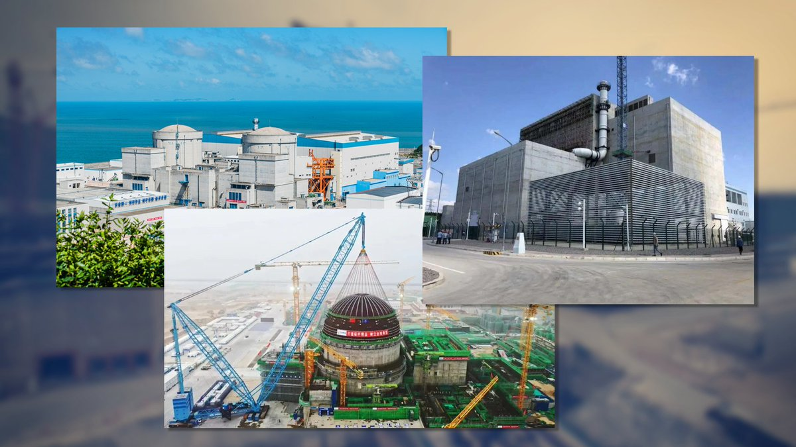
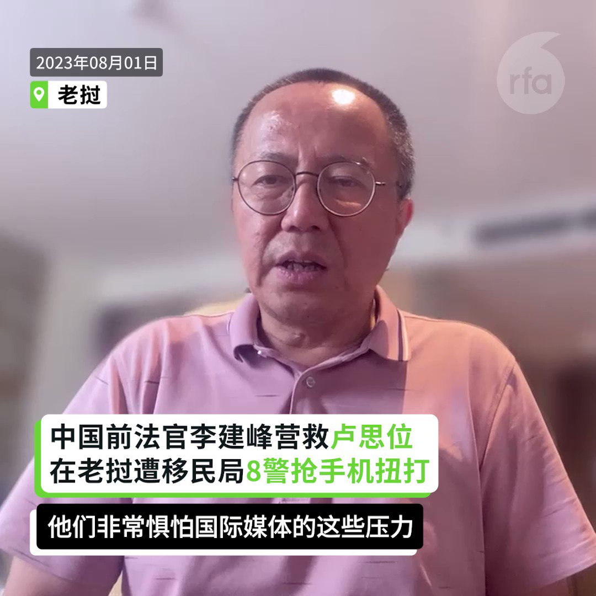
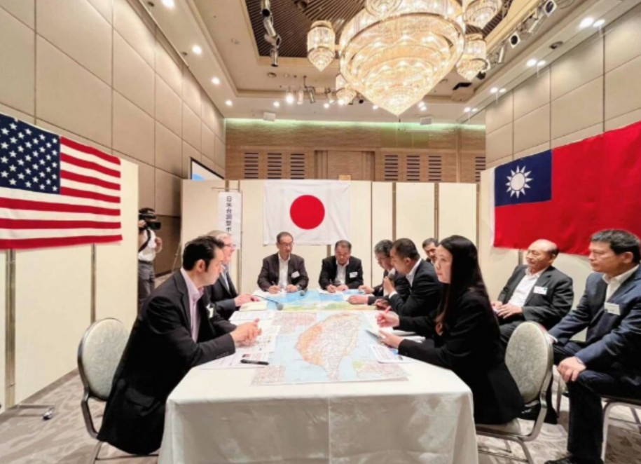
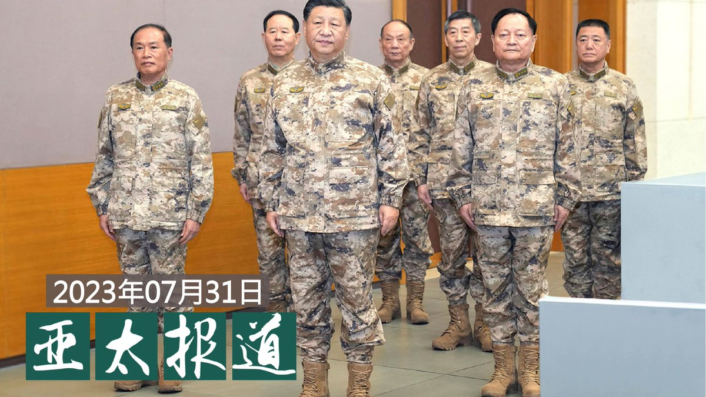
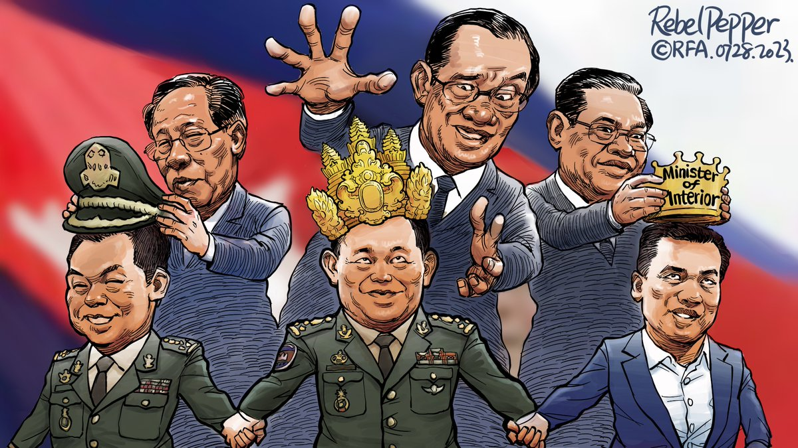
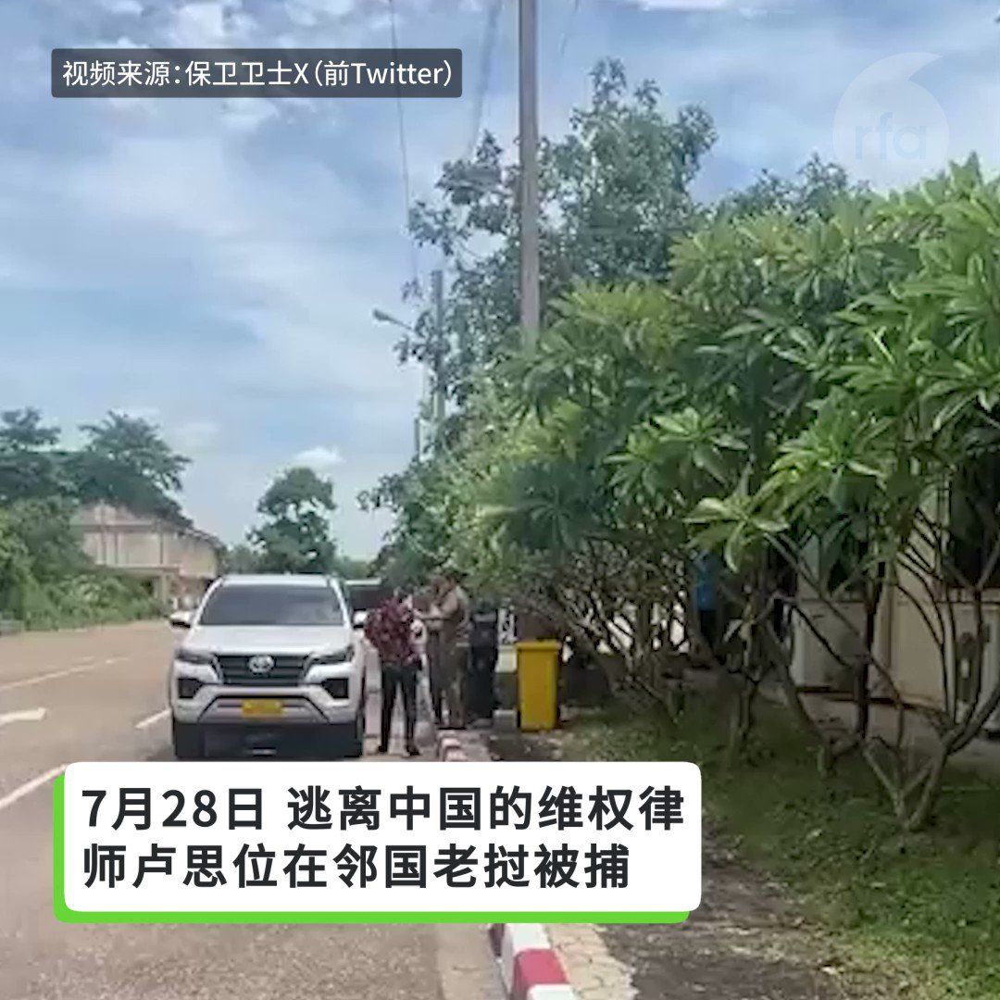
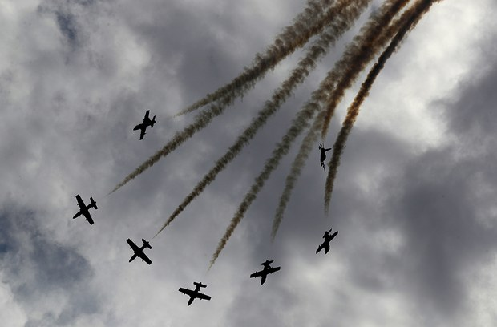

自由亚洲电台 北京时间 2023-08-01T21:54:02Z 1686374733003296771 RT @RFA_Chinese: 《北京市实施〈中华人民共和国反恐怖主义法〉办法》表决通过，2024年起，无人机要实名登记，不接受安检可拒绝进站搭乘地铁，租车、寄快递等将查验身份……您赞成这些随时查验身份的管理办法吗？ https://t.co/kBpMHdnZX4   自由亚洲电台 北京时间 2023-08-01T22:09:37Z 1686378655944146944 RT @RFA_Chinese: 已退役3年的中国 #火箭军 前副司令 #吴国华 近期逝世，7月30日出殡。据其老上司、前中央军委副主席 #张震 的长子张小阳透露，吴国华是在家中三楼厕所上吊身亡，原因是工作压力及家庭不和睦。

 https://t.co/G1Niqkjdxk   自由亚洲电台 北京时间 2023-08-01T22:10:44Z 1686378936744415233 RT @RFA_Chinese: 传出死讯后，微博关注增多，有网民就说：“真不敢相信下个雨都要命”、“天佑京津冀，不要再下了”、“北京政府请关注郊区建设”、“不敢相信这是2023年的北京，这次比河南721还严重，水气还要多”、“很多人还嘲讽北京小题大做，自私到极点。”
#北京暴…   自由亚洲电台 北京时间 2023-08-01T23:02:38Z 1686391997924601856 欧盟执委会主席 ＃冯德莱恩（Ursula von der Leyen)周一（31日）以俄罗斯入侵乌克兰一例，警告中国在有争议的 ＃印太 水域和针对 ＃台湾 日益咄咄逼人的行动，并表示欧盟不会容忍在印太地区的侵略行为。

 https://t.co/QyyWQDDIha   自由亚洲电台 北京时间 2023-08-01T23:45:52Z 1686402878087540736 中国的特定 #无人机出口管制 为期两年，与俄乌战争有关？ https://t.co/evHn9bryIK   自由亚洲电台 北京时间 2023-08-01T16:40:31Z 1686295833640349696 【中国国务院核准三座核电厂新项目】
【民众担忧安全性及战争风险】
中国国务院常务会核准议 #福建宁德、#山东石岛湾、#辽宁徐大堡 核电项目。其中距离台湾最近的宁德核电厂已运行4台机组，二期续建的两台机组，拟采用大陆自主三代核电技术华龙一号，民众担心核电厂缺乏公开透明的监管，担忧引发灾难。
https://t.co/qGQ22cDaLu   自由亚洲电台 北京时间 2023-08-01T17:20:14Z 1686305830621380610 【卢思位在老挝被捕】
【中国前法官李建峰欲探视 遭8警抢手机扭打】
原打算取道泰国赴美的中国维权律师 #卢思位，上周在 #老挝 被捕。在旅程中与卢思位不期而遇的中国前法官 #李建峰，1日赴老挝的移民总局拘留中心探视卢思位却遭到留置审讯，老挝警察试图抢夺李建峰手机，过程中8名警察与他发生扭打。 https://t.co/TfSvQwerdd   自由亚洲电台 北京时间 2023-08-01T18:08:22Z 1686317943955828736 【台湾首次参加美日台海兵推】
【日方：开战恐影响日GDP三成】
中国八一建军节前夕，中俄在太平洋实施海上联合巡航，超过10艘军舰穿过日本宗谷海峡。日本防卫副大臣 #井野俊郎 近期接受英媒访问表示，如果中国对台动武，日本很有可能向台湾提供某种支持。#日本战略研究论坛(JFSS)本月中，在东京举办第三次 #台海危机 兵棋推演，台湾首次获邀参加。当 #台湾有事即日本有事，成为日本政坛关切焦点，日方推估若台海开战，日本海上运输线受阻，将影响日本GDP 3成。
https://t.co/tUmNeerZ5f   自由亚洲电台 北京时间 2023-08-01T12:29:11Z 1686232584877957120 RT @RFA_Chinese: 因代理敏感案件而被当局吊销执照的中国维权律师 #卢思位 逃离中国后，周五（28日）在老挝被捕。
活动人士和家人担心他将被遣返回中国，面临酷刑和监禁。卢思位在洛杉矶的太太 #张春晓 女士紧急呼吁国际社会帮助。… https://t.co/bkBz…   自由亚洲电台 北京时间 2023-08-01T13:42:11Z 1686250957682921472 RT @RFA_Chinese: 【北京 #河北 持续 #暴雨 红色预警】
【多地山洪暴发汽车被冲走】
#北京 市31日发布洪水 #红色预警，#房山 区大石河流域漫水河断面出现红色预警标准洪水，升级发布洪水红色预警。
7月31日，门头沟因暴雨向永定河泄洪，周边主干道路全部临时管…   自由亚洲电台 北京时间 2023-08-01T11:03:22Z 1686210987559362560 RT @RFA_Chinese: 【#亚太报道（2023-7-31）】
欢迎收听和订阅播客【亚太报道】 https://t.co/MjLNSvVMqc

#北京 多处 #山洪 爆发至少2人死亡 / 律师 #卢思位 被遣返中国进入倒计时 / 7月PMI持续在荣枯线下 / 习近平晋…   自由亚洲电台 北京时间 2023-08-01T11:03:33Z 1686211032719523841 RT @RFA_Chinese: 《北京市实施〈中华人民共和国反恐怖主义法〉办法》表决通过，2024年起，无人机要实名登记，不接受安检可拒绝进站搭乘地铁，租车、寄快递等将查验身份……您赞成这些随时查验身份的管理办法吗？ https://t.co/kBpMHdnZX4   自由亚洲电台 北京时间 2023-08-01T10:21:28Z 1686200445222744064 评论 | #江棋生：推介 #许成钢 先生的《驱散迷雾》
https://t.co/8r5LSBTDQm   自由亚洲电台 北京时间 2023-08-01T05:59:49Z 1686134597564973063 《北京市实施〈中华人民共和国反恐怖主义法〉办法》表决通过，2024年起，无人机要实名登记，不接受安检可拒绝进站搭乘地铁，租车、寄快递等将查验身份……您赞成这些随时查验身份的管理办法吗？ https://t.co/kBpMHdnZX4   自由亚洲电台 北京时间 2023-08-01T06:41:28Z 1686145080284102662 【#亚太报道（2023-7-31）】
欢迎收听和订阅播客【亚太报道】 https://t.co/MjLNSvVMqc

#北京 多处 #山洪 爆发至少2人死亡 / 律师 #卢思位 被遣返中国进入倒计时 / 7月PMI持续在荣枯线下 / 习近平晋升新任 #火箭军 司令 / #高校毕业生就业数据造假 引发社会反响 https://t.co/NIcLHVbHcN   自由亚洲电台 北京时间 2023-08-01T05:03:55Z 1686120529948999680 评论 | 王丹 @wangdan1989：#秦刚 事件的两大疑点
 https://t.co/PaC5ufBGU2   自由亚洲电台 北京时间 2023-08-01T05:28:09Z 1686126628718665728 【#变态辣椒：自1985年开启的家天下】
在统治 #柬埔寨 近四十年后，强人 #洪森 宣布将把权力移交其长子 #洪玛内。处于执政党世代更替中心的是四星将军、曾任柬埔寨陆军司令的洪玛内，而现任国防部长及内务部长也将把职务交给洪森的另外两个儿子。 https://t.co/mqN7LV8Kjg   自由亚洲电台 北京时间 2023-08-01T05:31:37Z 1686127498395013120 专栏 | #夜话中南海：#秦刚 是否进 #秦城， 先看能否保住党籍
 https://t.co/j39xt5NnsH   自由亚洲电台 北京时间 2023-08-01T01:39:07Z 1686068990261518336 RT @RFA_Chinese: 【北京 #河北 持续 #暴雨 红色预警】
【多地山洪暴发汽车被冲走】
#北京 市31日发布洪水 #红色预警，#房山 区大石河流域漫水河断面出现红色预警标准洪水，升级发布洪水红色预警。
7月31日，门头沟因暴雨向永定河泄洪，周边主干道路全部临时管…   自由亚洲电台 北京时间 2023-08-01T01:47:45Z 1686071161548050432 两年一度的 #世界警察及消防运动会（2023 World Police &amp; Fire Games），本届在加拿大举行，#香港警察代表队 在加拿大游街时对港人叫嚣恐吓。
 https://t.co/EaRKUoWth0   自由亚洲电台 北京时间 2023-08-01T02:33:58Z 1686082793229471744 因代理敏感案件而被当局吊销执照的中国维权律师 #卢思位 逃离中国后，周五（28日）在老挝被捕。
活动人士和家人担心他将被遣返回中国，面临酷刑和监禁。卢思位在洛杉矶的太太 #张春晓 女士紧急呼吁国际社会帮助。
卢思位曾接手过很多敏感案件，包括为“709案”被捕维权律师辩护，及为成都“六四纪念酒瓶案”被捕者辩护。他还积极参与新公民运动，曾因参加厦门聚会而被当局传讯。2021年，卢思位因代理12港人案而被吊销律师执照。同年晚些时候，他被禁止离开中国赴美做访问学者，并被告知他受到边控。   自由亚洲电台 北京时间 2023-08-01T03:13:40Z 1686092786293170179 已退役3年的中国 #火箭军 前副司令 #吴国华 近期逝世，7月30日出殡。据其老上司、前中央军委副主席 #张震 的长子张小阳透露，吴国华是在家中三楼厕所上吊身亡，原因是工作压力及家庭不和睦。

 https://t.co/G1Niqkjdxk   自由亚洲电台 北京时间 2023-08-01T03:58:35Z 1686104088432480256 #事实查核｜英国打造"海上监狱"关押非法移民？
 https://t.co/eBaOiJHmwM   自由亚洲电台 北京时间 2023-08-01T01:00:26Z 1686059256439840768 澳大利亚"礼顿城市运输集团"旗下子公司 "礼顿亚洲"(Leighton Asia),被指涉及香港多宗劳资争议事件。但"#港版国安法"2020年实施以来, #香港劳工 抗争权利受到压制。近日， 澳大利亚的工运人士成立了名为"无礼"(Leight's Out)的组织, 声援涉及 #礼顿亚洲 劳资纠纷的香港工人。

 https://t.co/csM7pyeqJn   自由亚洲电台 北京时间 2023-08-01T01:15:36Z 1686063070525734932 https://t.co/0GiXwYzDRh   自由亚洲电台 北京时间 2023-08-01T02:20:47Z 1686079477032648704 最新消息，#卢思位 已被送到老挝机场旁的移民总局拘留中心，中国大使馆人员已守候在场，意味他可能很快会被送回中国。
卢思位身在美国的妻子担心丈夫回中国后会遭受监禁和酷刑对待，希望把握最后机会向国际社会求救。

  https://t.co/vjHpKffJDn   自由亚洲电台 北京时间 2023-08-01T00:15:47Z 1686048018745995264 【中国和阿联酋将在新疆举行首次空军联训】
据中国国防部消息，中阿“猎鹰盾牌-2023”空军联合训练将于8月在中国新疆举行。这将是中阿首次举行空军联训。
目前，中国正在中东地区扩大影响力。4月，在透过斡旋令沙特与伊朗重建外交关系后 ，中国加强了与沙特的商业和安全联系，并把沙特拉入上合组织。 https://t.co/4Wg9bqwLGb   