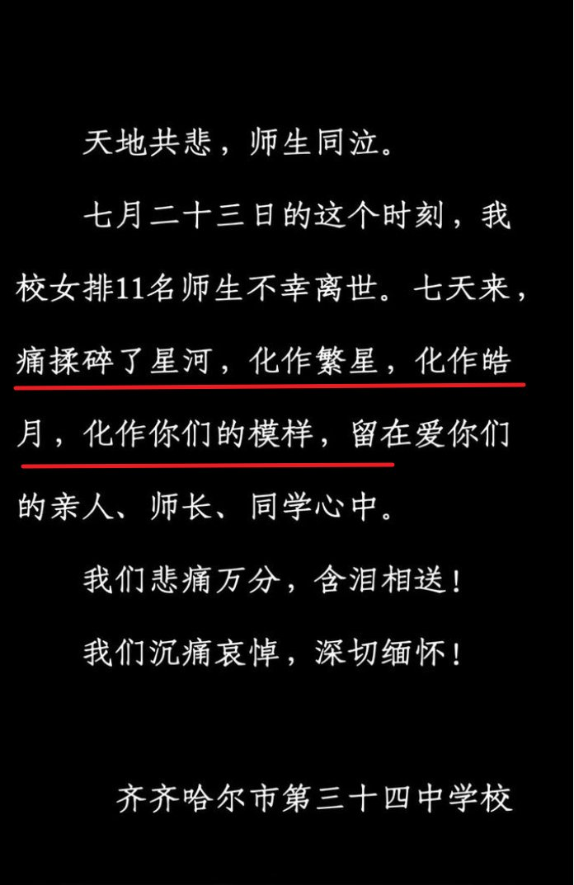
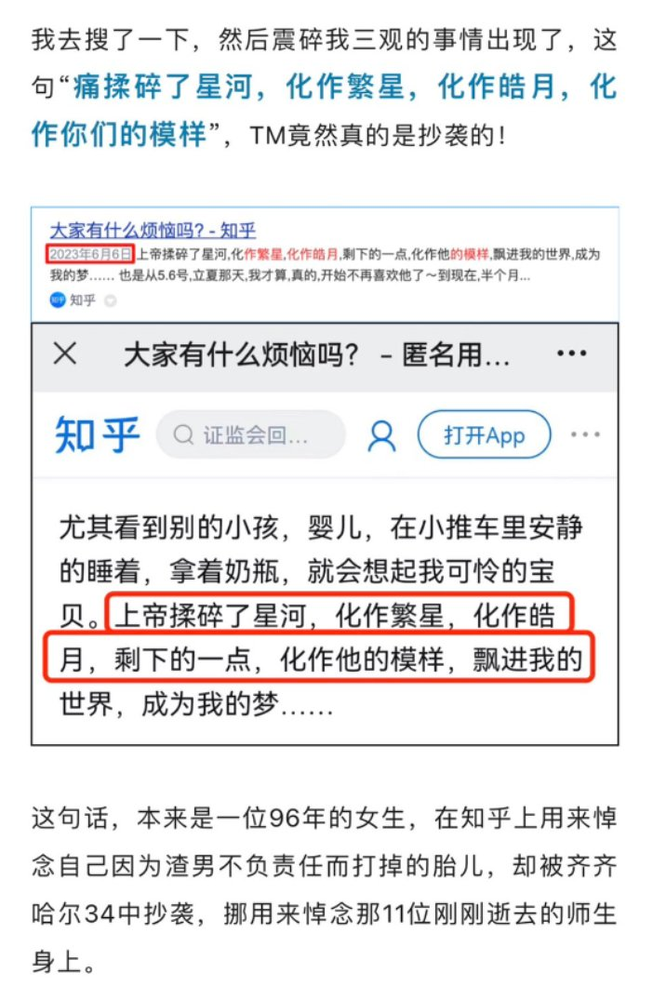

A李老师不是你老师 北京时间 2023-07-31T01:35:40Z 1685705733717782528 诚意何在？
7月29日，齐齐哈尔三十四中学发布悼文缅怀遇难学生。
然而有网友发现，除了悼文是套用模板以外，全篇悼文里唯一一句话竟然还是抄袭的。
这不禁让人想问，三十四中难道对自己遇难的师生连一句发自肺腑的真心话都说不出来吗？
34中女排一直为学校摘金夺银争取荣誉，而当训练中体育馆发生坍塌，学校竟然只想着如何敷衍了事推卸责任，实在是让人心寒。   A李老师不是你老师 北京时间 2023-07-31T00:01:04Z 1685681925728411648 7月30日，杭州地铁上，一名中年人在车厢里唱完《没有共产党就没有新中国》后发表演说，称 “如果谁跟共产党再打架，我就让他死！” https://t.co/ca8dit7ZUc   