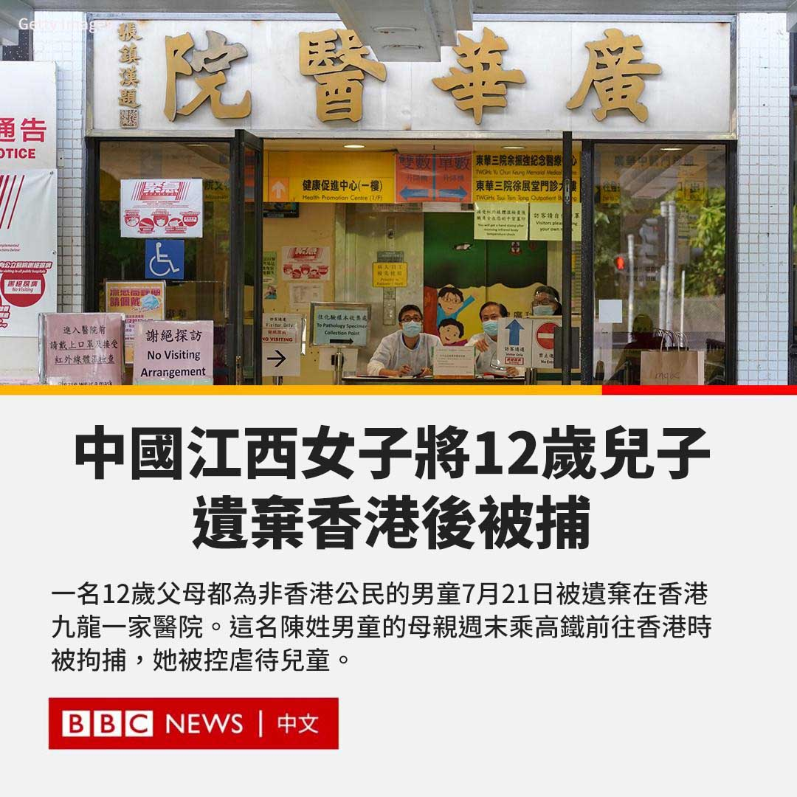
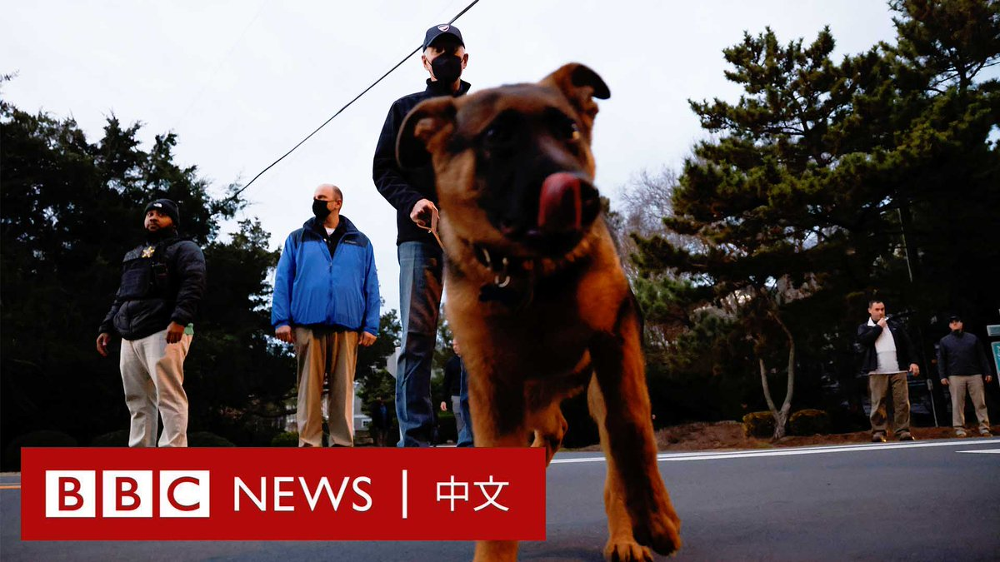

D英国广播公司BBC 北京时间 2023-07-31T15:46:29Z 1685919847732178944 在也门，许多孩子从出生开始便在内战的阴影下成长。政府军和胡赛武装从2014年开始冲突不断。据联合国统计，战争已在过去九年导致11,300名儿童死亡或伤残。 https://t.co/zKdwDdJsrG   D英国广播公司BBC 北京时间 2023-07-31T12:54:50Z 1685876653598420992 一名中国江西女子因涉嫌将她12岁的儿子遗弃在香港九龙一家医院而被捕。

据报道，她的儿子是一名“双非”男童。该词语是指父母皆非香港公民而在香港生育的儿童，这些孩子拥有香港永久居留权，但父母无权留在香港。

这名陈姓男童的母亲上周末乘高铁前往香港时被拘捕。她被控虐待儿童。

香港媒体报道称，这名男童于本月中旬先跟随母亲来到香港，入住了一家宾馆。四天后，他的母亲涉嫌于广华医院急症室内遗弃男童，并返回中国大陆。

多家媒体报导说，当时这名母亲对医院称该男童有腹泻、咳嗽的情况，随后将他独自留在医院接受治疗，自己则不辞而别。

这名男童2011年在香港出生后便返回中国内地居住，在香港并没有亲朋和住所。

据报道，他的母亲因听闻儿子可以在香港得到较优良的教育，因此指示孩子告知护士“自己被妈妈遗弃了”。BBC无法独立证实该说法。

香港警方后来联络男童母亲，要求其返回香港。

该案件周一（7月31日）提堂。据报道，这名母亲获准以5000元港币保释，但需交出旅行证件。

香港特区行政长官李家超上周曾表示，该事件“非常不应该”，他心中“非常不舒服”，会审视男童的父母是否要负法律责任。   D英国广播公司BBC 北京时间 2023-07-31T10:56:01Z 1685846750324797440 俄罗斯首都莫斯科周日（7月30日）遭到无人机袭击，画面显示有高楼发生爆炸，火光冲天。

俄罗斯国防部指袭击由乌克兰策划，两座办公楼的外墙受到轻微损坏。

乌克兰没有直接回应该事件，但总统泽连斯基表示，战争“正回到俄罗斯领土”。 https://t.co/rql9IqbukQ   D英国广播公司BBC 北京时间 2023-07-31T08:52:54Z 1685815766132707328 多年以来，在中国男足持续得到更多资源，成绩却令人失望的时候，中国女足一直被视为球迷的骄傲。无论在本届世界杯的最终成绩如何，中国女足在国内都被视为英雄，甚至被爱戴她们的球迷称为“铿锵玫瑰”。https://t.co/5QXAG2egKL   D英国广播公司BBC 北京时间 2023-07-31T09:02:21Z 1685818145154682886 自2022年10月起至今年1月，拜登爱犬“指挥官”至少发生10次攻击行为，连续咬伤7名白宫特勤人员，其中1人伤势严重，需送医治疗。白宫发言人称，这是因为它“压力很大”，目前正在被加强训练。 https://t.co/HzkzgJq3IZ   