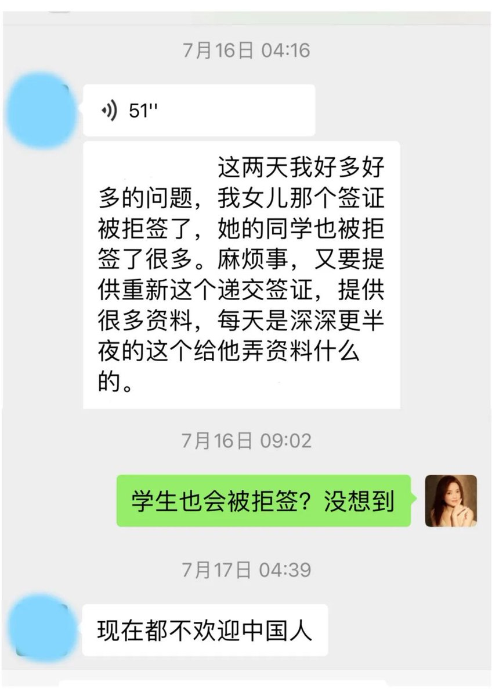
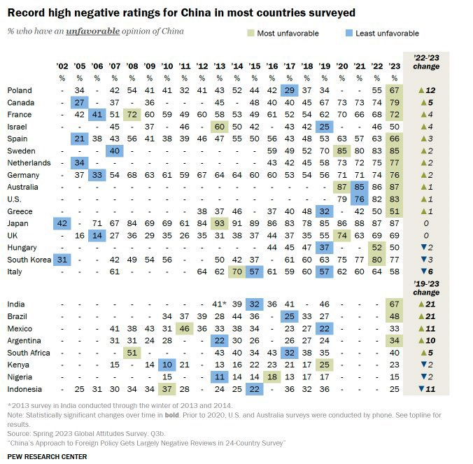
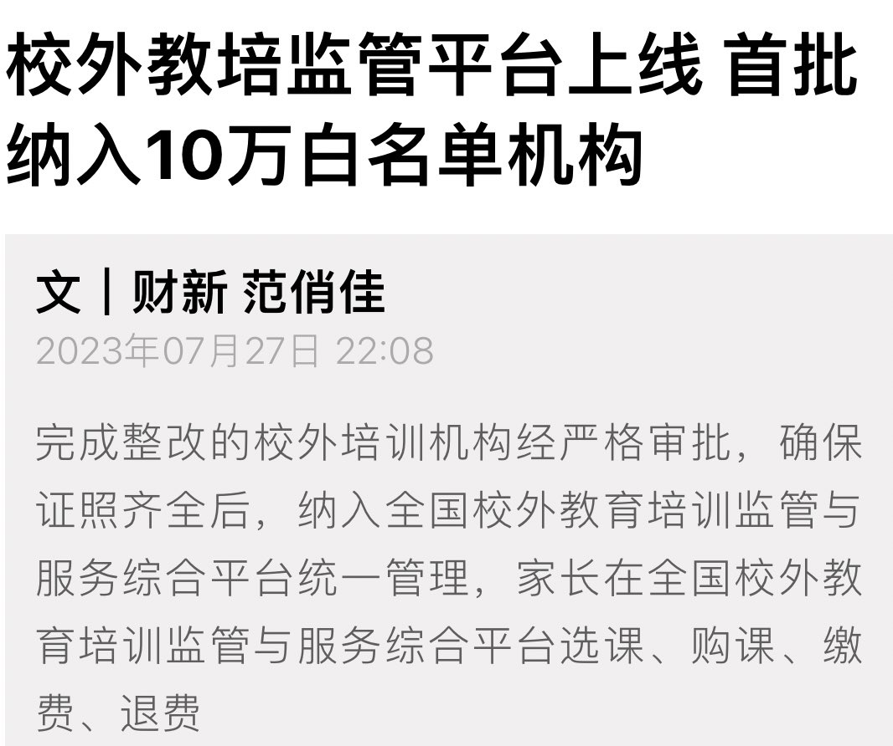
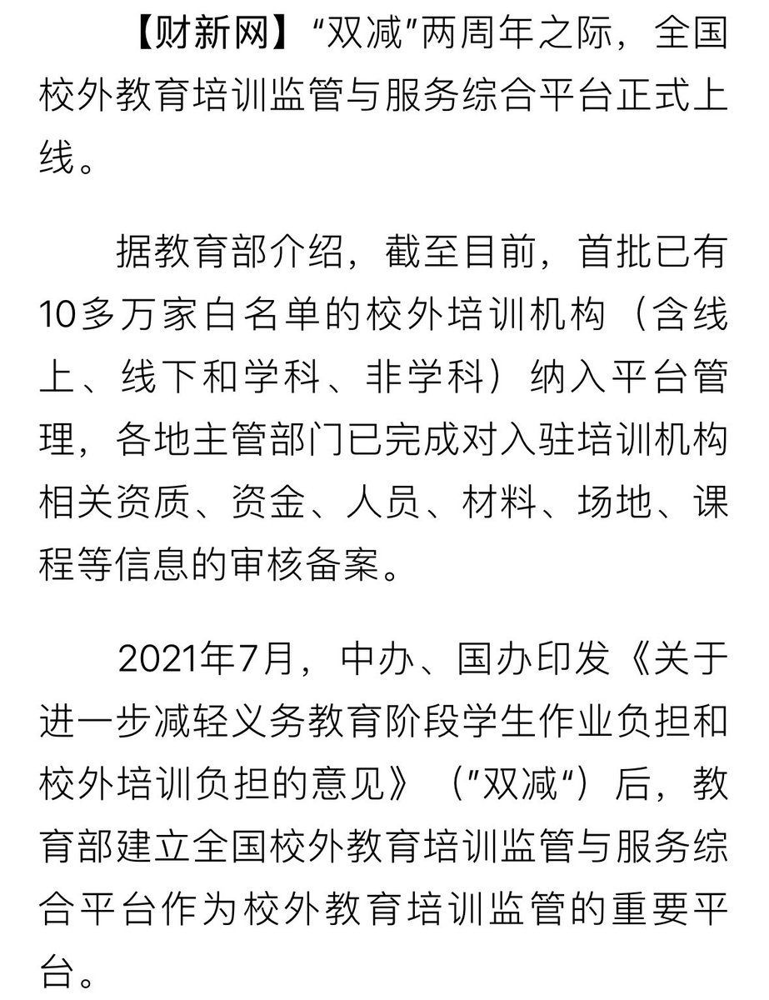
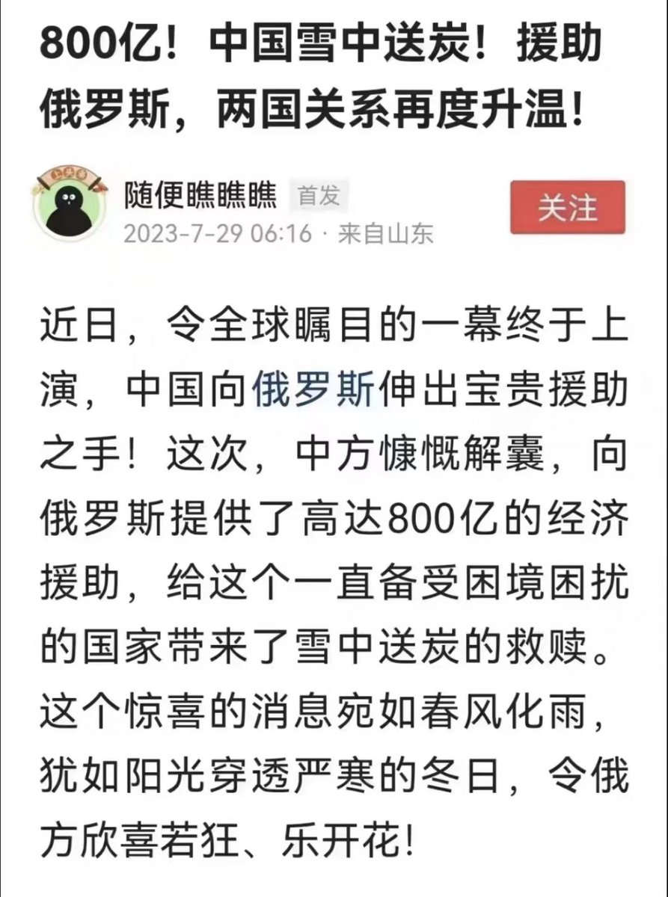

Petrichor 北京时间 2023-07-31T17:11:04Z 1685941136777428992 转发：不否定文化大革命，那叫没良心；
想否定改革开放，那叫没头脑。可惜有的大权在握的人即没良心也没头脑。这个观点很重要，只是80后没有多少人知道文化大革命。00后没有多少人感谢改革开放。就怕政治上重回文革、经济上返回改开之前。但是，小粉红的思想和红卫兵、拳匪差别不大，这才是最可怕的。   Petrichor 北京时间 2023-07-31T10:35:38Z 1685841622070693891 中国日降雨量最大不是出现在南方而是北方。1977年8月1日到2日，在陕西与内蒙古交界的毛乌素沙漠里，两日降水量高达1400毫米，相当于北京两年半的降水量。排名第二的是河南泌阳县林庄，1975年8月7日，受超强台风莲娜影响，日降雨量达到了1060毫米，最终酿成震惊世界的板桥水库溃坝惨剧。   Petrichor 北京时间 2023-07-31T10:45:50Z 1685844187118235648 美、英、法、德、加、日、瑞典、印度、巴西、阿根廷等国家的民众，对中国的非正面评价达到了新高。孔子说：君子之德风，小人之德草，草上之风必偃。意思是君子的道德是风，小人的道德是草，草往哪个方向倒，不是草的责任，而是风的责任。国家的形象不佳，不是老百姓的责任，而是习主席和外交部的责任。 https://t.co/AKQcNiT50M   Petrichor 北京时间 2023-07-31T10:53:37Z 1685846144729919488 仅两年，烧饼又翻过来。那一面已经烤糊了。中央又让搞校外教培了，以期增进就业和消费？早知今日 何必当初。治大国如翻大饼，10里山路不换肩是不行的。 https://t.co/PdQOl6eO2O   Petrichor 北京时间 2023-07-31T10:59:24Z 1685847600304459776 花钱买坏名声，与世界为敌，岂不是一步臭棋。 https://t.co/NKTInq4U6m   Petrichor 北京时间 2023-07-31T01:32:10Z 1685704852188405761 中俄两国之间有没有领土纠纷？老百姓说有，但政府说没有。历史上的领土纠纷，不再具有现实意义？失去的，就甘愿一劳永逸地放弃？ https://t.co/haJrjCl9gh   