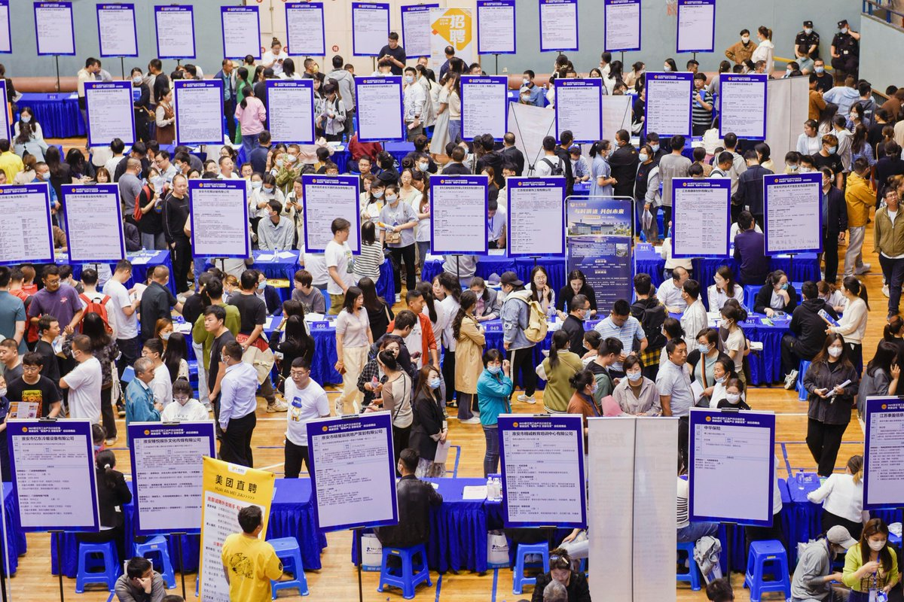
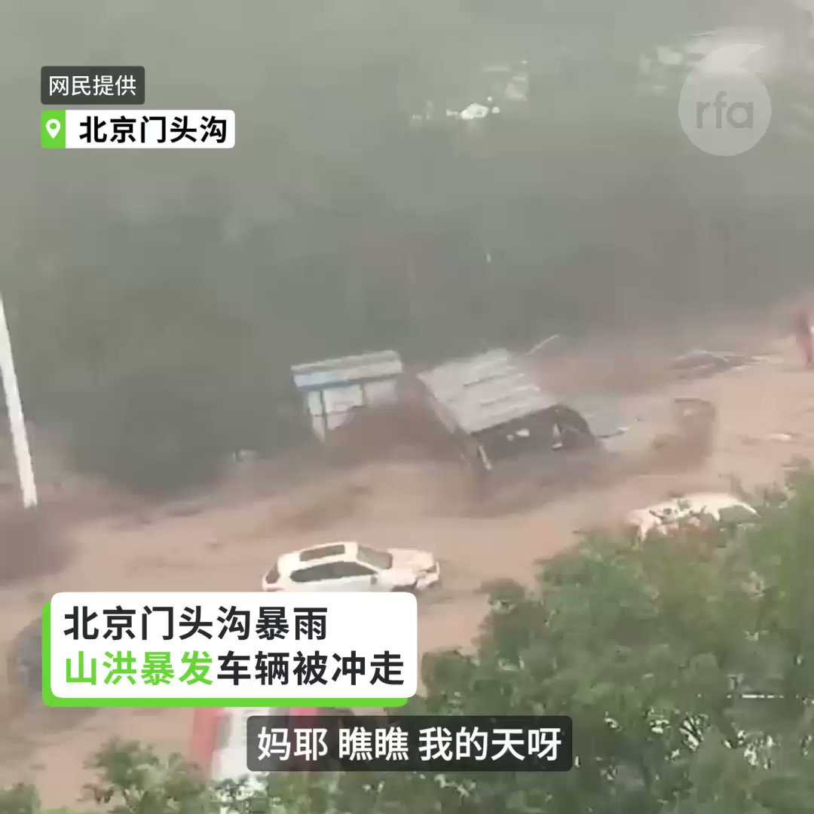

自由亚洲电台 北京时间 2023-07-31T23:24:58Z 1686035230816432129 传出死讯后，微博关注增多，有网民就说：“真不敢相信下个雨都要命”、“天佑京津冀，不要再下了”、“北京政府请关注郊区建设”、“不敢相信这是2023年的北京，这次比河南721还严重，水气还要多”、“很多人还嘲讽北京小题大做，自私到极点。”
#北京暴雨 #门头沟 

 https://t.co/kpqwhv26Ld   自由亚洲电台 北京时间 2023-07-31T18:27:41Z 1685960416365862912 【官方下架高校毕业生“#就业注水”报道】
【官宣呈反效果“被维稳”】
官媒《#半月谈》揭露高校为毕业生 #就业 #数据造假 的手法，引起社会大回响后，再将文章下架。评论称，由官媒公开高校为毕业生就业造假已久的问题，无法回应民意，更影响社会稳定，同时突显中国是长期数据造假的国家。
https://t.co/NRnbDYZcOa   自由亚洲电台 北京时间 2023-07-31T21:52:21Z 1686011920615108608 中国国家统计局31日公布，7月份 #制造业采购经理指数 (PMI)为49.3%，比上月上升0.3个百分点。统计局称 #制造业景气水平 持续改善。然而，指数连四个月都在荣枯线以下，景气仍呈现萎缩状态。
有台商对本台表示，中国期待以消费拉动经济增长不如预期。

 https://t.co/DqDdEDzXml   自由亚洲电台 北京时间 2023-07-31T16:24:23Z 1685929387039113216 【北京 #河北 持续 #暴雨 红色预警】
【多地山洪暴发汽车被冲走】
#北京 市31日发布洪水 #红色预警，#房山 区大石河流域漫水河断面出现红色预警标准洪水，升级发布洪水红色预警。
7月31日，门头沟因暴雨向永定河泄洪，周边主干道路全部临时管控，水深最深处达到0.5米。

网上视频显示，31号上午，#门头沟 多处 #山洪暴发，大水将路边的汽车卷走，许多车辆里面都还有人。

北京日报报道，北京城区积水主要集中在丰台、石景山和海淀，丰台丰裕铁路桥、看丹地铁站外道路、云岗西路、南沙窝桥等路段出现内涝积水。郊区方面，房山、门头沟、大兴多地因为降雨比较大，上午京港澳高速阎村桥、房山区兴良路、良常路、门头沟区109国道、斋幽路、大兴区魏永路支线等多条道路出现积水断路。另外，门头沟、房山还有几处塌方和小规模山洪等突发情况。

气象部门统计显示，从29日20时至31日13时，北京地区全市平均降雨量176.9毫米，城区平均188.9毫米，房山区平均346.8毫米，门头沟平均322.1毫米；最大降雨出现在门头沟高山玫瑰园，为580.9毫米；最大小时雨强出现在丰台千灵山，31日10时至11时111.8毫米/小时。   自由亚洲电台 北京时间 2023-07-31T15:54:25Z 1685921845315571712 【中国7月制造业 #PMI 49.3%】
【复苏力道仍衰弱】
7月份中国 #制造业采购经理指数 为49.3%，较上月上升0.3个百分点，连续两个月上升。不过整体而言，仍连续第四个月处在 #萎缩 区域。
https://t.co/V6lk5oyHGn https://t.co/WDyDKvn6iB   自由亚洲电台 北京时间 2023-07-31T11:20:12Z 1685852837996118016 RT @RFA_Chinese: 【#夏明 @XiaBamboohermit：#秦刚 或未延续 #王毅 政治遗产】
【#蔡慎坤 @cskun1989：调整对美关系 派系利益无法调和】
最新一期 #亚洲很想聊 【习近平掌握不了秦刚事件 要如何挽救中国雪崩经济？】
完整视频： ht…   自由亚洲电台 北京时间 2023-07-31T05:45:24Z 1685768581731008512 RT @RFA_Chinese: 【欢迎加入自由亚洲电台电报群】https://t.co/UkKZmFSRkG https://t.co/Qid2LNZxJn   自由亚洲电台 北京时间 2023-07-31T05:47:03Z 1685768994882531329 RT @RFA_Chinese: 【自由亚洲电台中文部《#读者广场》栏目，邀您投稿参与，一起关心中国的前途与发展】
原创首发，千字为限；
请附简介，马甲自便。
请将大作发至：fankui@rfa.org
详见 https://t.co/HU8KDnZip9   自由亚洲电台 北京时间 2023-07-31T05:47:37Z 1685769139732795392 RT @RFA_Chinese: 下载自由亚洲电台新版免费APP
https://t.co/ddEOsnrv3I
随时随地，获取最新资讯！ https://t.co/LiHp5L6Bxu   自由亚洲电台 北京时间 2023-07-31T00:29:23Z 1685689054824968192 已经全面掌握政权38年的 #柬埔寨 首相 #洪森，再次在立法选举中取得几乎全面胜利，之后即宣布辞职，让自己的长子 #洪马内 接棒执政，并致函中国总理李强，保证新政府将继续与中国“基于传统友谊、互信以及双赢合作”的路线。

 https://t.co/iBTp7wMVEM   自由亚洲电台 北京时间 2023-07-31T02:18:42Z 1685716561699717120 据路透社7月30日发自北京的消息，周日，中国北方地区为应对 #杜苏芮 风暴可能引发的洪水做准备，风暴在南方地区造成严重破坏，北京居民因预计将出现创纪录的降雨而被警告不要外出。

 https://t.co/IS002kj8He   