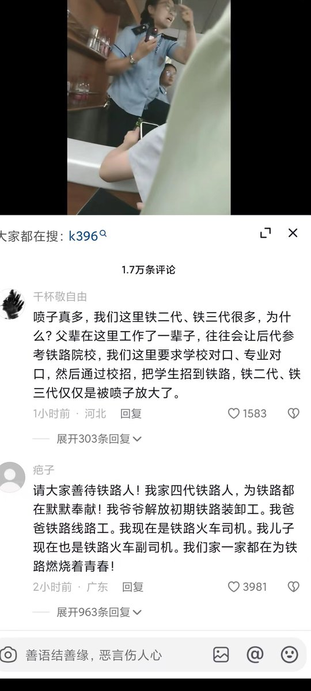

谁将十万横扫三江 北京时间 2023-07-31T20:23:50Z 1685989647686762496 RT @nytchinese: #观点 自2017年以来，中国政府在我的家乡实施了大规模拘禁计划。在此期间，估计有超过100万人被关进被称为“再教育中心”的集中营。
新疆的悲剧说明，不要忽视威权主义的蔓延。不要错误地认为发生在新疆人身上的事情不会发生在其他地方，不会发生在你们的…   谁将十万横扫三江 北京时间 2023-07-31T16:31:19Z 1685931131961839616 北京房山桥被冲垮了☝️😑这质量 https://t.co/gfHxoYpNty   谁将十万横扫三江 北京时间 2023-07-31T16:31:56Z 1685931286287048706 RT @RFA_Chinese: 【北京 #河北 持续 #暴雨 红色预警】
【多地山洪暴发汽车被冲走】
#北京 市31日发布洪水 #红色预警，#房山 区大石河流域漫水河断面出现红色预警标准洪水，升级发布洪水红色预警。
7月31日，门头沟因暴雨向永定河泄洪，周边主干道路全部临时管…   谁将十万横扫三江 北京时间 2023-07-31T15:55:11Z 1685922038886858752 7月31日早上8点，北京暴雨，K396上，列车已经晚点近24小时。乘客情绪不稳定，昨天列车员冒雨从外面搞了十五箱方便面为大家免费发放。今天目前是没有任何吃的了，不知还要等多久 https://t.co/jcGXioDXGB   谁将十万横扫三江 北京时间 2023-07-31T16:15:14Z 1685927083900571648 RT @whyyoutouzhele: 7月31日，有网友接到电话，对方威胁称禁止携带同性恋相关旗帜物料前往张惠妹北京演唱会，否则通知大麦取消他的票。
并准确说出几点几分在什么群里发了什么话。
目前后台有多名网友投稿相同遭遇。 https://t.co/uoppqJAmHr   谁将十万横扫三江 北京时间 2023-07-31T10:54:16Z 1685846309637591040 福州 大东海世茂天玺 业主维权 https://t.co/u4IITvYT49   谁将十万横扫三江 北京时间 2023-07-31T10:21:41Z 1685838109253287936 放弃谏言情节，尊重国家命运 https://t.co/pbjFpQtkIo   谁将十万横扫三江 北京时间 2023-07-31T10:24:13Z 1685838749220192256 湖北省黄冈市红安县。红安恒大烂尾楼，昨天业主收房日，房屋烂尾投诉无门，业主被打 https://t.co/cDUBfBNZMz   谁将十万横扫三江 北京时间 2023-07-31T10:26:47Z 1685839395386269696 RT @jakobsonradical: 今年6月底，有媒体揭露山西一煤矿公司的事故瞒报问题，随后当局派人倒查20年，发现该公司自2003年以来到2022年共瞒报事故40起，涉及死亡矿工43人；2022年特大事故又瞒报30余名遇难者。有网友感慨：原来一条人命都不配算一个数字。这…   谁将十万横扫三江 北京时间 2023-07-31T07:41:53Z 1685797893532491776 RT @Pandazhq: 这两天没看书，熬夜把《大明王朝1566》看完了，的确是神剧，且与中国政府当下的财政困境特别相符。

电视剧是从内阁年底算账开始的，所有的账算下来财政亏空了几百万，为了补亏空就开始在浙江推行“改稻为桑”，但是农民不愿意，推行很艰难。

为了尽快推行，端…   谁将十万横扫三江 北京时间 2023-07-31T07:51:58Z 1685800430981509120 唉，跟美团拼了 https://t.co/gvt3uX1YuG   谁将十万横扫三江 北京时间 2023-07-31T09:00:05Z 1685817576679694336 RT @jakobsonradical: 雇佣这么多人拍视频再现“警民团结”、“冒雨筑堤”，为了保障民众的生命和财产安全与台风拼搏。编导，摄影，制作，演职人员…你们都辛苦啦！ https://t.co/9tfq33aUh1   谁将十万横扫三江 北京时间 2023-07-31T09:29:13Z 1685824905965940736 世袭还有理了😅 https://t.co/8F9odVBs4x   