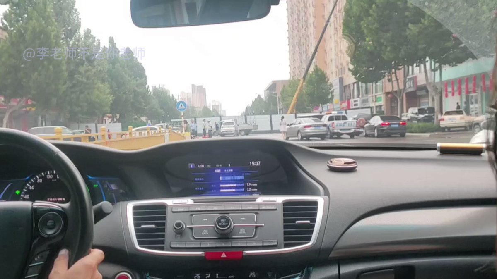
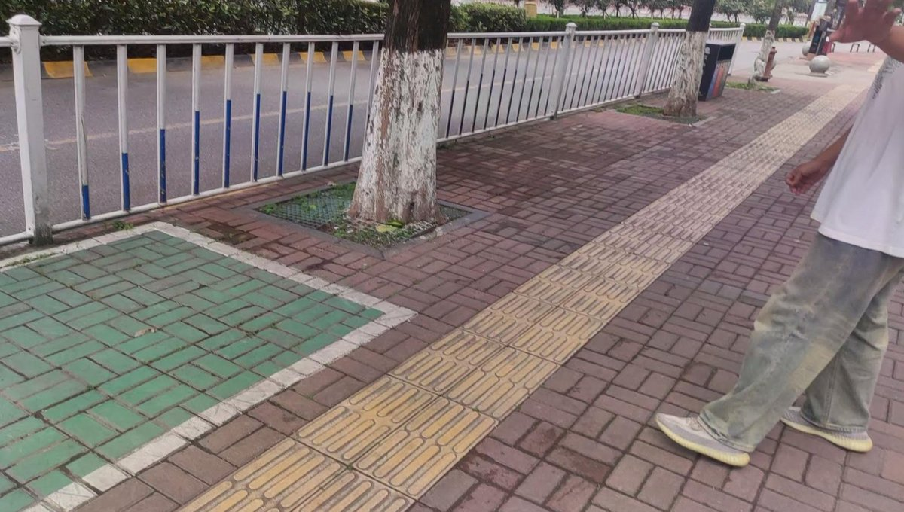
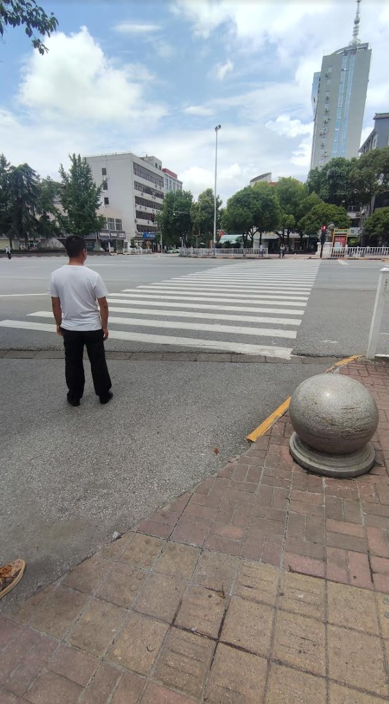
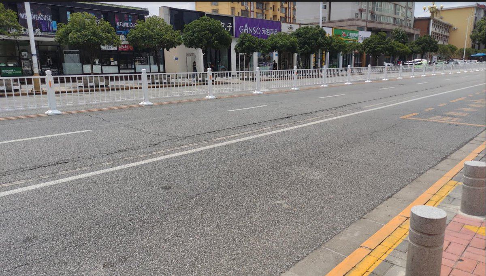
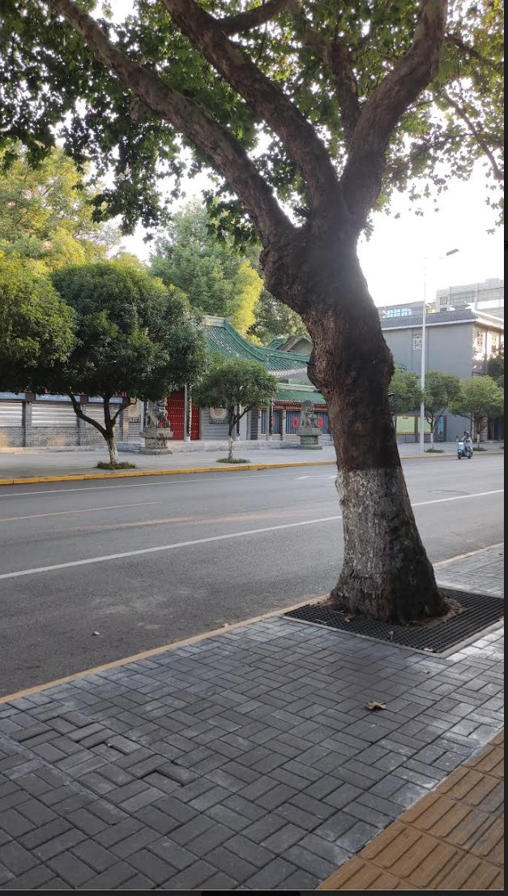
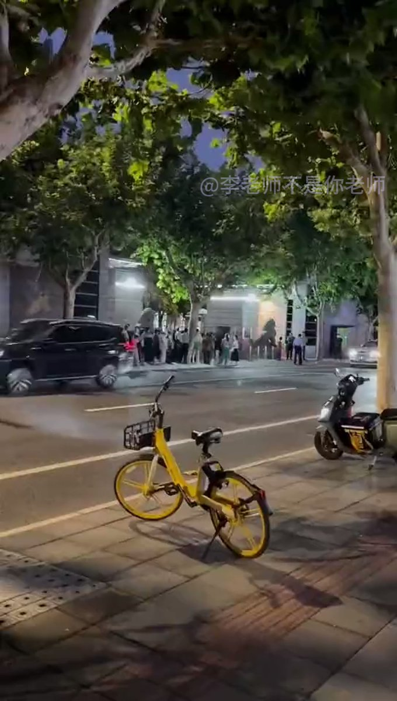
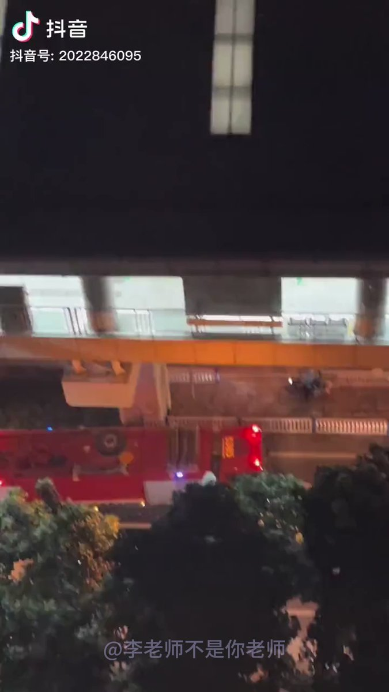

A李老师不是你老师 北京时间 2023-07-30T17:55:25Z 1685589907362754561 目前，相关路段被隔离墙封锁，路边有警察看守。 https://t.co/uT1NVQK7s4   A李老师不是你老师 北京时间 2023-07-30T18:00:12Z 1685591111119564800 网友补充今日汉中市区的情况。
天汉大道和周围路段基本被封锁，沿路全是交警和便衣。中午天汉大道清场后，群众被告知不允许过马路，之后又有便衣禁止大家在人行道通行，全部进入街边商铺等待
据称是因为今天国家主席习近平前往参观汉中博物馆。 https://t.co/B8Xa5MtI5N   A李老师不是你老师 北京时间 2023-07-30T18:03:21Z 1685591904551931904 网友投稿
7月29日，江苏南京浦口区。
1500户烂尾楼业主集体上街游行，高喊“启迪烂尾，江北无能”。
据悉，此前业主曾向省巡查组、市住建局等多渠道反应、投诉无果。 https://t.co/8H7D4AtZD9   A李老师不是你老师 北京时间 2023-07-30T18:13:06Z 1685594359092121600 网友投稿
近日，山东莱芜（济南市），部分家长对今年更改的招生政策不满，在教育局门口抗议 https://t.co/iA5EvliX2K   A李老师不是你老师 北京时间 2023-07-30T07:01:00Z 1685425219182235649 7月28日，朝鲜举办庆祝“祖国解放战争胜利”70周年大阅兵
黑衣墨镜的朝鲜国家保卫省（国安）纵队接受检阅。 https://t.co/Z2vLKuETXx   A李老师不是你老师 北京时间 2023-07-30T01:39:37Z 1685344339914878977 网友投稿
7月26日前后，上海长宁区警察局门口
一些民众高喊“司令员出来”“还我房子”
具体原因未知 https://t.co/sHreUNZfOn   A李老师不是你老师 北京时间 2023-07-30T01:44:10Z 1685345485844807681 网友投稿
7月29日晚，重庆轻轨2号线发生故障断电
一辆轻轨被困，门窗打不开。期间有人疑似中暑晕倒
最终，乘务员和民众破窗自救 https://t.co/Usk2qKyhVA   