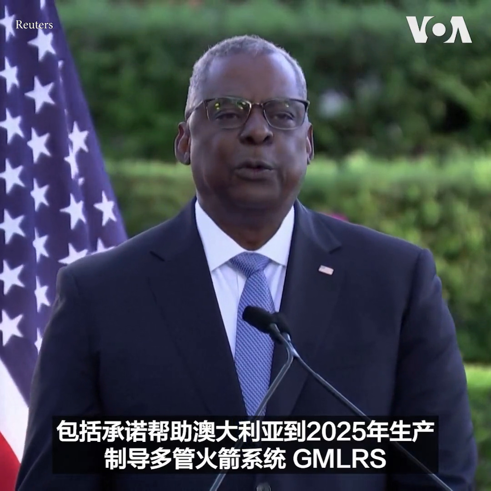

美国之音中文网 北京时间 2023-07-30T12:45:03Z 1685511803332423680 报道：美国基础设施恐被植入中国恶意软件 堪比“定时炸弹 https://t.co/ZV5uTBcD4N   美国之音中文网 北京时间 2023-07-30T10:45:02Z 1685481598903574528 西非国家领导人召开紧急会议 商讨如何应对尼日尔军事政变 https://t.co/aOVl12oF7N   美国之音中文网 北京时间 2023-07-30T09:44:04Z 1685466255891759105 #美中对标 中国热点对标美国论据，用一杯咖啡的时间聊聊中国热点的美国冷思考。一周以来中国政府在齐齐哈尔体育馆坍塌后的“善后”处理引发网络广泛批评。本期视频对标2021年佛州发生的公寓楼坍塌事件，反思政府如何人性化的善后。 https://t.co/HNckG2PoJ6   美国之音中文网 北京时间 2023-07-30T08:18:02Z 1685444606564130817 普京用人道援助和粮食拉拢非洲国家 https://t.co/utPtfwMKrV   美国之音中文网 北京时间 2023-07-30T05:09:02Z 1685397040204021760 日本支持印太地区伙伴斯里兰卡 https://t.co/fBIJyhvtc5   美国之音中文网 北京时间 2023-07-30T05:52:34Z 1685407995180822528 以色列民众继续抗议，向政府施压 https://t.co/U7KjRJzstl   美国之音中文网 北京时间 2023-07-30T03:27:33Z 1685371501435113472 美国与澳大利亚公布国防合作协议，加强并扩大两国军事联盟 https://t.co/y1EfpClI1C   美国之音中文网 北京时间 2023-07-30T01:33:07Z 1685342702232354816 南太岛国重要性陡升，西方高官密集访问，都是为了抗衡中国 https://t.co/HpYI9Ph3bb   美国之音中文网 北京时间 2023-07-30T01:59:42Z 1685349393107402752 美国国防部长奥斯汀29日在布里斯班表示，美国将帮助澳大利亚到2025年生产制导多管火箭系统。澳大利亚国防部长马勒斯说希望两年内澳大利亚可以开始导弹生产。奥斯汀与布林肯国务卿正在澳大利亚参加年度美澳磋商。
报道：https://t.co/yL5UfxuoGl https://t.co/dd4od1Vvdl   美国之音中文网 北京时间 2023-07-30T02:10:00Z 1685351984977858560 台湾绿营智库把“打台湾不如买台湾，买台湾不如骗台湾”概括为中共近年来加速促统进程的认知战战略。李酉潭教授在此基础上补充一条：骗台湾不如吓台湾。他说2022年选举蓝营得利于一句重要的选战口号：票投民进党，青年上战场。#纵深视角完整版：https://t.co/8ELzS94nBS https://t.co/CcE48UzDvR   