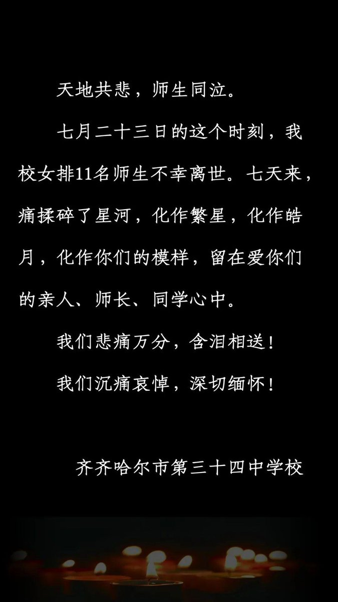

自由亚洲电台 北京时间 2023-07-30T13:01:14Z 1685515873409548288 #德国 埃尔朗根大学今年宣布暂停与 #中国留学基金委 的合作，不再接收领取CSC奖学金的中国学生。德国教育部长施塔克-瓦青格对此表示赞同，称这种决定“也应激励其他机构重新审视它们与CSC的合作关系”。
#留基委 

 https://t.co/Q9kZH4hBpN   自由亚洲电台 北京时间 2023-07-30T10:59:10Z 1685485157133041664 美国政府相信中国已在美国主要电力和通讯网络植入堪比“定时炸弹”的 #恶意软件，一旦美中因 #台湾 问题爆发冲突，北京很可能借此扰乱美军干预行动。 https://t.co/RflPR6CzUl   自由亚洲电台 北京时间 2023-07-30T07:55:11Z 1685438854814191616 #Tiktok 商店（TikTok Shop）近期成为 #印尼 媒体的讨论焦点。有印尼学者表示，Tiktok商店贩售的 #中国商品 比当地中小企业的产品更低廉，且社群媒体有大量数据，能精准定位消费者，可能威胁当地中小企业，呼吁印尼政府关注。
https://t.co/AZh1CTcV2p   自由亚洲电台 北京时间 2023-07-30T09:07:05Z 1685456947879858176 RT @RFA_Chinese: 7月23日，#齐齐哈尔 第三十四中学体育馆屋顶坍塌，致11人死亡。
7月29日，事发近一周后，学校发布悼文。
您怎么看？
（来源：齐齐哈尔市第三十四中学校） https://t.co/OPROXLLBB7   自由亚洲电台 北京时间 2023-07-30T09:07:40Z 1685457096400048128 RT @RFA_Chinese: 【习近平出席成都 #大运会 开幕】
【市内禁业余无线电和遥控器 居民回家要凭证】
据 #成都 多位居民告诉本台，#习近平 本周早些时候抵达成都后，当地提升了安保级别，开幕式会场附近居民不得开窗，全城实施无线电管制，禁用业余无线电台和遥控器。另有…   自由亚洲电台 北京时间 2023-07-30T09:08:21Z 1685457266370080769 RT @RFA_Chinese: #齐齐哈尔34中 门口，鲜花汇成悲伤的海洋，黄桃罐头摆成愤怒的方阵。城市的房顶塌了，每个人都感受得到。

为什么是 #黄桃罐头？

有人说，因为周边的花店全部被关了；
有人说，因为黄桃罐头驱鬼辟邪；
有人说，黄桃罐头是东北人的情怀，早年物资匮乏…   自由亚洲电台 北京时间 2023-07-30T04:42:32Z 1685390373517209601 美国白宫7月28日宣布向台湾提供3.45亿美元的军事援助，这是拜登（Joe Biden）总统首次动用“总统提取权”，以从美国自身现有库存提取的方式对 #台湾 提供重大 #军援。

 https://t.co/mg1B1idnZv   自由亚洲电台 北京时间 2023-07-30T05:30:01Z 1685402322661408768 #澳大利亚 将在两年内开始制造自己的 #导弹，这将使其能够向美国提供制导武器，并有可能向其他国家出口。在周六举行的澳美防长、外长“2+2”会谈上，推动与美国合作加快创建澳洲本土的导弹制造业，将是核心之一。美国将帮助澳大利亚在2025年前生产制导多管火箭发射系统。 https://t.co/Uxfkdl0x9g   自由亚洲电台 北京时间 2023-07-30T06:00:01Z 1685409872060485633 电子商务平台 #Tiktok 商店（TikTok Shop）近期成为 #印尼 媒体的讨论焦点。有印尼经济学者表示，Tiktok商店贩售的 #中国商品 比当地中小企业的产品更低廉，且社群媒体有大量数据，能精准定位消费者，影响力遽增，可能威胁当地中小企业，呼吁印尼政府关注。   