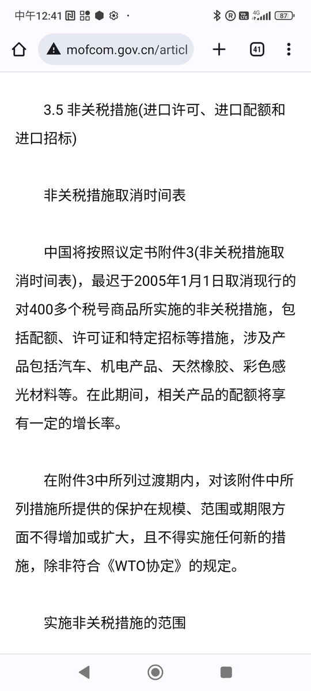

谁将十万横扫三江 北京时间 2023-07-30T21:45:59Z 1685647932970979328 齐齐哈尔34中体育馆楼顶坍塌事故11名学生死亡。

这两天突然涌出来一些人，大骂齐齐哈尔那学校门前的花、罐头、奶茶是“浪费”。

什么是浪费？一桌山珍海味8万8，随便动两筷子“领导我们这草台班子施工队还要您多提拔”；一条路铺了刨、刨了铺，10年了还坑坑洼洼。这是浪费，当然显然不仅是浪费。

而那些花，那些罐头和奶茶，从不是浪费，因为它们寄托的是哀思——她们离开得可惜、可叹、充满了遗憾、也让许多有孩子的人脊背发凉因为鬼知道还有多少类似的致命危险和为虎作伥的正能量在未知的迷雾里等着自己和自己的孩子。

发生这种事，填满校园外空地的，本应该是愤怒的抗议人群，这鲜花美食组成的无声抗议，已经是此地的无奈之举了。   谁将十万横扫三江 北京时间 2023-07-30T22:06:21Z 1685653057856819200 RT @whyyoutouzhele: 网友投稿
7月29日，衡水市安平天然气爆炸现场视频。
整条街道被炸的面目全非。
官方通报称事故造成2死2伤。 https://t.co/HVXrziHFGW   谁将十万横扫三江 北京时间 2023-07-30T22:06:29Z 1685653089758666752 RT @whyyoutouzhele: 7月30日晚，佛山市顺德区发生当街砍人事件。 https://t.co/Aisr7gCF0A   谁将十万横扫三江 北京时间 2023-07-30T20:17:30Z 1685625662739255296 RT @laodongqushi: 长时间加班违反劳动法且被大众抵制，但仍然肆意蔓延几乎不受监管。这篇跨时期定量分析发现：
农民工工作时长维持在每周65小时左右，远高于其它群体；
就业和失业率是推动员工工作时间增长的首要因素，延长工作时间是个人避免失业压力、确保满足生存需要的重…   谁将十万横扫三江 北京时间 2023-07-30T20:19:16Z 1685626108694396928 RT @whyyoutouzhele: 网友投稿
7月30日，青岛，台东步行街 https://t.co/5ieDaAkTVD   谁将十万横扫三江 北京时间 2023-07-30T16:53:52Z 1685574420528771072 RT @torontobigface: 我知道很多人不认为中国会民主化，觉得中国人既学不会民主，也学不会反抗
但不论怎么认为这都不是放弃的理由
人类就一定能发明超导体吗？
人类就一定能在灭亡之前走出太阳系吗？
这些都不确定
但是这并不妨碍大家去研究超导材料，也不妨碍的大家探索宇…   谁将十万横扫三江 北京时间 2023-07-30T18:09:36Z 1685593477655281664 RT @whyyoutouzhele: 网友投稿
7月29日，江苏南京浦口区。
1500户烂尾楼业主集体上街游行，高喊“启迪烂尾，江北无能”。
据悉，此前业主曾向省巡查组、市住建局等多渠道反应、投诉无果。 https://t.co/8H7D4AtZD9   谁将十万横扫三江 北京时间 2023-07-30T18:09:41Z 1685593499289485313 RT @whyyoutouzhele: 网友补充今日汉中市区的情况。
天汉大道和周围路段基本被封锁，沿路全是交警和便衣。中午天汉大道清场后，群众被告知不允许过马路，之后又有便衣禁止大家在人行道通行，全部进入街边商铺等待
据称是因为今天国家主席习近平前往参观汉中博物馆。 http…   谁将十万横扫三江 北京时间 2023-07-30T18:09:49Z 1685593530054696960 RT @whyyoutouzhele: 网友补充事情原委：这些喊话的人都是上海武警退伍军人（或者家属），当时部队给符合条件的军人分配了在部队附近的房子。但是十几年过去，今年年初部队突然说5年前有一个新规，规定说部队转业后要还房给部队，但是不知为什么从今年年初才开始大面积实施。部…   谁将十万横扫三江 北京时间 2023-07-30T18:10:01Z 1685593581241921536 RT @whyyoutouzhele: 网友投稿
7月26日前后，上海长宁区警察局门口
一些民众高喊“司令员出来”“还我房子”
具体原因未知 https://t.co/sHreUNZfOn   谁将十万横扫三江 北京时间 2023-07-30T18:13:58Z 1685594576374173696 成都电视台内部职员提供的信息：因出现乌克兰国徽涉及政治敏感，属重大违规事件

PS：中国的立场是中立劝和？一看这位同志就不关注外交动向 https://t.co/Ut5o9iMuMt   谁将十万横扫三江 北京时间 2023-07-30T15:26:35Z 1685552451007721472 RT @laomanpindao: 中国入世承诺书原文都在商务部网站上挂着，打开来第一条就是“非歧视原则”。也就是对于经济活动中的任何个体，均具有平等地位。外企固然没有特权，关键是国企不得享有垄断地位。… https://t.co/LDf2WDoJCz   谁将十万横扫三江 北京时间 2023-07-30T09:21:18Z 1685460526963544066 天津聚龙集团印度尼西亚农业产业合作区克扣员工工资：
招聘的主管（杨义）当时在招聘员工的时候，隐瞒岗位的实际情况，到岗后和招聘时所说不符合，环境条件特别差，连最起码的住宿条件都保证不了，宿舍蚂蚁频繁出现，身体上到处都有蚂蚁咬伤，疼痛实在难忍，无法控制，连下班休息都是问题，向领导反应无果，天气炎热，宿舍洗漱，洗衣服都成问题，工作环境区域高度高温状态，也是给领导反应后没有改善。致使不能正常工作，也被工作所烫伤，劳动合同也是没有签署，经给领导反应无果，不能改善，后来辞职回家，但是所工作的实际工作日工资公司给予扣除，没有实际发放，借此平台反应一下   