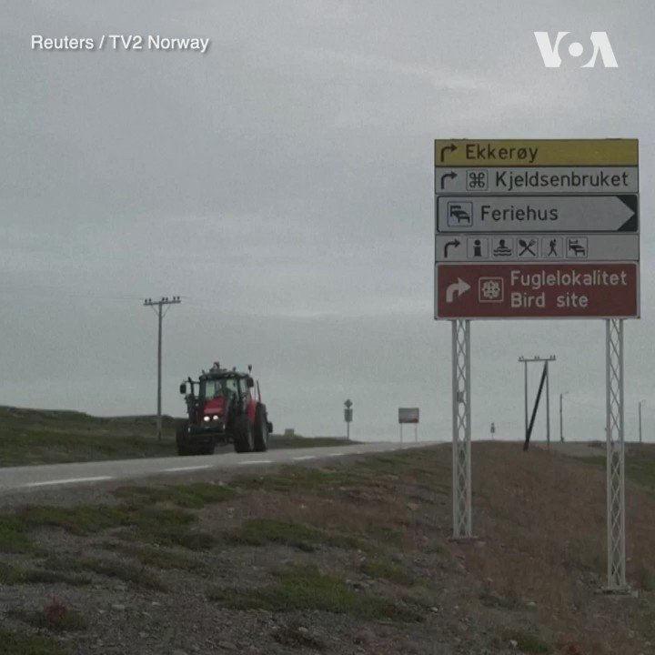

美国之音中文网 北京时间 2023-07-29T02:31:04Z 1684994902021816321 法院驳回律政司申请《愿荣光归香港》禁制令， 记协欢迎裁决 https://t.co/FRK3mLzOWw   美国之音中文网 北京时间 2023-07-29T02:59:45Z 1685002117545598976 挪威食品安全部门7月27日在该国北部部分地区宣布实施旅行禁令，以应对正在扩散的禽流感。禽流感今年已经在挪威造成成千上万只野生鸟类和家禽死亡。与此同时，芬兰官员说，在过去一星期，该国检测出H5N1禽流感病毒的农场数量从12个增加到20个。 https://t.co/AYicGT6x7t   美国之音中文网 北京时间 2023-07-29T03:32:07Z 1685010265782603776 白宫：美日韩领导人将于8月18日在戴维营举行峰会 https://t.co/rL6scOuYMp   美国之音中文网 北京时间 2023-07-29T04:07:20Z 1685019124903337987 中国八一建军节在即，解放军内部人事变故传闻不断。《南华早报》28日报道，火箭军司令李玉超、副司令刘光斌和前副司令张振中已被带走接受“反腐”调查。《澎湃新闻》27日报道，火箭军前副司令吴国华7月4日“因病医治无效”逝世，但该文随后被删除。到底发生了什么？ https://t.co/AKszrsIiPm   美国之音中文网 北京时间 2023-07-29T00:37:03Z 1684966208708481024 中国经济疲软恶循环：失业、降薪加剧经济放缓和通缩风险 https://t.co/IVF8hUyZPJ   美国之音中文网 北京时间 2023-07-29T00:56:10Z 1684971016957698051 波罗的海国家立陶宛因支持台湾，导致北京对其发动贸易制裁和外交抵制。美国之音记者最近在立陶宛首都维尔纽斯街头询问当地民众如何看待中国以及立陶宛政府的挺台抗中。“中国是独裁政权“，”台湾是民主国家”，一位受访者这么说。 https://t.co/vT6ytX3bed   美国之音中文网 北京时间 2023-07-29T01:20:34Z 1684977157850947585 日外相访印度、南非等国说服支持抗中，专家:日本具有一定的优势 https://t.co/x6RMvfKu2t   美国之音中文网 北京时间 2023-07-29T01:35:12Z 1684980840445648897 维权律师卢思位在老挝被捕，傅希秋:中国长臂管辖无处不在 https://t.co/5ptux69Guc   美国之音中文网 北京时间 2023-07-29T02:03:35Z 1684987982804393985 瓦格纳首领普里戈津“兵变”后首次露面圣彼得堡，赞扬尼日尔政变 https://t.co/zJ6qk5jLyY   美国之音中文网 北京时间 2023-07-29T02:20:38Z 1684992273992257537 香港高等法院28日驳回了香港政府对抗争歌曲“愿荣光归香港”的禁制令申请。法官陈健强认为考虑有关申请时，必须顾及言论自由的权利，尤其如果批出禁制令可能会产生”寒蝉效应”。香港记者协会主席陈朗升对法庭裁决表示欢迎。 https://t.co/lTtOc9FoLz   