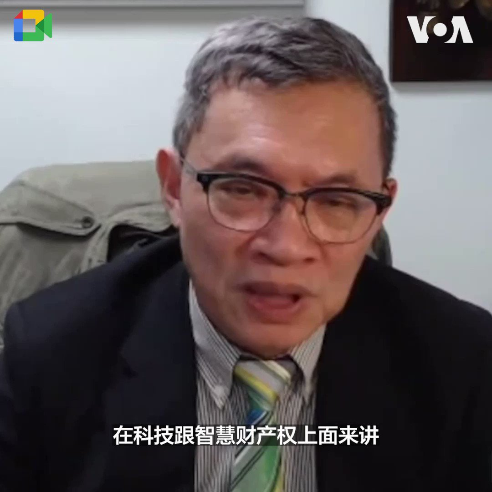
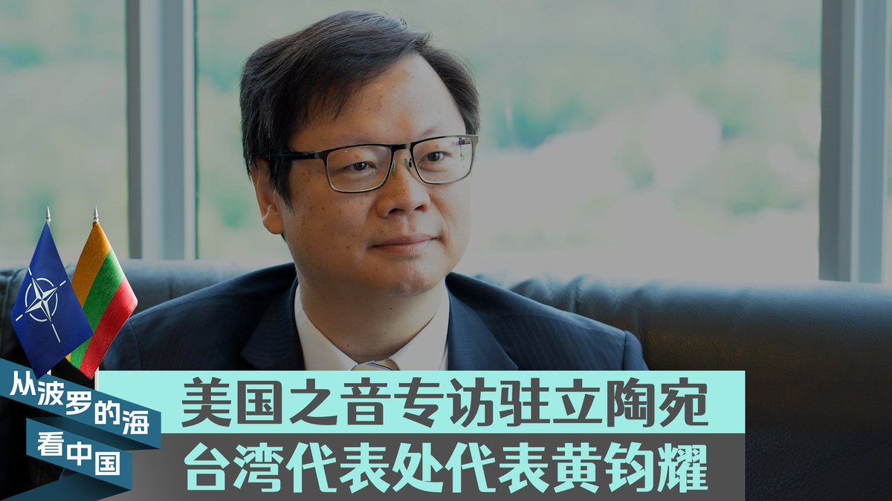
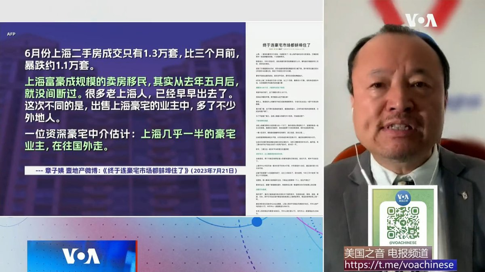
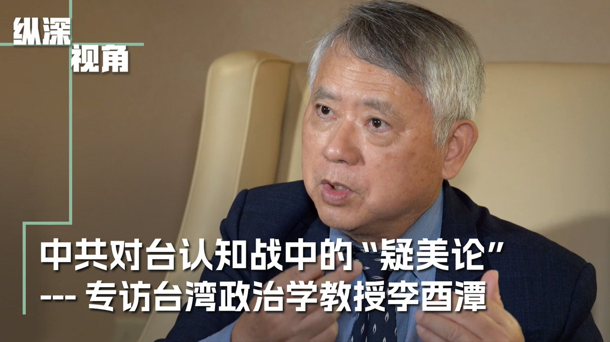
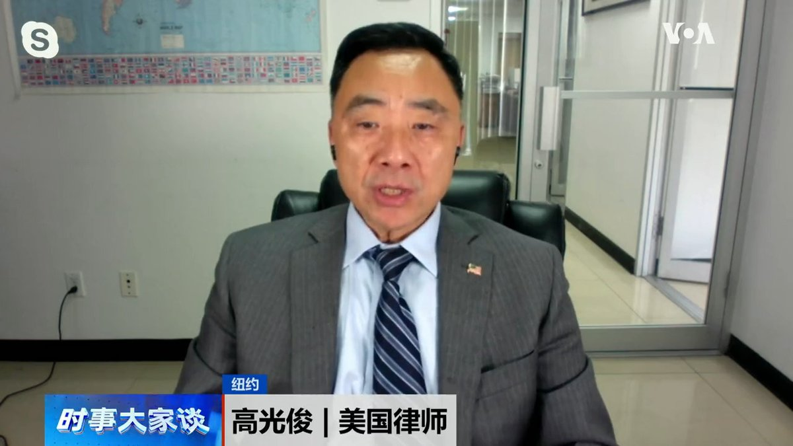

美国之音中文网 北京时间 2023-07-29T21:00:02Z 1685273981371432962 高瑜无疑是1980和90年代中国大陆最出色的记者之一。她的报道，甚至得到过来自中共高层的”评价”。高瑜的笔杆子，让她付出了前后三次入狱的代价。  
完整版🔗https://t.co/1Kh7lFEEcL
Spotify🔗https://t.co/IWkVAtBcmt
Apple Podcast🔗https://t.co/r919CLywLD
Google Podcast🔗https://t.co/gmAL7SwTdT https://t.co/2G2YYqskIP   美国之音中文网 北京时间 2023-07-29T21:25:51Z 1685280476137730048 马斯克将推特Twitter改名为X，并继续去除旧金山总部的旧名称痕迹。工人们28日晚从位于旧金山Market Street的总部楼顶将Twitter的字母拆下，代之以X。据报道马斯克希望将X打造成类似微信的平台。 https://t.co/xFHuHjwwtN   美国之音中文网 北京时间 2023-07-29T22:00:34Z 1685289215821770754 印度澄清去年印中有峰会, 但没有中方所说的“重要共识” https://t.co/jN5KZmtqJn   美国之音中文网 北京时间 2023-07-29T20:31:25Z 1685266777448546304 分析人士表示，中国共产党本身就是一个广义的间谍组织，现在的美中科技战事实上就是某种程度的美中情报战。西方民主国家虽与封闭的警察国家存在着“情报不对等”的情况，但“独裁者困境”常常因为不真实的情报而做出错误判断与决策。报道： https://t.co/HTjObgL2nT https://t.co/3CZ2WBvXVr   美国之音中文网 北京时间 2023-07-29T17:34:34Z 1685222271441670144 联合国资金锐减 被迫削减全球数百万人的粮食援助 https://t.co/cqchFjoLv7   美国之音中文网 北京时间 2023-07-29T18:03:34Z 1685229572831514624 中国希望法国能帮助缓和与欧盟的关系 https://t.co/8g5vV6ovzf   美国之音中文网 北京时间 2023-07-29T14:53:06Z 1685181637653590016 热浪东移 美国迎来今年最热时刻 https://t.co/BHv6cZkFG8   美国之音中文网 北京时间 2023-07-29T13:29:06Z 1685160501091930112 美国情报总监报告：中国的支持对俄罗斯持续战事起关键作用 https://t.co/0bfxvqGnsC   美国之音中文网 北京时间 2023-07-29T13:57:03Z 1685167531844419584 美国将帮助澳大利亚发展导弹制造业 https://t.co/8dGJAlkA52   美国之音中文网 北京时间 2023-07-29T11:13:33Z 1685126388591087616 澳大利亚军用直升机在军演中坠海 四名机组人员失踪 https://t.co/GSWFtOgaxD   美国之音中文网 北京时间 2023-07-29T10:14:06Z 1685111427517034496 另一种的“润”：中国年轻人摆脱国内压力，追求全球游牧生活方式 https://t.co/tKjylCzssy   美国之音中文网 北京时间 2023-07-29T06:27:55Z 1685054506952773632 “小国可以很有志气，小国也可以坚守它自己的原则跟价值，”驻立陶宛台湾代表处代表黄钧耀最近在接受美国之音专访时分析立陶宛为何在台湾问题上敢于挑战北京时说。他认为，台立关系之所以趋于紧密，是基于共同的理念和价值。https://t.co/g75POqNk7q https://t.co/Utcwz2ASwX   美国之音中文网 北京时间 2023-07-29T06:30:00Z 1685055028199849986 《上海搞成这样，我们很难过》 诉说上海“家道中落”引发共鸣。前上海外科医生、沪裔美国人协会会长何岸泉先生说，其实大家都有同感，上海人只是不说穿。 #时事大家谈 完整版：https://t.co/UpFXPb6Yg6 https://t.co/6OluX7lcDx   美国之音中文网 北京时间 2023-07-29T06:42:04Z 1685058066436493312 美参议院通过2024财年《国防授权法》助台培训军队，议员：对中国发出明确信号 https://t.co/P1k0vPvhAY   美国之音中文网 北京时间 2023-07-29T06:48:18Z 1685059636183912448 "他说三个警察来了，要把他带走"，这是中国维权律师卢思位28日在老挝被捕前发给妻子张春晓的最后信息。卢思位28日上午在老挝准备搭火车前往泰国时被老挝警方抓走。张春晓希望美国政府协助解救卢思位，也呼吁老挝政府尽快释放他。详细内容：https://t.co/tE7Ld3zJ8i https://t.co/jl6XMWJv1c   美国之音中文网 北京时间 2023-07-29T07:34:21Z 1685071221770129408 有学者认为台湾流传的“疑美论”是北京发起的一场企图利用台湾民主制度颠覆民主政体的不对称超限战。为什么专制的中国对民主的台湾有强大的舆论影响？一旦“疑美论”占据上风，将如何影响台湾的未来？请看《纵深视角》许波专访台湾政治学教授李酉潭。 https://t.co/6O1H3oUhNr   美国之音中文网 北京时间 2023-07-29T07:44:04Z 1685073668714713088 美国宣布向台湾提供3.45亿美元军援并首次动用“总统提取权” https://t.co/O3Uxy12K32   美国之音中文网 北京时间 2023-07-29T08:11:33Z 1685080586933923840 旅游专家建议非洲聚焦“小众”中国游客，而不是人数 https://t.co/8qS6qFTvVe   美国之音中文网 北京时间 2023-07-29T08:56:03Z 1685091782474989568 专家：美国公司降低在中国供应链风险，越南可能会从中受益 https://t.co/k5XXwU1ekZ   美国之音中文网 北京时间 2023-07-29T09:00:01Z 1685092781449175040 一键解锁#美国热搜 榜：1、秦刚事件，习近平的失误与复仇 2、皮尤调查：习近平治下的中国越来越不受世界待见 3、活久见，31个省市全部财政赤字 4、齐齐哈尔惨剧的冷血协议 5、习近平参会导致成都“封城” 6、悉尼大学小粉红的主题团课 7、习近平的金銮殿 8、成都大运会迎外宾的排场 https://t.co/g1WQg26G2F   美国之音中文网 北京时间 2023-07-29T04:29:34Z 1685024721623195648 法国调查涉嫌向中国和俄罗斯走私先进芯片技术案 https://t.co/JFKS6R8o2e   美国之音中文网 北京时间 2023-07-29T04:40:40Z 1685027514639679488 7月28日举行的女足世界杯D组第二轮比赛中，中国队在红牌罚下一人的情况下，最终以1比0战胜海地队，取得小组赛首场胜利。现场观战的中国球迷非常激动，认为两支队伍都贡献了非常精彩的比赛。中国女足接下来将在8月1日对阵小组赛两连胜的英格兰队。 https://t.co/Zzu5THIgL3   美国之音中文网 北京时间 2023-07-29T05:14:02Z 1685035913913720832 军人在政变后宣布尼日尔总统卫队将军为新领导人 https://t.co/dW4q48uVit   美国之音中文网 北京时间 2023-07-29T05:27:33Z 1685039314026352640 齐齐哈尔中学体育馆坍塌引发网民悲愤后，中国社媒逐渐加大审查力度 https://t.co/dTPM8SAy2r   美国之音中文网 北京时间 2023-07-29T05:59:02Z 1685047236915605504 俄军袭击乌克兰村庄，莫斯科指责基辅对俄罗斯南部进行导弹袭击 https://t.co/0OgxIybNDg   美国之音中文网 北京时间 2023-07-29T05:59:04Z 1685047245408710658 VOA专访驻立陶宛台湾代表处代表黄钧耀：台立关系基于共同的理念，不是短期经济利益 https://t.co/NfPvvxku8Y   美国之音中文网 北京时间 2023-07-29T06:00:01Z 1685047484643790849 齐齐哈尔中学体育馆坍塌后，家属等领导来沟通，结果来的全都是警察。美国律师高光俊说，中国的大国崛起，只是政府官员的崛起，而老百姓的基本权利经常很卑微。不管什么事情，动不动就是警察前来，这是中国共产党的一个特色。#时事大家谈 完整版： https://t.co/UpFXPb7w5E https://t.co/1M84oriyTK   美国之音中文网 北京时间 2023-07-29T02:31:04Z 1684994902021816321 法院驳回律政司申请《愿荣光归香港》禁制令， 记协欢迎裁决 https://t.co/FRK3mLzOWw   美国之音中文网 北京时间 2023-07-29T02:59:45Z 1685002117545598976 挪威食品安全部门7月27日在该国北部部分地区宣布实施旅行禁令，以应对正在扩散的禽流感。禽流感今年已经在挪威造成成千上万只野生鸟类和家禽死亡。与此同时，芬兰官员说，在过去一星期，该国检测出H5N1禽流感病毒的农场数量从12个增加到20个。 https://t.co/AYicGT6x7t   美国之音中文网 北京时间 2023-07-29T03:32:07Z 1685010265782603776 白宫：美日韩领导人将于8月18日在戴维营举行峰会 https://t.co/rL6scOuYMp   美国之音中文网 北京时间 2023-07-29T04:07:20Z 1685019124903337987 中国八一建军节在即，解放军内部人事变故传闻不断。《南华早报》28日报道，火箭军司令李玉超、副司令刘光斌和前副司令张振中已被带走接受“反腐”调查。《澎湃新闻》27日报道，火箭军前副司令吴国华7月4日“因病医治无效”逝世，但该文随后被删除。到底发生了什么？ https://t.co/AKszrsIiPm   美国之音中文网 北京时间 2023-07-29T00:37:03Z 1684966208708481024 中国经济疲软恶循环：失业、降薪加剧经济放缓和通缩风险 https://t.co/IVF8hUyZPJ   美国之音中文网 北京时间 2023-07-29T00:56:10Z 1684971016957698051 波罗的海国家立陶宛因支持台湾，导致北京对其发动贸易制裁和外交抵制。美国之音记者最近在立陶宛首都维尔纽斯街头询问当地民众如何看待中国以及立陶宛政府的挺台抗中。“中国是独裁政权“，”台湾是民主国家”，一位受访者这么说。 https://t.co/vT6ytX3bed   美国之音中文网 北京时间 2023-07-29T01:20:34Z 1684977157850947585 日外相访印度、南非等国说服支持抗中，专家:日本具有一定的优势 https://t.co/x6RMvfKu2t   美国之音中文网 北京时间 2023-07-29T01:35:12Z 1684980840445648897 维权律师卢思位在老挝被捕，傅希秋:中国长臂管辖无处不在 https://t.co/5ptux69Guc   美国之音中文网 北京时间 2023-07-29T02:03:35Z 1684987982804393985 瓦格纳首领普里戈津“兵变”后首次露面圣彼得堡，赞扬尼日尔政变 https://t.co/zJ6qk5jLyY   美国之音中文网 北京时间 2023-07-29T02:20:38Z 1684992273992257537 香港高等法院28日驳回了香港政府对抗争歌曲“愿荣光归香港”的禁制令申请。法官陈健强认为考虑有关申请时，必须顾及言论自由的权利，尤其如果批出禁制令可能会产生”寒蝉效应”。香港记者协会主席陈朗升对法庭裁决表示欢迎。 https://t.co/lTtOc9FoLz   