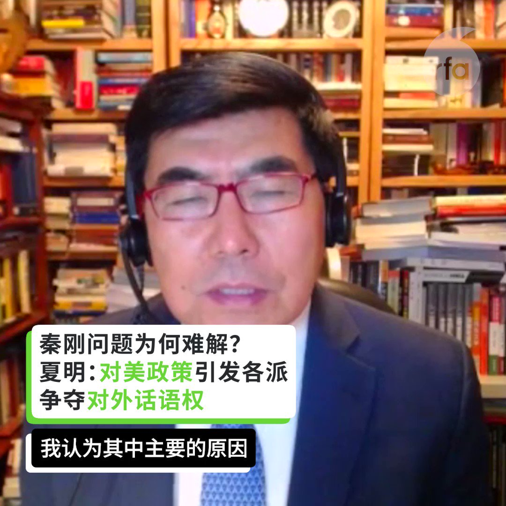

自由亚洲电台 北京时间 2023-07-29T22:53:55Z 1685302641654628352 7月23日，#齐齐哈尔 第三十四中学体育馆屋顶坍塌，致11人死亡。
7月29日，事发近一周后，学校发布悼文。
您怎么看？
（来源：齐齐哈尔市第三十四中学校） https://t.co/OPROXLLBB7   自由亚洲电台 北京时间 2023-07-29T21:20:00Z 1685279006600384512 RT @RFA_Chinese: 【#夏明 @XiaBamboohermit：#秦刚 或未延续 #王毅 政治遗产】
【#蔡慎坤 @cskun1989：调整对美关系 派系利益无法调和】
最新一期 #亚洲很想聊 【习近平掌握不了秦刚事件 要如何挽救中国雪崩经济？】
完整视频： ht…   自由亚洲电台 北京时间 2023-07-29T19:46:24Z 1685255449430335488 RT @RFA_Chinese: 在2023女足世界杯小组赛第二轮比赛中，中国队凭借王霜打入的点球，以1:0战胜海地队。相比于男足，中国官员对女足的管理干预较少，这给她们的发展提供了更大的空间。去年10月，中国足协发布关于女足的改革发展计划，您认为，“铿锵玫瑰”明天会更好吗？…   自由亚洲电台 北京时间 2023-07-29T19:49:08Z 1685256136142811136 RT @RFA_Chinese: 【#亚太报道（2023-7-28）】
欢迎收听和订阅播客【亚太报道】 https://t.co/MjLNSvVMqc

中国维权律师 #卢思位 在老挝被捕/#秦刚 重现中国 #外交部网站 / #火箭军 司令 #李玉超 落马/#习近平 现身 #成…   自由亚洲电台 北京时间 2023-07-29T12:49:29Z 1685150527640801280 RT @RFA_Chinese: 在2023女足世界杯小组赛第二轮比赛中，中国队凭借王霜打入的点球，以1:0战胜海地队。相比于男足，中国官员对女足的管理干预较少，这给她们的发展提供了更大的空间。去年10月，中国足协发布关于女足的改革发展计划，您认为，“铿锵玫瑰”明天会更好吗？…   自由亚洲电台 北京时间 2023-07-29T10:56:41Z 1685122143455993856 RT @RFA_Chinese: #齐齐哈尔34中 门口，鲜花汇成悲伤的海洋，黄桃罐头摆成愤怒的方阵。城市的房顶塌了，每个人都感受得到。

为什么是 #黄桃罐头？

有人说，因为周边的花店全部被关了；
有人说，因为黄桃罐头驱鬼辟邪；
有人说，黄桃罐头是东北人的情怀，早年物资匮乏…   自由亚洲电台 北京时间 2023-07-29T10:57:48Z 1685122425011249152 RT @RFA_Chinese: #习近平 将于7月27日-28日出席成都 #第31届世界大学生夏季运动会 开幕式，为出席开幕式并访问的外国领导人举行欢迎宴会和相关双边活动。
原定要去的斐济共和国总理兰布卡7月25日在脸书上说，他走楼梯看手机摔倒，头部受伤，去不了了。… htt…   自由亚洲电台 北京时间 2023-07-29T09:52:37Z 1685106019163348993 专栏 | #财经时时听：第一代 #农民工 无法 #养老 谁之过
 https://t.co/KJdbUNgWcN   自由亚洲电台 北京时间 2023-07-29T09:56:28Z 1685106987221303296 评论 | #何清涟：#中美关系 之结为何难解？
 https://t.co/U7Wg80SbAm   自由亚洲电台 北京时间 2023-07-29T10:00:05Z 1685107896684822528 专栏 | #解读新疆：#维吾尔 女学生被迫在新疆服装厂打工
 https://t.co/Ds2BpnvMi3   自由亚洲电台 北京时间 2023-07-29T06:09:17Z 1685049814311120896 因代理敏感案件而被当局吊销执照的中国维权律师 #卢思位 逃离中国后，周五（28日）在 #老挝 被捕。活动人士和家人担心他将被遣返回中国，并可能面临牢狱之灾。

 https://t.co/qptg43H8pm   自由亚洲电台 北京时间 2023-07-29T06:20:03Z 1685052523873439744 【#亚太报道（2023-7-28）】
欢迎收听和订阅播客【亚太报道】 https://t.co/MjLNSvVMqc

中国维权律师 #卢思位 在老挝被捕/#秦刚 重现中国 #外交部网站 / #火箭军 司令 #李玉超 落马/#习近平 现身 #成都大运会 全市严控/美情报：中国加大对俄经济及军事支持 https://t.co/zlM1bmp7M0   自由亚洲电台 北京时间 2023-07-29T06:27:14Z 1685054333011083264 #秦刚 被免去外长职务后，最新又传出曾任中国前外交部副部长的 #乐玉成 被免去国家广播电视总局副局长一职。乐玉成曾被认为是外交部长的热门人选。

 https://t.co/pAHVKwiK9u   自由亚洲电台 北京时间 2023-07-29T04:47:52Z 1685029328591953920 在2023女足世界杯小组赛第二轮比赛中，中国队凭借王霜打入的点球，以1:0战胜海地队。相比于男足，中国官员对女足的管理干预较少，这给她们的发展提供了更大的空间。去年10月，中国足协发布关于女足的改革发展计划，您认为，“铿锵玫瑰”明天会更好吗？ https://t.co/FyzsXCIoTH   自由亚洲电台 北京时间 2023-07-29T05:51:18Z 1685045290460467200 香港《南华早报》援引消息人士透露，中国解放军 #火箭军 司令员 #李玉超 及其前任和现任副手 #张振中 及刘光斌，近期正接受反腐调查。这是近来中国火箭军连续出现的人员变动消息中的又一起。
https://t.co/V2R7V0vr6w   自由亚洲电台 北京时间 2023-07-29T06:10:41Z 1685050168557907969 专栏 | #夜话中南海：#秦刚 被罢官是因为“#间谍 和间谍，不能搞破鞋”？
 https://t.co/nlB7kTEB7o   自由亚洲电台 北京时间 2023-07-29T02:49:48Z 1684999615941337090 #事实查核｜美国总统拜登又和"看不见的人"打招呼"？ https://t.co/fwOZyLxx5v   自由亚洲电台 北京时间 2023-07-29T02:51:14Z 1684999975229612035 评论 | #唯色：《杀劫》2023年最新修订版与前两版有何不同？(一) https://t.co/t2ayafX5b0   自由亚洲电台 北京时间 2023-07-29T02:51:37Z 1685000072222892033 评论 | #陈光诚：中共劳民伤财经济崩溃：无能者观风拍马，有能者躺平痛骂 https://t.co/RDogmRoGyL   自由亚洲电台 北京时间 2023-07-29T03:25:07Z 1685008501847060480 香港律政司早前向香港高等法院申请禁制令，禁止以任何方式传播抗争歌曲《愿荣光归香港》，理由是该歌曲涉及煽动分裂国家、侮辱国歌等，但禁制令被法院拒绝。法官是基于什么理据，拒绝港府的申请？裁决又是否显示香港仍有司法独立？ https://t.co/oQwhMEXtEc   自由亚洲电台 北京时间 2023-07-29T03:26:25Z 1685008831108227072 专栏 | #西藏纵览：中国警方阻止藏传佛教集会 https://t.co/PZpU5vyo0y   自由亚洲电台 北京时间 2023-07-29T03:34:38Z 1685010895741804546 一份美国研究机构的最新报告显示，中国军方计划建立海外海军基地，八个可能的选址横跨亚州、非洲，以抗衡美国及盟国的海上制裁。 https://t.co/R6blaxxcxH   自由亚洲电台 北京时间 2023-07-29T03:55:38Z 1685016182590693378 在中国青年高失业率的情况下，制造业实习岗位在实习岗位总数中的占比据第一位。在这样的情况下，“大学生进厂”工作的话题，正在中国互联网上成为热搜。 https://t.co/2GLqQWIHVL   自由亚洲电台 北京时间 2023-07-29T00:35:31Z 1684965821821730816 #习近平 出席 #成都大运会开幕式，宣布开幕（美联社视频） https://t.co/kj9GGV8ztU   自由亚洲电台 北京时间 2023-07-29T01:14:58Z 1684975747751145472 【#夏明 @XiaBamboohermit：#秦刚 或未延续 #王毅 政治遗产】
【#蔡慎坤 @cskun1989：调整对美关系 派系利益无法调和】
最新一期 #亚洲很想聊 【习近平掌握不了秦刚事件 要如何挽救中国雪崩经济？】
完整视频： https://t.co/0r4IEgw7Hf https://t.co/UBIEOsxKB3   自由亚洲电台 北京时间 2023-07-29T01:30:01Z 1684979536688291841 周五早上，#卢思位 在登上开往泰国的火车时，被老挝警方抓捕。当时，他正在前往曼谷的途中，准备飞往美国，与妻子和女儿团聚。

卢思位的妻子张春晓在短信中说, “我非常担心他的安全。如果他被送回中国，他肯定会被监禁。” https://t.co/ee1KYf57d1   自由亚洲电台 北京时间 2023-07-29T01:50:25Z 1684984670109503488 美国情报机构近日发现，中国已成为俄罗斯越来越重要的经济及军事伙伴。最新情报报告指出，自俄乌战争爆发以来，两国之间贸易量激增，中国还向俄罗斯提供致命武器援助，但中方对此进行了否认。 https://t.co/pfnvhSUS7D   自由亚洲电台 北京时间 2023-07-29T01:53:26Z 1684985430775877632 中国官方7月25日宣布，全国人大免去秦刚的外长职务，但免职原因不明。消息发布后中国外交部官网全面删除秦刚的资讯。但28日早上，中国外交部又将秦刚任外长期间的活动资讯悄悄上架。 https://t.co/Udf9jyU3Qi   自由亚洲电台 北京时间 2023-07-29T01:54:27Z 1684985684204175360 总部位于巴黎的国际能源署（简称IEA）周四（27日）发表的最新报告称，2022年中国煤炭消费量增长4.6%，达到45亿吨的历史新高。这提高了全球煤炭需求，并抵消了欧洲和北美的煤炭需求下降。 https://t.co/VVLdxZrIrA   自由亚洲电台 北京时间 2023-07-29T02:00:12Z 1684987133403308032 专栏 | #劳工通讯：深圳宝安区西乡街道新安电器厂多年欠缴工人社保后停业，工人罢工要求补缴 (七) https://t.co/8zOFTfbSjn   自由亚洲电台 北京时间 2023-07-29T00:04:45Z 1684958078544801792 评论 | #程晓农：中国的 #金融 命脉日渐枯竭
 https://t.co/Rd21G8mvt9   