谁将十万横扫三江 北京时间 2023-07-29T21:32:37Z 1685282178350104576 RT @torontobigface: 有些粉红天天夸中国吃的多便宜，比如西瓜多廉价，外卖多廉价，来证明中国多好。
不是这有啥好夸的？
西瓜便宜，说明农民收入低，外卖廉价说明骑手收入低，饭店用料廉价，厨师工资低。
难不成中国西瓜便宜是因为中国农场效率更高？
难不成中国外卖便宜是…   谁将十万横扫三江 北京时间 2023-07-29T16:24:34Z 1685204656417542144 RT @haveafreeheart: Twitter(X) should provide multiple payment methods for creators, not just Stripe.   @X   谁将十万横扫三江 北京时间 2023-07-29T16:36:16Z 1685207600504385536 RT @xiaojingcanxue: 今天写一点谈一下美国经济的衰退预期，其中大部分内容来自华泰证券的首席宏观经济学家易峘的演讲。

首先是为什么金融机构会在前两年预期美国衰退。大家可能觉得奇怪，经济增长这么强劲，他们怎么非要说会衰退？原因有这么几个：

1.… https:…   谁将十万横扫三江 北京时间 2023-07-29T16:49:32Z 1685210939812126721 RT @laomanpindao: 话说我第一次喝茶，是2015年，以房地产制度演变为切入点，回顾文革。这个系列的文章被当时的法轮功分子转到大纪元论坛，引起了不小的反响。于是国安过来找我喝了顿超长时间的茶，反复确认我跟法轮功有没有关联。好在这次之后，法轮功再转我的文章，国安就不…   谁将十万横扫三江 北京时间 2023-07-29T16:58:47Z 1685213266967154688 哈哈 https://t.co/HHcvo3g4Hs 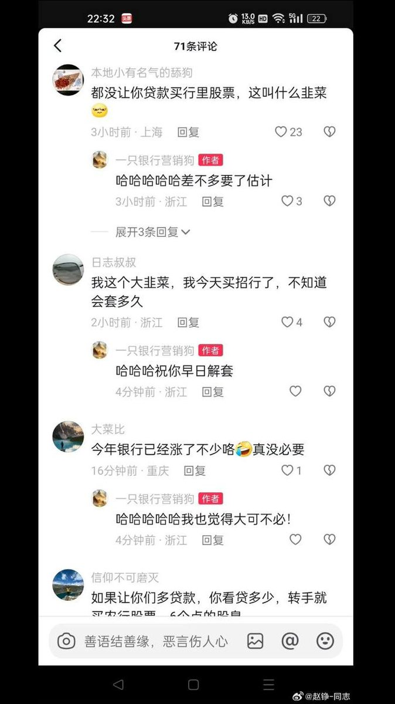  谁将十万横扫三江 北京时间 2023-07-29T16:58:56Z 1685213304632016896 ☝️ https://t.co/dDkVBz0tO4 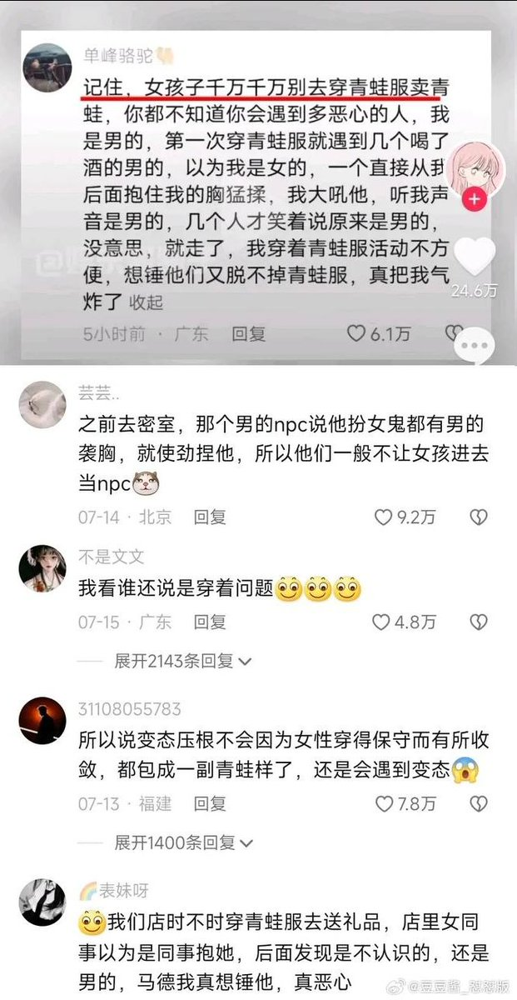  谁将十万横扫三江 北京时间 2023-07-29T17:24:16Z 1685219682457157633 RT @whyyoutouzhele: 网友投稿
烟台养马岛音乐节发布的禁止带入现场的旗帜： https://t.co/riY0NXZNOC 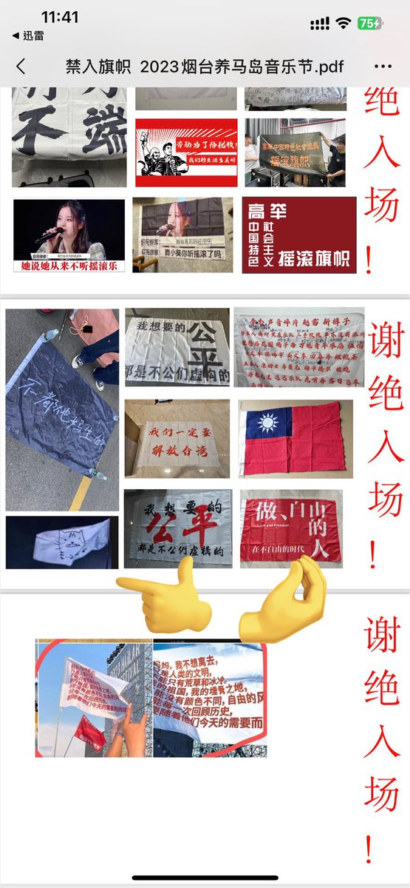  谁将十万横扫三江 北京时间 2023-07-29T17:24:39Z 1685219776053047296 RT @whyyoutouzhele: 网友投稿
7月28日，浙江杭州某酒店贴的告示。 https://t.co/ty6wHIJ2Qy   谁将十万横扫三江 北京时间 2023-07-29T15:35:44Z 1685192368444874752 中国的体制成本有多巨大？进口设备花费3500万，进口成本是1500万，账面利润是20万，给官员疏通关系达成交易的回扣两千万！这是普遍现象 https://t.co/wC7iHN2nEH 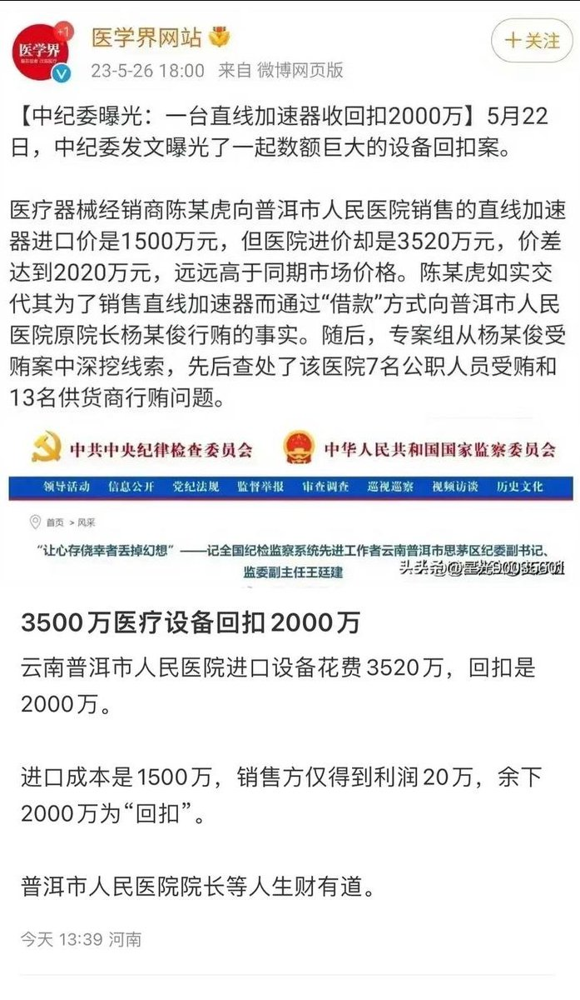  谁将十万横扫三江 北京时间 2023-07-29T15:45:25Z 1685194803171262464 RT @torontobigface: 其实共产党得罪我了吗？
至少我公开反共之前没有
我过去在中国也赚到钱了
唯一遭受的铁拳，也就是疫情期间被封在武汉
但是我本身善用互联网，那时候还是能买到东西，
那为什么我还会坚定的出来反共呢？
那是因为我看到太多的人遭受不公，我看不下去，…   谁将十万横扫三江 北京时间 2023-07-29T15:50:55Z 1685196188314963968 当毛粉批评米国糗事盯着西方国家喷的时候
毛泽东☝️ https://t.co/1f0uCV7g0Z 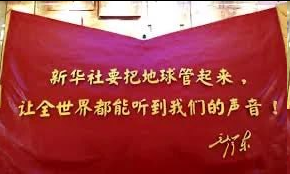  谁将十万横扫三江 北京时间 2023-07-29T16:07:26Z 1685200343662264320 RT @Pandazhq: 一点都不夸张，我们小时候就这样。 https://t.co/VuafUYYihI 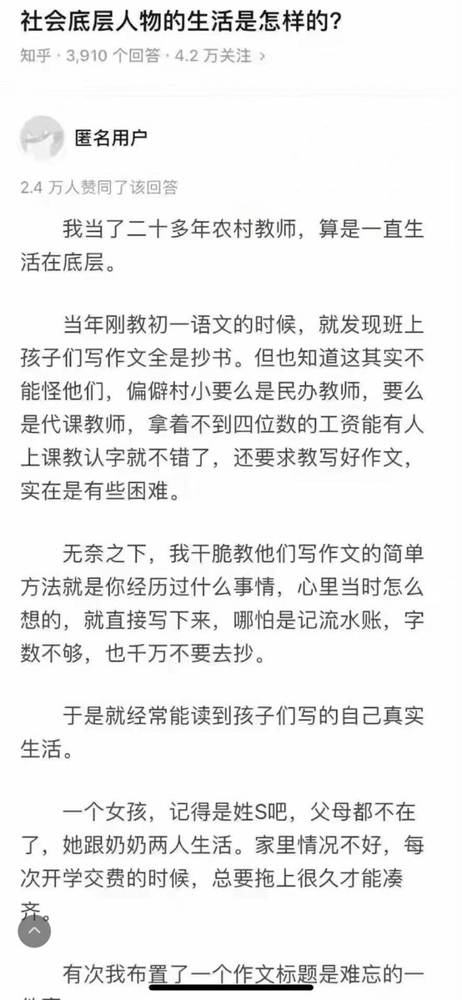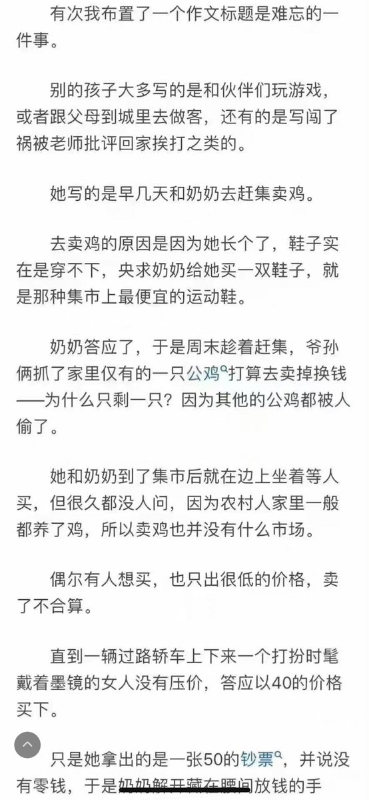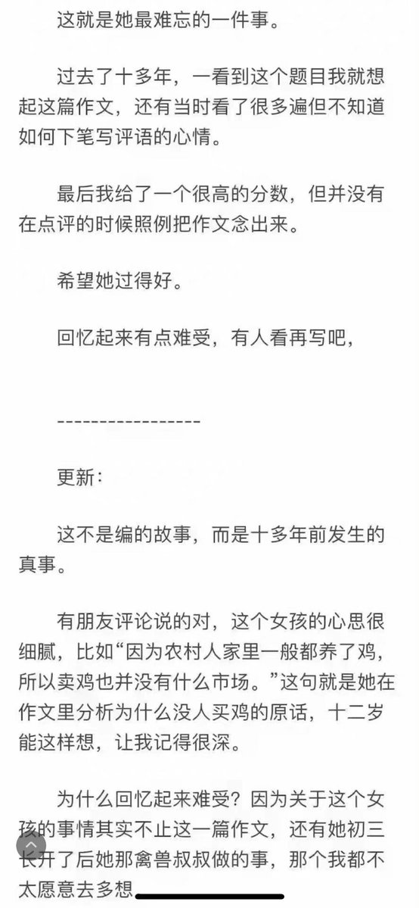  谁将十万横扫三江 北京时间 2023-07-29T12:44:30Z 1685149275716734976 ☝️🐶搞怪

现在最重要的，不是解决造反派被镇压，而是防止造反派受到马列势力的煽动聚集搞事。因为造反派被镇压这件事本身，和毛主席一点关系都没有，毕竟我们是封建专制国家，朝廷官员有它自己的周期性，有上去的就有下来的，当集权处于强盛周期的时候，造反派被镇压的人就多。
一个人被镇压，要么就是大环境出于集权周期，要么就是个人没本事，又或者没有生在好的家庭，起点太低，但无论如何，这口锅怎么也甩不到毛主席头上，所以国家不需要为当代造反派的死亡承担任何责任，你们要是真想宣泄，可以骂苏修，毕竟赫鲁晓夫时代他们真的挑起了中苏边境摩擦，这是对中国各行业劳动者的直接伤害。而另一方面，现在国际上中苏在诸多领域的竞争和冲突不仅真实存在，而且根本没有缓和的迹象，尤其是苏联人他们现在看不到通过非核战手段战胜中国的任何可能性从上到下是铁了心要把世界推向战争。因此，对于苏联来说，利用现在全球整体经济不景气的客观条件，去煽动中国的造反派搞事，就符合他们的利益，毕竟苏联人又不是傻，打仗是要死人的，在这之前当然尽量尝试从内部瓦解对方，这也是他们的一贯风格。这也是为什么，现在中国从官方到民间，都必须警惕那些造反派，尤其是找不到工作的大学生，被取缔工会的工人，要时刻关注他们的思想动向，不然鬼知道这群生活不如意的人会对社会有多大仇恨。虽然说，他们过不好不是国家和毛主席的错，但架不住犹太佬的挑拨。
人这种生物，天生就不容易反思自己，遇到挫折都本能地倾向于从外部找原因，就比如造反派被镇压这件事，明明是自己的问题，在造反期间没占到好岗位，不肯从事费体力的劳动，在军管之后肯定不堪一击，但犹太人的宣传，通常会抓住这些loser们的心理，把锅往国家和毛主席身上甩，让他们觉得自己只是怀才不遇，都是生不逢时，这就形成了搞乱社会的动机。所以说，“造反派被镇压，一镇压就死”这个问题，根本就没有任何讨论价值，这些造反派只是在为自己的选择埋单而已，谁叫你不给毛主席效忠呢?怎么不见这些军队的将军失业?俗话说，自助者天助，毛主席要是真可怜这帮loser,才是中了社会主义的圈套呢，让不努力的loser有存在感，是对社会资源的最大浪费。   谁将十万横扫三江 北京时间 2023-07-29T10:39:44Z 1685117876913754112 吉林白山北山公园一对母子上吊，据悉母亲患病没钱医治
母亲71岁，儿子45岁 https://t.co/errWc5k8Zk 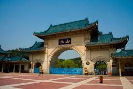  谁将十万横扫三江 北京时间 2023-07-29T11:39:00Z 1685132792370458624 RT @notcatis: 感谢光州民主运动，让我们看到民主诉求并不是西方世界的反华伎俩，而是超越意识形态的世界潮流。
                          
  ——YouTube视频《光州抗暴紀念歌》网友热评   谁将十万横扫三江 北京时间 2023-07-29T11:56:11Z 1685137117553491968 https://t.co/ynS91uk0yC 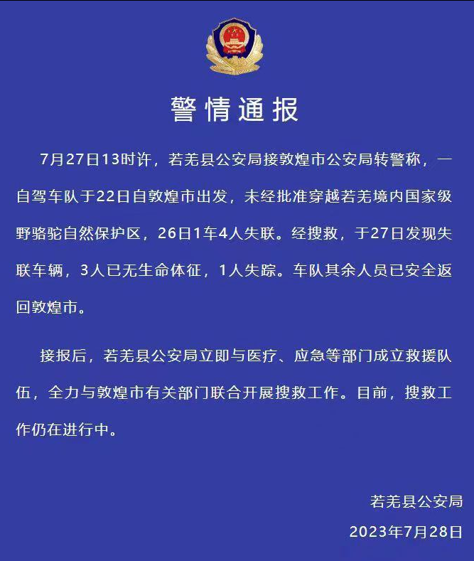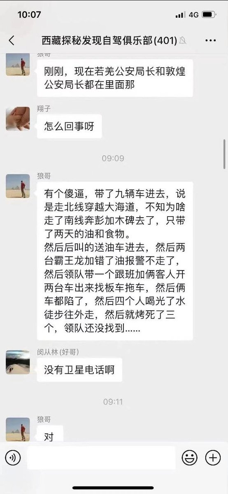  谁将十万横扫三江 北京时间 2023-07-29T09:04:06Z 1685093810731466752 你以为是资源调配的能力问题，其实是权力的傲慢，宁愿在仓库里放坏了都不给你 https://t.co/v3mSXK4Mxn   谁将十万横扫三江 北京时间 2023-07-29T00:00:51Z 1684957095693873152 四川阿坝州，游客游九寨沟，被导游“放狠话”“大巴车我说坏就坏，让你们买一点能怎样” https://t.co/1gcnchiMWR   谁将十万横扫三江 北京时间 2023-07-29T00:06:32Z 1684958527096504320 原深圳律协会长向法官行贿20万只为法庭发言不被打断 https://t.co/uCmLWp7AJ9 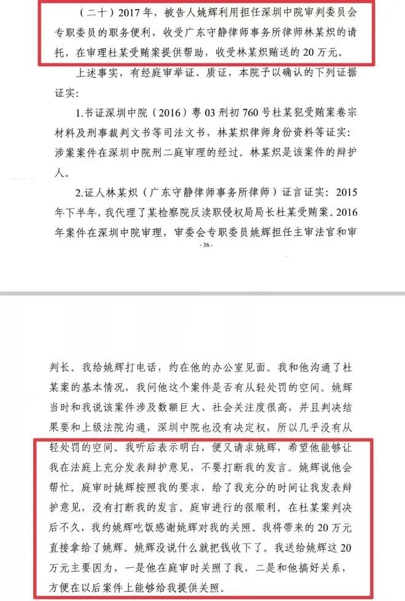  