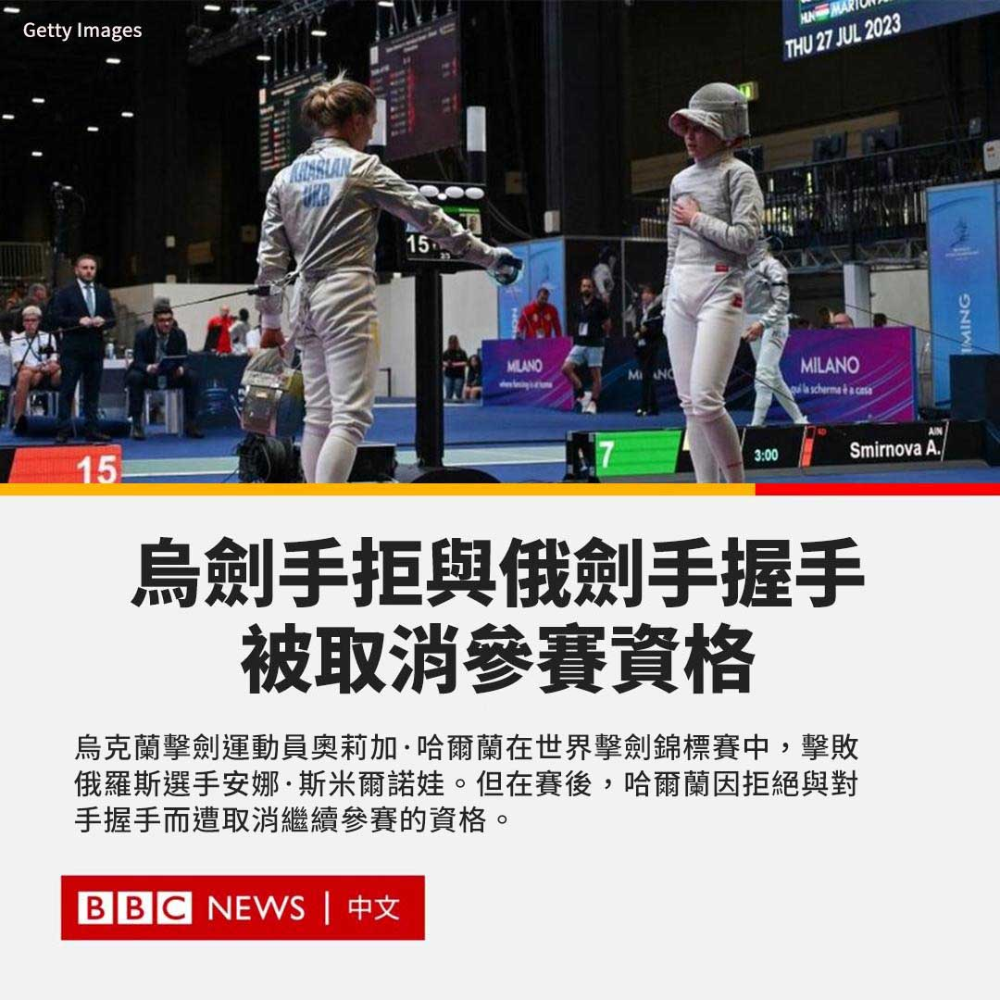
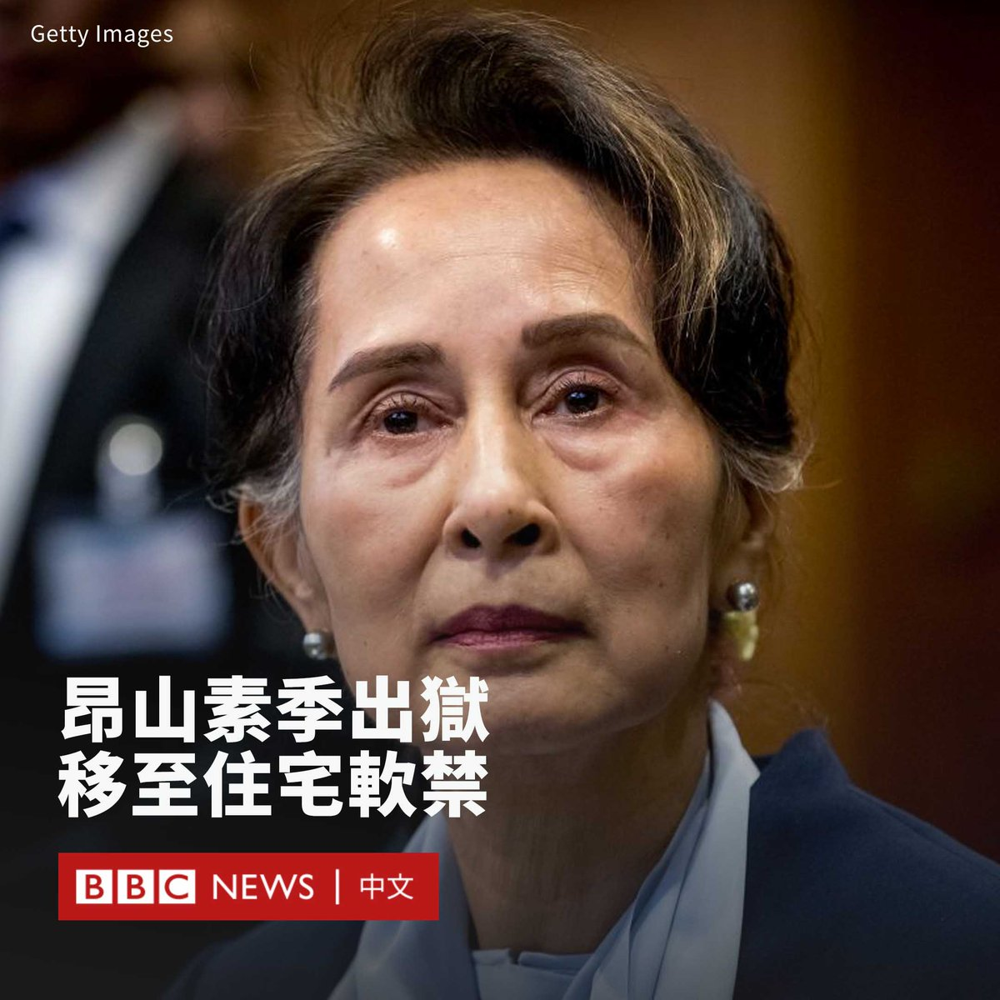
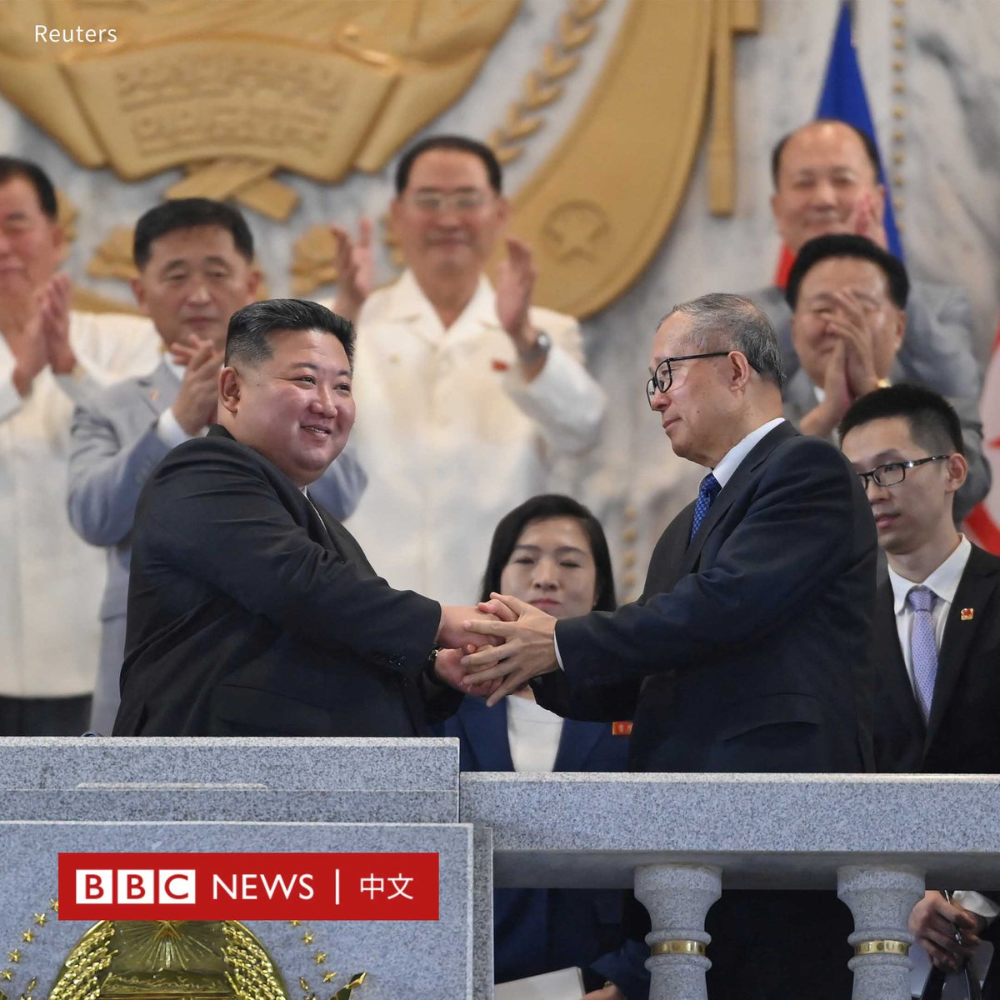
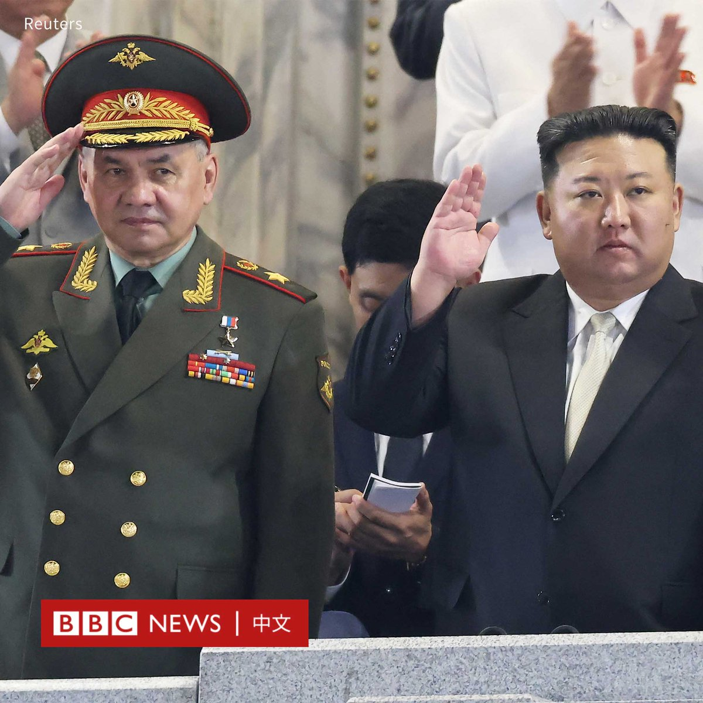
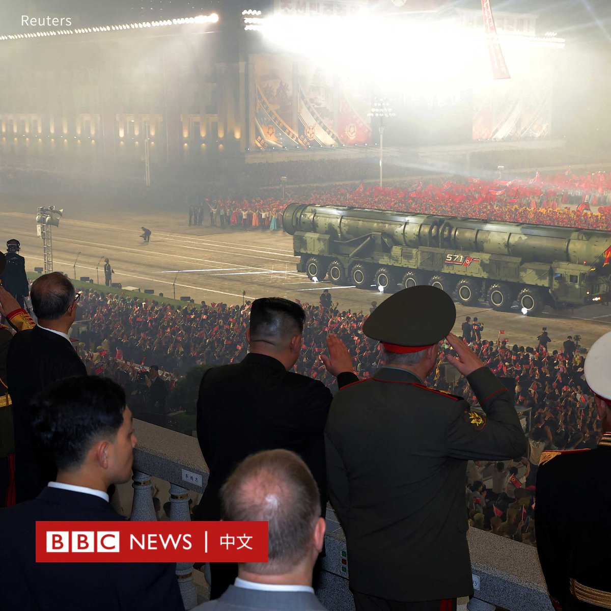
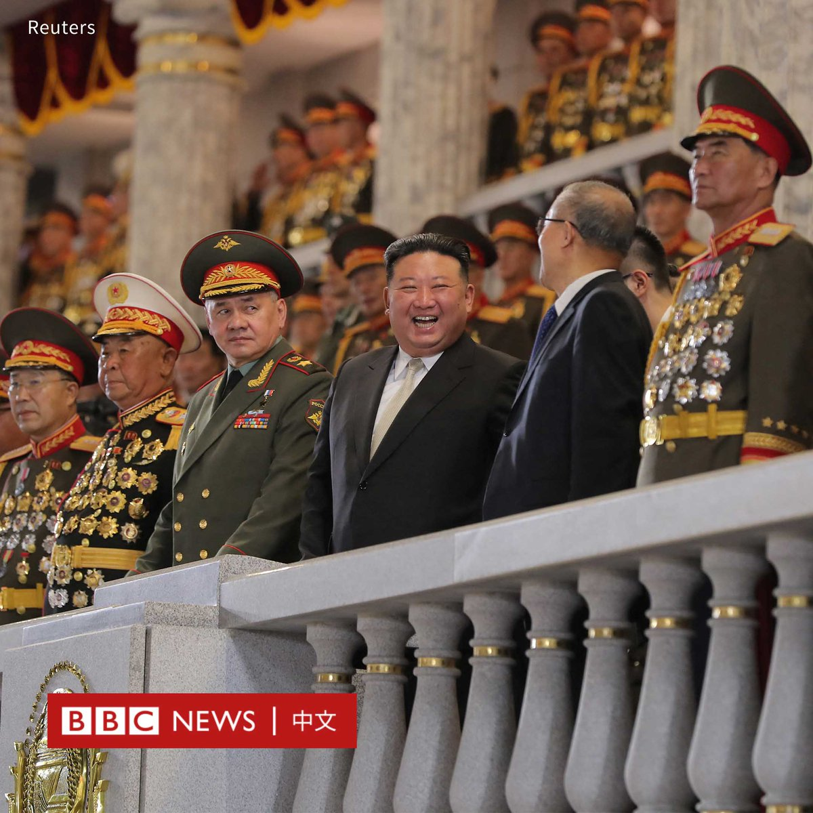
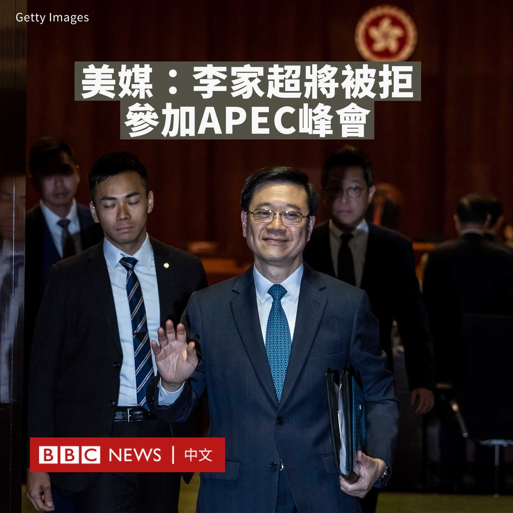
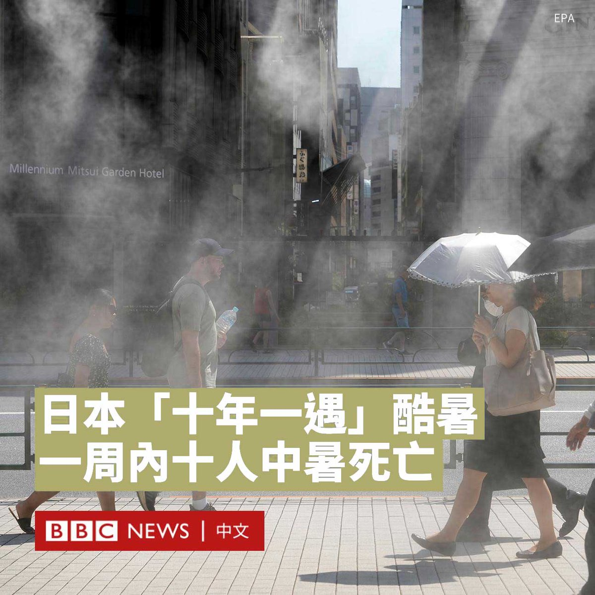

D英国广播公司BBC 北京时间 2023-07-28T17:45:55Z 1684862743453818880 乌克兰击剑运动员奥莉加·哈尔兰（Olha Kharlan）周四（7月27日）在世界击剑锦标赛中，击败俄罗斯选手安娜·斯米尔诺娃（Anna Smirnova）。但在赛后，哈尔兰因拒绝与对手握手而遭取消继续参赛的资格。

自俄罗斯入侵乌克兰以来，哈尔兰是首位与俄罗斯或白俄罗斯选手对阵的乌克兰击剑选手，这次比赛在米兰举行，哈尔兰以15-7获胜。

赛后，32岁的哈尔兰拒绝与斯米尔诺娃握手，只伸出自己手中佩剑，然后离开。

这引起斯米尔诺娃不满，她进行了45分钟的静坐抗议。

哈尔兰事后说：“我要传达的信息是，我们乌克兰运动员已准备好在运动场上面对俄罗斯选手，但我们永远不会和他们握手”。

身披着中立旗帜的斯米尔诺娃在第一轮比赛后仍站在击剑场上，继续进行抗议。大会最终安排她坐在椅子上，等待处理。

哈尔兰依然被列为晋级32强的选手，而斯米尔诺娃在官员的劝导下离开了击剑场，让下一场比赛开始。

然而，最终结果显示，哈尔兰被取消了女子佩剑个人赛的资格，她曾夺下四次个人赛冠军和四次奥运奖牌。

哈尔兰声称，国际击剑联合会（FIE）主席伊曼纽尔·卡西亚达基斯（Emmanuel Katsiadakis）曾向她许诺，可以不握手，而是碰一下剑。

她说：“我以为我得到了他的保证，就确保了安全，但显然不是这样”。

在哈尔兰被取消资格后，国际奥委会（IOC）呼吁各体育联合会以“必要的敏感度 ”处理乌克兰运动员和作为中立者参赛的俄罗斯选手，并补充说：“我们继续全力声援乌克兰运动员和乌克兰奥林匹克界” 。

在击剑比赛中，握手属于运动规则的一部分，拒绝握手将被出示黑牌并驱逐出场。   D英国广播公司BBC 北京时间 2023-07-28T15:41:11Z 1684831349914697728 缅甸被军方罢黜的民选领导人昂山素季（Aung San Suu Kyi）已被從監獄转移到住宅软禁。

BBC缅甸语获悉，昂山素季周一（7月24日）被移送到首都内比都的一座政府住宅。此前，她被单独囚禁了一年。

现年78岁的昂山素季在2021年2月军方发动政变后被拘留，她后来在闭门审判中被判囚33年，理由是“违反防疫规定”、“违反保密法”等。

两年多来，外界对于她的状况所知甚少。

据传昂山素季患有疾病，但军方否认了这些报道。本周早些时候，她所处的内比都监狱的一位消息人士对BBC说，她健康状况良好。

泰国外交部长敦·帕马威奈（Don Pramudwinai）本月上旬透露，他拜会了在狱中的昂山素季。

据BBC缅甸语报道，军方已安排昂山素季与议会下院议长迪昆妙（T Khun Myat）会面。然而，军方否认正在进行这些会谈。   D英国广播公司BBC 北京时间 2023-07-28T13:47:58Z 1684802859714617344 朝鲜周四（7月27日）举行阅兵式和文艺演出，庆祝朝鲜战争（韩战）停战70周年，这在该国被称为“胜利日”。中国和俄罗斯代表团受邀参加。

朝鲜官方通讯社发布的画面显示，领导人金正恩与到访的中共中央政治局委员李鸿忠、俄罗斯国防部长绍伊古（Sergei Shoigu）会晤。三人一起观看了阅兵式和演出。

朝中社报道称，在夜间举行的阅兵式上出现了“火星炮-18”型新型洲际弹道导弹和“火星炮-17”型洲际弹道导弹。

“火星炮-18”是朝鲜第一个使用固体推进剂的洲际弹道导弹，这使得它比液体燃料推进剂的发射速度更快。

这些导弹可以携带核弹头，联合国安理会决议明确禁止朝鲜使用弹道导弹科技。

在与中国代表团会面时，李鸿忠向金正恩转达了一封中国领导人习近平的亲笔信。

朝中社报道称，在欢迎宴会上，朝鲜劳动党中央委员会部长金成男对中国代表团说，平壤将“永远不会忘记在祖国解放战争的伟大胜利史，和朝中友谊史上谱写辉煌篇章的勇士们的英雄殊勋和丰功伟绩”。

此前一天，金正恩还和绍伊古参观了一个包括洲际弹道导弹、无人机在内的武器装备展览。绍伊古此行是自1991年苏联解体以来，俄罗斯国防部长首次访问朝鲜。

于朝鲜而言，俄罗斯和中国代表团的到来标志着三年来，平壤首次向外国宾客开放。

因为新冠病毒疫情，朝鲜2020年初关闭边境，停止一切跨境贸易和外交访问，连主要经济及政治盟友中国和俄罗斯也不例外。   D英国广播公司BBC 北京时间 2023-07-28T10:49:41Z 1684757991256682496 美国媒体报道称，华盛顿不会邀请中国香港特区行政长官李家超到美国出席亚太经合组织（APEC）领导人非正式会议。

香港政府对此回应称，美国应“切实履行东道主的基本责任，依照亚太经合组织的常规及一贯做法，邀请行政长官以中国香港领导人身份出席会议”。

“东道主有责任向各领导人发出邀请函，为他们出席会议提供便利。”行政长官办公室发言人说。

《华盛顿邮报》（The Washington Post）此前引述三名美方官员消息，白宫决定不让李家超出席11月在旧金山举行的APEC会议。这一决定可能再次加剧美中关系紧张。

美国在2020年香港实施《国安法》后，宣布对时任香港保安局长的李家超以及香港与中国大陆等逾10名官员实施制裁。李家超去年就任香港特首。

《华盛顿邮报》在报道中称，白宫拒绝就此发表评论，只称期待所有APEC成员“在符合美国法律法规的情况下参会”。

中国驻美大使馆发言人刘鹏宇则表示，北京对李家超被禁止出席APEC峰会表达“强烈反对”，称该决定“违背APEC规定，也违背了美国做出的承诺”。

据报道，美国官员称，俄罗斯总统普京（Vladimir Putin）也将被拒之门外。   D英国广播公司BBC 北京时间 2023-07-28T09:29:42Z 1684737863194451968 近期，日本全国大部分地区气温高达34至35℃，于一周内有十人因中暑死亡。气象厅指，全国大范围地区将出现“十年一遇”程度的酷暑。

日本政府称，截至7月23日的一周，全国有9000多人因高温中暑住院，一半人数以上是65岁以上，一星期内有10人因中暑死亡。

日本当局警告室内高温可导致死亡，称四成多病例发生在家中。

日本《读卖新闻》报导，气象厅7月25日表示，九州北部“出梅”，宣布日本全境今年梅雨季结束，而接下来中暑风险预料更高。

报导指，日本今年夏天酷热的原因，其一个因为西风带“蛇行”，另一个则是厄尔尼诺现象。

按照气象厅相关规定，最高气温不低于35摄氏度的日子被称为“猛暑日”。而东京进入七月后，中心城区的“猛暑日”天数已达到八天，是自气象厅1875年开始这项统计以来，当月“猛暑日”最多的一年。

预计气温将进一步升高，日本当局已向部分地区发布了“中暑警戒警报”。   