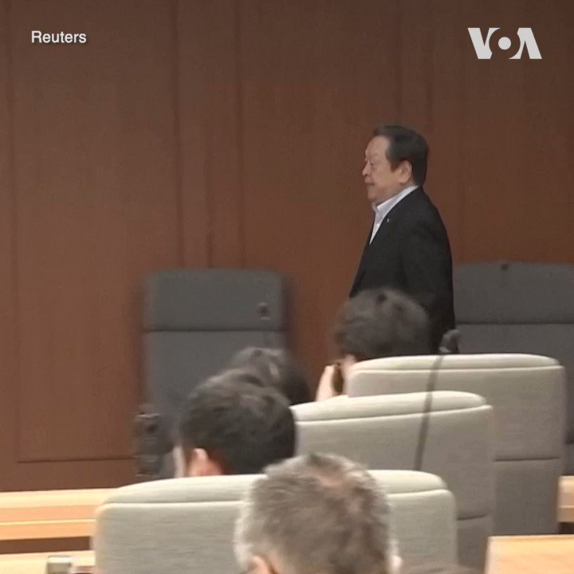
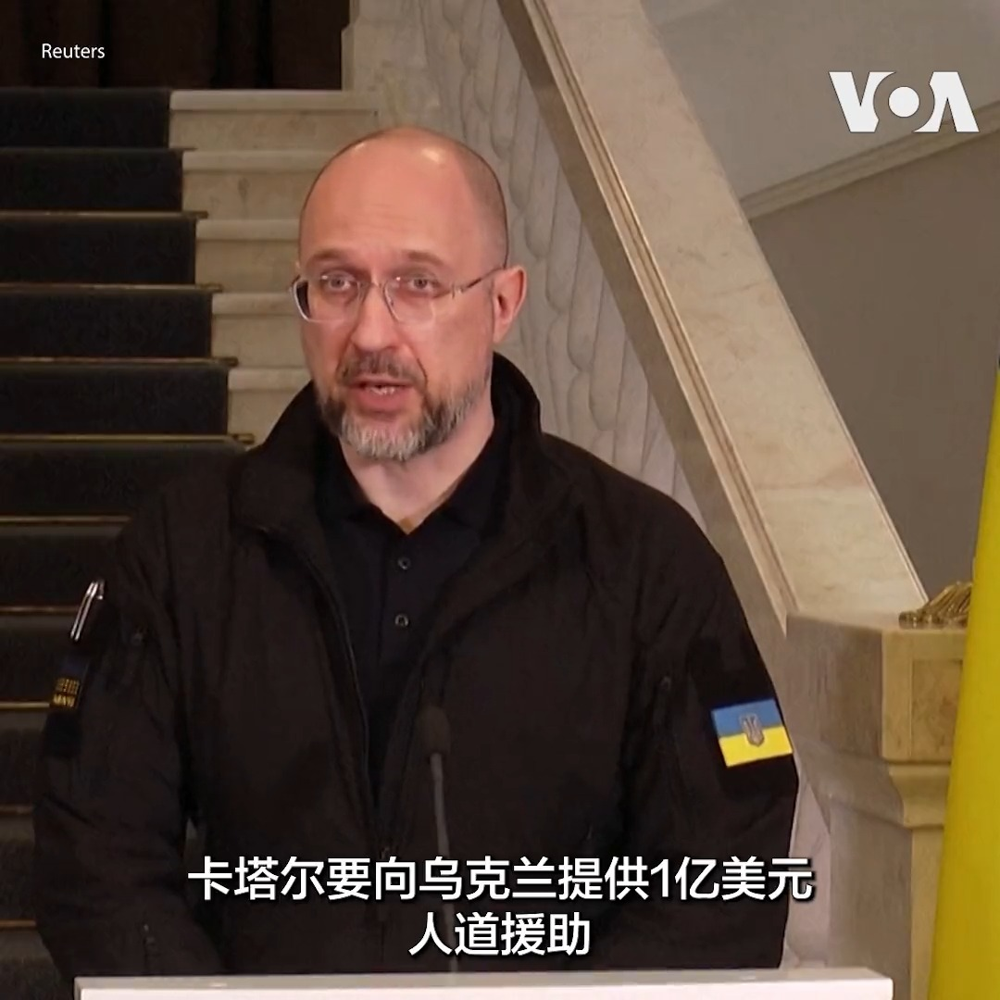
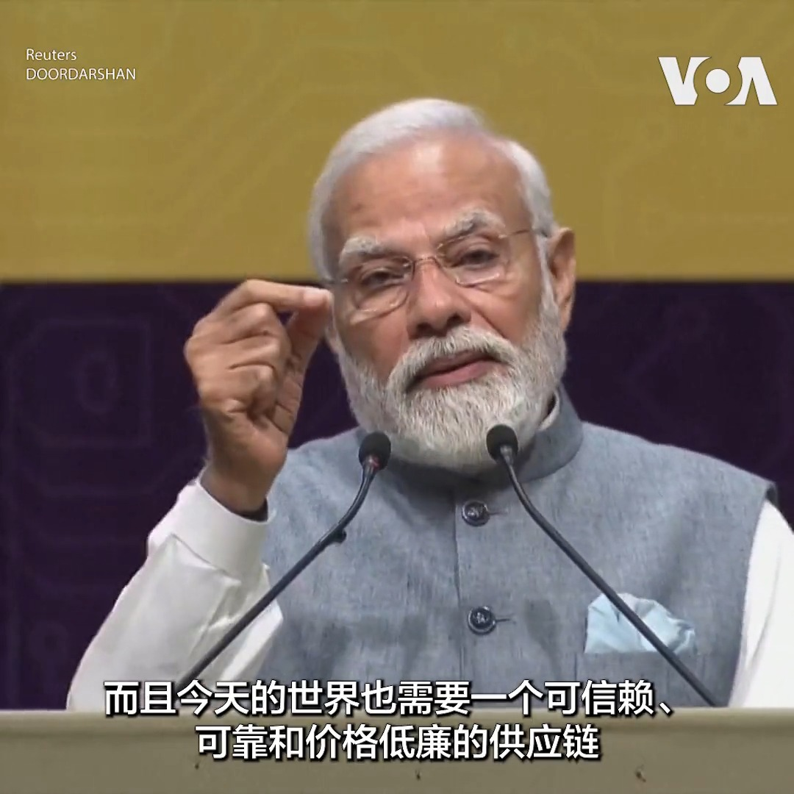
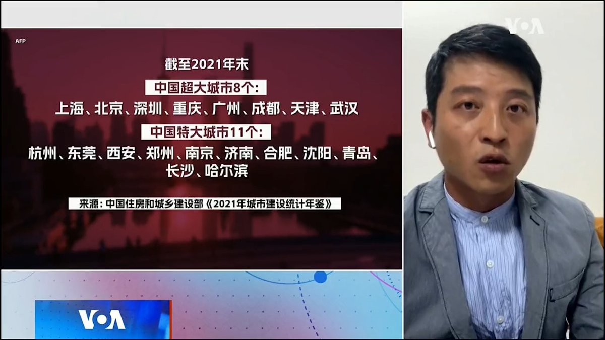
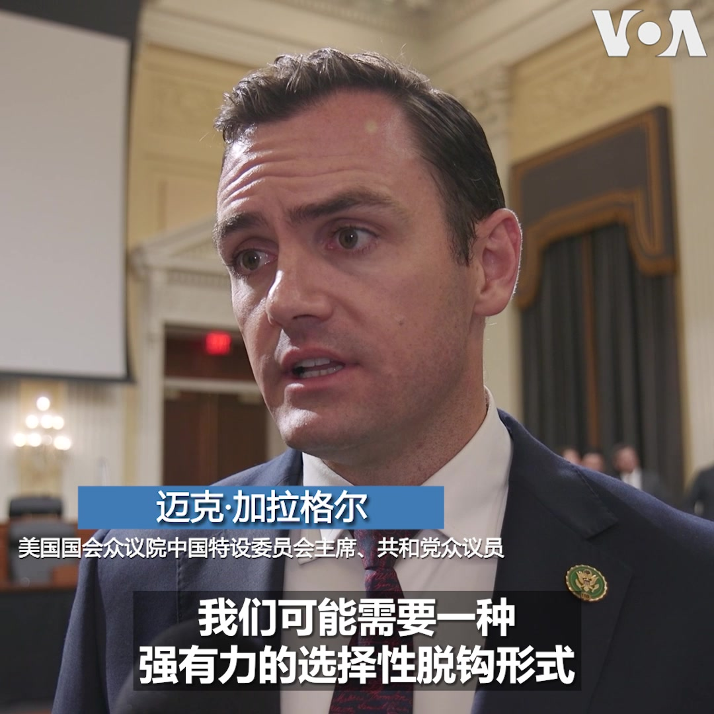
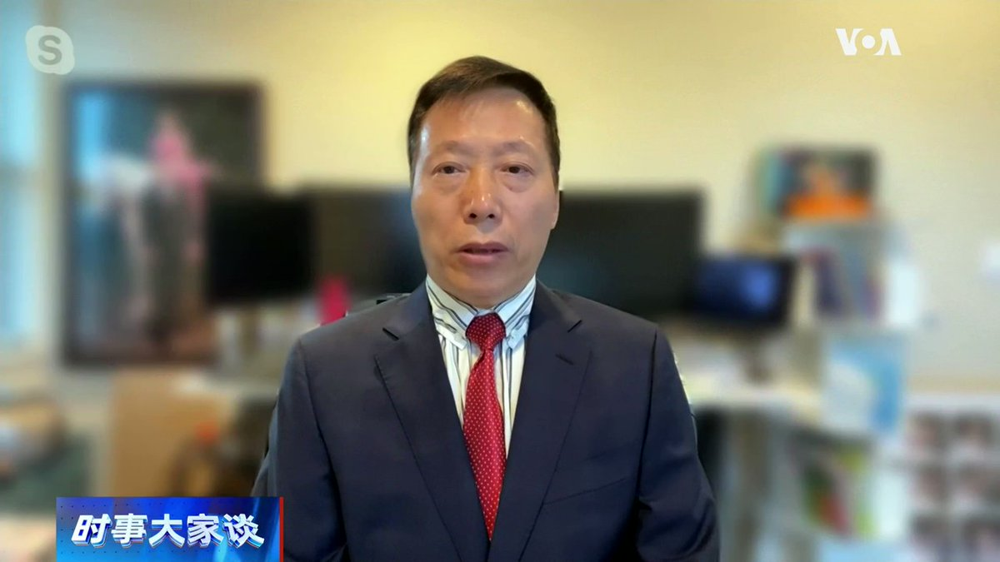
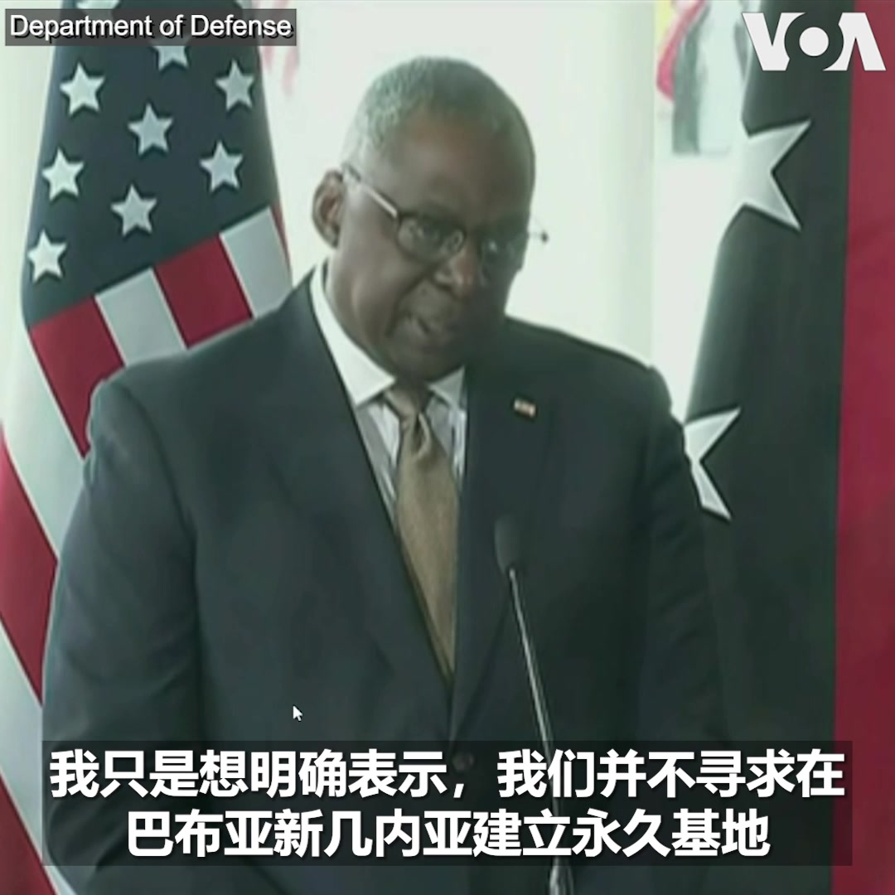

美国之音中文网 北京时间 2023-07-28T22:56:32Z 1684940911774715904 日本发表新版防卫白皮书，对中国军力扩张、中俄关系及台海局势拉响警报 https://t.co/BpIxfqKeE1   美国之音中文网 北京时间 2023-07-28T23:03:47Z 1684942737013948419 日本政府7月28日发表本年度《防卫白皮书》， 强调与盟友合力应对周边挑战。白皮书指出，日本正面临二战结束以来最严峻的安保环境，尤其是来自邻国的导弹威胁，因此强化反击能力至关重要。 https://t.co/jS15V2qECA   美国之音中文网 北京时间 2023-07-28T23:41:03Z 1684952114336804865 乌克兰总理什米加尔28日在基辅与卡塔尔首相兼外交大臣穆罕默德·本·阿卜杜勒拉赫曼·阿勒萨尼会晤后表示卡塔尔将要向乌克兰提供1亿美元的人道援助。什米加尔说援助将用于重建医疗卫生和教育、清除地雷等。 https://t.co/em63aETMwG   美国之音中文网 北京时间 2023-07-28T23:54:03Z 1684955386468765696 中国新任老外长王毅首次在官网致辞，秦刚任内相关活动文章下架后又上架 https://t.co/p1NVJxScEF   美国之音中文网 北京时间 2023-07-28T20:41:34Z 1684906943385870337 美中情报战 分析：中共就是广义间谍组织 https://t.co/dPa6ZtWp35   美国之音中文网 北京时间 2023-07-28T21:00:56Z 1684911818777534466 7/28【#时事大家谈】齐齐哈尔中学体育馆坍塌事件，为何难属最先面对的是警察？《上海搞成这样，我们很难过》为何引发共鸣？ 
 
嘉宾：美国律师高光俊律师;前上海外科医生、沪裔美国人协会会长何岸泉先生
主持人：陈小平  
  
Youtube🔗 https://t.co/orKeneurlZ https://t.co/BHembiXsoT   美国之音中文网 北京时间 2023-07-28T21:03:43Z 1684912518844522496 中国人权律师卢思位7月28日在老挝被捕。美联社说，卢思位是当地时间上午在试图登上一列开往泰国的火车时被老挝警方逮捕的。卢思位的原定行程是在泰国搭乘班机前往美国与家人团聚。卢思位的家人担心他有可能会被老挝当局引渡回中国。卢思位曾多次代理中国异议人士和香港活动人士。 https://t.co/Tj1FHljyvA   美国之音中文网 北京时间 2023-07-28T21:39:34Z 1684921540356579328 香港抗议歌曲《愿荣光归香港》一案出现大逆转：法庭反对颁布禁令 https://t.co/EOc4TI1an9   美国之音中文网 北京时间 2023-07-28T21:58:04Z 1684926195237019648 澳大利亚禁止新建住宅使用天然气 https://t.co/QeTbO9vX28   美国之音中文网 北京时间 2023-07-28T22:14:19Z 1684930285329080320 正在澳大利亚访问的美国国防部长劳埃德·奥斯汀7月28日与澳大利亚国防部长理查德·马尔斯举行会晤。两位防长承诺美澳双方将加强相互支持与合作。奥斯汀说，美国将继续支持盟友在印太地区对抗中国的霸凌行为。 https://t.co/5oaegf1LXU   美国之音中文网 北京时间 2023-07-28T18:39:31Z 1684876228879077376 台湾于7月24日-28日举行“汉光39号演习”，实兵模拟解放军攻台的备战状况。军方今年吸取乌克兰击退俄空降兵，守住基辅周边要地“安托诺夫机场”的经验，首度封闭桃园国际机场，演练应对解放军的“立体化登陆作战”。军事专家表示，今年汉光演习最贴近实战，且从验证中找到改进之道。https://t.co/gqqggTiETV https://t.co/McKuOL4JiK   美国之音中文网 北京时间 2023-07-28T19:12:33Z 1684884542505500674 台湾乒乓球星江宏杰27日在东京的记者会上呼吁前妻福原爱遵守法院裁定，尽快归还他们的第二个孩子。双方2021年在台湾离婚，同意共同监护两个孩子。两个孩子本来一直与江宏杰住在一起，去年夏天福原爱将小儿子带回日本，原计划在日本度过夏天，但江宏杰的律师说后来福原爱切断联系并拒绝将儿子送回台湾。 https://t.co/CVNBaXA66O   美国之音中文网 北京时间 2023-07-28T20:01:04Z 1684896752774889472 《华邮》报导美国拒绝香港特首出席亚太经合会议 https://t.co/E67c5YQWhA   美国之音中文网 北京时间 2023-07-28T20:23:02Z 1684902282897592321 多克苏里台风登陆中国，东南沿海地区交通中断，暴雨降临 https://t.co/8Yawql1RRc   美国之音中文网 北京时间 2023-07-28T20:31:50Z 1684904497041043456 印度总理莫迪28日说印度希望成为半导体业可信赖的伙伴, 并期待成为全世界的芯片供应者。在印度古吉拉特邦举行的半导体会议上，美国芯片制造商超微半导体公司AMD宣布计划在今后5年在印度投资约4亿美元建立最大的设计中心。莫迪将芯片制造作为印度经济战略的重点, 力图将印度打造为半导体制造业中心 。 https://t.co/24EsfCeTPw   美国之音中文网 北京时间 2023-07-28T17:55:02Z 1684865035410214912 昂山素季被从监狱转移至宅邸软禁 https://t.co/7A5eo9qgqH   美国之音中文网 北京时间 2023-07-28T12:56:33Z 1684789919905148930 朝鲜在晚间举行的阅兵式上展示弹道导弹、无人机等武器 https://t.co/cwOwvR64B6   美国之音中文网 北京时间 2023-07-28T12:42:03Z 1684786269921099777 美国参院通过《国防授权法案》 https://t.co/gm92TRdBMZ   美国之音中文网 北京时间 2023-07-28T13:29:07Z 1684798114316636160 澳大利亚总理坚信美国定将交付核动力潜艇 https://t.co/g3ABb2GHWs   美国之音中文网 北京时间 2023-07-28T13:49:03Z 1684803134106021888 路透：美国最快周五宣布对台逾3亿美元军援 https://t.co/CbTjpxSLS1   美国之音中文网 北京时间 2023-07-28T10:46:02Z 1684757075254235136 在悲观的年度安全评估中 日本欢迎与韩国关系的解冻 https://t.co/tFn706brkD   美国之音中文网 北京时间 2023-07-28T09:48:00Z 1684742468812869632 中国解放军愈发频繁地在南中国海进行危险操作，逼近、拦截美国正常作业的军机、军舰，美国国防安全学者担忧，危险操作可能导致擦枪走火，两国又缺乏风险管控机制，难以明确沟通战略意图，误读误判可能导致严重后果。 https://t.co/gd4BPd7bOx   美国之音中文网 北京时间 2023-07-28T10:01:03Z 1684745754282459136 乌军收复东南部村庄斯塔罗迈尔斯克 https://t.co/FKGm5sEBpX   美国之音中文网 北京时间 2023-07-28T10:31:04Z 1684753307133480961 检察官称特朗普下令删除监控录像；机密文件案第二名特朗普员工被指控 https://t.co/x2YBQzaeKs   美国之音中文网 北京时间 2023-07-28T05:12:04Z 1684673026984718336 波士顿中国留学生被控暴力威胁亲民主人士案定于明年1月开庭审理 https://t.co/kTAHFGBk1P   美国之音中文网 北京时间 2023-07-28T05:43:35Z 1684680962444255232 白宫官员：美国不想强迫巴基斯坦在北京与华盛顿之间选边站 https://t.co/Lm5ggpy9JX   美国之音中文网 北京时间 2023-07-28T06:29:13Z 1684692444917518337 继中共政治局4月提出在超大、特大城市推进“城中村改造”之后，国务院近日通过指导意见落实政策，鼓励民间资本参与。“台湾智库”中国问题研究中心主任吴瑟致博士认为，这一轮城中村改造瞄准一、二线城市，因为三、四线城市已被上一轮棚改榨干。政府现在资源有限。完整版：https://t.co/OfR4LfrwMz https://t.co/FeJq8IoNbA   美国之音中文网 北京时间 2023-07-28T06:53:37Z 1684698586167050240 美中科技竞争日趋激烈，美国会众院中国特设委员会周三召开听证会，讨论如何确保美国能在关键技术领域里保持领先地位。委员会主席加拉格尔和多名两党议员对美国之音记者 @voayihua 强调，必须防止美国发明的技术反过来被中国用来对付美国。https://t.co/zygoULx2D6 https://t.co/jqn0eHjexQ   美国之音中文网 北京时间 2023-07-28T07:00:01Z 1684700196863893504 齐齐哈尔34中体育馆坍塌，11人遇难。家长没求道歉、没求追责，只想沟通。为何他们等来的全是警察？ “全力救治”这种官腔为何频频？ “献花阴谋论”为何又来？讲述上海萧条惨状的《上海搞成这样，我们很难过》热传，谁把上海搞成这样？上海本可逃过一截？请收看美国之音7月28日上午9点《时事大家谈》。 https://t.co/I7DgZ5n6y4   美国之音中文网 北京时间 2023-07-28T07:12:00Z 1684703210156523520 秦刚作为曾受习近平器重连升三级的外交部长突遭免职，官方至今没有给出解释。独立时评人蔡慎坤先生认为，在中国官场，即使习亲自选定的官员都活得战战兢兢，人人心怀鬼胎，没有人可以正常开展工作。时事大家谈完整版：https://t.co/OfR4LfrwMz https://t.co/my1dt6EKRh   美国之音中文网 北京时间 2023-07-28T07:20:03Z 1684705237960175622 白宫驳回俄罗斯向非洲提供免费粮食的提议 https://t.co/HSzOzPmMf6   美国之音中文网 北京时间 2023-07-28T07:33:00Z 1684708494983749632 一位前白俄罗斯外交官告诉美国之音，中国前外长秦刚快速升迁的秘密可能与其任礼宾司司长期间有机会近距离向中国国家主席习近平展示其忠诚与能力有关。他在2015年为习近平访问白俄罗斯作准备的过程中，目睹了秦刚半夜为习近平次日参观的博物馆数台阶的超现实一幕。https://t.co/FyxOV6cpwI https://t.co/KyV1RTvdRo   美国之音中文网 北京时间 2023-07-28T07:35:03Z 1684709011038601216 巴布亚新几内亚承诺与美国合作将带来连锁效益 https://t.co/uZDF0hPV8O   美国之音中文网 北京时间 2023-07-28T07:48:03Z 1684712281786195968 巴基斯坦纪念中国投资十周年 中巴经济走廊实际结果如何评估 https://t.co/QhXXYkA0D0   美国之音中文网 北京时间 2023-07-28T08:03:03Z 1684716057880309760 美海警队将扩大地区存在与台湾等印太伙伴合作，应对不守国际秩序者的威胁和挑战 https://t.co/EBRYlPzmFg   美国之音中文网 北京时间 2023-07-28T08:33:33Z 1684723732290637824 罗马考虑撤出北京的一带一路，华盛顿与罗马重申伙伴关系 https://t.co/Zmir7ESVfu   美国之音中文网 北京时间 2023-07-28T09:18:06Z 1684734945321979904 加拿大外交官被拒绝旁听吴亦凡在中国的上诉审判 https://t.co/oiFiW3BPQP   美国之音中文网 北京时间 2023-07-28T03:26:30Z 1684646460774645760 乌克兰总统弗拉基米尔·泽连斯基7月27日视察了位于东南部的第聂伯罗市。他和驻守此地的乌军将领讨论了当地战况、军需补给和强化防空等问题。泽连斯基随后还参观了当地一家医院，并对救治受伤军人的医护人员表达谢意。 https://t.co/TEZzwwCISs   美国之音中文网 北京时间 2023-07-28T04:19:03Z 1684659686212280320 李家超到访大马“说好香港故事” 被迫出走网红：“各有各说”吧！ https://t.co/4Dx4hakppd   美国之音中文网 北京时间 2023-07-28T04:19:05Z 1684659694080778240 中国在中亚的软实力不断崛起，但文化和亲和力仍面临挑战 https://t.co/slXLzzqUXG   美国之音中文网 北京时间 2023-07-28T04:30:55Z 1684662674947465217 中国女足队28日将在世界杯女足赛中对阵海地，在首轮比赛中以0：1输给丹麦队后，中国女足必须在第二轮比赛中打败海地，以避免被淘汰的命运。中国队在澳大利亚阿德莱德的训练场展开练习，积极备战。美国之音采访了在澳大利亚准备为中国队加油的粉丝，听听他们怎么说。 https://t.co/eRafQy3dIW   美国之音中文网 北京时间 2023-07-28T04:49:02Z 1684667234281742339 普京承诺俄罗斯向非洲运送谷物 https://t.co/9o8jRCWYLc   美国之音中文网 北京时间 2023-07-28T05:43:34Z 1684680955179773952 模拟解放军空降桃园机场 分析:台湾汉光39号演习空前贴近实战 https://t.co/958MxqAx6d   美国之音中文网 北京时间 2023-07-28T06:02:03Z 1684685607899926528 在美中国留学生吴啸雷(Xiaolei Wu)涉嫌暴力威胁亲民主人士一案7月27日在波士顿进行了首次预审会议，将庭审时间定在2024年1月22日，预计庭审将持续4到5天。在那之前，双方还将进行多次预审会议。被告吴啸雷截至目前都表示不认罪。https://t.co/z7KbQS0K4N https://t.co/0AOIUlqbIX   美国之音中文网 北京时间 2023-07-28T06:03:08Z 1684685879636381697 美国国防部长奥斯汀7月27日抵达澳大利亚，参加在本周六举行的澳美2+2部长级磋商会议。在此之前，奥斯汀在离开巴布亚新几内亚前与巴新总理马拉佩的联合记者会上谈到两国《国防合作协议》时说，美国并不寻求在巴布亚新几内亚建立永久基地。马拉佩则表示，与美国的防务合作不是共同为战争做准备。 https://t.co/CkyxqQhiqJ   美国之音中文网 北京时间 2023-07-28T02:37:02Z 1684634013590601728 皮尤报告：世界大多数民众认为中国干预本国事务，不相信北京为世界和平做贡献 https://t.co/DXMPu6kRbd   美国之音中文网 北京时间 2023-07-28T02:49:36Z 1684637174401220608 几十年来，西雅图唐人街国际区的吴丹尼社区花园为年长的亚洲移民提供了一种家的感觉。花园最大的活动是一年一度的烤猪活动，这是自 1975 年以来的一项传统。美国之音记者娜塔莎·莫兹戈瓦娅带您一起体验这个花园。 https://t.co/GvMgr6MM4N   美国之音中文网 北京时间 2023-07-28T03:22:09Z 1684645368397713408 香港民调停止公布“六四”等多项调查 批评人士：学术界悲伤的一天 https://t.co/XFjJeGsVyI   美国之音中文网 北京时间 2023-07-28T03:55:40Z 1684653801410629632 在北京宣布免去秦刚外交部长职务后，秦刚名字及其外事活动记录都从外交部网站上消失。中国外交部闭口不谈秦刚，引发有关他被“政治清洗”的诸多猜测。不过，27日，外界发现秦刚的名字再次出现在中国外交部网站的“外事日程”页面上，引发新一波议论。有网友问，是不是因为这两天外交部被问烦了？您怎么看？ https://t.co/ELBC2YnMXS   美国之音中文网 北京时间 2023-07-28T01:23:33Z 1684615522716110848 中国手机市场上半年出货量锐减7.4%，年底前难有起色 https://t.co/UBzRJYzkh1   美国之音中文网 北京时间 2023-07-28T01:38:33Z 1684619296461447170 中国提议与菲律宾举行联合军演，菲军总参谋长表示要对此进行研究 https://t.co/tMGJCEH9K7   美国之音中文网 北京时间 2023-07-28T01:56:37Z 1684623841534812160 印度外交部发言人7月27日抗议中国政府为前往中国参加比赛的部分印度运动员颁发另纸签证，而不是通常的贴纸或印章式签证。中国政府此前也曾对来自印度东北部与中国接壤省份的印度公民颁发另纸签证，以此表明两国对这些地区的主权仍存争议。 https://t.co/aKJAvzjr9K   