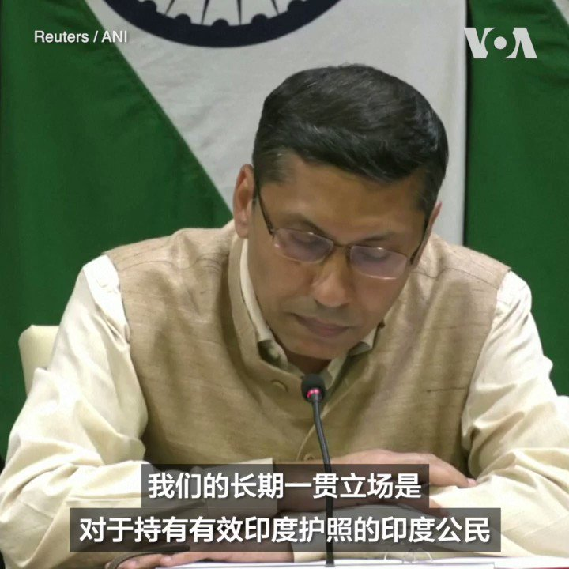

美国之音中文网 北京时间 2023-07-28T02:49:36Z 1684637174401220608 几十年来，西雅图唐人街国际区的吴丹尼社区花园为年长的亚洲移民提供了一种家的感觉。花园最大的活动是一年一度的烤猪活动，这是自 1975 年以来的一项传统。美国之音记者娜塔莎·莫兹戈瓦娅带您一起体验这个花园。 https://t.co/GvMgr6MM4N   美国之音中文网 北京时间 2023-07-28T03:22:09Z 1684645368397713408 香港民调停止公布“六四”等多项调查 批评人士：学术界悲伤的一天 https://t.co/XFjJeGsVyI   美国之音中文网 北京时间 2023-07-28T03:55:40Z 1684653801410629632 在北京宣布免去秦刚外交部长职务后，秦刚名字及其外事活动记录都从外交部网站上消失。中国外交部闭口不谈秦刚，引发有关他被“政治清洗”的诸多猜测。不过，27日，外界发现秦刚的名字再次出现在中国外交部网站的“外事日程”页面上，引发新一波议论。有网友问，是不是因为这两天外交部被问烦了？您怎么看？ https://t.co/ELBC2YnMXS   美国之音中文网 北京时间 2023-07-28T01:23:33Z 1684615522716110848 中国手机市场上半年出货量锐减7.4%，年底前难有起色 https://t.co/UBzRJYzkh1   美国之音中文网 北京时间 2023-07-28T01:38:33Z 1684619296461447170 中国提议与菲律宾举行联合军演，菲军总参谋长表示要对此进行研究 https://t.co/tMGJCEH9K7   美国之音中文网 北京时间 2023-07-28T01:56:37Z 1684623841534812160 印度外交部发言人7月27日抗议中国政府为前往中国参加比赛的部分印度运动员颁发另纸签证，而不是通常的贴纸或印章式签证。中国政府此前也曾对来自印度东北部与中国接壤省份的印度公民颁发另纸签证，以此表明两国对这些地区的主权仍存争议。 https://t.co/aKJAvzjr9K   