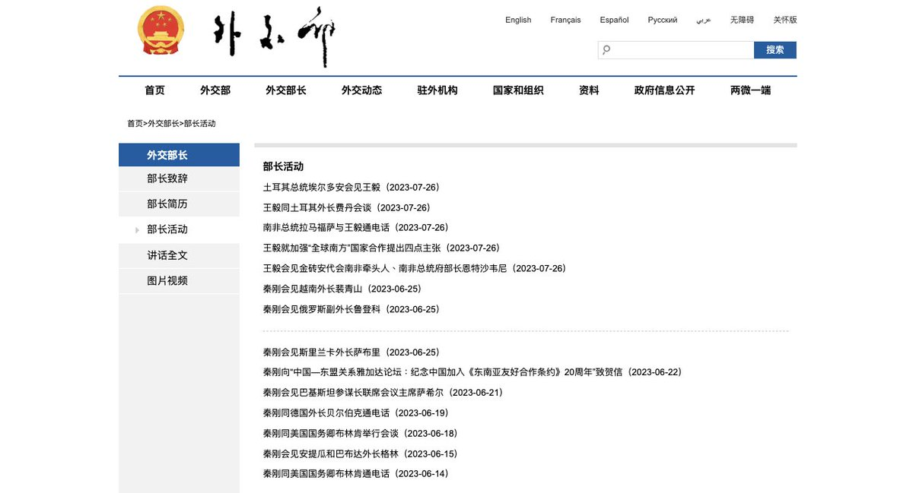
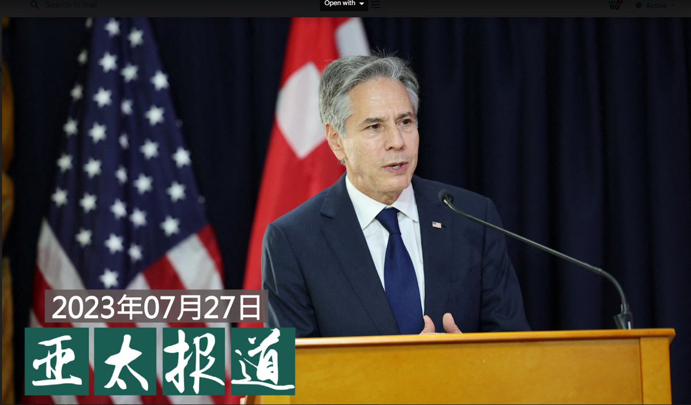
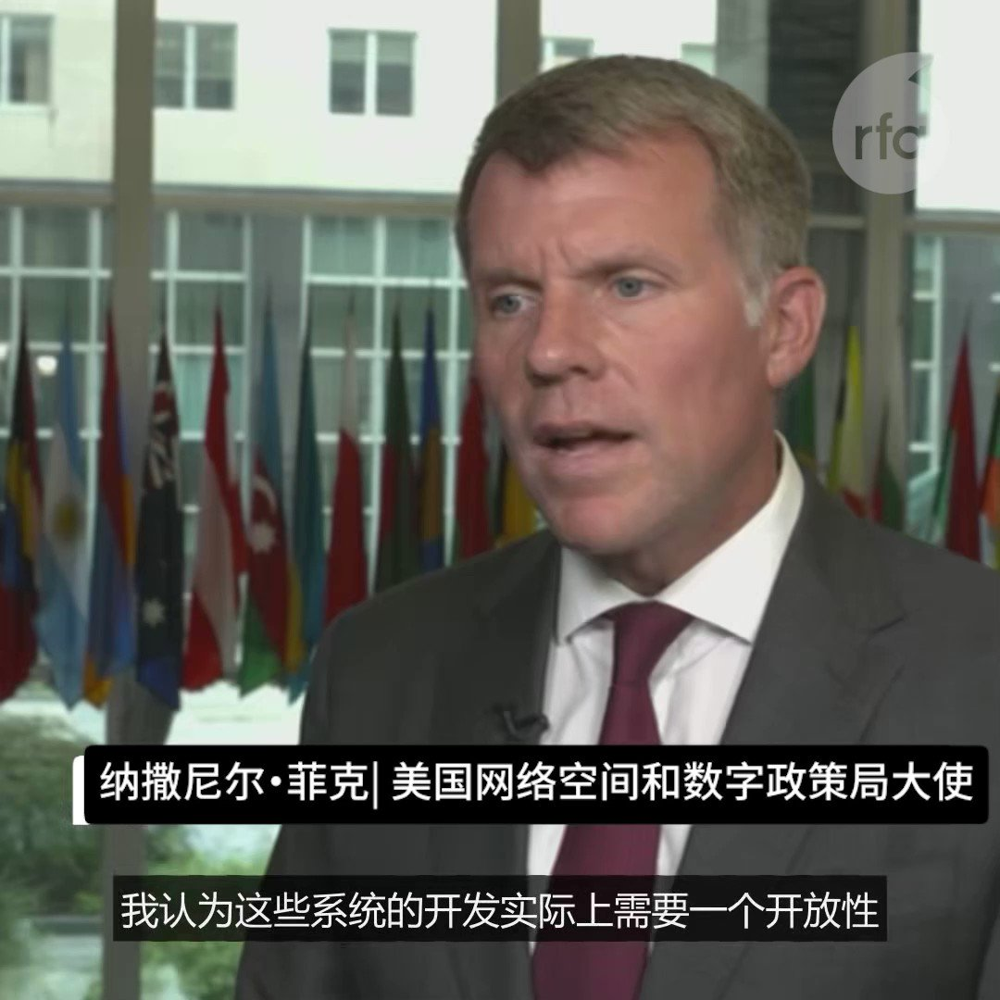

自由亚洲电台 北京时间 2023-07-28T22:15:14Z 1684930516338851840 RT @RFA_Chinese: 当记者在一些流行的人工智能平台如ChatGPT上输入普通话问题“1989 年天安门广场大屠杀是什么？” 平台给了他一个受到中国政府严格审查的答案。如今，中国已敲定管理 ChatGPT 等生成人工智能服务的法律，8月14日起实施。美国网络空间和数…   自由亚洲电台 北京时间 2023-07-28T15:06:52Z 1684822714291482624 【一度消失的 #秦刚 外交活动信息 重现 #中国外交部 网站】

详细报道：https://t.co/eTWS0ux2UQ https://t.co/5l6o9mcJBy   自由亚洲电台 北京时间 2023-07-28T16:02:09Z 1684836626302988288 【习近平出席成都 #大运会 开幕】
【市内禁业余无线电和遥控器 居民回家要凭证】
据 #成都 多位居民告诉本台，#习近平 本周早些时候抵达成都后，当地提升了安保级别，开幕式会场附近居民不得开窗，全城实施无线电管制，禁用业余无线电台和遥控器。另有维权人士被旅游。
https://t.co/QsJDYhTfPT https://t.co/gsTJjcfSWU   自由亚洲电台 北京时间 2023-07-28T10:51:06Z 1684758351115177984 RT @RFA_Chinese: “有谁从小康人家而坠入困顿的么？＂当年鲁迅先生家道中落，走异路，逃异地，留学日本学洋务。
如果留学到一半，家里破产，是不是比鲁迅更惨？
#留学断供，原本的人生规划被打断，学业未完成。是留下来艰难自救，还是放弃学业回国？在调整适应过程中又有怎样的…   自由亚洲电台 北京时间 2023-07-28T10:52:39Z 1684758739541184513 RT @RFA_Chinese: 【“不签字不让看孩子！”齐齐哈尔塌房事故中最没人性的一幕！】

7月26日，网上流传 ＃齐齐哈尔 体育馆坍塌当晚医院里家属和官员对峙视频。政府相关人员要求遇难学生家长在一份文件上签字才能看孩子，引发了家长强烈不满和愤怒，并质疑政府部门对学生们的…   自由亚洲电台 北京时间 2023-07-28T10:53:09Z 1684758865223585792 RT @RFA_Chinese: #齐齐哈尔34中 门口，鲜花汇成悲伤的海洋，黄桃罐头摆成愤怒的方阵。城市的房顶塌了，每个人都感受得到。

为什么是 #黄桃罐头？

有人说，因为周边的花店全部被关了；
有人说，因为黄桃罐头驱鬼辟邪；
有人说，黄桃罐头是东北人的情怀，早年物资匮乏…   自由亚洲电台 北京时间 2023-07-28T02:49:25Z 1684637130734329856 #事实查核｜ #韩国 惊现"大批 #幽灵儿童"？ 2236名婴儿"生死不明"？ https://t.co/kxfTI9idmC   自由亚洲电台 北京时间 2023-07-28T03:14:56Z 1684643551391670272 中国交通运输新业态协同监管部际联席会议办公室组织对 ＃滴滴出行、＃高德打车、＃T3出行、＃曹操出行、＃携程用车 等网约车平台、聚合平台公司进行约谈。
  https://t.co/9LFGOtRxzk   自由亚洲电台 北京时间 2023-07-28T04:30:02Z 1684662451869212673 美国网络空间和数字政策局巡回大使纳撒尼尔·菲克 (Nathan Fick)如何看待美国与中国在人工智能领域的竞争？这是否是本届美国政府的首要任务？ https://t.co/DV9eWQd7Wv   自由亚洲电台 北京时间 2023-07-28T04:55:07Z 1684668762572926979 【李鸿忠交给金正恩一封习近平亲笔信】
7 月 27 日报道，由中共中央政治局委员 ＃李鸿忠 率领的北京代表团抵达平壤，并向朝鲜领导人 ＃金正恩 递交了 ＃习近平 一封信。金正恩说，这次访问显示了习近平“高度重视朝中友谊”的承诺。 https://t.co/wxGOlKPMZ9   自由亚洲电台 北京时间 2023-07-28T07:00:08Z 1684700226211491845 【＃亚太报道（２０２３－７－２７）】
欢迎订阅播客 https://t.co/MjLNSvVMqc

＃布林肯 与 ＃奥斯汀 出访南太及澳洲 / ＃秦刚 下台 ＃王毅 回锅 ＃战狼外交 回归？ / ＃韩战七十年 中国为保卫和平而战？ / 美议员：中共不择手段 ＃窃取美国知识产权 / 中共在 ＃台湾大选 前打 ＃认知战 制造疑美论 https://t.co/UHIHcLCV4E   自由亚洲电台 北京时间 2023-07-28T07:45:02Z 1684711524894449664 RT @RFA_Chinese: 【＃亚太报道（２０２３－７－２７）】
欢迎订阅播客 https://t.co/MjLNSvVMqc

＃布林肯 与 ＃奥斯汀 出访南太及澳洲 / ＃秦刚 下台 ＃王毅 回锅 ＃战狼外交 回归？ / ＃韩战七十年 中国为保卫和平而战？ / 美议员…   自由亚洲电台 北京时间 2023-07-28T07:45:22Z 1684711607882969088 RT @RFA_Chinese: 今年的7月27日是《＃朝鲜停战协定》签署70周年。联合国在其网站上发布文章，再次确认朝鲜战争是因为韩国受到朝鲜军队的攻击而爆发。而中国政府在其官媒上依然宣称，加入朝鲜一方参战的中国是为了保卫和平而战，中国是获胜的一方。 https://t.co…   自由亚洲电台 北京时间 2023-07-28T08:02:31Z 1684715923431686144 #齐齐哈尔34中 门口，鲜花汇成悲伤的海洋，黄桃罐头摆成愤怒的方阵。城市的房顶塌了，每个人都感受得到。

为什么是 #黄桃罐头？

有人说，因为周边的花店全部被关了；
有人说，因为黄桃罐头驱鬼辟邪；
有人说，黄桃罐头是东北人的情怀，早年物资匮乏，生病吃黄桃，来客吃黄桃，想家吃黄桃；
还有人说，桃与“逃”谐音，寄托了人们想“逃过一劫”的美好愿望。

孩子，快逃！   自由亚洲电台 北京时间 2023-07-28T08:49:12Z 1684727673086529536 RT @RFA_Chinese: 【“不签字不让看孩子！”齐齐哈尔塌房事故中最没人性的一幕！】

7月26日，网上流传 ＃齐齐哈尔 体育馆坍塌当晚医院里家属和官员对峙视频。政府相关人员要求遇难学生家长在一份文件上签字才能看孩子，引发了家长强烈不满和愤怒，并质疑政府部门对学生们的…   自由亚洲电台 北京时间 2023-07-28T04:37:40Z 1684664373678116864 当记者在一些流行的人工智能平台如ChatGPT上输入普通话问题“1989 年天安门广场大屠杀是什么？” 平台给了他一个受到中国政府严格审查的答案。如今，中国已敲定管理 ChatGPT 等生成人工智能服务的法律，8月14日起实施。美国网络空间和数字政策局巡回大使纳撒尼尔·菲克 (Nathan Fick)对该规定有何看法？
同时，一些行业专家被警告说，中国政府为成为世界人工智能领导者，所花资金是美国政府的三倍，理由是中国军方正在大力投资人工智能设备。在纳撒尼尔·菲克看来，中国在人工智能领域的雄心壮志能否与美国的竞争保持同步？   自由亚洲电台 北京时间 2023-07-28T04:45:53Z 1684666437913489409 美国务卿 #布林肯 与防长奥斯汀本周同时出访太平洋地区
布林肯访问 #汤加 及新西兰和澳大利亚
奥斯汀先到巴布亚新几内亚，而后在澳大利亚与布林肯会合，共同出席年度澳美部长级磋商会议
美中激烈竞争的背景下，两人出访重要性何在？取得了哪些成果？
凯迪 @KittyWang５ 报道 https://t.co/1sJnh7q9eN   自由亚洲电台 北京时间 2023-07-28T05:10:15Z 1684672573320355841 【“不签字不让看孩子！”齐齐哈尔塌房事故中最没人性的一幕！】

7月26日，网上流传 ＃齐齐哈尔 体育馆坍塌当晚医院里家属和官员对峙视频。政府相关人员要求遇难学生家长在一份文件上签字才能看孩子，引发了家长强烈不满和愤怒，并质疑政府部门对学生们的抢救和处理方式。 https://t.co/0qvBtEsNxQ   自由亚洲电台 北京时间 2023-07-28T05:27:04Z 1684676804530089985 在英德法等高收入国家中，对中国的负面观感更高，而且多年不变。在南非、墨西哥等中等收入国家当中，则近年对中国的看法开始变得比较负面。
为什么中国给人印象这么差？

 https://t.co/PjkLAgXlpo   自由亚洲电台 北京时间 2023-07-28T05:30:29Z 1684677664073003009 专栏 | ＃军事无禁区：挥别旧梦 面对现实－看 ＃基辛格访京
 https://t.co/wyP8eqH2zm   自由亚洲电台 北京时间 2023-07-28T06:00:01Z 1684685095272394756 今年的7月27日是《＃朝鲜停战协定》签署70周年。联合国在其网站上发布文章，再次确认朝鲜战争是因为韩国受到朝鲜军队的攻击而爆发。而中国政府在其官媒上依然宣称，加入朝鲜一方参战的中国是为了保卫和平而战，中国是获胜的一方。 https://t.co/c8n8mP64l9   自由亚洲电台 北京时间 2023-07-28T04:12:43Z 1684658093542535168 “有谁从小康人家而坠入困顿的么？＂当年鲁迅先生家道中落，走异路，逃异地，留学日本学洋务。
如果留学到一半，家里破产，是不是比鲁迅更惨？
#留学断供，原本的人生规划被打断，学业未完成。是留下来艰难自救，还是放弃学业回国？在调整适应过程中又有怎样的感悟？
如果你愿意分享，请跟帖回复，或电邮 fankui@rfa.org   自由亚洲电台 北京时间 2023-07-28T00:30:41Z 1684602218056744960 ＃香港警务处 大力抢人，降低聘用要求，还向中国内地派出招聘团，招募在中国读书的香港学生。然而，半年多以来，只招募了120多名在内地的港生，远低于5000多人的空缺。高薪的 ＃港警 工作为何不能吸引香港年轻人？

 https://t.co/uetDl84BK1   自由亚洲电台 北京时间 2023-07-28T00:14:39Z 1684598179994722305 专栏 | #绿色情报员：#黑肺 换来GDP 农民工和尘二代的窒息
#尘肺病 #尘默呼吸 
 https://t.co/vah40TMHu6   