谁将十万横扫三江 北京时间 2023-07-28T23:05:15Z 1684943102828806144 网友投稿：江西一高中女生被家里预订嫁人，彩礼八十万准备拿来买房 https://t.co/eC2KGV9kEg 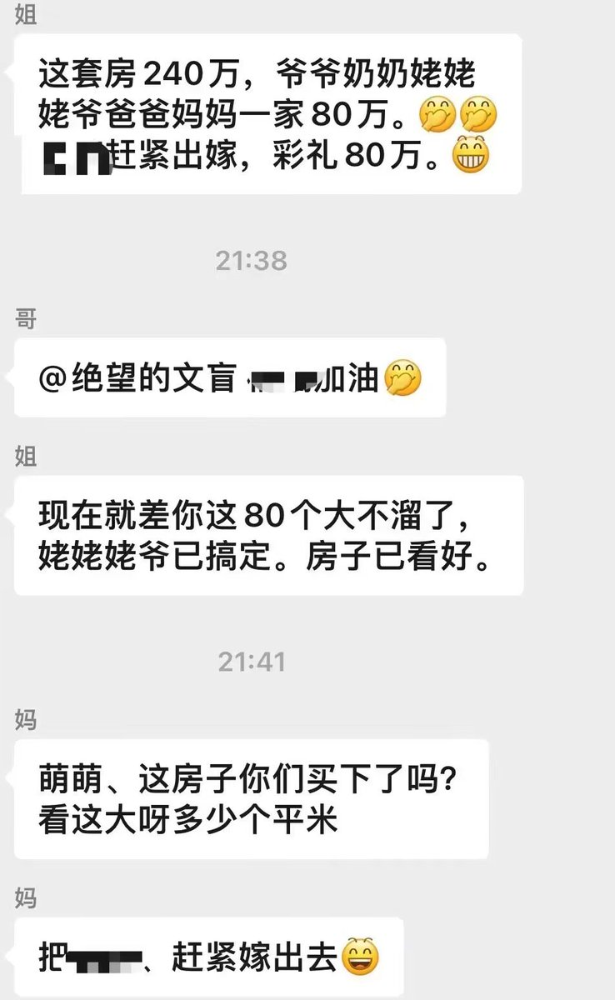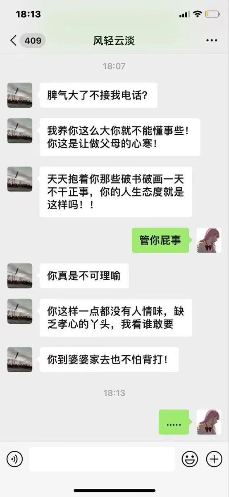  谁将十万横扫三江 北京时间 2023-07-28T22:33:32Z 1684935124390207489 讨薪求助

我是一个普通的打工人，经历的事情也并不稀奇。

给大家讲讲我正在经历的事。故事有点长，希望大家耐心点看完。我需要大家的帮助，谢谢各位！

注意看里面的时间线，很重要。尤其是后期的时间线，有关键的作用。

事件详情：

2021年7月底，我推掉了另外两家公司的邀约，决定入职山东恒泰信检测科技有限公司。

应聘的时候说让我来做试验室负责人，帮公司建立见证六项试验室，谈好了岗位和薪资待遇，结果让我在家等了一个月，到8月30号才入职，入职之后一个月，到10月1号才签合同。签合同的时候岗位薪资全不对，公司说都这么签的，这个不重要，发工资的时候按谈好的发。并且签完公司就把合同收走了，根本没按规定给我一份。

第一次发工资的时候我发现数额不对，我找公司问，公司说我负责这个项目还没开展，岗位补贴先不给，等开展了再给。于是在项目不开展的这段时间，我是公司一块砖，哪里需要哪里搬。学过节能，给桩基内业打过下手做过资料，还在十一二月风雪飘摇的天气里下过大海边上的工地做桩基检测（我是女的）。

打了四个月的杂，到2022年元旦的时候，公司换了法人。新上台的经理没几天就找我谈话，说见证六项的项目暂时不开展了，公司现在用不上我，要么转岗降薪，要么让我主动辞职，让我考虑一下。我说转岗可以，降薪不行，我也不会主动辞职，要么公司给补偿金辞退我，要么就劳动仲裁。公司同意我转岗不降薪，于是我到节能试验室当了检测员。

2022年4月公司节能试验室第二次cma资质认定评审（第一次在2021年10月，评审组来了俩小时评审中止了，没通过），这次通过了，但是接不着业务。

6月的时候经理跟我说公司又要开展见证六项试验室的项目，让我来负责，我就以节能检测员的身份开始给公司筹建见证六项的试验室。从场地规划，画图纸，设计试验室，盯装修，到准备各种资料，定项目，定参数，定设备，盯设备到货安装检定校准，人员培训等等，全是我的事。当然，后期有公司同事帮忙一起做，不然我一个人也完成不了。

12月的时候见证六项试验室建成了，申请cma资质认定评审，2023年初的时候通过了，增项成功。我不否认在这件事上公司领导功不可没，但至少也能证明公司交办我的工作我完成的也不差吧？

2023年初增完项到6月份，公司试验室一点业务没接到（拉业务归公司业务经理管，不归试验室负责），于是我就又给桩基内业打下手，又过了四个月打杂的生活。但是打杂的用不着开我这么些工资，于是我又成了没用的闲人。

今年6月12号星期一，领导找我谈话说，公司不是慈善机构不养闲人，要么转岗到桩基下工地，要么公司给我一个半月的补偿辞退我（我的合同9月30号到期）。我想了想今年要评职称，社保不能断，所有东西都准备好了，就等10月份提交评审资料了，现在离职今年就评不了了。为了评职称，下工地就下工地（我是个女的且身体还不太好，干不了工地上高强度的工作，全公司的人都知道）。于是我跟领导说，那我下工地，先试一段时间，要是能干就继续干，干不了到时候再离职。领导同意了。我说能不能从下个周（6月19号）开始，我需要一点时间做工作交接，领导同意了，让我交接好了做一份交接表给他。并且趁着这一个周的时间，抓紧催着让工地资料员带我把现场人员的证件办出来（公司主要桩基检测业务是接的万华化学烟台和蓬莱工业园的活儿，园区管理严格，要进出园区必须有出入证，且办证手续复杂）。

之后我开始做交接表，但是公司光让我交接却没安排接手人，我就只能先把我的工作内容和资料统计到表格上，等公司确定了接手人再核对签字。到周四（6月15号）的时候，我的证件办出来了，我的交接表也做完了，接手人还没确定，于是也没法核对签字。

周五（6月16号）上午九点多，领导再次找我谈话，说公司考虑了一下觉得工地上太热了现场环境太差了，我干不了那个活儿，公司也不敢让我去工地了，怕我万一在现场出点事公司要担责任，所以，公司决定辞退我，工资考勤就结算到今天（6月16号），之后就不用来了。让我考虑一下给他答复，我说行我考虑一下。领导接着说，无论我考虑的怎么样，公司都决定要辞退我了，工资考勤就结算到今天（6月16号），也没说办离职手续的事（谈话内容我录了音）。

第二天（6月17号）是星期六，我请假了（假是6月15号在领导找我谈话之前就请好了的，公司规定每周上六天班，只有星期天休息，但是周六上班从来没给过双倍工资的加班费），约了医院检查身体（前面说了我身体不太好）。

我算了一下时间，发现时间不够用（病情比较严重，约了外地的大医院），周一无法按时去公司上班。于是我在6月17号下午五点多又在系统里向公司提交了下周一（6月19号）一天的请假申请，但是领导给我驳回了，理由是该员工已离职。我当时就很懵，毕竟我还没办离职手续。公司果然说到做到，说结算到16号就结算到16号，我17号请假就不批了，算离职。

周一（6月19号）下午，我带着我的病例、检查结果和医生开的诊断证明等资料回到公司，想申请三个月的医疗期（关于职工医疗期的问题有兴趣的同学可以自己去百度一下，作为劳动者这些知识多知道点还是有必要的）。我的情况和条件完全符合3个月医疗期申请的条件，但是领导说，你不要跟我耍这些小手段！我不会批的！我说，首先，我请假看病是在你找我谈话之前，我以这个作为手段，我是能未卜先知吗？第二，我的检查结果还有诊断证明都清清楚楚，我确实是需要停工治病，这是事实。第三，我完全符合3个月医疗期申请的条件。你认为我在合理合法的范围内维护自己的权益是耍手段是吗？领导说，是！这在我看来就是耍手段！你不要跟我说这些，这是你自己的事跟公司没关系！于是我跟他确认了一遍，公司确定不给我批医疗期是吗？他说是，不管如何在我这我就是不批！你爱告告去，随便你怎么告！老板有的是关系，不怕你告！

我说那公司把我的劳动合同给我，当时签完合同公司就收走了没给我。领导说公司这份不能给我，我说那我的呢？领导说，那我不知道，谁给你办的你找谁去，反正公司这份不能给你。于是我找了我合同当时的经手人。那人说，这事她说了不算，还得领导同意，找领导，领导又说不是他办的他不管。总而言之，就是互相推诿踢皮球，就是不给我合同。

虽然公司已经在6月16号口头辞退我了，但是一直没给我办离职手续，也没给我结算薪资报酬，但是却说不用我去公司上班了。这算几个意思？说辞退我又没给我办手续，不给我结账，还不让我去上班。这是想拖着我不了了之吗？这是人干的事？为了证明我跟公司还存在联系，也方便我通过公司考勤群组收集证据，于是我从6月20号到6月28号依然每天在软件上打卡，打完就走，期间端午三天假期没打。

6月28号我向烟台开发区劳动仲裁机构提交了仲裁申请书，向公司索要拖欠我的工资、加班费、未休年假补贴、违法解除劳动合同的经济补偿金，并随立案申请书一起提交了我的工资银行流水、社保缴费记录、聊天录音和截图等等各种证据材料。并且向稽核部门申请公司给我补缴我在职期间20个月的应缴但未足额缴纳的社保。

6月30号早上我收到了公司邮寄给我的解除劳动合同证明，以及辞退通知书。辞退理由是，该员工从6月20日至6月28日无故连续旷工8天（端午三天法定假期公司也给我算在内了），所以公司合理合法辞退我。

公司这一出儿都给我气笑了。6月16号就态度坚决的口头辞退了我（口头辞退也是有法律效力的），我17号请假都驳回了，理由是我已离职，然后说我20号到28号旷工，并且以此作为辞退我的理由？并且直到现在公司也没把我的劳动合同给我。各种理由耍无赖，就是不给。

7月21日，调解中心让我和公司去进行仲裁前调解。调解员说，我这个事，他们院长（仲裁机构的领导）很重视。我当时就很疑惑，就我这么个简单的劳动报酬纠纷案，怎么连仲裁机构的院长都惊动了？还很重视？

调解过程中，公司提交了伪造的我的工资条和员工手册作为证据。首先，从我入职那天开始到离职，公司就没有任何成型上墙的规章制度，从来就没有过员工手册。第二，工资条公司从来不会给我们，我们去要，给的也是电子表格的截图。鉴于我们工资结构非常简单，就是固定的基本工资外加每天15元饭补，很容易核对，所以我也没有每个月都向公司要工资条截图。导致我手里的工资条不全，只有一部分。但是工资结构是清晰可见的。然而，公司提交的工资条是伪造的，工资结构都给我改动了。真正的工资结构只有固定工资和饭补，改动之后变成了基本工资、加班费、绩效提成、奖金、岗位补贴、饭补等等。也就是说，在工资总额不变的情况下，真正的工资里每个月只有基本工资和饭补，根本没给加班费等其他的，而伪造的工资条里是都包括的。比方说我一个月开5000块钱，真正的工资结构是，4500元基本工资，500元饭补，根本没有其他的。伪造的工资结构就变了2000元基本工资，1000元加班费，1000元绩效提成，500元岗位补贴，500元饭补。这样一来，虽然银行流水对得上，但是公司欠我的加班费等等，他都不用给了。

调解时，我说公司提交的工资条是假的，工资结构改动了。公司人事理直气壮地说，公司有权利改工资结构。我说公司确实有权利，但是也必须先征得员工的同意，之后重新签合同才行。并且已经发放的工资，已成既定事实，工资结构不能改。公司人事死咬着能改。于是我问她承不承认本次提交的工资条是改动过的，她又说这个不能告诉我。如果真像她说的，公司真的有权利改员工的工资条，那她怎么又不敢承认了？很明显她知道这是伪造的，不敢认。

经过调解，一个问题也没有解决。公司拒不支付我的工资、加班费、未休年假补贴、违法解除劳动合同的经济补偿金。于是，调解员就说，调解不成，下一个流程是把案件转到仲裁委员会，等排期开庭。但是要等很久，今年排满了，我的案子要排到明年。

我查询了相关法律依据，发现法律有明确规定，案件转移到仲裁委员会后，只要受理，从受理之日起最多两个月就必须结案。根本不像调解员说的要排到明年，不然他们就是程序违法，我可以依法起诉他们。我不知道他们是出于什么目的跟我说要排期到明年。

今天（7月27号）上午，我给烟台开发区劳动仲裁调解中心打电话，询问案件进展，工作人员告诉我，我的案件还没有转交到仲裁委员会，说明天周五（7月28日）给我转。一字记之曰：拖。

我是吃了不懂法和太相信人性的亏，怎么也没想到公司会做这种事。这个世界是怎么了？老百姓的合法权益得不到保障，国家法律的公信力和执行力去哪里了？全民普法的时代，为什么还有人敢如此猖狂地公然挑衅法律？我兢兢业业工作，努力挣钱养家糊口，结果连获得应得的劳动报酬的权力都没有？遇上这样的公司我连自己都养不活，还敢结婚生子吗？让我的孩子将来也遭受这种不公平的待遇甚至欺压吗？

万能的网友同志们，请帮我出出主意，这么不要脸的公司，视法律为无物，欺压员工到这种地步，我接下来应该怎么办？   谁将十万横扫三江 北京时间 2023-07-28T22:41:50Z 1684937210163015680 坚定文化自信，弘扬优秀传统文化文字狱

究竟是谁为难工人，Z怠宦成以WF乱J为R，YP工人FD不在其位，不谋其Z，及承认自己是劳动争议制造者在为难GR，讨薪之路为何如此艰辛，大家共同QZ不答乱答MS，是不知工人的权益由GJ保障，而不是在FX，FD  XF第33条实施，要求GR放弃XF第41条赋予的权利叫维权。
97年开始反映县Z掌管企业公章，劳动BM保管欠条，如今举报21年6月25日行Z确认98年11月自由职业退休，96年记载无效，06年只是缴到98年11月，且只有原记载53%有效涉嫌滥用职权，24日还转送县Z，见一见94年调资表，按照96年记载计发退休金表比登T还难，到底是企业(单位)问题，还是GJ  XFJ网站一面我宣S，一面又FD维护XF权威，FD履行XF工作TL第23条书面回复义务。
一百多次反映是维权，还是要求GJ XFJ网站带头履行XF工作TL第23条书面回复义务比登T还难？
是因为讨X未果而暴起S人的事件，而不是因GJ  XFJ网站带头不履行XF工作TL第23条书面回复义务，GR失去咨询知情只是享有权利不讲义务是否WF权而暴起S人的事件？也就是是县Z在GJ  XFJ网站上乱答可e，还是GJ XFJ网站带头敷衍塞责推诿有XF工作TL第23条书面回复义务不作为更可e，也就是GJ  XFJ网站没有回复咨询拿出离职证明是个人诉求还是RSJ享有行Z确认98年11月自由职业退休的权利同时必须履行的FL义务义务，谁还有给咱工人咨询权义务职责。   谁将十万横扫三江 北京时间 2023-07-28T22:48:47Z 1684938962379673600 要整改，是要购物卡，中华烟，茅台酒，尽职尽责怎么会出现这么多塌方式腐败，怎么会出现长沙自建房倒塌，齐齐哈尔体育馆类事件？体制内但凡有一个算的上是人的，都不会出现这种事 https://t.co/putdrdcS4W 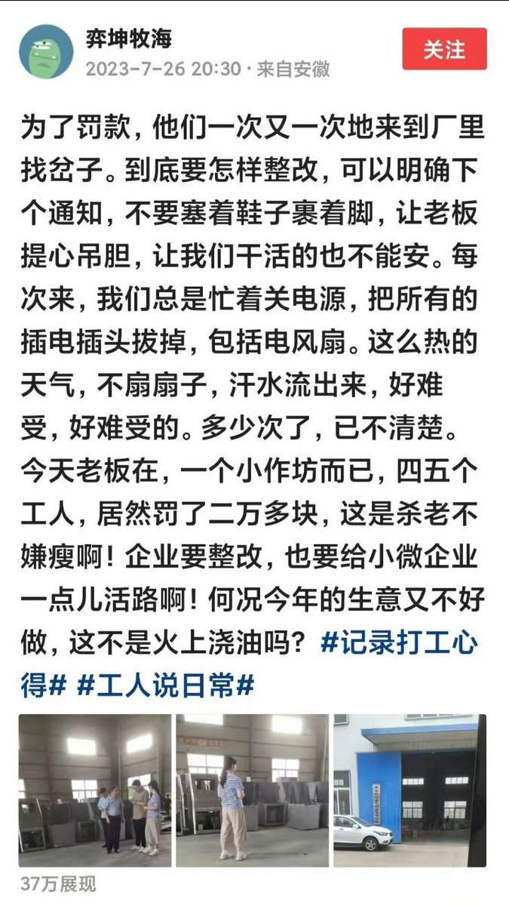  谁将十万横扫三江 北京时间 2023-07-28T23:14:51Z 1684945521126051841 武汉市正商金域世家支持更换物业的业主 半个月内轮番被物业请黑恶势力暴打！报警无果，警察和黑恶势力勾连。业主备受欺压，白白被打

PS：这是很正常的事，中国人天天被自己供养的物业打 https://t.co/RAOa0cpm5x 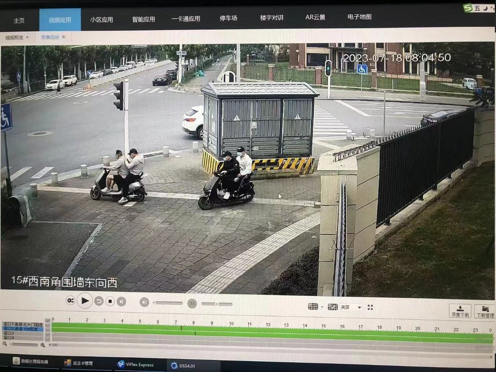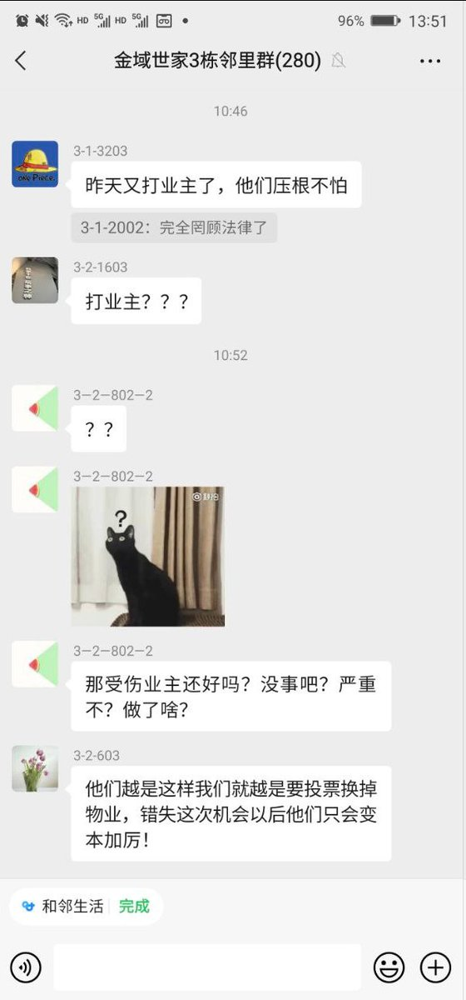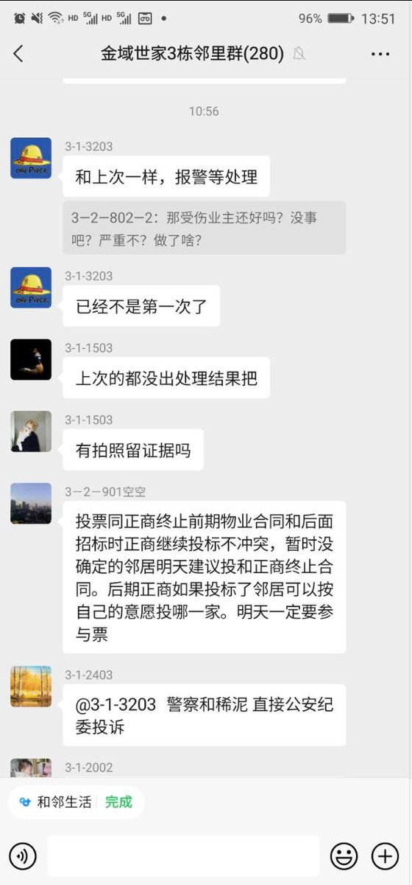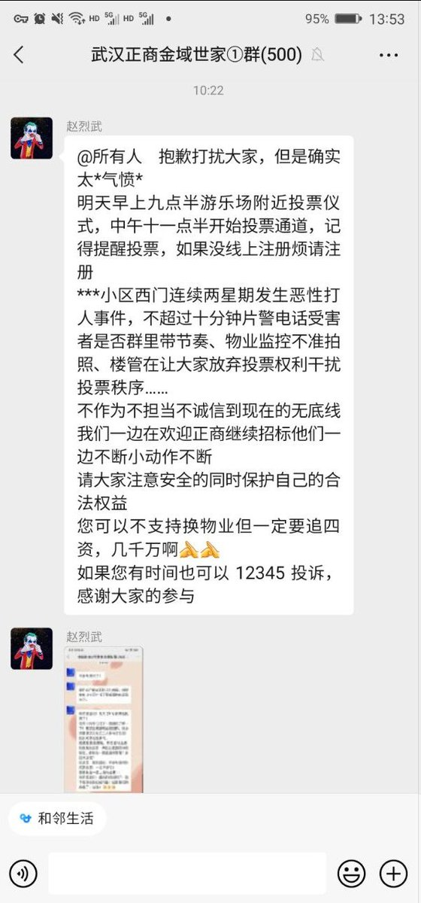  谁将十万横扫三江 北京时间 2023-07-28T23:35:17Z 1684950660746473473 “今天只要我从你手里赚不到钱，不是你死就是我死！” https://t.co/hPgiDQ9eoa   谁将十万横扫三江 北京时间 2023-07-28T23:50:08Z 1684954401474322432 RT @whyyoutouzhele: 网友投稿
前教育部发言人，前语文出版社社长王旭明在微博上关于齐齐哈尔的发言。
指责齐齐哈尔教育局领导和三十四中的老师们面对悲剧连最起码的缅怀和纪念都没有。
指责他们是与人民对着干。 https://t.co/gSOnG7ZONZ 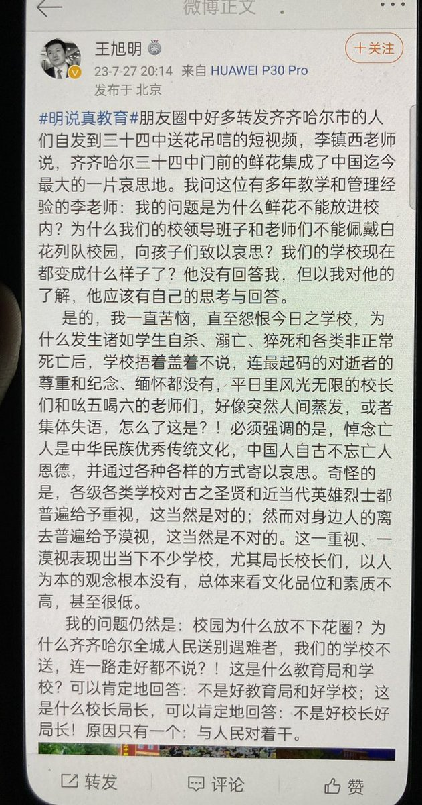  谁将十万横扫三江 北京时间 2023-07-28T20:47:06Z 1684908336687534080 评论区沦陷 https://t.co/J3347J6clo   谁将十万横扫三江 北京时间 2023-07-28T21:25:22Z 1684917966985654272 RT @whyyoutouzhele: 有微博网友发帖热议
今天成都的晴天价值500万。 https://t.co/BdGU10iyej 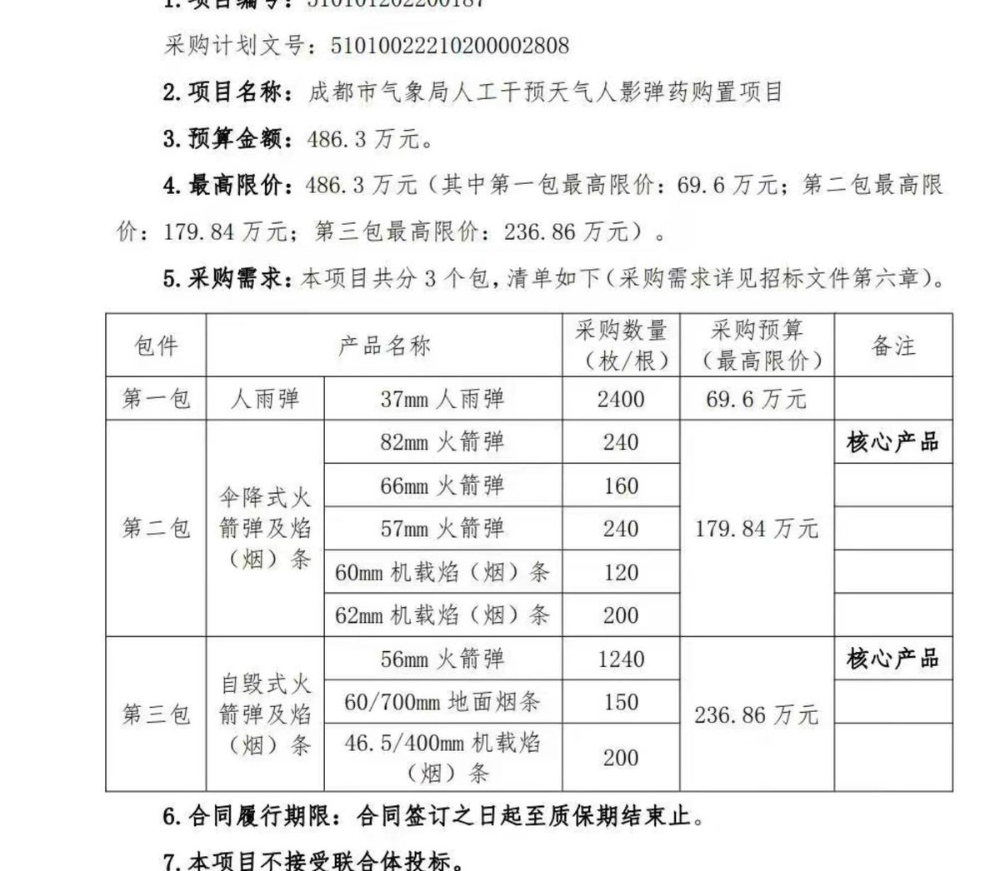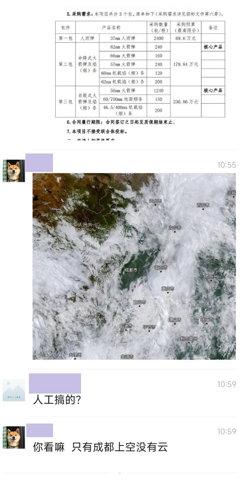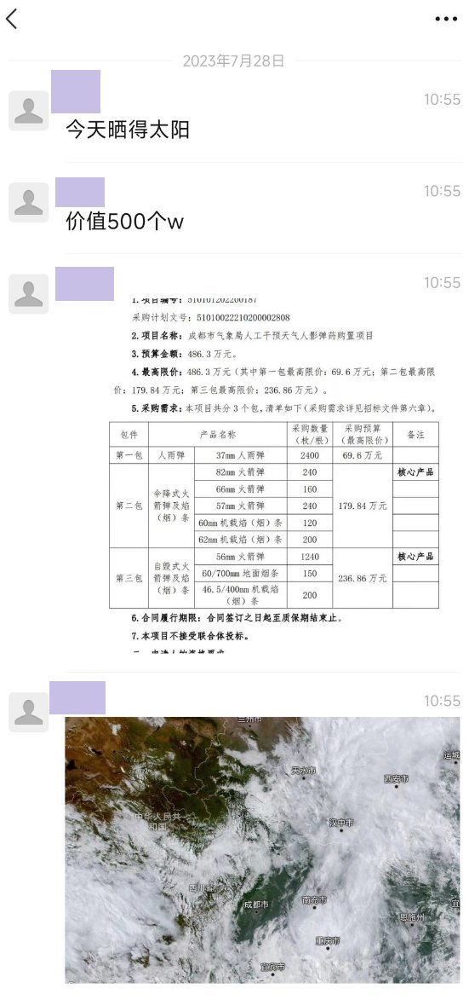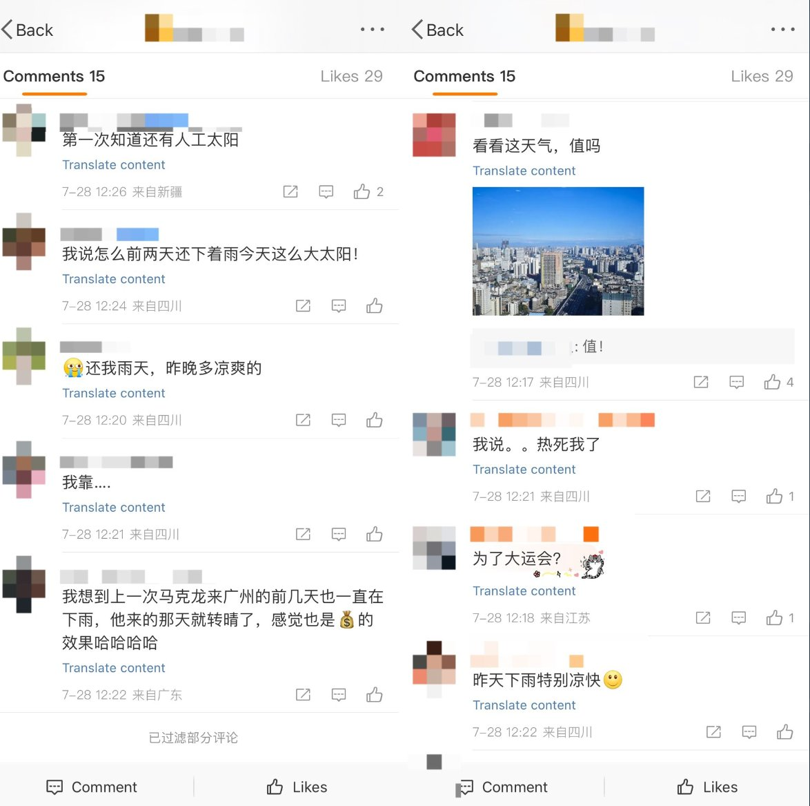  谁将十万横扫三江 北京时间 2023-07-28T21:59:07Z 1684926461789306880 RT @lilaoshizuikeai: 刚知道个消息，挺好玩的
7月22日，西安，一群年轻人在闹市区举旗子和横幅
此时正值西安政府防范中考家长抗议的关键时刻
警方在大雁塔，大唐芙蓉园周围布置着大量的警力
然而，一群小孩子却在警察的眼皮子底下站出来了
很快，组织者被带进警局谈话…   谁将十万横扫三江 北京时间 2023-07-28T21:59:59Z 1684926679586852864 在阶级社会中，法律是统治阶级意志的体现。公平公正不是被统治阶级能享有的。
诸如烂尾楼、恶意讨薪、寻衅滋事、地铁禁止喝水等等。   谁将十万横扫三江 北京时间 2023-07-28T19:27:36Z 1684888332160172033 网友投稿：中国电科指鹿为马以坑害员工，北京法院枉法裁判想不了了之

您好！本人名叫毛昌，身份证号为：360122198509181812，也是受害当事人。2013年3月8日至2019年10月8日期间，作为合同用工人员而非正式事业编制人员，本人依次在中国电子科技集团有限公司二级成员单位电视电声研究所（中国电子科技集团公司第三研究所）（以下简称电视电声研究所）相关技术研究部，以及三级成员单位北京中电慧声科技有限公司（以下简称慧声公司）工作。

2019年7月起，因双方发生劳动争议，难以协商。2019年9月，本人提出被迫辞职。为维护自身合法权益，受害人就向北京市朝阳区劳动人事争议仲裁委员会发起仲裁申请。因单位盖有歧义（注销）的公章和非事业编制混合用工等因素，造成受害员工难以准确认定当时所在的主体名称。

2020年1月14日首次仲裁开庭日，因中国电子科技集团公司第三研究所主体早已注销，听信仲裁员建议撤回。2020年1月17日，再次以北京中电慧声科技有限公司作为主体发起劳动仲裁。2020年3月31日，电视电声研究所王磊和杨中庆等领导班子却看不惯弱势群众依法维权，就指鹿为马滥用职权，搞莫须有旷工理由解除所谓的人事关系。

在发起多次劳动仲裁无果后，受害人就起诉到北京法院，历经了北京市朝阳区人民法院一审和北京市第三中级人民法院二审，却遭徇私舞弊枉法裁判。2021年7月20日，北京市第三中级人民法院下午庭审期间，天怒人怨，与郑州特大暴雨共鸣同悲。从此，受害人被迫走上白手起家的谋生道路。在创业的同时，不忘还原历史，搞清来龙去脉。

在找到能翻案改判的证据后，2023年5月4日，受害人便向北京市高级人民法院EMS邮寄了申诉材料，并通过北京12368诉讼热线和12345市民热线等多种反映渠道以监查案件处理进展。现北京高院已签收快三个月了，却仍不按《中华人民共和国民事诉讼法》第210条和第211条来处理，只想退回申诉材料，不了了之。

至今为止，以上两单位仍未及时出具有效合法的离职证明，未补缴清受害人的五险社保，更未办理人事档案转移；以及办理的北京户口亦真亦假，享受不了当地的社保和生育政策等。经历长达四年的新时代窦娥冤，给受害人的工作、生活和家庭等造成了严重的经济损失和精神伤害等。因此，向贵方报料，希望借用宝地，为弱势劳动群众伸张正义，为社会进步贡献良知！欢迎转发或联系，先行感谢！   谁将十万横扫三江 北京时间 2023-07-28T20:05:31Z 1684897873727729665 RT @whyyoutouzhele: 网友投稿
一则高温下工人顶着烈日干活的视频，引发了网友们的共鸣 https://t.co/c9SO4k5CIn   谁将十万横扫三江 北京时间 2023-07-28T20:06:20Z 1684898079219367936 微博博主止痛胶囊

我们女装店开在商场下面，卖的也不是很潮流前卫的款式，各年龄段都能穿。  
今天店里来了母女，是我来接待的，小女孩也就刚上小学，脖子上挂着一个小玩具，妈妈去试衣服的时候她就乖乖在门口等着，妈妈穿着新衣服出来，女宝就拍着小巴掌捧场，整个过程轻松又愉快。
正当我在准备推荐其他衣服时，旁边试衣间里的女顾客也出来了，试的是我们店新上的裙子，她一边照全身镜问坐在椅子上玩手机的儿子:“怎么样?我穿这个裙子好看吗?”  男生看起来是高中生，从进店一直在玩手机，旁边放着刚买的aj鞋。
男生不耐烦象征性地抬头瞟了一眼:“ 还行还行。”男生妈妈:“还行到底是好看还是不好看啊?” 
男生更加急躁，眼睛不离手机屏幕:“哎呀你都这个岁数了还要求什么好看难看啊，能穿不就行了。”
男生妈妈小声嘟囔:“人家店员说我穿这个肯定好看，我就试试...”像犯了什么错误似的。
男生忽然大声起来:“人家卖衣服的肯定得说你穿着好看啊，不然怎么赚你钱啊!” 
我、女宝和她妈妈、男生妈妈、以及接待男生妈妈的女同事，都尬在那儿。我心想这要是我儿子我肯定大耳刮子扇他。  
男生紧接着起身，提起新鞋:“这么久了还没试完,我先回家了，你自己慢慢试吧。”说完就头也不回地走了，把他妈妈独自留在店里。
男生妈妈像泄了气的皮球，眼看着一点一点瘪了下去，沉默着回到试衣间关上门，去换上她来时穿的衣服。
但换了特别久。这时，女宝拽她妈妈的衣角，抬着头说:“妈妈,我觉得那个阿姨穿那个裙子真的挺好看的。”
女宝妈妈一脸无奈地看着我，说刚才那男孩说话太过分了。
我说就是,但不是咱们的孩子咱们也不好管教。我们又陷入沉默。
过了几分钟，她蹲下对女儿说:“既然你觉得阿姨穿那个裙子很漂亮，那一会儿等阿姨出来，你过去夸夸她，好不好?” 
女宝一脸害羞:“好是好，可我不太好意思..
“没事，妈妈陪你一起去。  “好耶!那我好意思啦!”女宝可爱的小表情把我和同事都逗笑了。
等那个男生的妈妈从试衣间出来，女宝立刻拉着她妈妈跑过去:“阿姨，你穿这条裙子真漂亮! 
男生妈妈被突然的夸奖夸得有点儿懵，不明所以但还是说了谢谢小宝贝。
女宝妈妈解释:“这孩子刚才就觉得你穿这裙子漂亮，想跟你讲，但又害羞,非得我陪着才好意思过来和你说。”
女宝红着脸抱着她妈妈的腿，只露出一只眼睛。男生妈妈忽然眼圈儿有点红，一直说谢谢宝贝,宝贝真乖之类的话。
女宝妈妈忽然提议:“你再穿上给我们看看吧，哪怕不买，我们也觉得漂亮，我们给你拍几张照片当纪念也好呀!  男生妈妈:“啊..这太麻烦你们了吧，而且我刚换下来。”  我和同事也一起鼓励她再穿上试试，反正儿子都走了也没人催她了，就图和自己开心。
“好!那听你们的!我再试试!”
她兴奋地走进试衣间，好像她之前从未穿过这条裙子似的。  这次她换衣服的速度很快，试衣间的门很快就开了，她像个少女似的羞涩，碎步走了出来。
女宝带头，她妈妈还有我和同事都拍巴掌夸她漂  女宝妈妈:“来来来，摆几个姿势我给你拍几张。’说着就掏出手机找角度。  
女宝看她妈妈帮阿姨拍照，立刻加入进来:“妈妈妈妈，我也要拍!  说着拿起胸前的玩具放在眼睛前，也学着她妈妈的样子给男生妈妈拍照。
这时我才发现女宝胸前的玩具是个儿童相机，很袖珍。女宝一边拍，一边嘴巴还一直发出咔嚓咔嚓的“配音”。
拍完后，她们加了vx传照片，女宝妈妈安慰男生妈妈:“别总想着别人，你也得多为自己着想才行。  
男生妈妈点点头，深吸一口气平复情绪:“这个裙子我买啦!”  同事听到后，赶紧去库里去拿新的。
女宝抬头对她说:“阿姨,我拍的照片没法发给你,因为我的相机是假的，你穿裙子的样子在我脑袋里。”说着她用小手戳了戳自己的脑袋。  
男生妈妈弯下腰摸了摸女宝的头:“没关系，阿姨已经永远拥有那条裙子了。”
那一刻，店里没有谁的身份是某人的妈妈，都是能看见自己的女人。   谁将十万横扫三江 北京时间 2023-07-28T20:13:10Z 1684899796463808512 RT @layla8964: 触目惊心的数据。

就业者的年收中央值。
男中学毕业&gt;女大学毕业。

1女人从事的职业太少。蓝领非大卒也能有五六百万的年收，这些职业几乎没有女人的身影。
2很多女性依旧是非正式雇佣。
连正社员的女人们都只在企业里做一般职，大卒年收也在400万的边缘…   谁将十万横扫三江 北京时间 2023-07-28T20:13:26Z 1684899866781343744 评论区已沦陷...... https://t.co/YeCYdIyb1e   谁将十万横扫三江 北京时间 2023-07-28T20:23:21Z 1684902361347825664 江苏大学研究生在宿舍猝死，过了四天才被发现

三年前，江苏大学学生跳楼自杀

五年前，江苏大学医学院研究生顾健，在镇江第一医院规培，值夜班时突发心脏骤停抢救无效死亡

六年前，江苏大学电气学院硕士研究生史国平在导师饭局被劝酒，回宿舍后死亡 https://t.co/SB5sO9POh7   谁将十万横扫三江 北京时间 2023-07-28T07:33:46Z 1684708689683623937 是命运的齿轮还是坦克的履带 https://t.co/OwBhKTD3Xb   谁将十万横扫三江 北京时间 2023-07-28T07:35:25Z 1684709106303840257 RT @lilaoshizuikeai: 我这几天其实在认真自省自己为什么对《罗刹海市》无感。
想了想大概是因为在自由的中文世界里呆久了也就自然而然从阴阳怪气过度到想骂什么就骂了
但是很显然在国内的环境里随便一点指桑骂槐还是可以吓大家一跳的。…   谁将十万横扫三江 北京时间 2023-07-28T08:37:40Z 1684724771895103488 一场突如奇来的变故打破了原有的生活，但不离不弃的爱情弥为珍贵 https://t.co/WW8xSfF8bN   