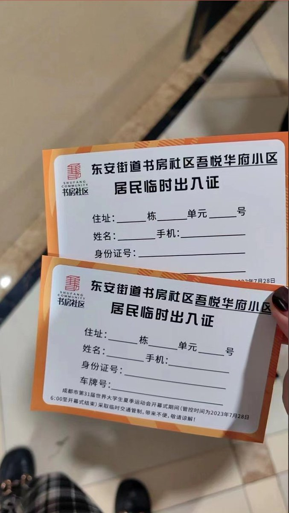
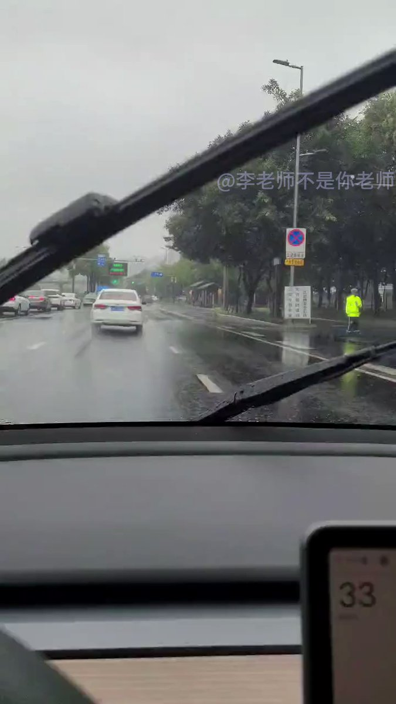
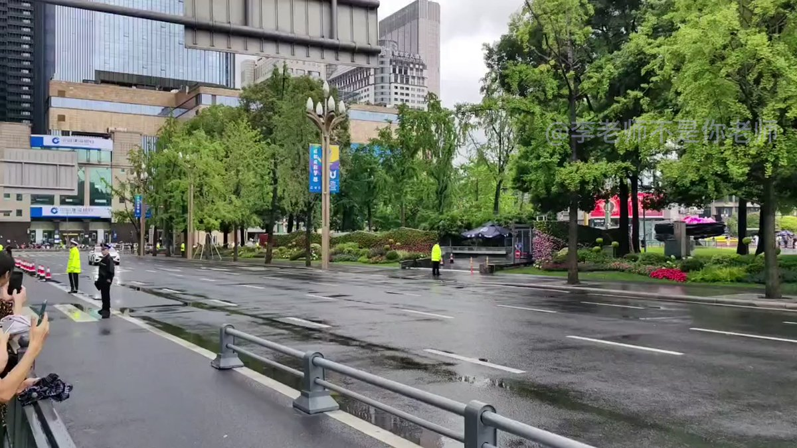

A李老师不是你老师 北京时间 2023-07-27T15:18:35Z 1684463275675721729 网友投稿
成都大运会期间，部分居民再次启用临时出入证 https://t.co/VmbSnX2Q52   A李老师不是你老师 北京时间 2023-07-27T15:27:39Z 1684465555737026560 网友投稿
7月27日下午，成都全城戒备。
三环路周围五步一岗十步一哨 https://t.co/3Yy7aOUYLl   A李老师不是你老师 北京时间 2023-07-27T15:34:49Z 1684467363154997248 网友投稿
7月27日，成都天府广场封路。
有外国元首车队经过，国旗不认识。 https://t.co/PNfuZzTIX9   A李老师不是你老师 北京时间 2023-07-27T07:55:43Z 1684351824638140420 7月26日，一段齐齐哈尔体育馆坍塌当晚医院的新视频流出。
视频中，家长被要求不签字就不能见孩子最后一面，质问领导“你家孩子多大” https://t.co/NVe19Rma1o   A李老师不是你老师 北京时间 2023-07-27T07:05:43Z 1684339240316837889 从齐齐哈尔34中体育馆坍塌事件展开 
聊一聊为什么每一次突发事件的舆情处理最终都能够成为了一场政府的公关灾难。
https://t.co/IJ5QybQz15   A李老师不是你老师 北京时间 2023-07-27T07:58:53Z 1684352621044277249 所谓摇滚之城，重要的不是摇滚，而是对摇滚的解释权。就像   