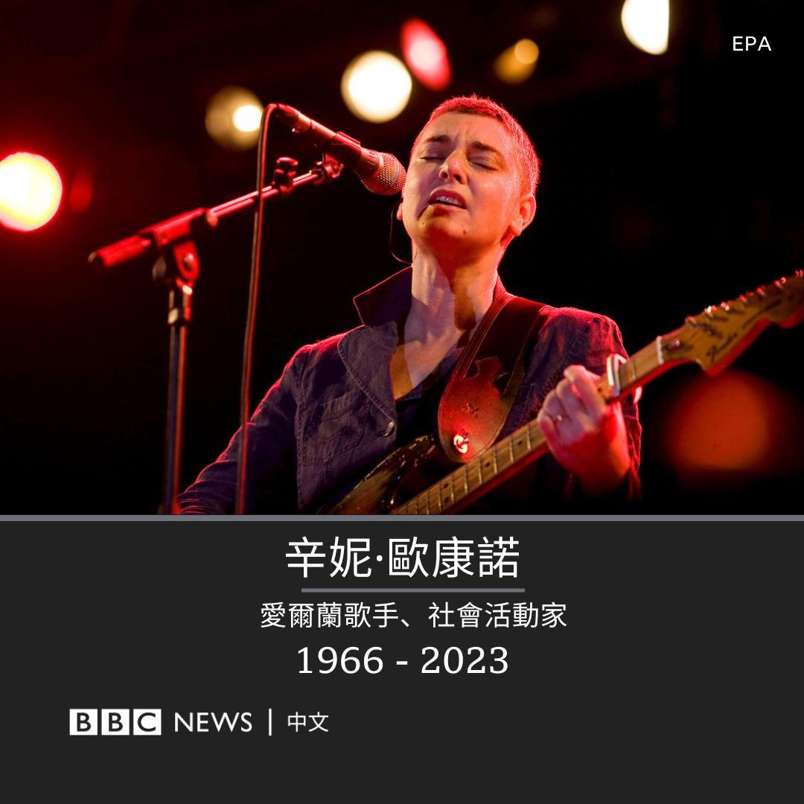
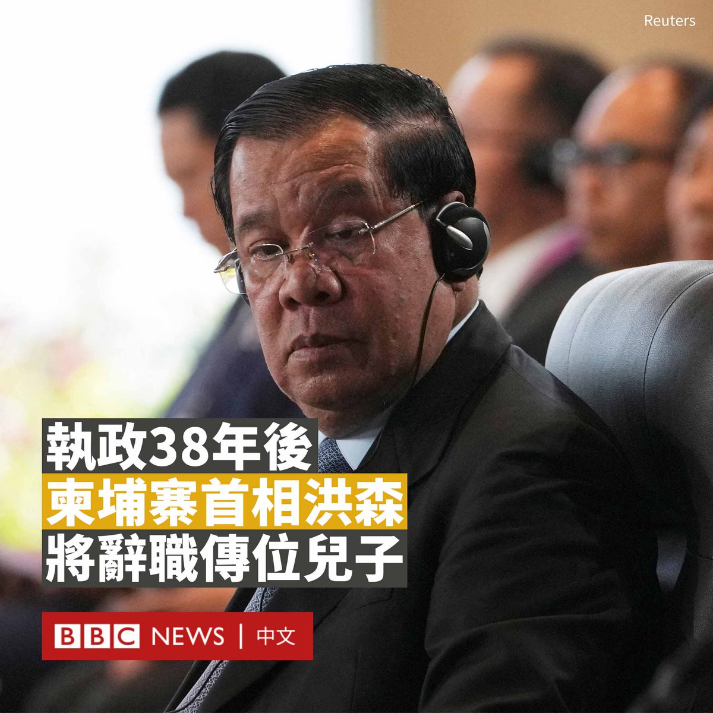
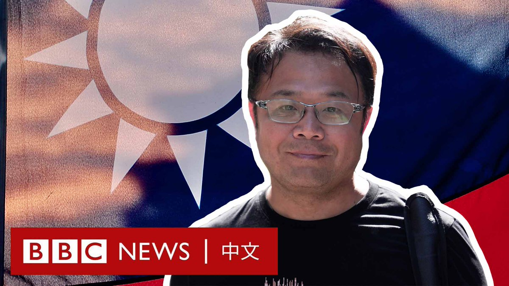
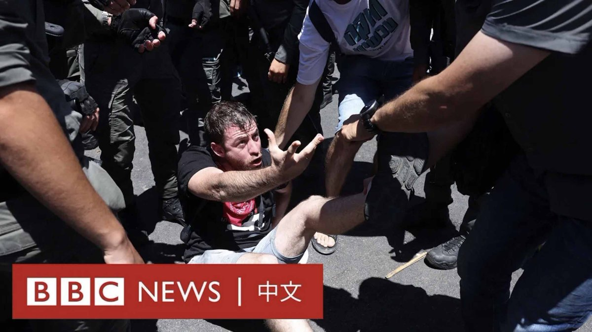

D英国广播公司BBC 北京时间 2023-07-27T16:25:39Z 1684480152766410754 一些分析师表示，潘功胜的晋升表明中南海认识到为了应对经济问题，需要一位具有危机管理经验的经济学家来协助引导。https://t.co/Ttiyvje478   D英国广播公司BBC 北京时间 2023-07-27T17:27:51Z 1684495807721136128 爱尔兰歌手、社会活动家辛妮·欧康诺（Sinéad O’Connor）逝世，终年56岁。她的家人发表声明告知了这一消息。

声明指，她的家人和朋友表示非常悲痛，并且希望在这个艰难时刻，保护她的隐私。她的具体死因未公布。

欧康诺最著名的代表作是1990年发行的单曲《Nothing Compares 2 U》，这首歌由王子（Prince）所作，在英美等世界多地都曾名列榜首。

爱尔兰总理利奥·瓦拉德卡（Leo Varadkar）向欧康诺致敬，称赞她的音乐“受到全世界的喜爱，她的才华无与伦比”。

爱尔兰总统迈克尔·希金斯（Michael Higgins）也赞扬她的歌声“美妙、独特”。

欧康诺1966年12月出生于爱尔兰都柏林。年幼时，她被送到感化院。后来，一位修女给她买了一支吉他，并为她介绍了一位音乐老师，从此开启了她的音乐生涯。

欧康诺1987年发行的第一张专辑《The Lion And The Cobra》就广受好评，在1987年至2014年间发行了十张专辑。

欧康诺直言不讳地表达了自己的社会和政治观点，她曾经在美国电视节目《周六夜现场》（Saturday Night Live）中撕碎了前教宗若望保禄二世（Pope John Paul II）的照片，这是她职业生涯中最引人注目的事件之一。

她唱完了鲍勃·马利（Bob Marley）的《战争》（War）之后，她看着镜头说 “打倒真正的敌人”，以此抗议天主教会对儿童的性虐待。

她的行为导致美国全国广播公司（NBC）对她终身禁播，美国国内也出现了针对她的抗议活动，但她表示并不后悔。

欧康诺的最后一张录音室专辑《I'm Not Bossy, I'm The Boss》于2014年发行。   D英国广播公司BBC 北京时间 2023-07-27T15:18:20Z 1684463214648872961 柬埔寨首相洪森（Hun Sen）宣布将于8月初辞职，把权力移交给儿子洪玛奈（Hun Manet）。

洪森已统治柬埔寨近40年，是世界上执政时间最长的领导人之一。

上周日（7月23日），他所在的政党柬埔寨人民党在没有悬念的选举中，再次赢得所有席位。他在三天后宣布了该决定。

现年70岁的洪森在声明中表示，洪玛奈将于8月10日被任命为首相。

洪森在官方电视台的特别播报中称，考虑到继续执政可能会造成不稳定，他将辞职。

不过，他将继续担任执政的柬埔寨人民党领导人。政治分析人士说，这个职位仍然赋予他最终的控制权。

现年45岁的洪玛奈曾在美国西点军校和英国布里斯托尔大学就读。作为接班人，他曾担任柬埔寨王家军副总司令兼陆军司令。

据报道，周三（7月26日），洪森前往柬埔寨王宫，拜访了国王诺罗敦·西哈莫尼（Norodom Sihamoni）。

1985年，32岁的洪森首次担任柬埔寨人民共和国的总理，成为当时世界上最年轻的政府首脑。

周日的选举并无悬念，因为唯一可信的反对党被取消了参选资格。参加投票的还有其他17个政党，但都规模很小或与人民党结盟，因此没有实际竞争力。

近年来，洪森愈发强硬地清除政治对手。他在2017年通过法院解散了当时最大的反对党——柬埔寨救国党（CNRP），并监禁或迫使其领导人流亡海外。

他还越来越多地压制异议和言论自由，关闭了该国大多数独立媒体。   D英国广播公司BBC 北京时间 2023-07-27T13:26:11Z 1684434987821731843 日本计划向海洋排放100多万吨经处理的核污染水，该计划获得国际原子能机构（IAEA）的批准。尽管如此，当地社区、邻国的反对者和环保人士仍强烈表达了他们的担忧。 

人们担心的是什么？这些核废水会造成怎样的影响？ https://t.co/pAPLU9FXO2   D英国广播公司BBC 北京时间 2023-07-27T10:48:49Z 1684395385685528577 在新冠疫情期间，网络课堂成为很多儿童上课的替代方式。但联合国机构呼吁对科技进行适当的监管，以使之永远不会取代由教师主导的面对面教学。https://t.co/jZ9tYNcPlP   D英国广播公司BBC 北京时间 2023-07-27T12:00:00Z 1684413299671322624 台湾商人李孟居于2019年8月从香港入境深圳后失踪，引发台湾社会关注。中国当局后来指他涉嫌危害国家安全而被逮捕，他随后被判入狱1年10个月，另有两年不得离境。

几天前，李孟居重获自由。BBC中文纪录了他离开中国大陆的时刻。他在访问中讲述了被捕过程和这期间的生活。 https://t.co/Wh8DibJmtf   D英国广播公司BBC 北京时间 2023-07-27T08:56:21Z 1684367082933321729 以色列议会通过了一项极具争议的司法改革法案，这在该国引发了大规模抗议，有示威者称该法案导致“民主已死”。

批评人士称，该法案将削弱司法部门监督以色列历史上最右翼政府的权力，但总理内塔尼亚胡表示，改革对国家至关重要。 https://t.co/ASH3qd0Qn6   