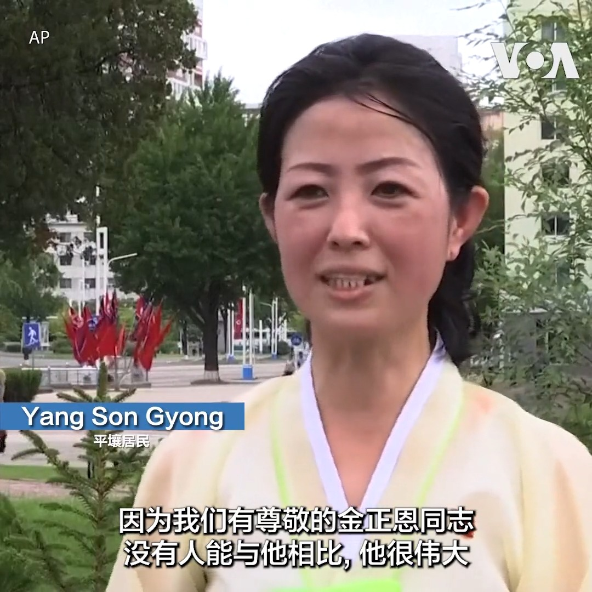
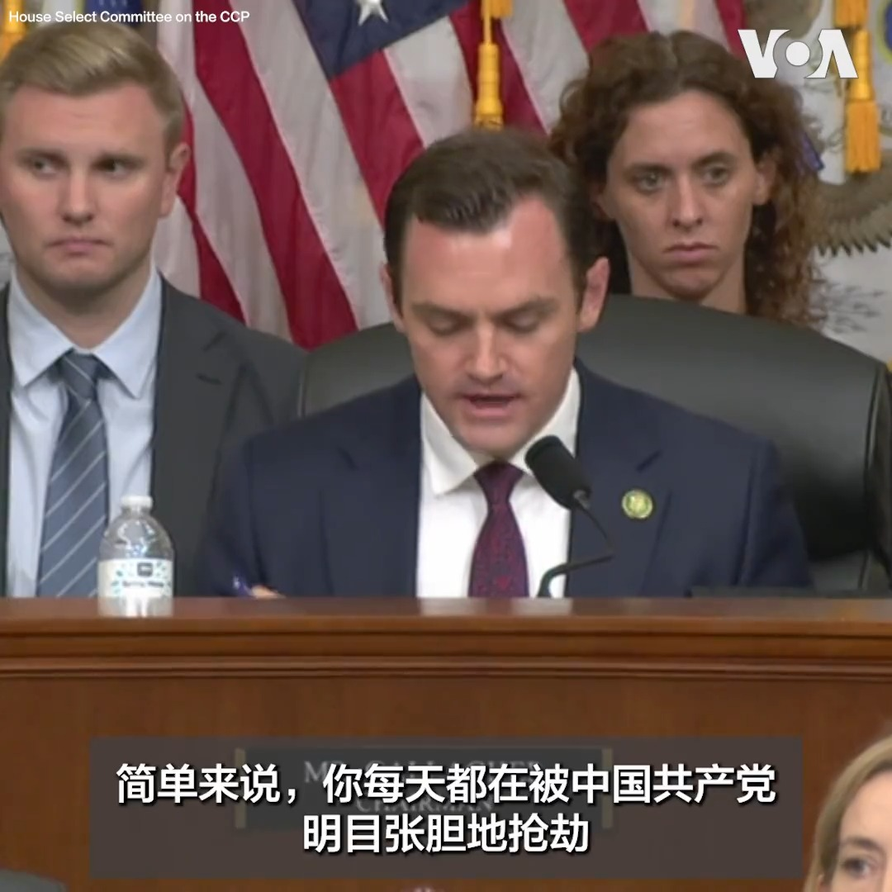
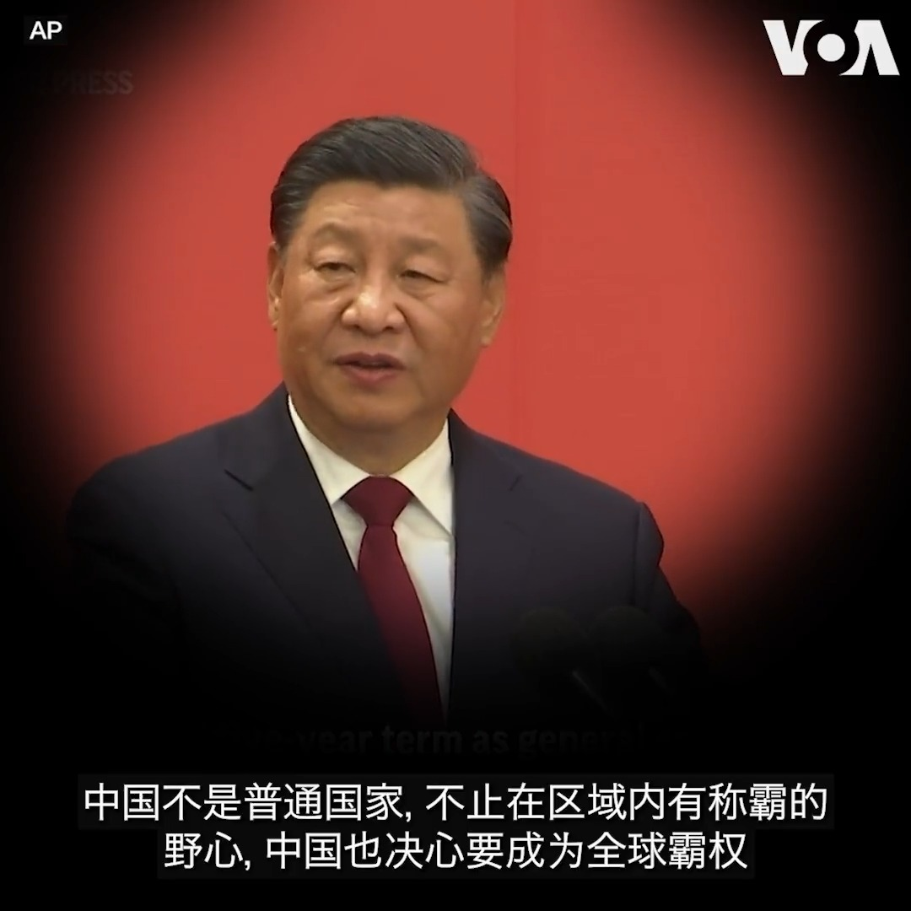
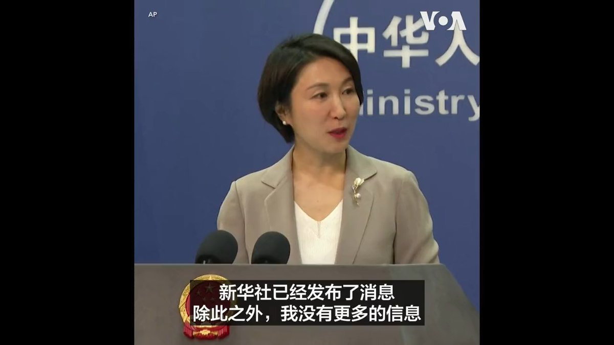
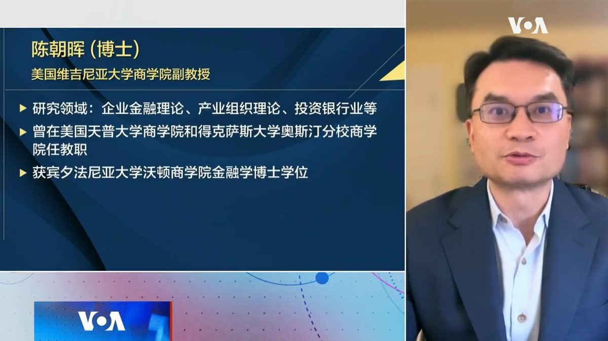

美国之音中文网 北京时间 2023-07-27T23:53:34Z 1684592874455957504 金正恩向俄罗斯防长绍伊古展示遭安理会禁止的导弹 https://t.co/p2aUTNNMno   美国之音中文网 北京时间 2023-07-27T20:41:47Z 1684544611644055553 朝鲜民众27日庆祝《朝鲜停战协定》签署70周年。平壤街头布满国旗、以及朝鲜讲述自己赢得战争胜利的标语。朝鲜称7月27日停战协议签署这天为“胜利日”即“祖国解放战争胜利纪念日”，目前中国和俄罗斯政府代表团正在访问平壤。 
报道: https://t.co/s6qa2X5mi9 https://t.co/oCU9OOz5DU   美国之音中文网 北京时间 2023-07-27T21:00:52Z 1684549414457683969 7/27 【#时事大家谈】“秦刚之谜”暴露中共黑箱政治，加重世界对华疑虑？又推“城中村改造”，北京为救经济真得无计可施了？

嘉宾：独立时评人、专栏作家蔡慎坤先生; “台湾智库”中国问题研究中心主任吴瑟致博士
主持人：平章    

YouTube：https://t.co/Ipsx5pLHjN https://t.co/SA6Em9NfjF   美国之音中文网 北京时间 2023-07-27T21:18:02Z 1684553736025432065 俄罗斯导弹夜袭敖德萨，联合国谴责俄罗斯破坏乌克兰文化遗产 https://t.co/Zxl4o4l6ug   美国之音中文网 北京时间 2023-07-27T21:59:03Z 1684564056798384129 中国工业利润连续六个月以两位数的速度下滑 https://t.co/PC8l1nr9j8   美国之音中文网 北京时间 2023-07-27T22:05:49Z 1684565758272241669 正在进行的台湾年度“汉光”军演7月27日在新北市沿海地区八里举行。台湾总统蔡英文和国防部长邱国正等官员亲临现场视导。此次“联合反登陆作战操演”主要包括设置阻绝设施、步战联合阵地、要港防卫和反击作战等项目。 https://t.co/0nbbrL9LjU   美国之音中文网 北京时间 2023-07-27T17:09:09Z 1684491100789305346 台湾副总统赖清德8月过境美国 美多位众议员吁副总统哈里斯安排会面 https://t.co/fopPPjOzAr   美国之音中文网 北京时间 2023-07-27T17:44:06Z 1684499894659317760 美财政部高官：美国将毫不犹豫对中国采取针对性措施以维护国家安全 https://t.co/BWmcVqciIK   美国之音中文网 北京时间 2023-07-27T17:44:11Z 1684499917556047872 “每天都被中共抢劫” 美两党议员积极讨论新规应对知识产权盗窃问题 https://t.co/9rtoX8i3yr   美国之音中文网 北京时间 2023-07-27T18:03:07Z 1684504681681416194 台商李孟居在中国刑满已离境称自己“真的自由了” 预计几周后返台 https://t.co/4mOOMLuSW8   美国之音中文网 北京时间 2023-07-27T15:26:08Z 1684465174189842435 朝鲜庆祝“胜利日”70周年 联合国仍寻求半岛无核化 中俄要与平壤拉近关系 https://t.co/D45379kN2Y   美国之音中文网 北京时间 2023-07-27T15:53:05Z 1684471957495091200 意大利退出一带一路成定局？ 梅洛尼预计当面告知拜登 https://t.co/qgdTIYFb1n   美国之音中文网 北京时间 2023-07-27T16:07:05Z 1684475479494119424 美国承诺奥库斯大门为新西兰敞开 巴布亚新几内亚让美国设“灾害管理”基地 https://t.co/knUfWmW0qI   美国之音中文网 北京时间 2023-07-27T13:15:00Z 1684432174089478145 “简单来说，你每天都在被中国共产党明目张胆地抢劫，”美众议院中国特设委员会主席加拉格尔7月26日在如何确保美国在关键技术上的领导地位的听证会上说。一位前官员在会上表示，中共对美国构成生存威胁，美国必须像反恐那样，“以同样的紧迫感、领导力、支出和战略来应对这一生存威胁”。 https://t.co/aTj1MPOPTM   美国之音中文网 北京时间 2023-07-27T11:30:00Z 1684405752214200320 “这是一项国家安全投资”，美国商务部长雷蒙多7月26日在美国企业研究所谈到生效了一年的《芯片与科学法》时说。但她坦承，如何有针对性地限制向中国出口先进芯片是一项很困难的工作。“你不想控制任何你不必控制的事情，因为它会剥夺美国公司可以投入研发的收入，”她说。 https://t.co/w7Giwz59An   美国之音中文网 北京时间 2023-07-27T12:07:06Z 1684415086428033026 波士顿中国留学生被控暴力威胁亲民主人士案周四举行预审会议 https://t.co/RUBt7bcx6x   美国之音中文网 北京时间 2023-07-27T05:32:38Z 1684315817041879040 孙韵：换将之后的中国外交 https://t.co/c8QodzpREo   美国之音中文网 北京时间 2023-07-27T06:30:00Z 1684330255098736641 浙江省宣布，全面取消落户限制。台北海洋科技大学通识中心副教授吴建忠肯定这个改革方向，但是指出，中共一有问题就想到农民，可是期待农民救房市不太实际。#完整版：https://t.co/FXOVCkESjR https://t.co/crVnHK9JqZ   美国之音中文网 北京时间 2023-07-27T10:21:29Z 1684388508037701632 俄乌战争持续，台海危机四伏，美国学者敦促政府重建“民主的兵工厂”，快速提高军工产能，巩固国防力量，与私营企业和国际盟友合作。“基础的、传统的热战和军事火力在战场上依然起到重要作用。”这是俄乌战争的经验，也是学者强调强化军事实力应对中国威胁的原因。 https://t.co/n7F8V4tOke   美国之音中文网 北京时间 2023-07-27T05:49:09Z 1684319973173526529 柬国防部：由中国现代化翻新的云朗海军基地接近完工 https://t.co/ojoCpMYgeq   美国之音中文网 北京时间 2023-07-27T06:31:03Z 1684330520099057664 王毅在中国外交部的调整中访问了非洲 https://t.co/ZUFb7kTXwd   美国之音中文网 北京时间 2023-07-27T06:31:05Z 1684330528022097921 联邦法官拒绝亨特·拜登税务案认罪协议 https://t.co/CzrG0RtlCz   美国之音中文网 北京时间 2023-07-27T07:00:00Z 1684337802341670914 秦刚事件再次证明习时代中共政治愈发“黑箱化”。中共为何迷恋黑箱政治？在中国与世界关系更为紧张微妙的当下，中共黑箱政治尤其危险？另一方面，中国国常会再提“城中村改造”，北京为救经济真得无计可施了？这一轮城中村改造是否又会成为腐败重灾区？请留言参与7/27时事大家谈。 https://t.co/eOEchWE5Ez   美国之音中文网 北京时间 2023-07-27T07:24:06Z 1684343866520899587 秦刚为何被免去外交部长职务？他现在人在哪里？“查阅新华社”、“没有信息可以提供”、“没有更多信息”——中国外交部发言人毛宁在7月26日的记者会上始终这样回应。外媒记者当日以各种方式提出了十多个相关提问，这些总长约十分钟的问答内容没有出现在中国外交部发布的文字记录中。https://t.co/iAhnGPE7L1 https://t.co/y0n70IXqFo   美国之音中文网 北京时间 2023-07-27T07:30:00Z 1684345351929733121 中共中央政治局会议首次不提“房住不炒”，反应出房地产业形势严峻。维吉尼亚大学商学院副教授陈朝晖说，放弃“房住不炒”的政策底线，意味着放松房地产金融属性，限贷、限购政策会慢慢松动。 #时事大家谈 完整版：https://t.co/FXOVCkESjR https://t.co/6t6HxJuz39   美国之音中文网 北京时间 2023-07-27T07:39:32Z 1684347754351570944 美国防部长首访巴新，时隔70余年或将重振二战太平洋“桥头堡” https://t.co/QrtfiHpERJ   美国之音中文网 北京时间 2023-07-27T07:39:36Z 1684347769350422528 美国重返联合国教科文组织 https://t.co/1xSJ59bALQ   美国之音中文网 北京时间 2023-07-27T08:00:00Z 1684352903790882816 中国报道--叶兵：西安学生家长大规模抗争 评论：教育资源配置不公，体制问题。https://t.co/Cblv6ee0gt https://t.co/YgaY7ucqa6   美国之音中文网 北京时间 2023-07-27T08:12:04Z 1684355938634043392 中国言辞尖刻的外长被罢免，但其好斗风格预计将会延续下去 https://t.co/ZCzqjvclv7   美国之音中文网 北京时间 2023-07-27T08:40:34Z 1684363110130544641 乌克兰谷物出口问题可能使欧盟出现更大分歧 https://t.co/igHVAZNKBz   美国之音中文网 北京时间 2023-07-27T08:54:05Z 1684366512801583106 前军事官员在国会就外星人和外星飞船作证 https://t.co/0dAguhbwbk   美国之音中文网 北京时间 2023-07-27T09:00:01Z 1684368005042696192 一键解锁#美国热搜 榜 1、外媒记者逼问之下 毛宁变成复读机2、海外专家解谜秦刚免职王毅回炉3、白俄外交官爆料秦刚如何侍奉习近平4、南京女子坐地铁喝水被罚款5、齐齐哈尔体育馆坍塌吴亦凡二审，巧合吗？6、后盾还是肉盾7、找茬儿敏感词8、退役军人宣誓当炮灰9、成都大运会特斯拉禁行 https://t.co/AOyNWxuTS8   美国之音中文网 北京时间 2023-07-27T09:13:03Z 1684371286221541376 美联储升息，鲍威尔说9月可能再加息 https://t.co/vh7SpqrZo0   美国之音中文网 北京时间 2023-07-27T04:20:07Z 1684297566773731330 美国和西非国家经济共同体等共同谴责尼日尔的明显政变企图 https://t.co/3PxzRzXDK9   美国之音中文网 北京时间 2023-07-27T04:48:05Z 1684304607462449155 西安学生家长大规模抗争 评论：教育资源配置不公，体制问题 https://t.co/5OdZouo52s   美国之音中文网 北京时间 2023-07-27T05:01:04Z 1684307874938519552 中国为走出经济泥潭密集发文，公务员降薪潮仍在蔓延 https://t.co/i91yj4UhX7   美国之音中文网 北京时间 2023-07-27T05:40:34Z 1684317815333871616 意大利是G7国家中唯一与中国签订一带一路备忘录的国家，不过意国总理梅洛尼已表达退出意愿，而根据彭博社报道，她将在7月27号访问白宫时知会美国这项决定。7月26号白宫国安会战略沟通协调员科比强调，美意元首将“就中国问题进行更密切的跨大西洋协调”，世界上越来越多国家也已看到了一带一路的风险。 https://t.co/sX49qEIIdv   美国之音中文网 北京时间 2023-07-27T06:03:05Z 1684323481146757120 前白俄罗斯外交官揭秘秦刚糗事 https://t.co/obBlIizgAh   美国之音中文网 北京时间 2023-07-27T02:32:07Z 1684270387360829440 50多头鲸鱼在澳大利亚集体搁浅后死亡 https://t.co/XlPw1wnPlr   美国之音中文网 北京时间 2023-07-27T03:30:12Z 1684285003981619202 一位韩国学者说，朝鲜正在筹备以盛大阅兵式纪念朝鲜战争停战协定签署70周年。这位学者对路透社表示，他在对卫星图像进行分析后认为，阅兵式将有大约1万5千人参与，并可能展示朝鲜的新型核武器。官方媒体报道说，朝鲜已经邀请俄罗斯和中国官员出席纪念活动。 https://t.co/PeuD7SR0os   美国之音中文网 北京时间 2023-07-27T03:31:34Z 1684285348342554625 秦刚尴尬下台 林和立：证明习近平不堪大任 https://t.co/mw5h43fmh8   美国之音中文网 北京时间 2023-07-27T03:39:08Z 1684287252535341058 秦刚遭免职，成为中国最短命的外长，且下台原因不详，这么尴尬的外交事件，中国微博网民多数反应仍是“坚决拥护党的领导”，而几位中国学者則是噤声禁谈。境外观察人士认为，中国政治太黑箱“让人跌破眼镜”，而中国国家主席习近平放任秦刚争议延烧一个月才处理，证明他不堪大任。https://t.co/tcmG0sgdC3 https://t.co/sDh31nj7x9   美国之音中文网 北京时间 2023-07-27T00:54:33Z 1684245834282708992 日本不愿评论中国外长异动，强调愿与北京保持密切沟通 https://t.co/f6TkyxiEjb   美国之音中文网 北京时间 2023-07-27T01:20:02Z 1684252249403564032 朝鲜战争停战70周年之际半岛紧张局势升级，南北双方以不同方式纪念 https://t.co/7JECqfNLJi   美国之音中文网 北京时间 2023-07-27T01:49:03Z 1684259548906029056 台湾汉光军演拉开帷幕，桃园机场反空降机降演练受关注 https://t.co/zrCo3dX6Ti   美国之音中文网 北京时间 2023-07-27T02:03:34Z 1684263204233560065 亨特·拜登将对税务指控认罪 https://t.co/w4g1IJQvOg   美国之音中文网 北京时间 2023-07-27T02:07:07Z 1684264098089902080 台湾军队7月26日在台北近郊的桃园国际机场举行反空降演习。演习模拟桃园机场遭到敌军入侵时如何防御。此次演习共计出动了6架直升机和约180名军人。演习是台湾年度“汉光”军演的一部分，演习期间桃园机场附近空域实施了大约一小时的空中管制。 https://t.co/sra5lXIKcj   