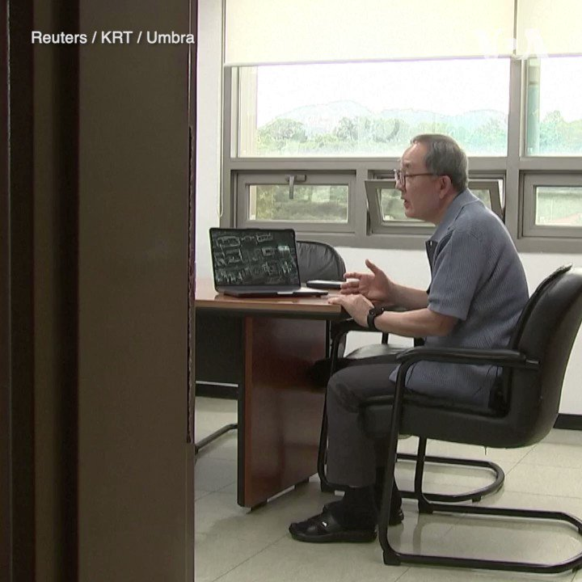
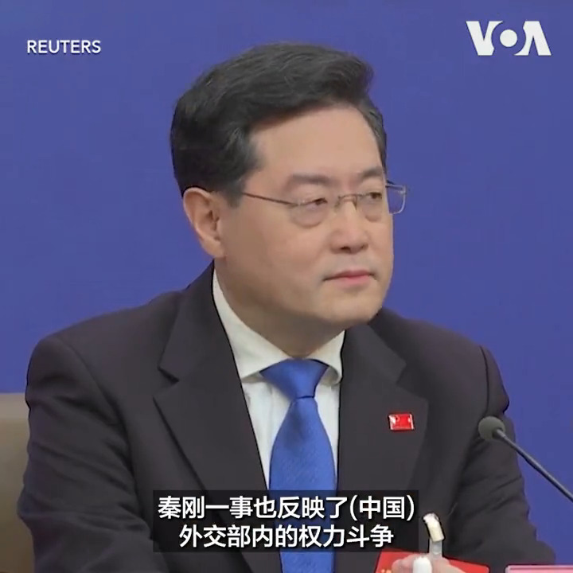
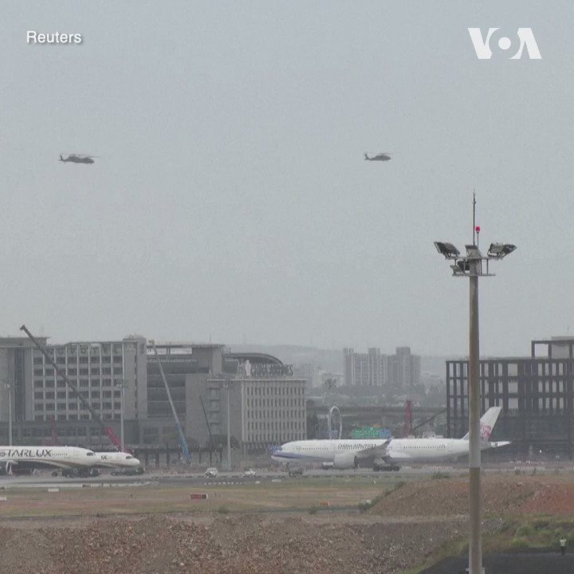

美国之音中文网 北京时间 2023-07-27T08:40:34Z 1684363110130544641 乌克兰谷物出口问题可能使欧盟出现更大分歧 https://t.co/igHVAZNKBz   美国之音中文网 北京时间 2023-07-27T08:54:05Z 1684366512801583106 前军事官员在国会就外星人和外星飞船作证 https://t.co/0dAguhbwbk   美国之音中文网 北京时间 2023-07-27T09:00:01Z 1684368005042696192 一键解锁#美国热搜 榜 1、外媒记者逼问之下 毛宁变成复读机2、海外专家解谜秦刚免职王毅回炉3、白俄外交官爆料秦刚如何侍奉习近平4、南京女子坐地铁喝水被罚款5、齐齐哈尔体育馆坍塌吴亦凡二审，巧合吗？6、后盾还是肉盾7、找茬儿敏感词8、退役军人宣誓当炮灰9、成都大运会特斯拉禁行 https://t.co/AOyNWxuTS8   美国之音中文网 北京时间 2023-07-27T09:13:03Z 1684371286221541376 美联储升息，鲍威尔说9月可能再加息 https://t.co/vh7SpqrZo0   美国之音中文网 北京时间 2023-07-27T04:20:07Z 1684297566773731330 美国和西非国家经济共同体等共同谴责尼日尔的明显政变企图 https://t.co/3PxzRzXDK9   美国之音中文网 北京时间 2023-07-27T04:48:05Z 1684304607462449155 西安学生家长大规模抗争 评论：教育资源配置不公，体制问题 https://t.co/5OdZouo52s   美国之音中文网 北京时间 2023-07-27T05:01:04Z 1684307874938519552 中国为走出经济泥潭密集发文，公务员降薪潮仍在蔓延 https://t.co/i91yj4UhX7   美国之音中文网 北京时间 2023-07-27T05:40:34Z 1684317815333871616 意大利是G7国家中唯一与中国签订一带一路备忘录的国家，不过意国总理梅洛尼已表达退出意愿，而根据彭博社报道，她将在7月27号访问白宫时知会美国这项决定。7月26号白宫国安会战略沟通协调员科比强调，美意元首将“就中国问题进行更密切的跨大西洋协调”，世界上越来越多国家也已看到了一带一路的风险。 https://t.co/sX49qEIIdv   美国之音中文网 北京时间 2023-07-27T06:03:05Z 1684323481146757120 前白俄罗斯外交官揭秘秦刚糗事 https://t.co/obBlIizgAh   美国之音中文网 北京时间 2023-07-27T02:32:07Z 1684270387360829440 50多头鲸鱼在澳大利亚集体搁浅后死亡 https://t.co/XlPw1wnPlr   美国之音中文网 北京时间 2023-07-27T03:30:12Z 1684285003981619202 一位韩国学者说，朝鲜正在筹备以盛大阅兵式纪念朝鲜战争停战协定签署70周年。这位学者对路透社表示，他在对卫星图像进行分析后认为，阅兵式将有大约1万5千人参与，并可能展示朝鲜的新型核武器。官方媒体报道说，朝鲜已经邀请俄罗斯和中国官员出席纪念活动。 https://t.co/PeuD7SR0os   美国之音中文网 北京时间 2023-07-27T03:31:34Z 1684285348342554625 秦刚尴尬下台 林和立：证明习近平不堪大任 https://t.co/mw5h43fmh8   美国之音中文网 北京时间 2023-07-27T03:39:08Z 1684287252535341058 秦刚遭免职，成为中国最短命的外长，且下台原因不详，这么尴尬的外交事件，中国微博网民多数反应仍是“坚决拥护党的领导”，而几位中国学者則是噤声禁谈。境外观察人士认为，中国政治太黑箱“让人跌破眼镜”，而中国国家主席习近平放任秦刚争议延烧一个月才处理，证明他不堪大任。https://t.co/tcmG0sgdC3 https://t.co/sDh31nj7x9   美国之音中文网 北京时间 2023-07-27T00:54:33Z 1684245834282708992 日本不愿评论中国外长异动，强调愿与北京保持密切沟通 https://t.co/f6TkyxiEjb   美国之音中文网 北京时间 2023-07-27T01:20:02Z 1684252249403564032 朝鲜战争停战70周年之际半岛紧张局势升级，南北双方以不同方式纪念 https://t.co/7JECqfNLJi   美国之音中文网 北京时间 2023-07-27T01:49:03Z 1684259548906029056 台湾汉光军演拉开帷幕，桃园机场反空降机降演练受关注 https://t.co/zrCo3dX6Ti   美国之音中文网 北京时间 2023-07-27T02:03:34Z 1684263204233560065 亨特·拜登将对税务指控认罪 https://t.co/w4g1IJQvOg   美国之音中文网 北京时间 2023-07-27T02:07:07Z 1684264098089902080 台湾军队7月26日在台北近郊的桃园国际机场举行反空降演习。演习模拟桃园机场遭到敌军入侵时如何防御。此次演习共计出动了6架直升机和约180名军人。演习是台湾年度“汉光”军演的一部分，演习期间桃园机场附近空域实施了大约一小时的空中管制。 https://t.co/sra5lXIKcj   