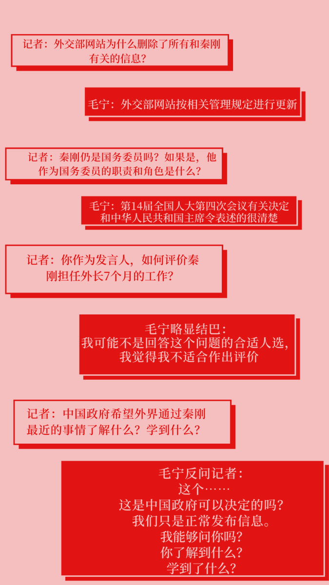
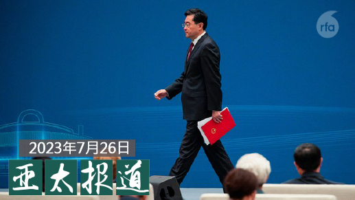
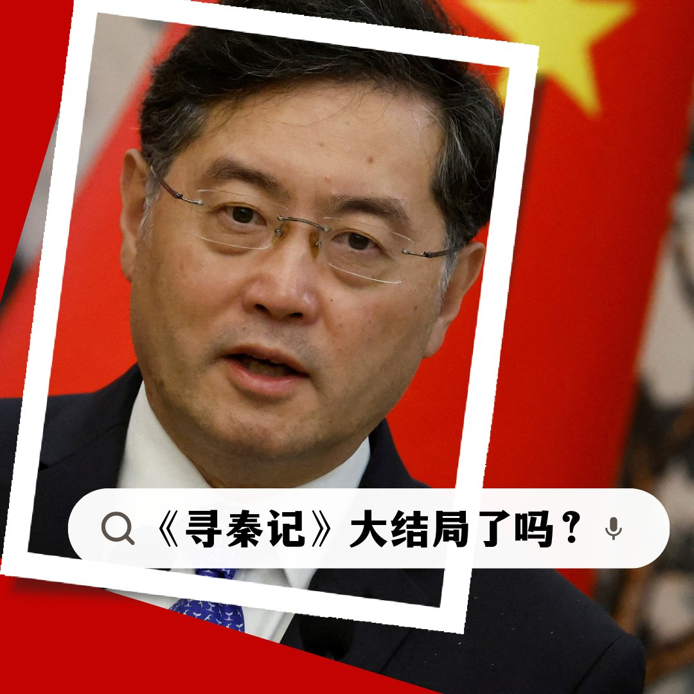
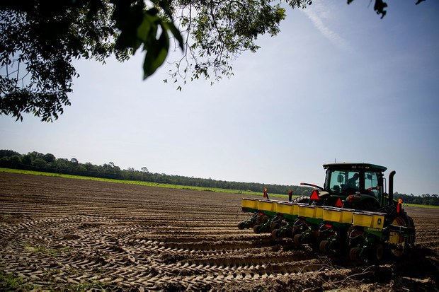
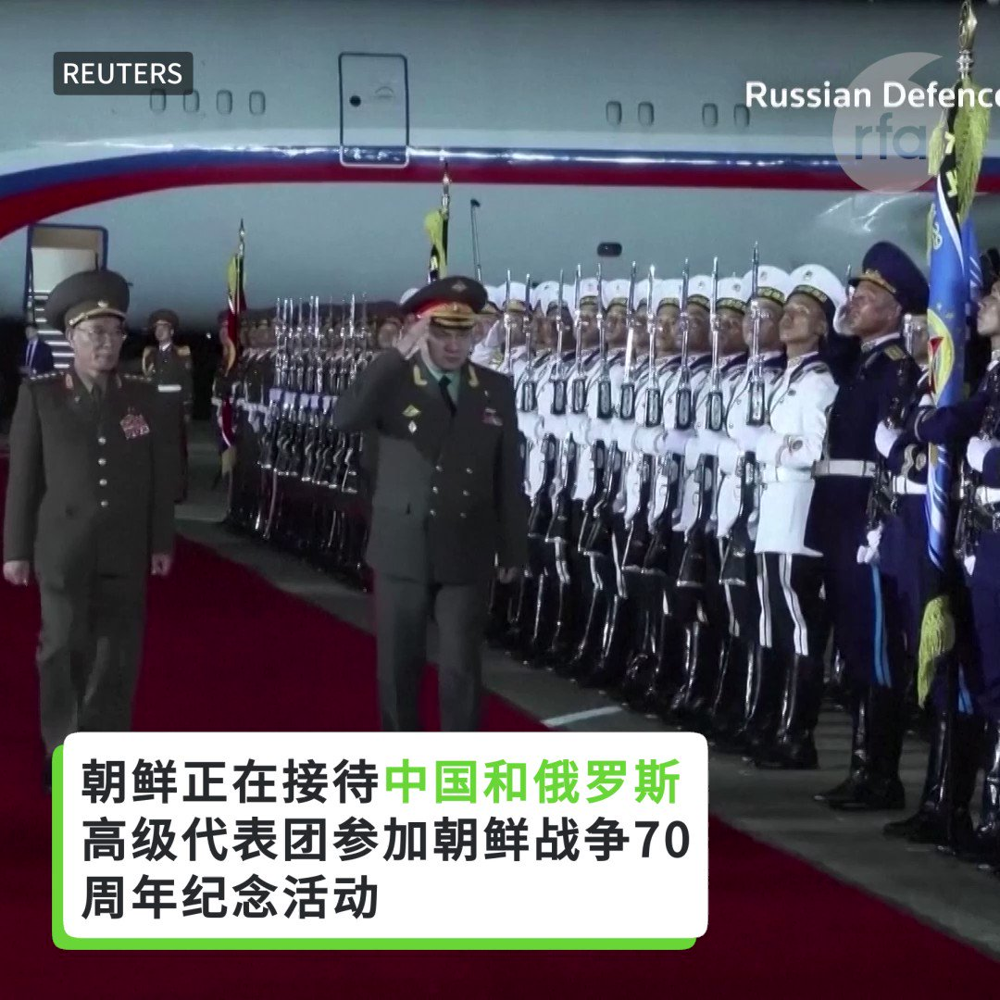

自由亚洲电台 北京时间 2023-07-27T10:50:25Z 1684395791656407040 RT @RFA_Chinese: 【中俄代表团赴平壤庆祝“胜利日”】
#中国、#俄罗斯 分别派代表团访问朝鲜并出席 #朝鲜战争停战70周年 纪念活动。并希望通过此次活动加深与北京和莫斯科的关系，在与华盛顿和西方的竞争中达成共识。 https://t.co/rUC6xWDSZT   自由亚洲电台 北京时间 2023-07-27T04:50:02Z 1684305097495568386 【甘肃 #山丹大佛寺 大佛殿发生火灾】 https://t.co/IcOgRIeHf2   自由亚洲电台 北京时间 2023-07-27T09:50:14Z 1684380645521334272 RT @RFA_Chinese: 关于秦刚，外媒记者连番追问，中国外交部发言人毛宁这样回复。
毛宁的回复，您打几分？ https://t.co/qVvmI69hRG   自由亚洲电台 北京时间 2023-07-27T10:21:15Z 1684388447921016834 专栏 | #纵横大历史：第五十八讲　#三家村 https://t.co/jgBuHEGub1   自由亚洲电台 北京时间 2023-07-27T10:22:42Z 1684388814192783360 评论 | #魏京生：#习近平 的靴子
#秦刚
 https://t.co/guGulx6LAE   自由亚洲电台 北京时间 2023-07-27T05:22:43Z 1684313321497939968 “我是 #政治犯 家属。我们这个家庭跟普通人生活不一样的，我们没有一个正常的生活。”-#李文足

“我女儿就老是问我一句，这里我们能住多久？就是孩子上不了学，然后我们住的地方又不是很安稳。她就会问那些东西。其实很难过。”- #王峭岭

“骨肉分离对于谁来说，都是一件很难过的事情。但现在我不单是被限制出境，连护照都不给办，所以我觉得能和孩子见面的机会，真的是遥遥无期。”-#王宇

“709大抓捕”已经过去八年了，然而对于被捕律师和一直在抗争的家属而言，“#709事件”却仍像梦魇一样，一直缠绕着他们。

详见  https://t.co/SSlNQJuas8   自由亚洲电台 北京时间 2023-07-27T06:30:01Z 1684330256499621888 美国“捍卫教育家长”组织（ Parents Defending Education)表示，越来越多证据表明，中国共产党资助的实体正渗透到美国幼儿园到12年级的基础教育系统。 https://t.co/Gg2UHk5pay   自由亚洲电台 北京时间 2023-07-27T07:00:09Z 1684337841957130240 【#亚太报道（2023-7-26）】
欢迎收听和订阅播客【亚太报道】 https://t.co/MjLNSvVMqc

#秦刚 去向依旧不明源于 #中共内斗？/ #齐齐哈尔事故 反映出制度性问题/ 中国政府发文提振 #民营经济 效果几何/#潘功胜 是中国经济拆弹人还是爆雷者？/美众议院通过 #台湾国际团结法案 https://t.co/ZNl2Ogw5FQ   自由亚洲电台 北京时间 2023-07-27T09:01:15Z 1684368316029100032 RT @RFA_Chinese: 【#亚太报道（2023-7-26）】
欢迎收听和订阅播客【亚太报道】 https://t.co/MjLNSvVMqc

#秦刚 去向依旧不明源于 #中共内斗？/ #齐齐哈尔事故 反映出制度性问题/ 中国政府发文提振 #民营经济 效果几何/#潘功…   自由亚洲电台 北京时间 2023-07-27T09:01:35Z 1684368402352054273 RT @RFA_Chinese: “我是 #政治犯 家属。我们这个家庭跟普通人生活不一样的，我们没有一个正常的生活。”-#李文足

“我女儿就老是问我一句，这里我们能住多久？就是孩子上不了学，然后我们住的地方又不是很安稳。她就会问那些东西。其实很难过。”- #王峭岭… http…   自由亚洲电台 北京时间 2023-07-27T09:16:37Z 1684372182992912384 #习近平 将于7月27日-28日出席成都 #第31届世界大学生夏季运动会 开幕式，为出席开幕式并访问的外国领导人举行欢迎宴会和相关双边活动。
原定要去的斐济共和国总理兰布卡7月25日在脸书上说，他走楼梯看手机摔倒，头部受伤，去不了了。

对比2011年的深圳大运会，出席开/闭幕式的有莫桑比克、玻利维亚、斐济、斯里兰卡、埃塞俄比亚、罗马尼亚，俄罗斯、老挝、亚美尼亚等国领导人...
十年 #战狼外交，中国的朋友更多了还是更少了？   自由亚洲电台 北京时间 2023-07-27T04:47:52Z 1684304549744631808 #秦刚 被免去外交部长的消息发布后，似乎让外界愈发对秦刚的行踪感兴趣。
本台记者王允 @Jeff23Wang 详细报道。

 https://t.co/rleCHeLvMY   自由亚洲电台 北京时间 2023-07-27T05:06:25Z 1684309220882280448 连日来，中国黑龙江省 #齐齐哈尔市中学体育馆坍塌事故，成为国内外舆论关注焦点。为何这样的灾难性事件在中国频频上演？ 这起事件中，官方对待死难者家长的态度，又反映出怎样的制度性问题？
本台记者凯迪 @KittyWang5 报道 
#刀郎 #罗刹海市 

 https://t.co/vjWWlKNaD6   自由亚洲电台 北京时间 2023-07-27T05:18:32Z 1684312266588528640 据法新社消息，截至周三上午，中国外交部网站上所有提及秦刚的内容均已删除。
搜索秦刚的名字显示“已为您找到0条相关结果”，提到他的外交活动的文章链接也显示页面“不存在或已被删除”。
不过，秦刚并没有从互联网其他地方消失，他的名字和照片仍然可以在中央政府网站这样的官网上找到。
王毅回锅外长，秦刚下落不明，您来预测，《寻秦记》大结局了吗？   自由亚洲电台 北京时间 2023-07-27T05:35:59Z 1684316660134473729 7月25日，斐济总理兰布卡称，他因摔伤头部，只好原定的访华行程，无法参加7月28日在成都召开的 #第31届世界大学生夏季运动会 开幕式。
世界大学生运动会曾于2001年北京、2011年在深圳举行。北京大运会有哥伦比亚、波兰及匈牙利总统出席；深圳大运会有俄罗斯、法国、德国及印度尼西亚总统出席。
#成都大运会 目前为止未闻西方国家领导人出席。
十年 #战狼外交，中国的朋友更多了还是更少了？   自由亚洲电台 北京时间 2023-07-27T06:00:01Z 1684322707780042752 近两周，中国政府连下多道文件，以鼓励民营经济，试图为整体经济形式提供新的增长动力。但 #民营经济 所面临的内需不足、民营企业经营困难、重点领域风险高等问题，仅靠下发文件就能解决吗？

  https://t.co/udMJlZoXI1   自由亚洲电台 北京时间 2023-07-27T00:37:32Z 1684241554133905409 #解放军  #八一建军节 即将来临，中国官媒报道，中共中央政治局24日就 #全面加强军事治理 进行集体学习。有分析认为，“徐郭遗毒”已大致清洗，或许还有“小山头”存在，此时再清洗一些人，将产生震慑作用。

 https://t.co/AJeovCVKpX   自由亚洲电台 北京时间 2023-07-27T01:04:34Z 1684248356103520272 美国参议院25日以压倒性多数表决通过  #禁止中国企业购买美国农地，并对投资中国国家安全产业的美国人实施新规定。
据纽约时报报道，美国两党参议员以绝大多数票将这些法案纳入年度国防政策法案。其中禁止中国、俄罗斯、朝鲜、伊朗等国的企业或代理人收购美国农地或农业企业控股权的法案以91票赞成，7票反对获得通过。另一项法案要求美国人如果要在上述四国的国家安全产业进行投资，必须在14天内告知美国财政部，这些产业包括人工智能、半导体和高超音速设备生产。
支持该法案的参议员表示，该法案对于封堵美国对华经济防御的漏洞意义重大。美国目前限制某些先进技术的对华出口，但并没有禁止在中国境内为这些技术提供资金的伙伴关系。
报道表示，尽管这些法案仍需获得众议院通过，才能成为法律。但对于参议院来说是一个重要开始，显示国会山对中国采取行动的热情。   自由亚洲电台 北京时间 2023-07-27T01:55:05Z 1684261068657381376 美国《财富》杂志日前公布 #中国500强 排行榜显示，中国10大最赚钱的企业当中，唯一上榜的民企是网络巨头 #腾讯集团。中国10大营收公司，也只有 #中国平安保险 一家民企上榜。
https://t.co/twPff6bCsN   自由亚洲电台 北京时间 2023-07-27T03:18:31Z 1684282066039607298 【中俄代表团赴平壤庆祝“胜利日”】
#中国、#俄罗斯 分别派代表团访问朝鲜并出席 #朝鲜战争停战70周年 纪念活动。并希望通过此次活动加深与北京和莫斯科的关系，在与华盛顿和西方的竞争中达成共识。 https://t.co/rUC6xWDSZT   自由亚洲电台 北京时间 2023-07-27T03:30:12Z 1684285005621780480 #事实查核｜中国登上顶尖期刊的 #科研论文 总数已超越美国？
 https://t.co/sIgvvmBLiI   自由亚洲电台 北京时间 2023-07-27T03:45:15Z 1684288792277172225 美国联邦众议院7月25日通过《#台湾国际团结法》（Taiwan International Solidarity Act），法案主张联合国大会第2758号决议仅处理中国代表权问题，未涉及台湾。
台湾的外交部回应说，该法案旨在反制中国试图透过扭曲2758号决议，阻碍台湾参与国际组织的恶劣行径。

 https://t.co/ZI2QCbjaJZ   自由亚洲电台 北京时间 2023-07-27T00:40:56Z 1684242407313879047 【高清图片 点击观看】台湾 #汉光实兵演习 融入俄乌战经验以及"#全社会防卫"概念，首次征用桃园国际机场作 #反空降操演。同时，台北车站也上演反恐操演。
https://t.co/6dsqQ3s3bM   自由亚洲电台 北京时间 2023-07-27T02:12:54Z 1684265552527622156 关于秦刚，外媒记者连番追问，中国外交部发言人毛宁这样回复。
毛宁的回复，您打几分？ https://t.co/qVvmI69hRG   自由亚洲电台 北京时间 2023-07-27T00:00:53Z 1684232329034887168 【请点击观看高清图片】台湾 #汉光实兵演习 融入俄乌战经验以及"#全社会防卫"概念，首次征用桃园国际机场作 #反空降操演。同时，台北车站也上演反恐操演。   