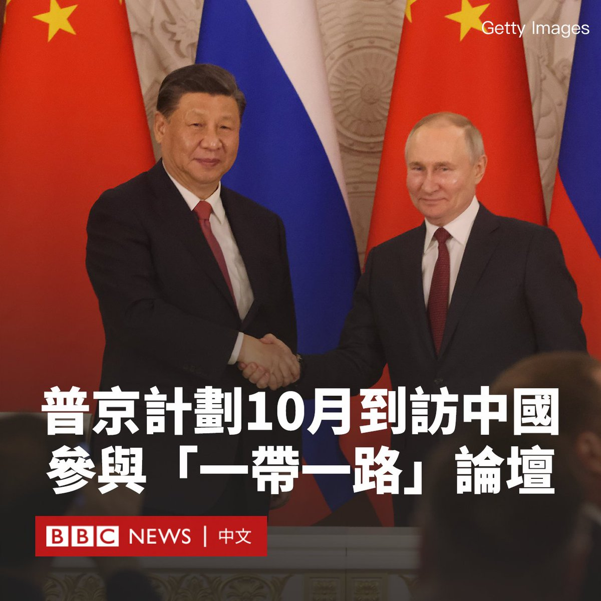
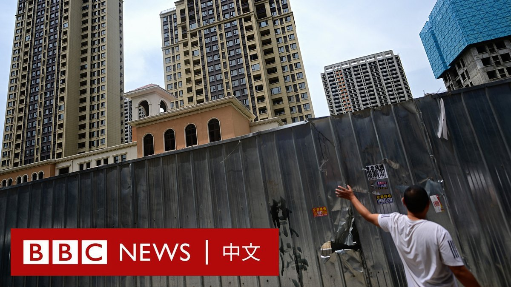
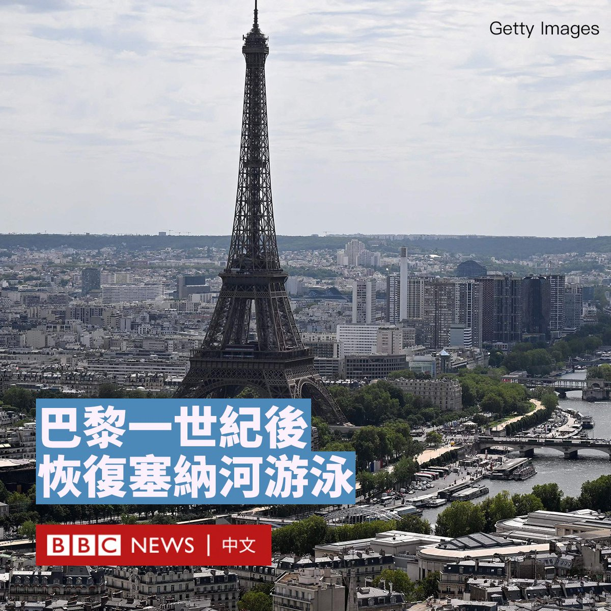
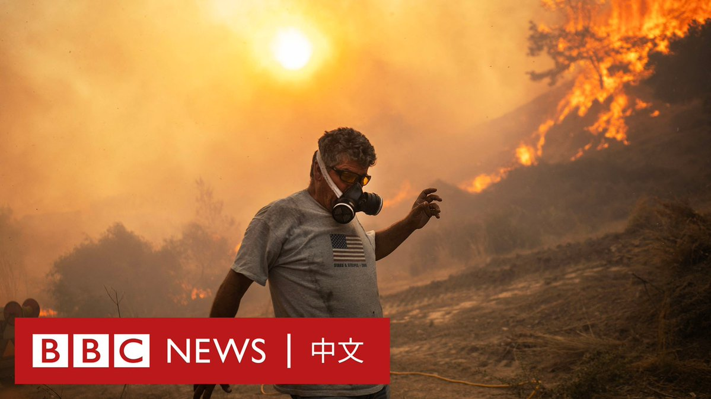
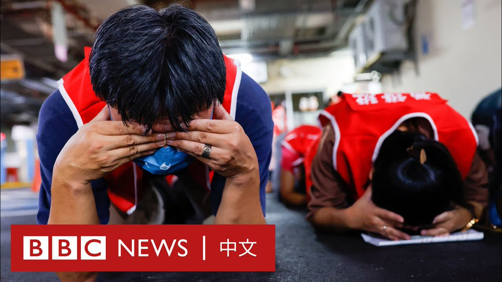

D英国广播公司BBC 北京时间 2023-07-26T17:16:32Z 1684130572594216961 根据路透社报导，俄罗斯总统普京（Vladimir Putin）计划在10月份访问中国，并预计将出席“一带一路”论坛。

这将是莫斯科入侵乌克兰后，普京首次访问北京。

自从俄国入侵乌克兰导致西方与莫斯科的关系急剧恶化后，中国成为俄罗斯最重要的盟友。

普京上次访华是在入侵乌克兰前夕的北京冬奥会。当时中国国家主席习近平称，两国的合作伙伴关系“无上限”，表示两国的广泛合作涵盖经济、贸易、政治和军事领域。

尽管北京尚未直接在军事上支援俄罗斯，但截至目前，中国拒绝谴责莫斯科的战争行径，并指责西方对俄罗斯进行制裁。

同时，在西方对俄罗斯发布能源进口禁令后，中国加大了对于石油和天然气的购买力度，俄罗斯也越来越多地使用人民币作为储备货币。

今年三月，习近平访问了莫斯科，与普京签署了一系列经济和其他合作协议。   D英国广播公司BBC 北京时间 2023-07-26T19:50:29Z 1684169312154664960 “对于老百姓来说，这其实是很无力的一件事。”

中国多地发生烂尾楼危机后，许多相关房地产项目至今没有复工。一些业主尝试过抵制缴纳月供和去信访办上访，但经过数月的努力，他们仍未得到一个答案。 https://t.co/beKKzWMmsw   D英国广播公司BBC 北京时间 2023-07-26T14:58:10Z 1684095749037117440 经过一个世纪后，巴黎塞纳河再次开放给公众游泳。

距离奥运会还有一年的时间，巴黎正在进行历史性清理工作的最后阶段，不久将会看到有人在塞纳河游泳。

由于水质污染，知名的塞纳河在过去一个世纪都禁止民众下水。但巴黎耗资14亿欧元的改造项目被普遍认为是成功的，城市游泳将成为此次奥运会的主要遗产之一。

巴黎的塞纳河将举办三项奥运会项目和残奥比赛（铁人三项、马拉松游泳和身障铁人三项）；到2025年，将会在码头边开放三个露天游泳区。

负责奥运会的巴黎市副市长皮埃尔·拉巴丹说：“当人们看到运动员在塞纳河中游泳且没有健康问题时，他们就会有信心返回塞纳河游泳了，那将是历史的一刻”。

与许多西方城市一样，巴黎的城市水质在近一个世纪的现代化发展的影响下变得肮脏不堪。由于人口激增带来的生活污水与上游工业废水的排放，塞纳河水质一度非常糟糕。

其中一个主要原因是19世纪的“单一系统”排水基础设施，它将厨房和浴室的污水混合起来，排入河流。在正常情况下，这些废水可通过地下复杂管道系统流向城市郊区的处理中心。然而当出现暴雨时，排水系统会饱和，多余的水会被排放到塞纳河中。

污染严重时，塞纳河只记录到三种鱼类可以在河流中生存。1923年，当局禁止下水游泳，不过一年一度的圣诞节渡河比赛一直持续到第二次世界大战。

如今，经过水质清洁工程，塞纳河的水质得到改善，流域内已有30至35种鱼类生存。   D英国广播公司BBC 北京时间 2023-07-26T18:09:26Z 1684143883465400320 甘肃省张掖市山丹县大佛寺大佛殿周一（7月24日）凌晨发生火灾。当局隔日确认火灾没有造成人员伤亡，火灾原因仍在调查中。 https://t.co/lVmEQJMsoi   D英国广播公司BBC 北京时间 2023-07-26T16:08:54Z 1684113549927358466 7月18日，希腊观光景点罗德岛发生严重火灾，约两万人已被紧急疏散。当地时间周二（25日）接报尤比亚岛（Evia）共有3人死亡，包括两名空军机师及一名畜牧员。 https://t.co/HBHJ6kJwBf   D英国广播公司BBC 北京时间 2023-07-26T10:40:00Z 1684030779217809408 本周，台湾多个城市连续四天进行防空演习，以模拟如何抵御北京军队的攻击以及对于灾害的响应，许多地方拉响防空警报。

“汉光39号”军演也于周一（7月24日）登场。台湾媒体称，此次汉光演习是近40年来“最接近实战”的一次。 https://t.co/UXODLl5yAl   D英国广播公司BBC 北京时间 2023-07-26T13:51:50Z 1684079055618953216 七十年前，中国以志愿军的名义，派遣数以十万计的军人赴朝鲜半岛作战。在被美韩联军俘虏的战俘有逾1.4万人辗转前往台湾。在大半个世纪后，多数军人已经离世，两位定居台北的前战俘讲述了他们跌宕起伏的人生足迹转变。https://t.co/YyXGbBdBzB   D英国广播公司BBC 北京时间 2023-07-26T11:38:36Z 1684045528890310658 就任中国外交部长仅半年多，并被视为是习近平一手提拔的政治新星的秦刚周二（7月25日）突然被免职，由前外长王毅接任。
https://t.co/qvvsIbGyV3   D英国广播公司BBC 北京时间 2023-07-26T08:38:04Z 1684000095279390720 台湾一名女孩在网上被一名男子以裸照恐吓要求性交，女孩报案后，被警方要求配合诱捕这名男子，未料却在警方监控下被该男子开车载走性侵。

这起事件引发台湾社会的关注，两名警察正在接受调查。

据报道，这名13岁女孩在交友应用程式上认识了涉案男子，他试图以裸照勒索她并要求与他发生性关系。

这名女童向警方报案，但警方反而希望她能充当卧底，以协助警方的抓捕。

据报道，该事件发生于2020年11月，这名台湾桃园的女孩同意协助桃园市政府警察局中坜分局的警察在埋伏地点抓捕威胁她的男子。

然而，该男子将女孩接上车，载到300米外的路边停车并命令其口交，女童在畏惧下妥协，随后被载回，此时埋伏的警员才出面将男子拘捕。

警方发言人表示，桃园地检署侦查该案时，女童并未提及配合警方诱捕时遭受性侵的过程，而是在法院审理时说出自己的经历。

这名张姓男子被判犯有性侵罪，判处八年监禁。

据台湾媒体报道，桃园市警局表示，两名警察因涉嫌伤害罪及废弛职务罪，正在被检方调查。时任分局长、侦查队长被记过。

警方表示，尽管警察告诉她不要进入该男子的车内，但她突然上车后令警察措手不及，追赶未果。

但批评者质疑，警方让未经训练的未成年人进行卧底调查是否合适。   