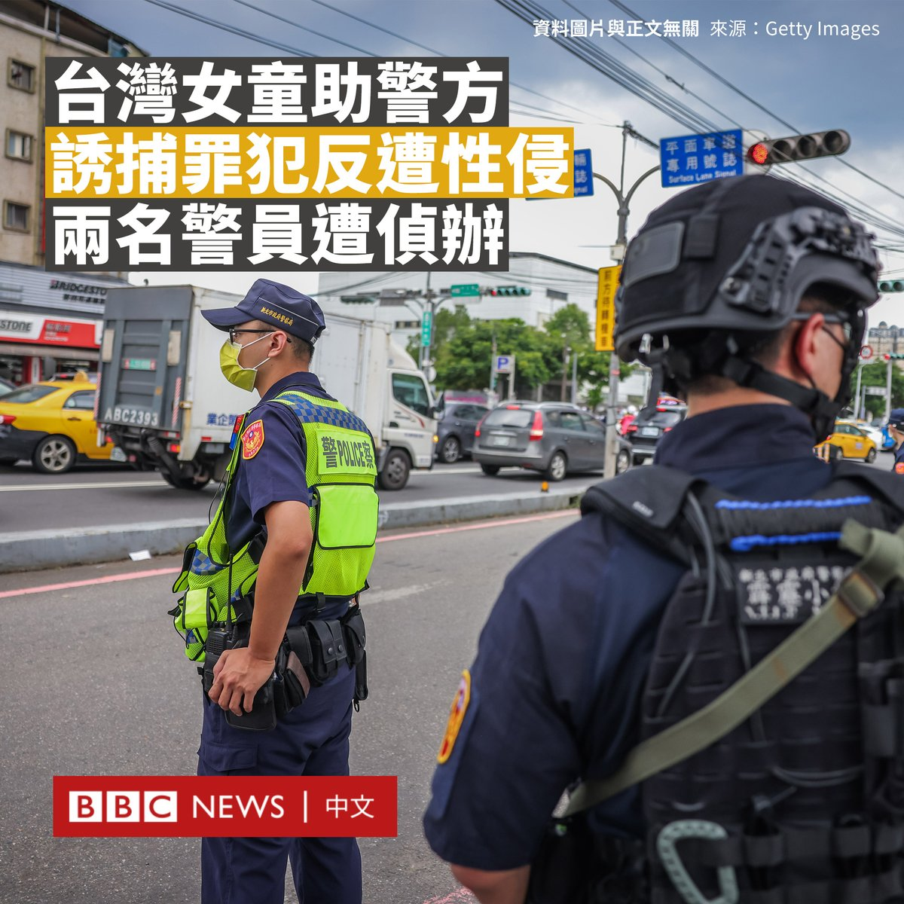

D英国广播公司BBC 北京时间 2023-07-26T13:51:50Z 1684079055618953216 七十年前，中国以志愿军的名义，派遣数以十万计的军人赴朝鲜半岛作战。在被美韩联军俘虏的战俘有逾1.4万人辗转前往台湾。在大半个世纪后，多数军人已经离世，两位定居台北的前战俘讲述了他们跌宕起伏的人生足迹转变。https://t.co/YyXGbBdBzB   D英国广播公司BBC 北京时间 2023-07-26T11:38:36Z 1684045528890310658 就任中国外交部长仅半年多，并被视为是习近平一手提拔的政治新星的秦刚周二（7月25日）突然被免职，由前外长王毅接任。
https://t.co/qvvsIbGyV3   D英国广播公司BBC 北京时间 2023-07-26T08:38:04Z 1684000095279390720 台湾一名女孩在网上被一名男子以裸照恐吓要求性交，女孩报案后，被警方要求配合诱捕这名男子，未料却在警方监控下被该男子开车载走性侵。

这起事件引发台湾社会的关注，两名警察正在接受调查。

据报道，这名13岁女孩在交友应用程式上认识了涉案男子，他试图以裸照勒索她并要求与他发生性关系。

这名女童向警方报案，但警方反而希望她能充当卧底，以协助警方的抓捕。

据报道，该事件发生于2020年11月，这名台湾桃园的女孩同意协助桃园市政府警察局中坜分局的警察在埋伏地点抓捕威胁她的男子。

然而，该男子将女孩接上车，载到300米外的路边停车并命令其口交，女童在畏惧下妥协，随后被载回，此时埋伏的警员才出面将男子拘捕。

警方发言人表示，桃园地检署侦查该案时，女童并未提及配合警方诱捕时遭受性侵的过程，而是在法院审理时说出自己的经历。

这名张姓男子被判犯有性侵罪，判处八年监禁。

据台湾媒体报道，桃园市警局表示，两名警察因涉嫌伤害罪及废弛职务罪，正在被检方调查。时任分局长、侦查队长被记过。

警方表示，尽管警察告诉她不要进入该男子的车内，但她突然上车后令警察措手不及，追赶未果。

但批评者质疑，警方让未经训练的未成年人进行卧底调查是否合适。   