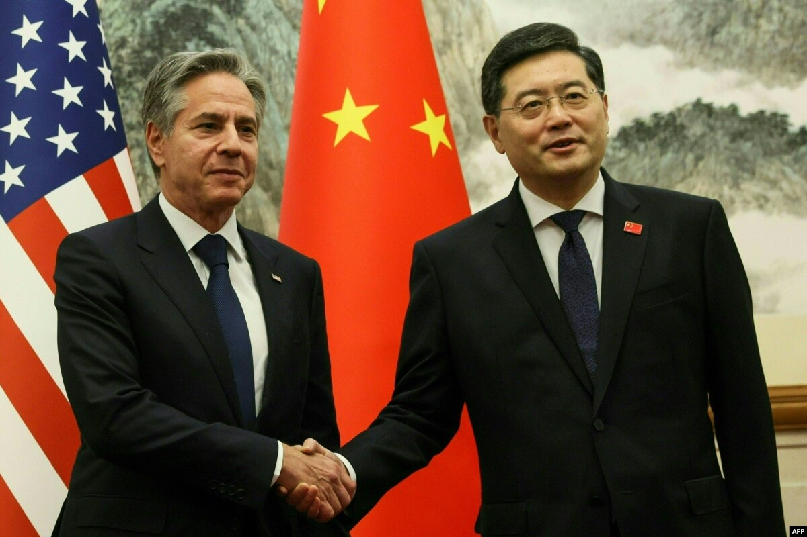
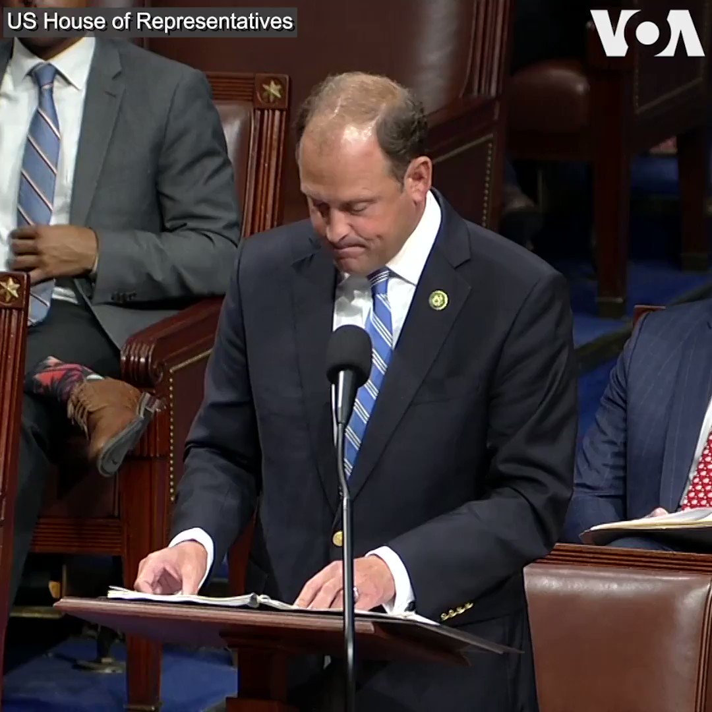
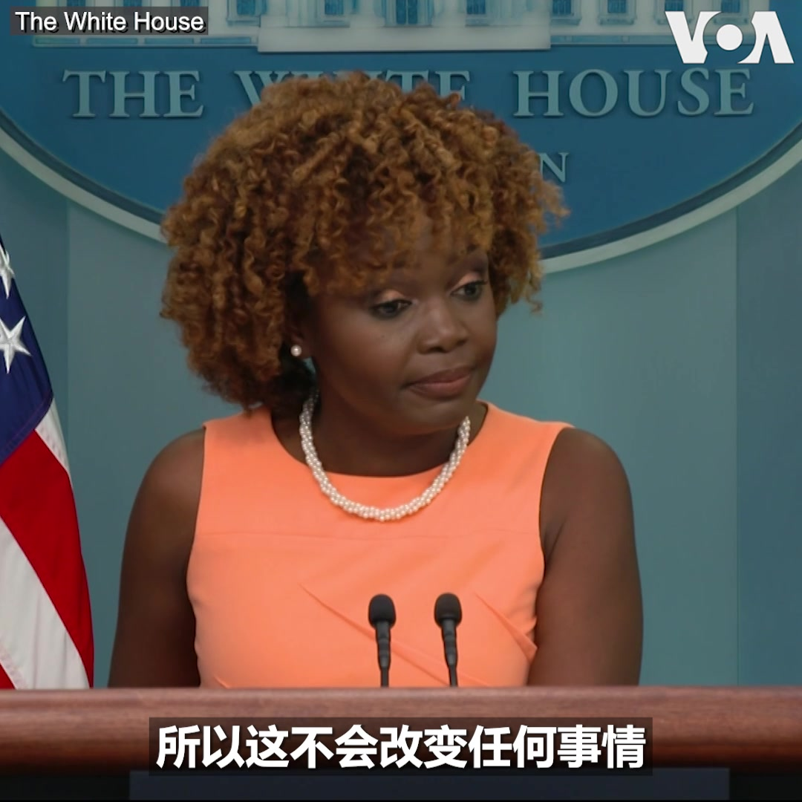
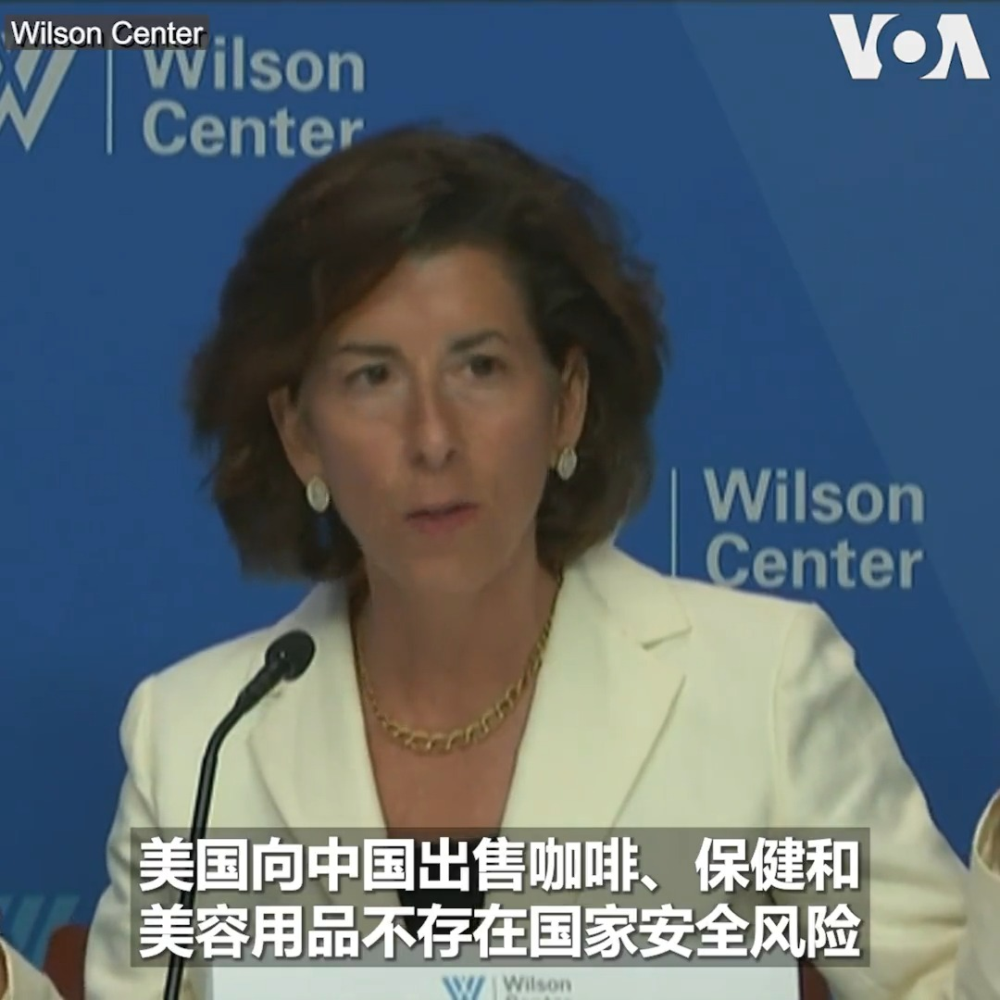
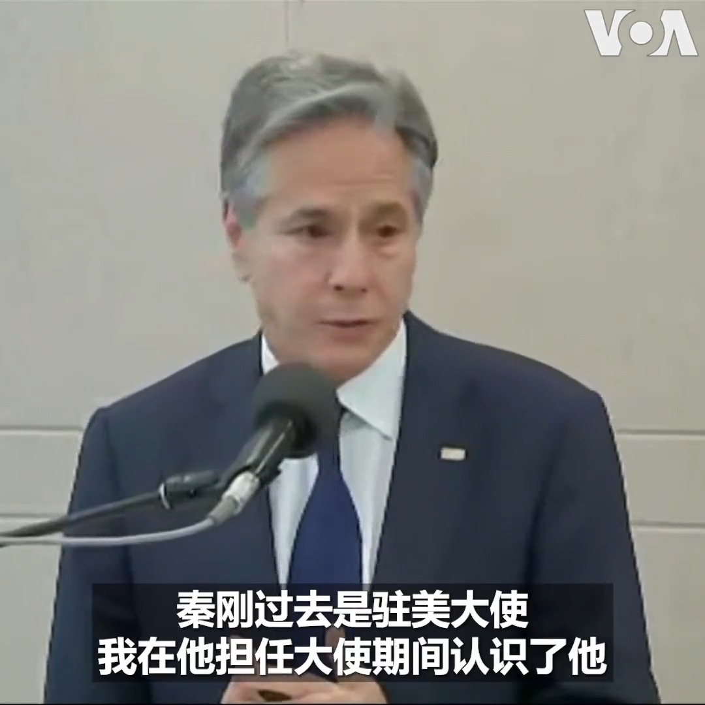
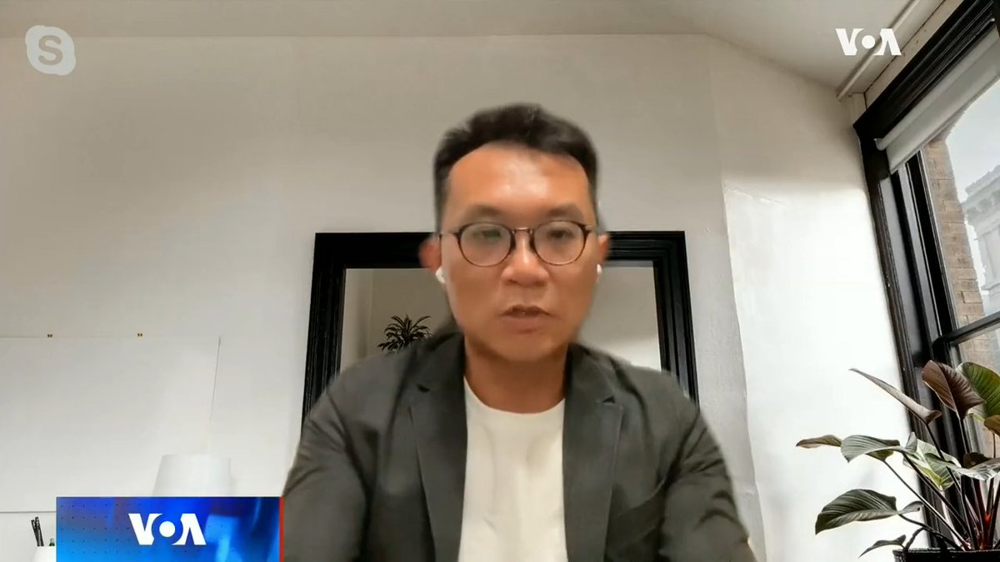
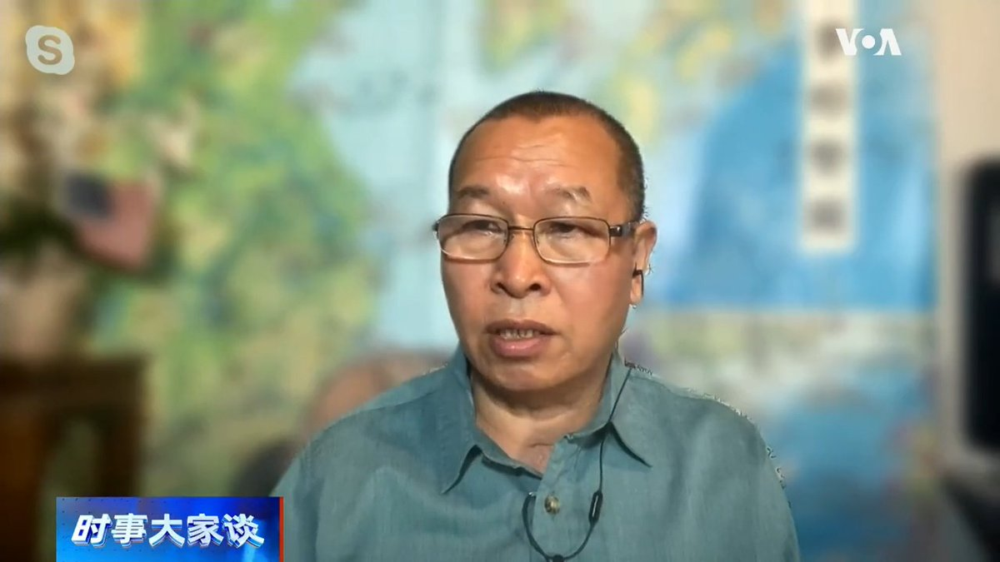
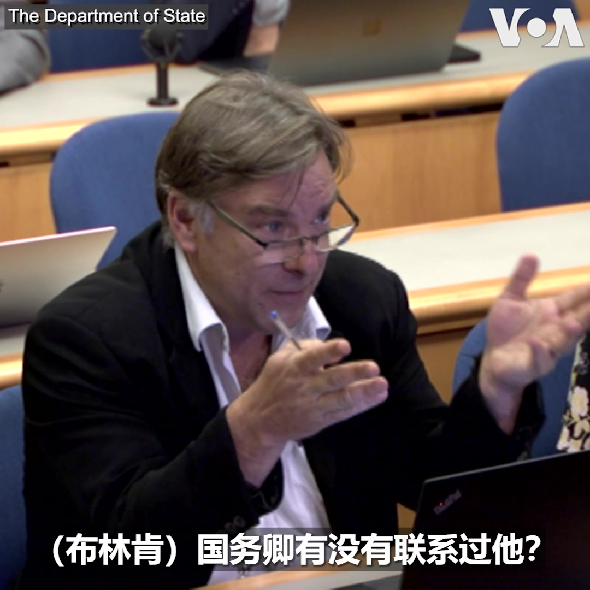

美国之音中文网 北京时间 2023-07-26T08:44:31Z 1684001717161975808 【中国外交高层人事震荡，华盛顿：美国与中国接触不会因此发生改变】https://t.co/a0oVFhKc9r https://t.co/MIgMmJv96R   美国之音中文网 北京时间 2023-07-26T09:25:09Z 1684011942367854592 美国务院：美国可望发放自2016年以来最多的学生签证 https://t.co/UlOC5FVGmN   美国之音中文网 北京时间 2023-07-26T09:55:35Z 1684019601334730752 反伊斯兰活动人士在埃及、土耳其驻丹麦大使馆前焚烧古兰经 https://t.co/166iLVx1Db   美国之音中文网 北京时间 2023-07-26T07:12:05Z 1683978458219831296 从俄罗斯获释的前美国海军陆战队员在为乌克兰而战时受伤 https://t.co/tNIb09oVwv   美国之音中文网 北京时间 2023-07-26T08:49:02Z 1684002855823478784 美国国会众议院表决通过《台湾国际团结法》， 厘清联大2758号决议未涉台湾代表权或主权 https://t.co/RfztpwFKYb   美国之音中文网 北京时间 2023-07-26T09:52:32Z 1684018836314497024 美国国会众议院7月25日以口头表决的方式通过跨党派立法，将对中国合成阿片类药物的制造商进行制裁，并追究有关中国官员的责任。提出法案的共和党联邦众议员安迪·巴尔在院会致辞时说，中国在历史上一直是且仍然是全球芬太尼循环链的主要来源。“详细报道：https://t.co/MNxyeZXDfg https://t.co/ZPqnRvWQbB   美国之音中文网 北京时间 2023-07-26T10:36:44Z 1684029956723015680 #揭谎频道：环球时报声称美国保护主义做法持续拖累全球经济，而中国的大门始终对全球投资者敞开。然而，从今春开始针对咨询业的搜查，到7月1日的新版反间谍法，都标志着跨国公司在中国运营的成本正在不断升高。https://t.co/IkC68TUVP4   美国之音中文网 北京时间 2023-07-26T05:04:05Z 1683946243234623490 美国会议员敦促对中国在美洲开发银行的“恶意影响”进行更多审查 https://t.co/oXgegv4TYq   美国之音中文网 北京时间 2023-07-26T06:27:34Z 1683967253858107392 法官阻止拜登政府限制移民避难的政策但推迟执行 https://t.co/jYKm8SQfVR   美国之音中文网 北京时间 2023-07-26T06:40:32Z 1683970515038359553 对于秦刚被免去外交部长一职而由王毅重操旧业，白宫发言人让-皮埃尔7月25日在例行记者会上表示，美国会继续深化与中国的沟通渠道，“这不会改变任何事情”。 https://t.co/QriXeHRwpi https://t.co/HQH4ETFPW3   美国之音中文网 北京时间 2023-07-26T07:00:02Z 1683975422432919552 中共中央政治局会议首次不提习近平原先“坚持房子是用来住的，不是用来炒的定位”，政府是否会出台稳房市政策？房市还有救吗？浙江省全面取消落户限制，这是正确的改革方向？还是因为经济下行，盯上农民的钱包？美国之音【时事大家谈】7月26日上午9点讨论这些话题，请发表看法或提问。 https://t.co/sxkBm4SCEa   美国之音中文网 北京时间 2023-07-26T07:09:00Z 1683977679479898118 “我们需要在任何可能的地方与中国做生意，我们需要在任何可能的地方促进贸易，但我们需要保护我们必须保护的地方，”美国商务部长雷蒙多(Gina Raimondo)7月25日在威尔逊中心的一次对话上谈到美中关系时说。她透露，她仍然计划今年夏天晚些时候访华，目前双方还在敲定具体的日期。 https://t.co/Ro6k3GrmNz   美国之音中文网 北京时间 2023-07-26T08:23:57Z 1683996542863024130 【秦刚被免职，布林肯怎么看？】正在对太平洋岛国汤加进行访问的美国国务卿布林肯7月25日在与汤加首相举行的联合新闻发布会上回答媒体提问时说，他祝福秦刚，但他也认识王毅十多年，他会继续和王毅及其他中国官员进行接触。 https://t.co/6vAKzE6573   美国之音中文网 北京时间 2023-07-26T09:25:05Z 1684011925133484033 美国将向乌克兰提供4亿美元新军援 https://t.co/qM9swkRGIg   美国之音中文网 北京时间 2023-07-26T09:41:05Z 1684015953645031425 美众院通过跨党派法案 对中国阿片生产商进行制裁 https://t.co/eVU1t5zcLr   美国之音中文网 北京时间 2023-07-26T04:21:05Z 1683935423687692288 秦刚事件: 证明习近平令人尴尬的判断失误和凭直觉决策的不可靠性 https://t.co/nnKEtCofbs   美国之音中文网 北京时间 2023-07-26T04:35:33Z 1683939064997871616 中国事务分析人士说，外长被免职反映内部动荡 https://t.co/Pfc9GLP7Yz   美国之音中文网 北京时间 2023-07-26T04:39:00Z 1683939930660126724 秦刚免职后的下场可能会如何？台湾中华亚太菁英交流协会王智盛接受美国之音时事大家谈访问时以前中共中央警卫局局长王少军死后三个月竟密不发丧为例指出，中共内部在习近平恐怖统治下人人自危，担心被叛变的瓦格纳效应陷入恶性循环，不排除秦刚也会有类似的下场。完整版：https://t.co/EpSZlXQ8FC https://t.co/VemlAuNkbL   美国之音中文网 北京时间 2023-07-26T05:04:09Z 1683946262444511232 推特上的中国：秦刚的信息从官网消失，这是一场政治清洗吗？ https://t.co/H3tBCAPLEL   美国之音中文网 北京时间 2023-07-26T05:23:05Z 1683951026167062528 中国外长秦刚被免职，美国务院如何回应？ https://t.co/bYPEZyAKiG   美国之音中文网 北京时间 2023-07-26T06:13:34Z 1683963730546290695 美军称俄战斗机在叙利亚上空向美国无人机发射热焰弹并将其损坏 https://t.co/b7mAQgJGnp   美国之音中文网 北京时间 2023-07-26T02:32:07Z 1683908002091499520 中国学生申请及入读英国大学数字按年下跌 联招总裁：高峰或已过去 https://t.co/H77wdm9l2Y   美国之音中文网 北京时间 2023-07-26T02:41:34Z 1683910377086795776 塔斯社：普京计划10月访问中国 https://t.co/Mz4MzxsH2F   美国之音中文网 北京时间 2023-07-26T03:12:02Z 1683918044911788032 美国空军7月25日指责俄罗斯军机在叙利亚上空对美军无人机作出抵近飞行和发射照明弹等危险动作，导致美军无人机受损。美军说，俄军战机一度飞到距离美国无人机只有几米的距离。目前约有900名美军部署在叙利亚，为库尔德人部队击败伊斯兰国组织提供协助。 https://t.co/0QFeDmIh0L   美国之音中文网 北京时间 2023-07-26T03:31:32Z 1683922954529169422 秦刚被免职究竟内情如何？最先披露火箭军司令涉嫌向美国出卖情报的前解放军海军司令部中校姚诚告诉美国之音，中共对提供境外情报上纲上线，前总书记赵紫阳到他本人都是受害者，秦刚免职恐涉火箭军洩密案与间谍气球背后的美中情报博弈，此事对习近平打击很大。完整版：https://t.co/EpSZlXQ8FC https://t.co/ZKdAEqp23T   美国之音中文网 北京时间 2023-07-26T03:43:41Z 1683926009119113216 秦刚周二被正式免职， 王毅重返外交部出任新外长。对此，美国国务院副发言人帕特尔在周二的例行记者会上回答记者提问时说，“决定谁是中国外长的是中国”。那么中方是否事前通知美国这个变动？ 帕特尔表示，除了公开报道的内容，他没有进一步信息。 https://t.co/AK1Yn0hngG   美国之音中文网 北京时间 2023-07-26T04:03:16Z 1683930938739421186 以色列医生罢工，抗议司法改革 https://t.co/yQu6GbrgmR   美国之音中文网 北京时间 2023-07-26T04:04:44Z 1683931309045870594 传言的子弹飞了整整一个月后，北京终于正式宣布秦刚被免去外交部长，并重新任命王毅接替。华盛顿资深美中关系专家葛来仪说，秦刚被免职很可能因其私生子生在美国令事件变得复杂而让最高领导人习近平对其失去信心。而这一事件必定会给习近平带来很大负面影响。葛来仪认为，王毅只是过渡性外长。 https://t.co/FQ9wuRC6mP   美国之音中文网 北京时间 2023-07-26T00:57:06Z 1683884086845399040 中国房地产业预期政策进一步舒缓，股票债券周二飙升 https://t.co/v4WRZOMHAx   美国之音中文网 北京时间 2023-07-26T01:13:05Z 1683888111426875392 中共杭州市委原书记周江勇受贿近两亿元被判死缓 https://t.co/bVBezwIDy9   美国之音中文网 北京时间 2023-07-26T01:56:30Z 1683899035755610113 在公众视野中已经神秘消失一个月之久的中国外长秦刚7月25日被中国政府正式免职，曾任两届外长的王毅以中共中央政治局委员和中央外办主任之尊重返外交部执掌大权。详细：https://t.co/whvF6q2ImU https://t.co/4yWDTSvpi2   美国之音中文网 北京时间 2023-07-26T02:09:06Z 1683902209191444480 黄浦江封：面对吝啬的“31条”，中国企业家们到底需要什么？ https://t.co/XEjENc7peq   美国之音中文网 北京时间 2023-07-26T00:09:34Z 1683872127064346624 日外相：日中同意与韩国恢复三国峰会机制 https://t.co/PgQ2UiZOmy   