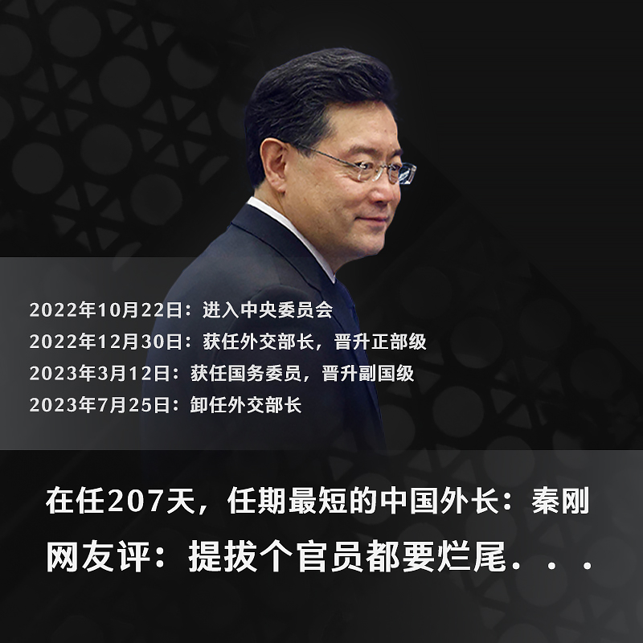
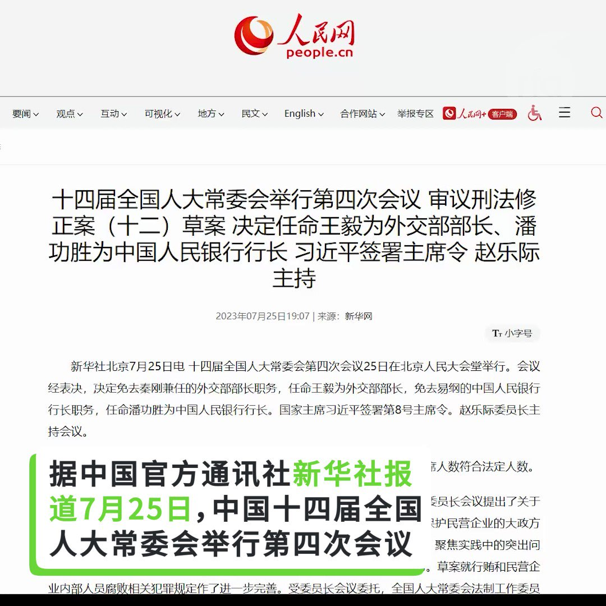

自由亚洲电台 北京时间 2023-07-26T04:33:05Z 1683938442697383936 【原中央警卫局长 #王少军 死后3月才官宣  为什么？】 https://t.co/3FkbdTQIGQ   自由亚洲电台 北京时间 2023-07-26T04:38:48Z 1683939879997128705 美国南方司令部司令劳拉·理查德森（Laura Richardson）将军近日在接受美国《新闻周刊》独家专访时称，中国的影响力已经逼到美国眼皮底下来了。
她分析说，中国不断在努力靠近美国门槛的“红色地带”，亦即中国在加勒比地区、中美洲和南美洲的影响力越来越大。她说，“他们距离我们的本土只有20码，在进攻区内。”她将这种情况与印太地区的情况作比较，说这种情况就像美国印太司令部的第一岛链一样，中国的所有国家权力工具都具备了：外交、信息、军事和经济。
但中国驻美大使馆发言人对外表示，中国在该地区的合作只是为了共同利益，而不是战略游戏的一部分，也不针对任何一方。
理查德森将军还专门提到了中国的一带一路倡议。她说，南方司令部所辖区域31个国家中超过一半都参与了这个倡议；而美国正在与中国投标竞争该地区的一波波基础设施项目。她强调，美国是美洲的一部分，这非常重要，本地区的合作伙伴更愿意与美国合作，美国需要在合适的时间和地点出现。   自由亚洲电台 北京时间 2023-07-26T04:44:17Z 1683941259805880320 继房贷断供，社保断供后，近期，又来个新词“留学断供”。子女大学未毕业，家里就破产。留学生们要么选择留下来艰难自救，要么被迫选择放弃学业回国。
您身边有出现留学断供的朋友吗？
您分析，当下中国，为什么很多家长供不起孩子出国留学了? https://t.co/rieVccHID4   自由亚洲电台 北京时间 2023-07-26T04:46:05Z 1683941714434596864 马斯克将 Twitter 重新命名为“X”后，还宣布未来几个月将创建一款类似于微信万能应用程序，在一个平台内提供各种服务，增加金融交易功能，将推特打造一个综合性的社交平台，并进军支付、银行和商务领域。 https://t.co/2URvFFJtcR   自由亚洲电台 北京时间 2023-07-26T05:00:00Z 1683945218285117440 在消失一个月后，#秦刚 被全国人大常委会正式免去中国外交部长的职务，而由已升任中共中央政治局委员、中央外办主任的 #王毅 接任。
这次为何没有同时撤去秦刚国务委员的职务？秦刚事件对 #习近平 的形象及 #美中关系 又会产生怎样的影响？
本台记者凯迪 @KittyWang5 报道。
 https://t.co/Ul6cRdWcq2   自由亚洲电台 北京时间 2023-07-26T05:30:02Z 1683952776525803524 一只靴子落地：中国政府官宣，外交部长秦刚被免职，现任中共中央外办主任王毅出任外交部长。
更多靴子高悬：秦刚现在哪里？他为何被免职？他是犯了反习的“政治错误”，还是权斗出局？
有网友说，这么不清不楚，只能令中国政府更难堪。您怎么看？ https://t.co/auQ3XyIOxi   自由亚洲电台 北京时间 2023-07-26T02:38:37Z 1683909638427639832 RT @RFA_Chinese: 【黑暗中找光的人: 中国视障律师金希】
https://t.co/dLPQ6jbOGA
来自浙江的金希是中国第一位视障法学硕士，目前在台湾读博士。
尽管中国有8500万身心障碍者，他只有靠自己磕磕绊绊在黑暗中找光。台湾生活打开他的视野，让他深刻…   自由亚洲电台 北京时间 2023-07-26T03:12:46Z 1683918232523243521 海关数据显示，名为Pozitron的 俄罗斯公司2022年11、12月从中国公司“Beijing KRNatural”进口了价值超过6000万美元的“气软头盔”、“陶瓷杂项”等物品。这些产品的描述是非军用，但有国防专家表示，将双重用途商品误标为民用商品是一种常见做法，实际上这些商品是用于战场的。
 https://t.co/8g80QAoagz   自由亚洲电台 北京时间 2023-07-26T03:52:02Z 1683928114173476865 RT @RFA_Chinese: 专栏 | #夜话中南海：傅二奶事小，“秦二世“事大
#秦刚 #傅晓田 

 https://t.co/ynt0UYzSTh   自由亚洲电台 北京时间 2023-07-26T03:53:16Z 1683928422945263617 RT @RFA_Chinese: 专栏 | #夜话中南海：要么下基层，要么进秦城，#秦刚 复出已无半点可能
 https://t.co/oliC1GmHmM   自由亚洲电台 北京时间 2023-07-26T03:58:06Z 1683929638924611591 #秦刚 被免职，#王毅 任中国外交部长，引发海内外舆论哗然及更多追问，主要集中在以下几个方面。
您最关心哪个问题？   自由亚洲电台 北京时间 2023-07-26T04:16:08Z 1683934177048285185 评论 | 王丹 @wangdan1989：#金属战争 开打，中美胜算几何？
 https://t.co/uFUNjW9tEJ   自由亚洲电台 北京时间 2023-07-26T01:06:45Z 1683886518744809473 #陆生 一开始不敢伸手，团长、奥运乒乓金牌选手 #丁宁 拿了书看看封面和背面就往后传给其他学生，之后有团员说“我们统一（拿）吧”，导览老师说统一拿会很重，有五十本大概有二十公斤，最好每个人拿一本，后来还邀请陆生拿着书大合照。
#马英九基金会陆生访团 https://t.co/guGvdkwnmq   自由亚洲电台 北京时间 2023-07-26T02:00:54Z 1683900142976638977 官宣：中国外长 #秦刚 被免职，#王毅 回任。
原因不详，下落不明。《寻秦记》进入下半场... https://t.co/pqLmaSE1ij   自由亚洲电台 北京时间 2023-07-26T02:19:23Z 1683904794576945178 北京独立评论人季风："警察的目的就是维稳，对受害者家属一些情感的压制...早前发声的家长，再也没有发声了...相当一部分官员是不太尊重生命，这样的道歉，难道能够掩盖他们的渎职吗？不追究这样的犯罪，迟早会引起民愤民怨，最后引起群体式的事件。 " #齐齐哈尔
https://t.co/J7BH87Atcl   自由亚洲电台 北京时间 2023-07-26T00:20:16Z 1683874819098701824 随着中国与西方世界的关系恶化，#中国对西方国家的直接投资 规模正在急速缩减，转战东南亚、南美等采矿和能源项目。

此外，中国已在重新考虑“#一带一路”倡议，继续投资发展中国家的基础建设项目。但基于此前该倡议造成的 #债务危机，中国官方希望进行更保守的新项目投资。 https://t.co/Nl3DegE4h6   