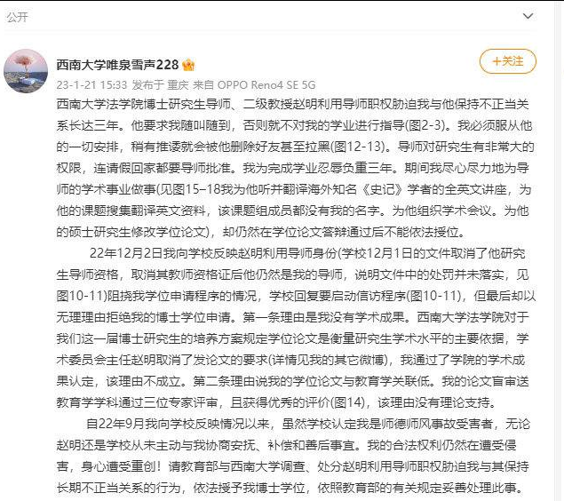
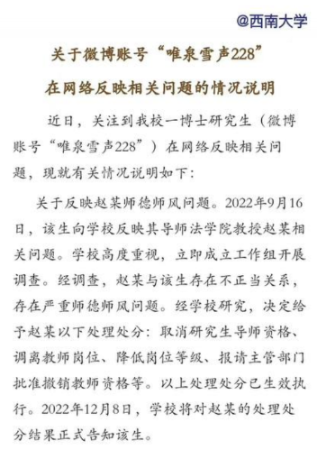
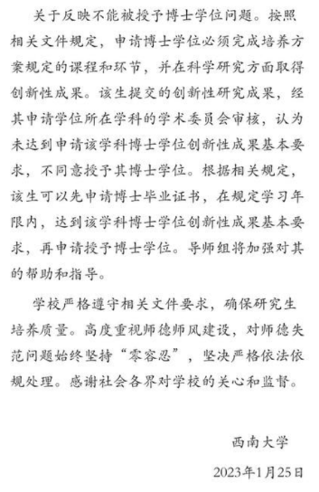

谁将十万横扫三江 北京时间 2023-07-26T07:42:57Z 1683986226175684609 一名重庆西南大学女博士生实名举报导师赵教授，利用职务职权威胁自己与其发生关系， 自己忍耐了3年却依然不能顺利毕业，女博士一怒之下曝光了不雅聊天记录

女博士在导师赵教授的实验室里工作了三年，期间不断被赵教授骚扰，威胁并要求与其发生关系，否则就不让她顺利毕业。为了能够完成学业，这名女博士生忍辱负重，默默承受了三年的骚扰和威胁。此外，她还无偿帮助赵教授完成了大量的学术之外的工作，如打扫卫生、照顾赵教授家人等等。

最终，这名女博士生忍无可忍，一怒之下将赵教授的不雅聊天记录曝光。在聊天记录中，赵教授用露骨的言辞向女博士生表达了自己的欲望，甚至威胁要毁了她的学业和前途。”

该女博士生的举报引起了舆论的强烈关注和谴责。许多人对赵教授的行为表示愤怒和失望，认为他的行为不仅违反了职业道德和职务职责，还对这位女博士生的人身权利造成了严重的侵犯。

赵教授作为女博士生的导师，本应尽职尽责地指导她完成学业，提供学术上的支持和帮助。然而，他利用自己的权力地位，对女博士生施以不当的压力和威胁，使其处于困境之中。

这种性骚扰和权力滥用的行为，在学术界和社会上都是极为严重的问题。许多类似的案件都披露了导师对学生进行性骚扰或性侵犯的事实，这不仅损害了受害者的权益，也对整个学术环境和社会道德造成了不良影响。

同时，女博士生为了能够毕业，不得不默默忍受了三年的折磨和压力，这说明了当前学术界对于性骚扰和权力滥用问题的不足关注和解决。学校和相关部门应该重视这些问题，并采取有效的措施，保护学生的权益，加强对这种行为的预防和打击。

对于赵教授的不雅聊天记录，应该追究其法律责任。这种行为不仅涉嫌性骚扰，还涉及到滥用职权、威胁等严重问题。学校可以与相关部门合作，进行调查和处理，并在法律允许的范围内给予受害者相应的赔偿和保护。

此外，这也应该引起学术界和社会的反思。我们应该加强对导师与学生之间权力关系的监管和约束，建立健全的机制来保障学生的权益和安全。只有在一个公正、公平、和谐的学术环境下，才能培养出更多优秀的人才，推动社会的进步和发展。

总之，这名女博士生的实名举报揭露了一个严重的问题，并引起了公众的关注和讨论。希望学校和相关部门能够重视此事，采取切实有效的措施，保护每一位学生的权益和人身安全，共同维护一个健康、公正的学术环境。   谁将十万横扫三江 北京时间 2023-07-26T12:42:54Z 1684061709957496832 7月25日卓越集团门前讨薪 https://t.co/FtPvDwv8NC   谁将十万横扫三江 北京时间 2023-07-26T07:00:56Z 1683975650661781504 RT @whyyoutouzhele: 网友投稿
7月24日，有媒体报道称，湖南岳阳一男子遭枪击身亡。 https://t.co/0q7eqKKU5a   谁将十万横扫三江 北京时间 2023-07-26T07:59:00Z 1683990262203269120 秦刚根本没担任过外长🤪 https://t.co/mZjjWoqXRm   谁将十万横扫三江 北京时间 2023-07-26T09:21:48Z 1684011101045018624 RT @whyyoutouzhele: 网友投稿
7月25日晚，天津南开小学
因为学校计划9月份让学生搬进还在装修的教室
引发家长对“甲醛”问题的担忧
集体下跪请愿要求换校长。 https://t.co/SdBsM6mbcS   