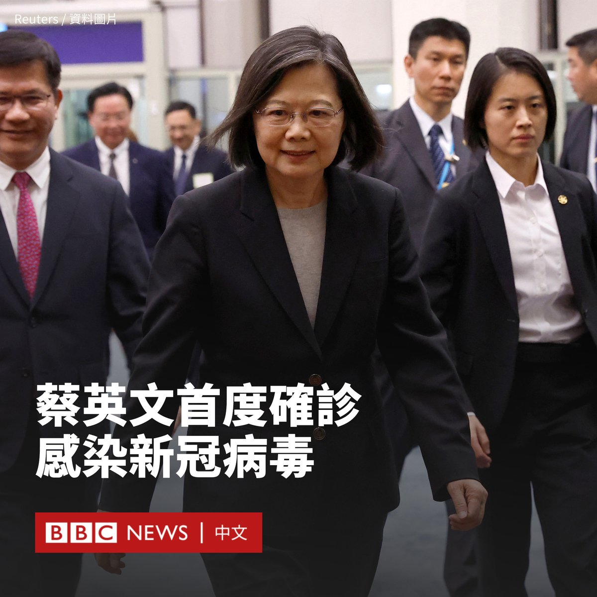
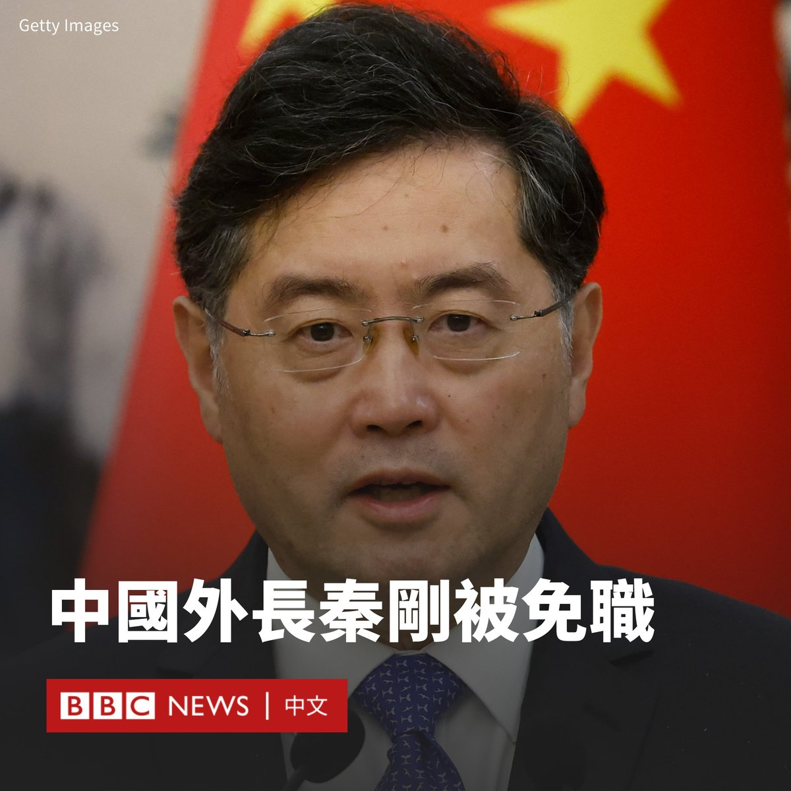
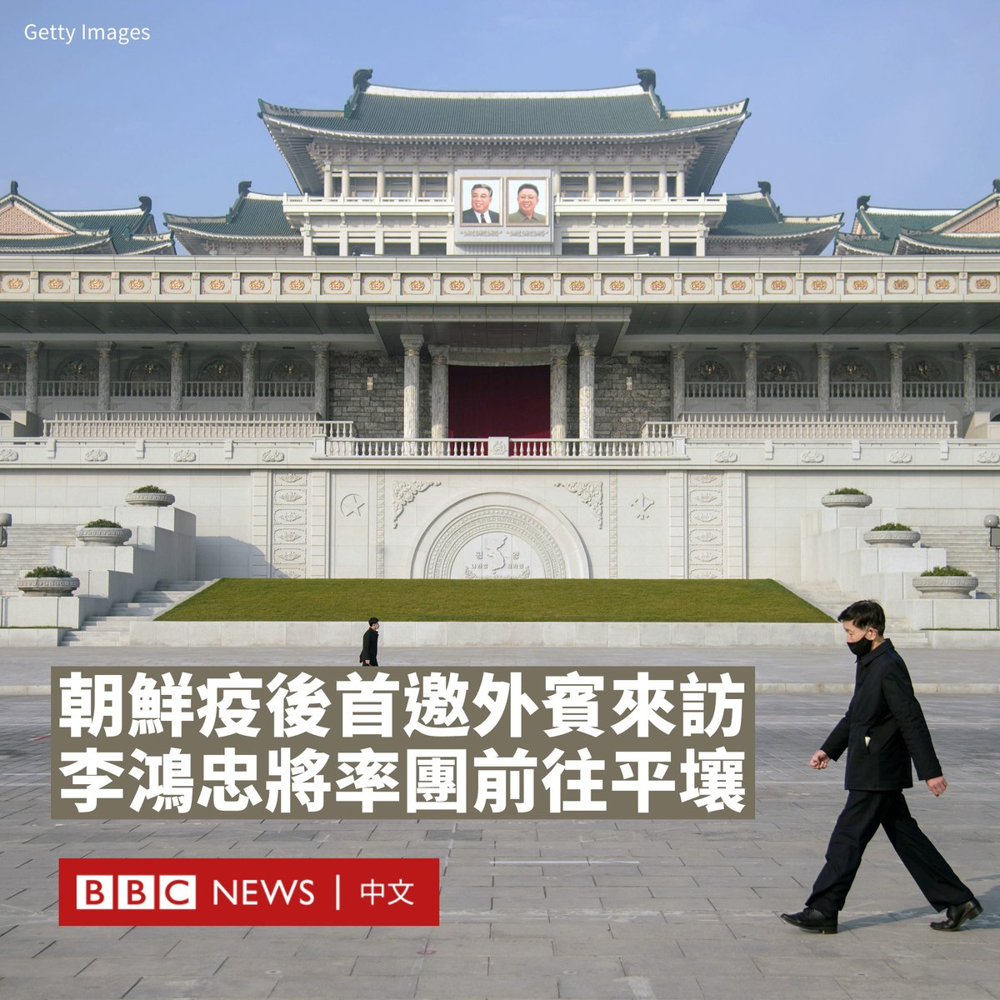
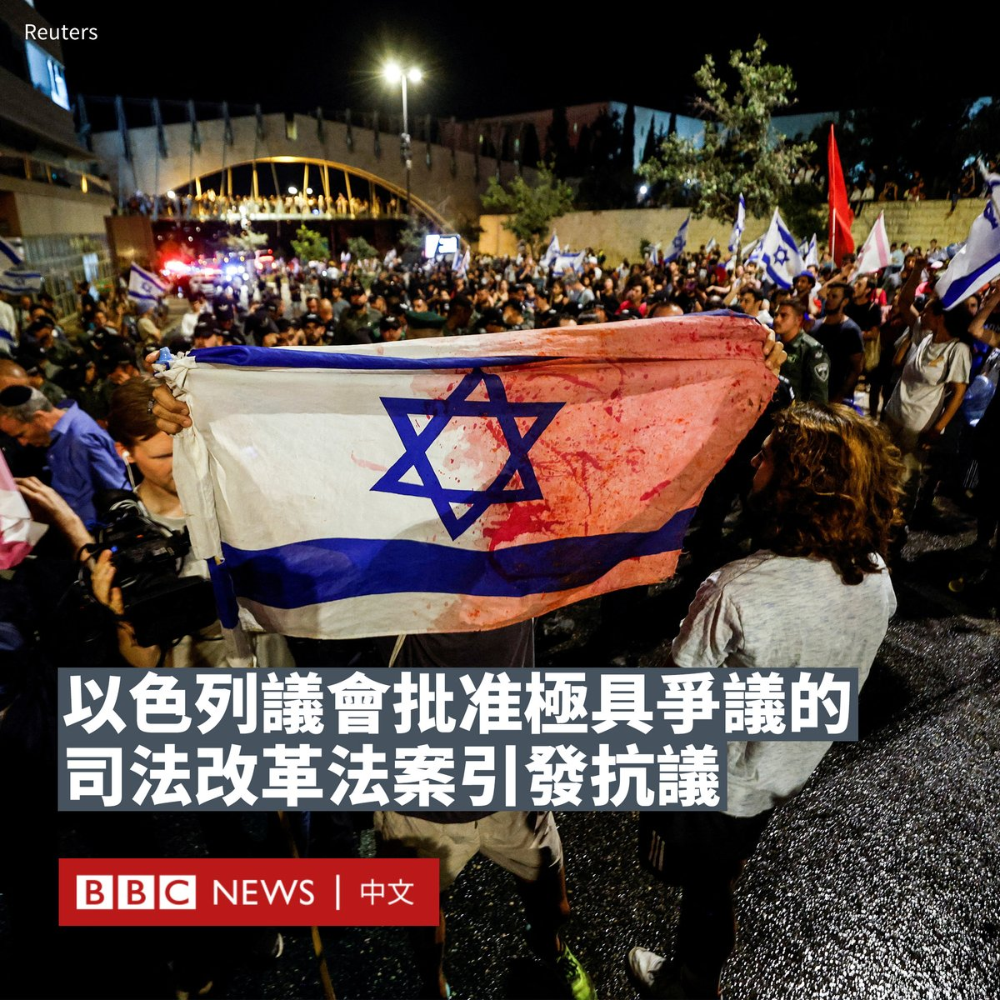
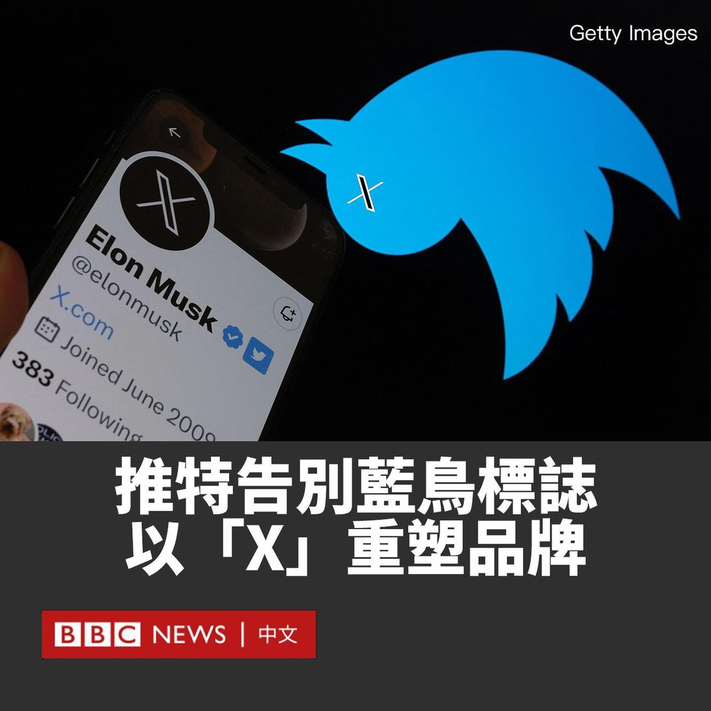
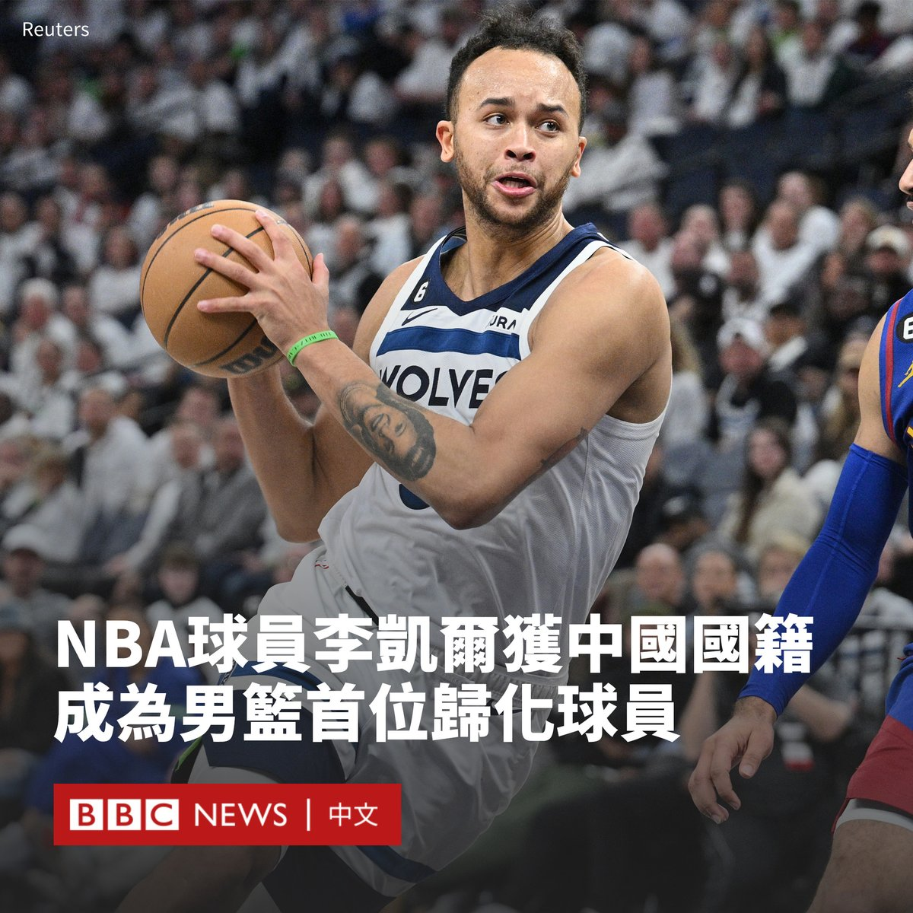

D英国广播公司BBC 北京时间 2023-07-25T16:53:45Z 1683762451471532033 台湾总统府发言人林聿禅表示，蔡英文在周二（7月25日）确诊感染新冠病毒，但症状轻微。

“蔡总统于结束上午行程后，午间略感身体不适，经Covid-19快筛后呈现阳性。”总统府发言人在一份声明中说。

“经医疗团队专业建议，总统取消今日下午公开行程。”声明补充道。“（蔡英文）会依循医疗团队的建议稍事休息，但相关国政公务仍透过执政团队密切掌握。”

据台湾媒体报导，蔡英文周二上午前往台北一家医院，探望了陆军第六军团指挥部辖属基隆弹药分库爆炸事件的伤者。

这是现年66岁的蔡英文首次感染新冠病毒。   D英国广播公司BBC 北京时间 2023-07-25T19:06:17Z 1683795801238298625 【最新消息】中国当局宣布，中国外交部长秦刚被免职，任命现任中共中央外办主任王毅为外交部长。

官方通讯社新华社报道称，中国全国人大常委会周二（7月25日）召开会议作出该决定，但报道并未提及秦刚被免职的原因。

北京周一（7月24日）临时宣布在次日召开全国人大常委会会议。全国人大常委会大约每两个月开会审议立法和报告，在6月结束上一次会议后，原本预计下一次会议应是在8月份举行。

在今天的宣布前，现年57岁的秦刚是半个世纪以来中国最年轻的外交部长，也是中国当前最年轻的副国级干部。

秦刚最后一次公开露面是在6月25日，随后持续缺席多场外事活动。   D英国广播公司BBC 北京时间 2023-07-25T19:33:58Z 1683802767834644480 中国当局宣布，中国外交部长秦刚被免职，任命现任中共中央外办主任王毅为外交部长。

官方通讯社新华社报道称，中国全国人大常委会周二（7月25日）召开会议作出该决定，但报道并未提及秦刚被免职的原因。

中国中央电视台报道说，国家主席习近平随后签署了主席令批准这一决定。但报道并未提及免去秦刚的国务委员头衔。

这是中共“二十大”以来中国政治的罕见一幕。秦刚在去年12月被任命为外交部长，至今仅半年多，这让他成为中共建政以来任职时间最短的外长。

他最后一次公开露面是在6月25日，随后持续缺席多场外事活动。

中国外交部发言人曾在7月11日对记者说，秦刚因“健康原因”不能出席在印尼举行的东盟会议，但该解释后来被从外交部的记者会实录中删去。

在今天的宣布前，现年57岁的秦刚是半个世纪以来中国最年轻的外交部长，也是中国当前最年轻的副国级干部。

他曾被视为是深得习近平信赖的助手，曾任驻美大使。在去年12月被任命为外交部长后，今年3月再被擢升兼任国务委员。

在过去一个月中，秦刚的“消失”引发分析人士和网民们对其下落的猜测。中国高官突然从公众视野中消失通常被视为潜在的麻烦迹象，包括遭遇健康原因或政治上的危机。

北京周一（7月24日）临时宣布在次日召开全国人大常委会会议。   D英国广播公司BBC 北京时间 2023-07-25T17:50:21Z 1683776694522355712 “世界币”（Worldcoin）向人们提供数字货币，代价是人们让自己的眼球被扫描。在这个被称作是“反乌托邦”加密货币项目正式发布的首日，数以千计的人们排队等候自己的虹膜被采集。https://t.co/SUtSYqO3W9   D英国广播公司BBC 北京时间 2023-07-25T15:00:51Z 1683734039285604352 朝鲜官方通讯社朝中社周一（7月24日）报道称，应平壤邀请，中共中央政治局委员、中国全国人大常委会副委员长李鸿忠将率团访问朝鲜, 参加朝鲜战争（韩战）停战70周年纪念活动 。

这是自朝鲜三年前因新冠疫情关闭边境以来，首次邀请外宾团体来访。预计李鸿忠将与朝鲜最高领导人金正恩会面。

中共中央对外联络部发言人胡兆明当天也宣布，应朝鲜劳动党和政府邀请，李鸿忠将率中国党政代表团于周三（7月26日）起访问朝鲜。

在2020年初新冠疫情爆发后，朝鲜迅速关闭边境，停止所有贸易和外交往来，甚至对主要经济和政治盟友中国也不例外。

过去三年，朝鲜没有派员出席各种国际活动，外事活动仅由驻外外交人员代为参加。今年3月，中国驻朝大使王亚军赴平壤履新，成为鲜有的外国官员前往朝鲜的案例。

韩联社分析认为，此次中国代表团访朝可被视为朝鲜结束3年零6个月的被孤立状态，正式开展对外活动的信号。

1953年7月27日，朝鲜和中国军队及以美国为首的联合国军在开城板门店举行签字仪式，宣布朝鲜战争进入停战状态。朝鲜将该日期称作“祖国解放战争胜利纪念日”，预计今年将举行大型庆祝活动。   D英国广播公司BBC 北京时间 2023-07-25T16:23:26Z 1683754820816216065 以色列议会周一（7月24日）无视该国数月来的抗议，通过了一项颇具争议的司法改革法案，对最高法院的权力进行限制，这在该国引发了大规模抗议。

在反对派议员抵制投票的情况下，以色列总理内塔尼亚胡（Benjamin Netanyahu）领导的右翼联盟周一通过了这项法案，其将阻止法院否决它所认为政府不合理的决定。

在以色列各地，数以万计的人走上街头。警察与抗议人群在夜间发生了冲突。耶路撒冷和特拉维夫的警察使用高压水枪驱散堵塞高速公路的示威者。警方称，周一至少有22人被捕。

以色列当局表示，该法案是为了反击最高法院过度干预政治的行为。但批评人士说，这项改革威胁到以色列的民主，让国家走向专制统治。

商界和工会领袖威胁要大规模罢工，数千名预备役军人表示将拒服兵役。而反对派议员们向赞成改革的议员们呼喊“耻辱”。

作为以色列的重要盟友，美国白宫称该法案的通过“令人遗憾”。

这项争议性改革使以色列两极分化，是该国历史上最严重的内政危机之一。自今年年初以来，每周都有数万到数十万示威者走上街头。

一名躺在街上抗议的示威者对BBC说，他是在反抗“独裁统治”。当被问及他将坚守阵地多久时，他说：“我们永远不会投降。”

另一名示威者说：“内塔尼亚胡绑架了这个国家，我担心它会变成一个神权国家。”

以色列多家主流报纸周二（7月25日）刊登了全黑的头版，指责这是以色列民主的“黑暗一天”。《耶路撒冷邮报》报道称，这是抗议组织刊登的广告。

内塔尼亚胡表示，他的联盟将继续与反对党接触，以便就今后的任何司法立法达成协议。   D英国广播公司BBC 北京时间 2023-07-25T13:14:44Z 1683707331350261760 推特（Twitter）已将其标志从经典的蓝鸟变更为“X”，并把推特的网址改成了https://t.co/8yxqa3LTQm。

在推特的网页版本上，“X”已经取代了自2012年开始使用的蓝鸟logo，尽管移动应用程序上尚未使用新标志。

推特所有人马斯克（Elon Musk）称，“推文”（Tweets）的说法也将被替换，帖子将被称为“Xs”。

马斯克在推特的头像也更改为新标志，并在他的个人简介中添加了“https://t.co/8yxqa3LTQm”。

周日（7月23日），马斯克表示他想要改变推特的标志，并发推文说：“很快我们就会告别推特品牌，并逐渐换掉所有的小鸟。”

他在推特上发布了一个闪烁的“X”图像，以及一张“X”标志投影到推特总部外墙的照片。

此前，马斯克已宣布成立“X公司”（X Corp.），该公司预计将成为马斯克其他产品的基础。

马斯克一直想创建一个名为“X”的“超级应用”。他曾谈及希望开发一款类似微信的应用程序的计划。

微信是中国使用人数最多的社交媒体之一，它提供了几乎全方位的服务，包括文字和视讯聊天、文件共享、打车、外卖订餐、网上支付，以及通过“小程序”进一步延展到其他功能。

已成绝响的蓝乌被称为拉里（Larry）。推特的联合创始人比兹·斯通（Biz Stone）在2011年表示，这是对篮球巨星和波士顿凯尔特人队（Boston Celtics）传奇人物拉里·伯德（Larry Bird）的致敬。   D英国广播公司BBC 北京时间 2023-07-25T12:07:13Z 1683690340761366529 俄罗斯宣布中止与乌克兰之间的协议，正受旱灾之苦的非洲国家严肃警告，当地将面临严重粮食短缺。https://t.co/LnKHMxoqCO   D英国广播公司BBC 北京时间 2023-07-25T08:55:24Z 1683642068772462597 在过去的一周，不均衡的教育资源在中国陕西省西安市引发一轮激烈的辩论。家长纷纷向当地教育部门寻求答案，质疑今年该市中考考生中有大量来自其他省份的学生。https://t.co/XFgtiLiOyj   D英国广播公司BBC 北京时间 2023-07-25T09:49:13Z 1683655612444606464 美国NBA球员凯尔·安德森（Kyle Anderson）已获中国国籍，成为中国男篮首个归化球员。

中国篮球协会官方微博星期一（7月24日）发贴称：“欢迎李凯尔！在各方的推动和支持下，李凯尔已于今天上午获得中国国籍，并与中国篮协主席姚明见面。”

李凯尔是安德森的中文名。中国媒体报道说，他的“李”姓是沿用了他外曾祖父的姓氏，据说后者是广东客家人，而他的曾祖母是牙买加人。

“归化李凯尔符合中国法律规定和国际篮联有关规则，而血缘和文化认同是我们相向而行的重要原因。”姚明说。

据中国媒体报道，李凯尔预计将代表中国男篮出战今年8月份举行的国际篮联篮球世界杯（FIBA Basketball World Cup）。

“我很高兴地宣布我将代表中国队男篮出战世界杯。身披中国队战袍，是我的骄傲和荣幸。”李凯尔在微博上发布的影片中说道。

李凯尔1993年9月出生于纽约。在NBA效力于明尼苏达森林狼队（Minnesota Timberwolves）。

获得公民身份后，李凯尔还可以代表中国参加明年的巴黎奥运会。

目前尚不清楚李凯尔是否放弃了美国国籍。中国严格的法律通常禁止公民拥有双重国籍。   