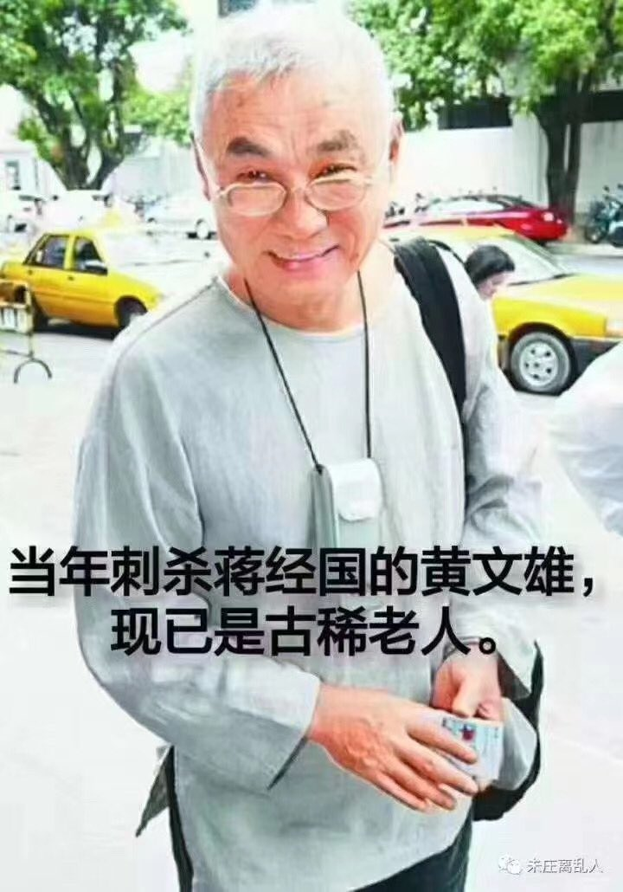
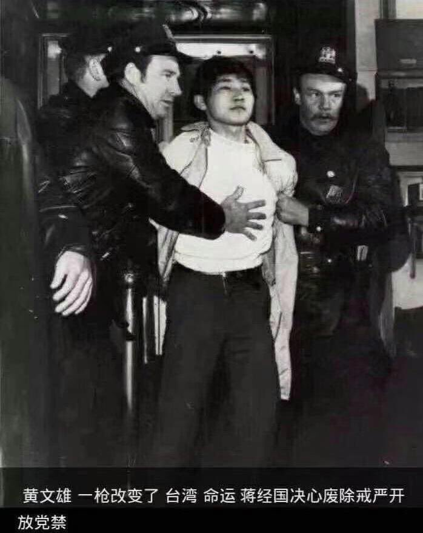

Ivy未央 北京时间 2023-07-25T06:57:05Z 1683612294226354176 转）1970年蒋经国访美遇刺，刺客是台湾3级贫农户，依靠蒋经国推出贫农户子女倾斜政策，上大学并赴美留学。 美国警方对“恩将仇报”的黄文雄提出19万美元的巨额交保侯审费，竟然在三天内被全球的台胞捐款凑齐。无论美方还是台方都猛然醒悟——民心所向， 台湾民主已经不可阻挡! https://t.co/yBovEf55OM   