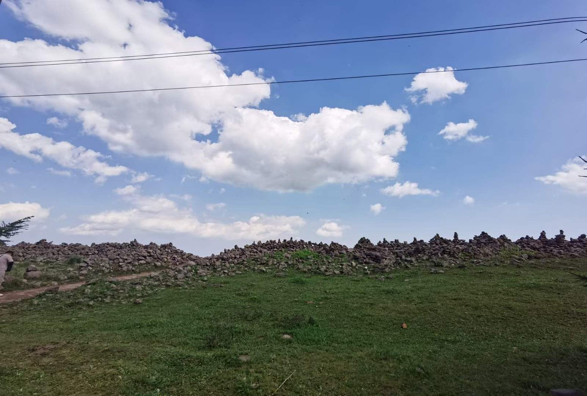
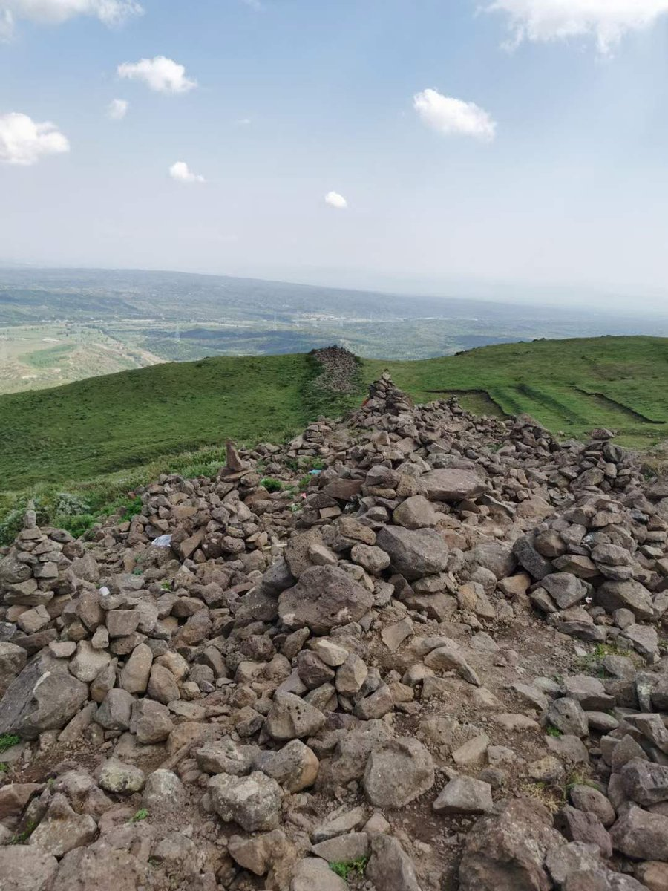
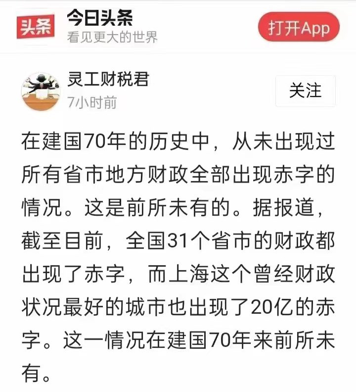
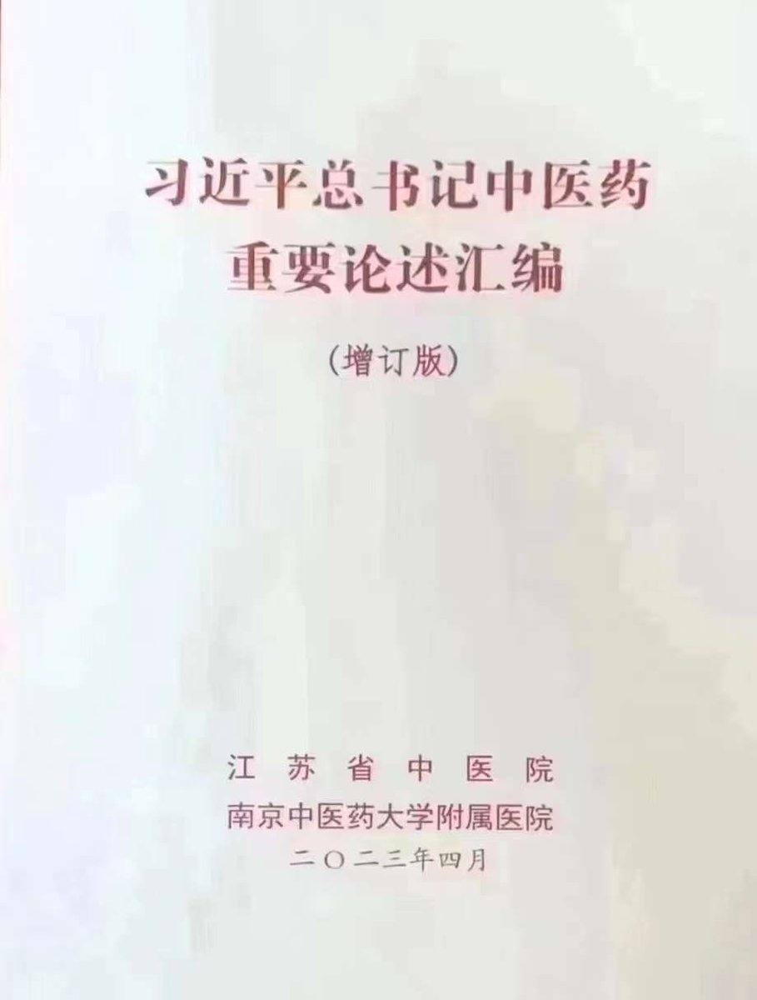
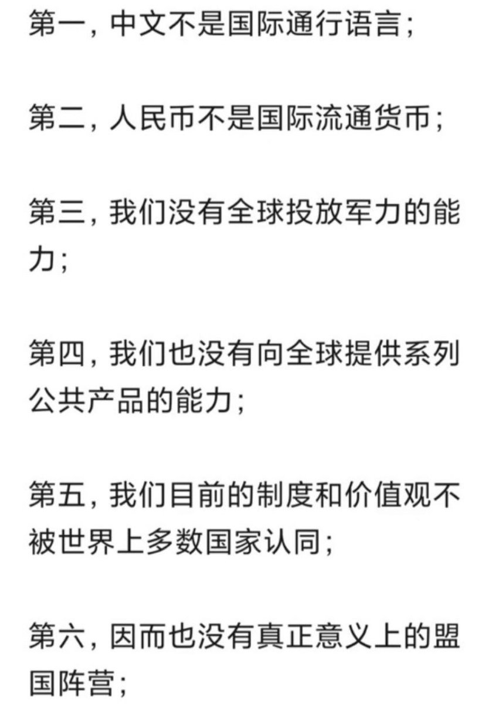
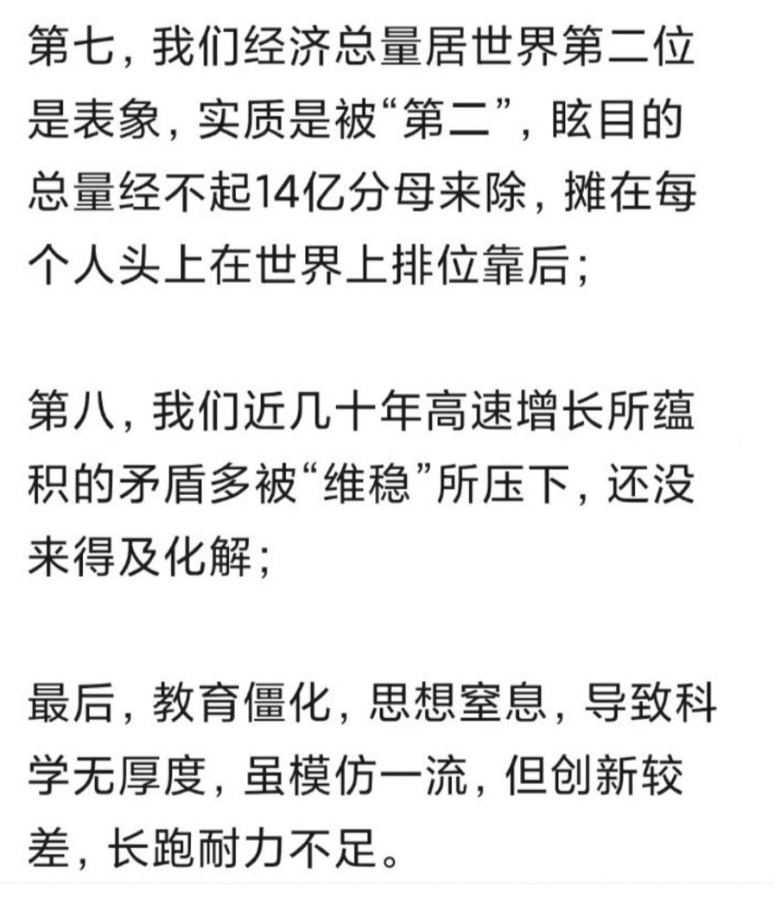
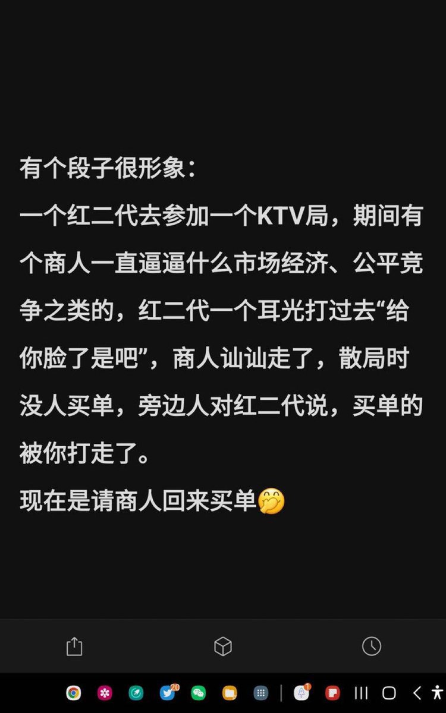

Petrichor 北京时间 2023-07-25T11:13:13Z 1683676750516047872 如果没有人告诉你，面对这堆乱石头，你绝对想不到这是原先的长城，而且是五代（赵、秦、汉、北魏、明朝）长城。“万里长城今犹在，不见当年秦始皇”。何况长城如今也不在了。 https://t.co/7S5fXdbVvm   Petrichor 北京时间 2023-07-25T11:20:37Z 1683678615454482434 领袖英明 https://t.co/JdRsCF2bQk   Petrichor 北京时间 2023-07-25T11:45:41Z 1683684922374995968 这是西人于1939年在江苏无锡太湖边拍摄的影像。觉得那时的人过得还不错，生活悠哉，至少比上世纪中国大陆60年代大饥荒时好，人的服装比文革期间还好。但是，转念一想，似乎有些罪恶感，因为1939年的无锡正被日军占领呢，日本鬼子不是无恶不作、见中国人就烧杀抢掠吗？ https://t.co/cxf0YdUFnq   Petrichor 北京时间 2023-07-25T09:13:05Z 1683646520053186562 齐齐哈尔三十四中女排的最后一堂训练课，开始于7月23日下午1点半。体育馆内共有19人，包括两名排球队教练和17名女排成员，屋顶坍塌前，有4名队员逃出，其余人员被埋在了里面。隔壁建筑工程工地把珍珠岩（多孔火山岩）堆放体育馆房顶，雨水渗进珍珠岩，重量增加造成房顶垮塌。 https://t.co/rAM0rIjyVl   Petrichor 北京时间 2023-07-25T09:36:32Z 1683652421350825984 “遇特殊情况要执行主席面授机宜指示”，这是林彪写给毛泽东一封信里写的。人治的精髓，杀人于无形，最高指示是面授机宜的口头指示，不留痕迹，事后哪有证据？最后有事不是红卫兵就是临时工背锅。 https://t.co/GVQuA8wjHD   Petrichor 北京时间 2023-07-25T09:48:10Z 1683655350031884288 习近平在梁家河村做过赤脚医生？他对以分子生物学为基础的现代西方医学及其最新进展有过论述没有？中医无需医学专业知识，谁都可以侃几句。权力大者侃的就成“重要论述”。 https://t.co/ltLbUyq2v8   Petrichor 北京时间 2023-07-25T02:13:19Z 1683540881003954187 有人列出习近平的人类命运共同体的计划国际上不受待见的9条原因。任何领引该计划的国家必须具有坚强的理论（价值观）基础和科技创新能力，这正是中国目前没有的。如今美国是世界当之无愧的霸主，科技创新遥遥领先，归根到底就是因为美国的制度能培养、吸引和留住顶尖人才。否则领导不会送子女去美国。 https://t.co/6dbvXnD5rk   Petrichor 北京时间 2023-07-25T03:30:06Z 1683560206540718081 转发一个段子，似乎很有道理。但愿企业家或商人有点记性，不要好了伤疤忘了痛。打耳光的手始终高举着，打你们耳光是随时随地的事，就看红二代高不高兴。但话又说回来，为什么这个企业家和商人愿意给红二代捧场？挨打，这不是活该？ https://t.co/NyzdgLgA0b   