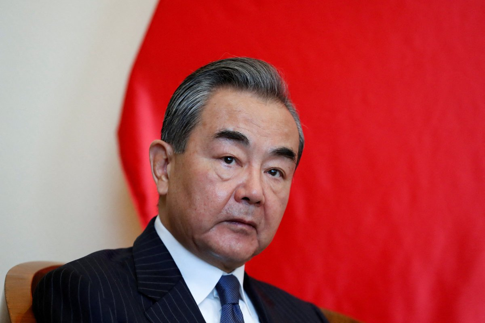
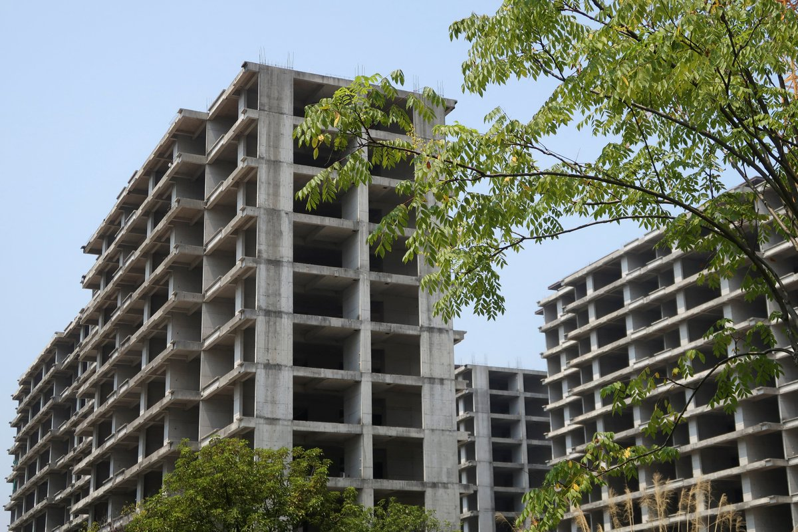

自由亚洲电台 北京时间 2023-07-25T19:25:44Z 1683800696603414528 【秦刚消失满月被免职 王毅回任外交部长】
新华社报道，中国十四届全国人大常委会25日举行第四次会议，审议刑法修正案（十二）草案，决定任命 #王毅 为 #外交部部长、潘功胜为中国人民银行行长。
据新华社，会议经表决，决定免去 #秦刚 兼任的外交部部长职务，任命王毅为外交部部长，免去易纲的中国人民银行行长职务，任命潘功胜为中国人民银行行长。   自由亚洲电台 北京时间 2023-07-25T20:01:34Z 1683809714134568961 RT @RFA_Chinese: 【秦刚消失满月被免职 王毅回任外交部长】
新华社报道，中国十四届全国人大常委会25日举行第四次会议，审议刑法修正案（十二）草案，决定任命 #王毅 为 #外交部部长、潘功胜为中国人民银行行长。
据新华社，会议经表决，决定免去 #秦刚… https…   自由亚洲电台 北京时间 2023-07-25T16:53:20Z 1683762345754112000 【成都警方草木皆兵迎 #大运会】
【严查违禁品 快递货物受限】
第31届 #世界大学夏季运动会 将于本周五在四川成都举行。中国国家主席 #习近平 将出席大运会开幕式。据成都居民及相关人士称，当地政府的 #安保 措施异常严厉，包括路面交通，快递包裹均采取前所未有的防范措施。重点防范民众在此期间发泄不满情绪。
https://t.co/siw2B2ymzR   自由亚洲电台 北京时间 2023-07-25T17:55:30Z 1683777989488836608 【政治局会议担心 #房地产 风险】
【数据：中国新房成交缩水近4成】
房地产的问题已经成为中共口中的“#重点领域风险”。据发一份研究报告显示，中国50个重点城市新房成交面积同比缩水近4成，而且有42个城市交易行情有环比下降态势。分析指，过去房地产高峰期撑起中国GDP近3成，然而，刚性需求不足，价格与销售量具跌，#中国经济滑坡 是必然。
https://t.co/3qiuqitxRr   自由亚洲电台 北京时间 2023-07-25T12:57:11Z 1683702916618629120 RT @RFA_Chinese: 【 #台湾空袭演习】
7 月 24 日，台湾北部各城市进行空袭演习,包括首都台北在内的城镇关闭了30分钟。在北京的军事威胁日益增强的情况下，台湾正在加紧准备，以防中国发动袭击。 https://t.co/kDRyZMsSBs   自由亚洲电台 北京时间 2023-07-25T09:57:21Z 1683657658295787521 RT @RFA_Chinese: 清华北大参观原本免费开放，现在价格却贵过故宫甚至环球影城。据北京商报报道，中国黄牛看准家长望子成龙的名校梦，一家3口参观清华北大等名校喊到要价人民币2000元。透过黄牛预约去清华北大一趟的开销，比环球影城一家三口的门票还贵。您如何看待这类现象？…   自由亚洲电台 北京时间 2023-07-25T10:06:41Z 1683660007512981507 RT @RFA_Chinese: 【在澳港人抗议 #中共渗透校园　中国学联活动被迫腰斩】
澳大利亚布里斯班的 #中国学生学者联合会(CSSA) 7月20日于 #昆士兰大学 举行迎新活动。由于该会被指是中共用作渗透校园的统战组织,故此引来港人学生和校友前来抗议。 https://…   自由亚洲电台 北京时间 2023-07-25T10:07:24Z 1683660186542649344 RT @RFA_Chinese: 7月23日，在音乐圈“沉寂”了多年的歌手刀郎忽刷屏朋友圈、视频号、今日头条、抖音 …
一首原创的《罗刹海市》，歌词信息量巨大，皮里阳秋含沙射影，引发了网友各种解读。有人说他在内涵四位当年羞辱他的明星，有人认为他借古讽今绝不局限于乐坛恩怨。… h…   自由亚洲电台 北京时间 2023-07-25T10:08:10Z 1683660380990754816 RT @RFA_Chinese: 专栏 | #夜话中南海：要么下基层，要么进秦城，#秦刚 复出已无半点可能
 https://t.co/oliC1GmHmM   自由亚洲电台 北京时间 2023-07-25T07:36:40Z 1683622253219708928 韩国警方近日接到超过2000件收到可疑国际包裹的报警。据称，这些可疑邮件最初从中国大陆寄出，途经台湾中转后到达韩国。中国外交部周一（24日）表示，已经收到了韩方的协查请求，正在进行有关调查。

 https://t.co/dE5UAMlqQB   自由亚洲电台 北京时间 2023-07-25T09:39:27Z 1683653154229874688 RT @RFA_Chinese: 7月23日，在音乐圈“沉寂”了多年的歌手刀郎忽刷屏朋友圈、视频号、今日头条、抖音 …
一首原创的《罗刹海市》，歌词信息量巨大，皮里阳秋含沙射影，引发了网友各种解读。有人说他在内涵四位当年羞辱他的明星，有人认为他借古讽今绝不局限于乐坛恩怨。… h…   自由亚洲电台 北京时间 2023-07-25T00:25:10Z 1683513663213404160 中国外交部发言人 #华春莹 24日宣布，国家主席 #习近平 将于7月27日至28日出席成都第31届 #世界大学生夏季运动会 开幕式，为出席开幕式并访华的外国领导人举行欢迎宴会和相关双边活动。
#大运会 

 https://t.co/yeT5ALWhBN   自由亚洲电台 北京时间 2023-07-25T00:55:34Z 1683521316283088898 加拿大通讯社透过《#信息公开法》取得联邦情报谘询委员会在1986年2月公布的一份名为《中国/加拿大：对加拿大华人社区的干扰》的报告。

这份37年前的报告警告：“中国利用公开的政治活动和秘密情报行动来影响和利用 #加拿大华人社区，以实现其经济和政治目的。” https://t.co/e3WwbmIhNC   自由亚洲电台 北京时间 2023-07-25T01:36:37Z 1683531645520084993 台湾 #汉光39号演习 首日传出意外。台湾陆军第六军团发言人史顺文指出，北台湾基隆弹药分库24日下午3点多，在弹药库房外，执行弹药检整作业时，其中一枚120公厘迫炮弹不明原因 #爆炸，造成9名官兵受伤，其中2员伤势较重，已送医急救。

 https://t.co/OS8hNJ7yPk   自由亚洲电台 北京时间 2023-07-25T02:49:30Z 1683549986657816576 #事实查核｜#雇佣兵 为 #乌克兰 作战，收到的薪水竟是假钞？
 https://t.co/YqZ0W4BJ88   自由亚洲电台 北京时间 2023-07-25T03:43:41Z 1683563621928902658 7月23日，在音乐圈“沉寂”了多年的歌手刀郎忽刷屏朋友圈、视频号、今日头条、抖音 …
一首原创的《罗刹海市》，歌词信息量巨大，皮里阳秋含沙射影，引发了网友各种解读。有人说他在内涵四位当年羞辱他的明星，有人认为他借古讽今绝不局限于乐坛恩怨。
刀郎到底在骂谁？《罗刹海市》为什么火？您预测它会被下架吗？   自由亚洲电台 北京时间 2023-07-25T04:09:00Z 1683569992409939968 朝鲜官方通讯社“朝中社”周一（24日）报道称，中共中央政治局委员 #李鸿忠 将于本周率团 #访问朝鲜, 参加 #朝鲜战争停战70周年 庆祝活动 。这是自朝鲜因新冠疫情关闭边境以来，首次宣布进行此类访问。

 https://t.co/y6mddc4CnB   自由亚洲电台 北京时间 2023-07-25T04:12:17Z 1683570819761606656 中共中央政治局周一（7月24日）召开会议，研判中国经济形势和对策。会议认为 #中国经济 处于曲折式恢复阶段，并强调扩大内需、提振信心的重要性。但有 #民营企业家 评论说，现在已经没有多少民营企业家还对中国经济有信心。
本台记者王允 @Jeff23Wang 报道。
 https://t.co/oDPBFpDIcK   自由亚洲电台 北京时间 2023-07-25T04:35:56Z 1683576771877416961 评论 | #唯色：在ADI-Inalco联合举办《#杀劫》英文版在线讨论会上的发言
 https://t.co/Cpzng23oFl   自由亚洲电台 北京时间 2023-07-25T04:58:37Z 1683582481948344327 中国前高校老师王德育博士在接受本台采访时表示，西安考生家长抗议“#回流生”是争夺有限的教育资源，而真正的矛盾被掩盖了。
“（#西安抗议）这个矛盾在有限的程度内发酵一下，掩盖了中国教育资源的最大矛盾：过于向权力和财富的集中。” https://t.co/WplnpNQPlB   自由亚洲电台 北京时间 2023-07-25T05:34:59Z 1683591631994253312 清华北大参观原本免费开放，现在价格却贵过故宫甚至环球影城。据北京商报报道，中国黄牛看准家长望子成龙的名校梦，一家3口参观清华北大等名校喊到要价人民币2000元。透过黄牛预约去清华北大一趟的开销，比环球影城一家三口的门票还贵。您如何看待这类现象？ https://t.co/9Ja2MhLYQD   自由亚洲电台 北京时间 2023-07-25T05:35:44Z 1683591819547013120 专栏 | #夜话中南海：要么下基层，要么进秦城，#秦刚 复出已无半点可能
 https://t.co/oliC1GmHmM   自由亚洲电台 北京时间 2023-07-25T05:43:58Z 1683593894402068480 【#亚太报道（2023-7-24）】
欢迎收听和订阅播客【亚太报道】 https://t.co/MjLNSvVMqc

#齐齐哈尔 一体育馆坍塌 11人遇难 / 政治局开会谈经济 专家警示不要 #翻烧饼 / #西安“回流生”事件的本质 / 江西女子将儿子遗弃香港 / 台湾 #汉光演习 假想敌北部登陆入侵 https://t.co/MIFeWgs0fi   自由亚洲电台 北京时间 2023-07-25T06:29:58Z 1683605470710464512 【 #台湾空袭演习】
7 月 24 日，台湾北部各城市进行空袭演习,包括首都台北在内的城镇关闭了30分钟。在北京的军事威胁日益增强的情况下，台湾正在加紧准备，以防中国发动袭击。 https://t.co/kDRyZMsSBs   