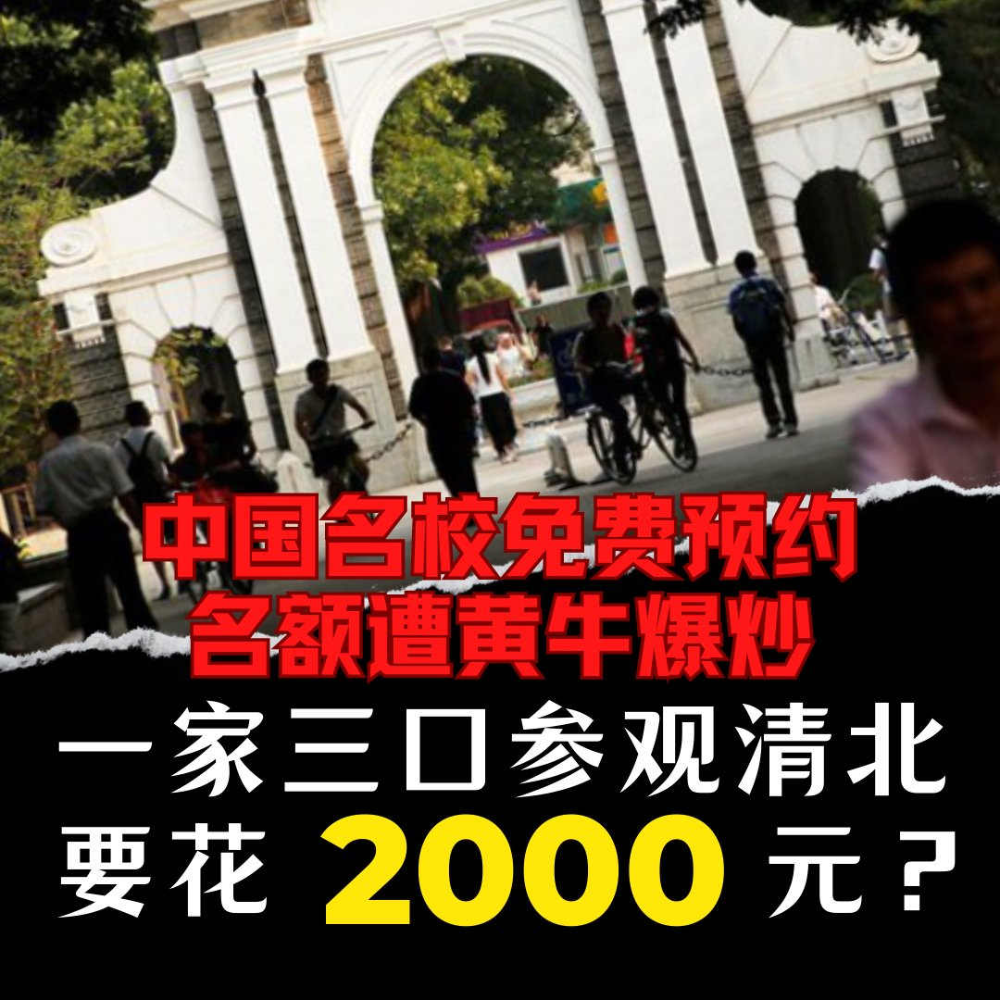
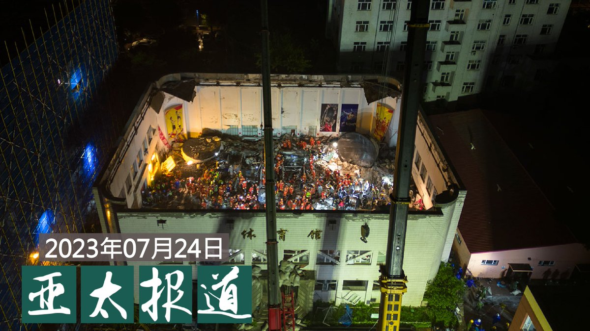
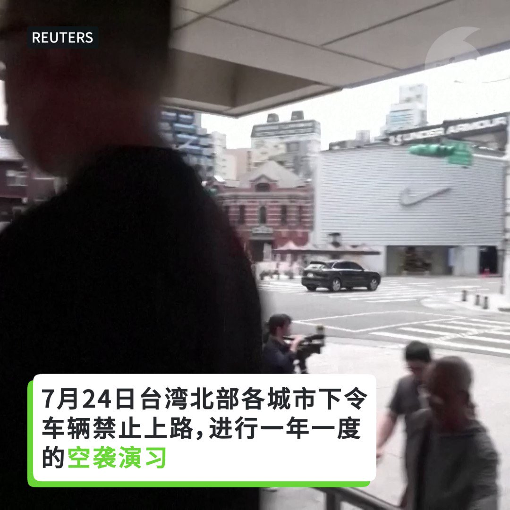

自由亚洲电台 北京时间 2023-07-25T04:12:17Z 1683570819761606656 中共中央政治局周一（7月24日）召开会议，研判中国经济形势和对策。会议认为 #中国经济 处于曲折式恢复阶段，并强调扩大内需、提振信心的重要性。但有 #民营企业家 评论说，现在已经没有多少民营企业家还对中国经济有信心。
本台记者王允 @Jeff23Wang 报道。
 https://t.co/oDPBFpDIcK   自由亚洲电台 北京时间 2023-07-25T04:35:56Z 1683576771877416961 评论 | #唯色：在ADI-Inalco联合举办《#杀劫》英文版在线讨论会上的发言
 https://t.co/Cpzng23oFl   自由亚洲电台 北京时间 2023-07-25T04:58:37Z 1683582481948344327 中国前高校老师王德育博士在接受本台采访时表示，西安考生家长抗议“#回流生”是争夺有限的教育资源，而真正的矛盾被掩盖了。
“（#西安抗议）这个矛盾在有限的程度内发酵一下，掩盖了中国教育资源的最大矛盾：过于向权力和财富的集中。” https://t.co/WplnpNQPlB   自由亚洲电台 北京时间 2023-07-25T05:34:59Z 1683591631994253312 清华北大参观原本免费开放，现在价格却贵过故宫甚至环球影城。据北京商报报道，中国黄牛看准家长望子成龙的名校梦，一家3口参观清华北大等名校喊到要价人民币2000元。透过黄牛预约去清华北大一趟的开销，比环球影城一家三口的门票还贵。您如何看待这类现象？ https://t.co/9Ja2MhLYQD   自由亚洲电台 北京时间 2023-07-25T05:35:44Z 1683591819547013120 专栏 | #夜话中南海：要么下基层，要么进秦城，#秦刚 复出已无半点可能
 https://t.co/oliC1GmHmM   自由亚洲电台 北京时间 2023-07-25T05:43:58Z 1683593894402068480 【#亚太报道（2023-7-24）】
欢迎收听和订阅播客【亚太报道】 https://t.co/MjLNSvVMqc

#齐齐哈尔 一体育馆坍塌 11人遇难 / 政治局开会谈经济 专家警示不要 #翻烧饼 / #西安“回流生”事件的本质 / 江西女子将儿子遗弃香港 / 台湾 #汉光演习 假想敌北部登陆入侵 https://t.co/MIFeWgs0fi   自由亚洲电台 北京时间 2023-07-25T06:29:58Z 1683605470710464512 【 #台湾空袭演习】
7 月 24 日，台湾北部各城市进行空袭演习,包括首都台北在内的城镇关闭了30分钟。在北京的军事威胁日益增强的情况下，台湾正在加紧准备，以防中国发动袭击。 https://t.co/kDRyZMsSBs   