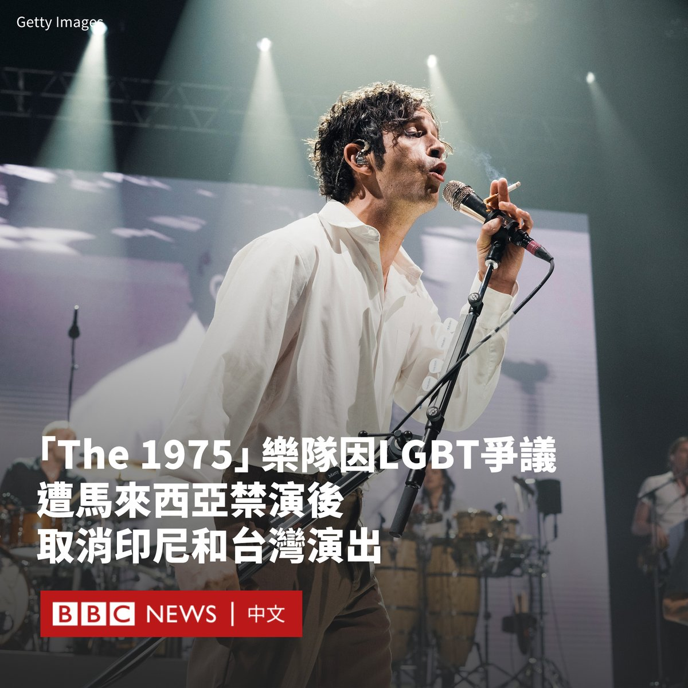
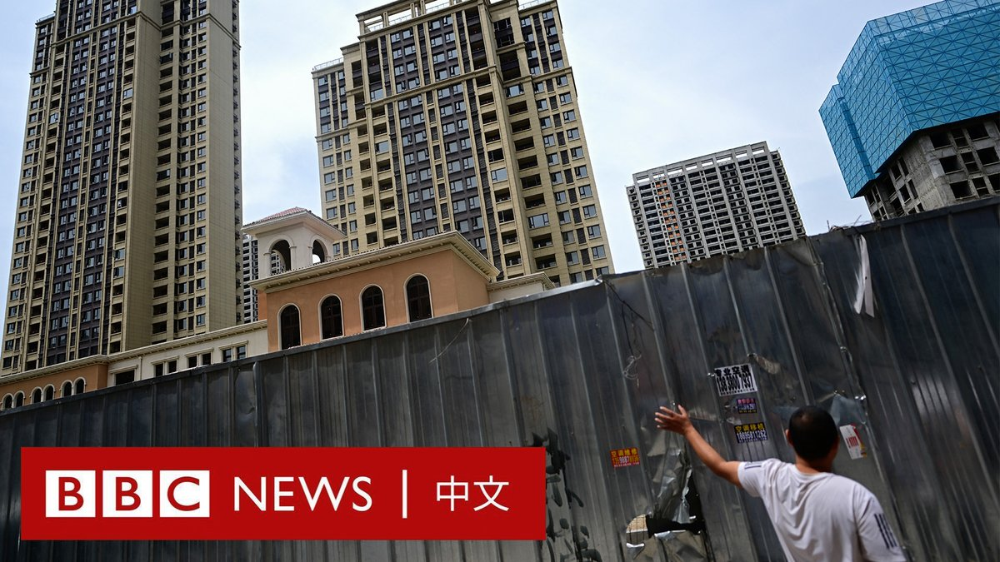
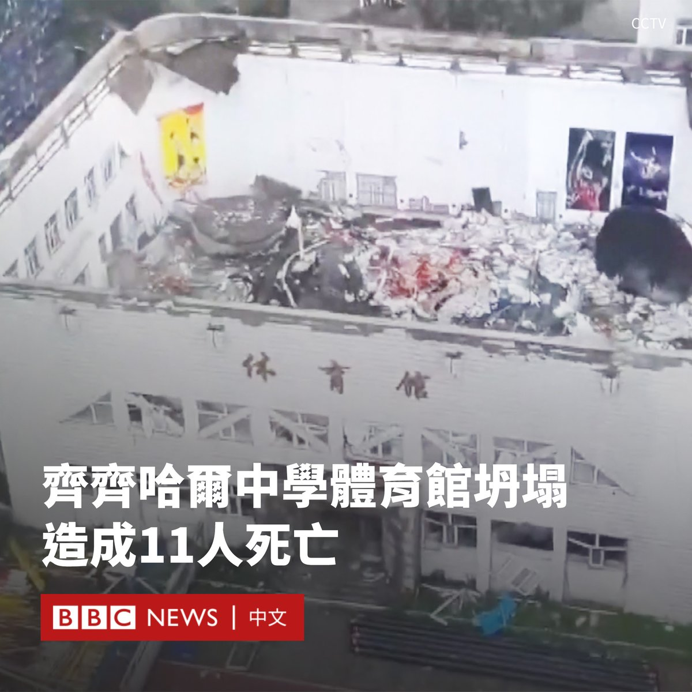
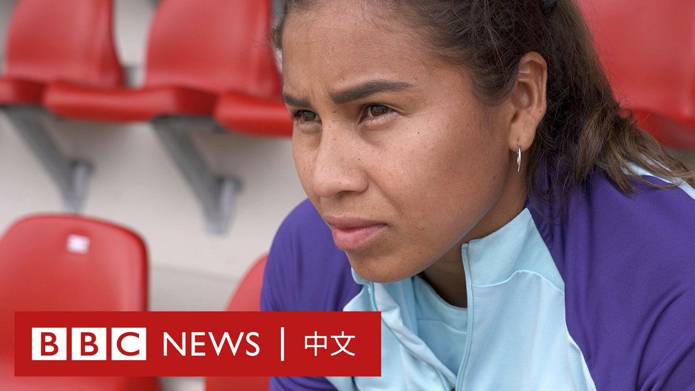
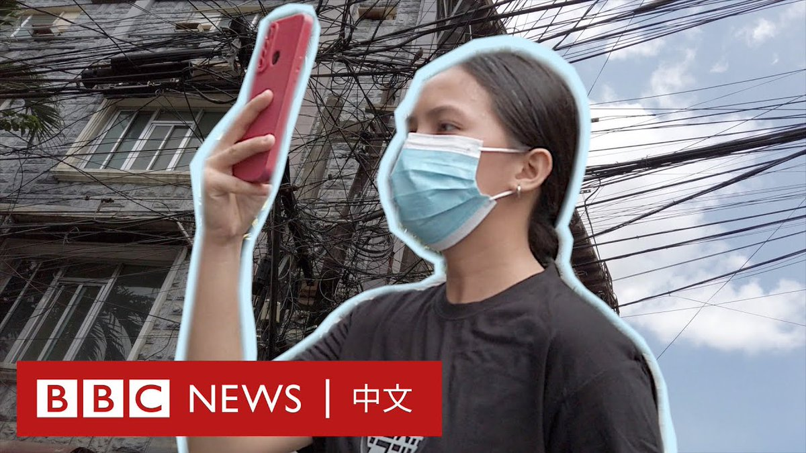

D英国广播公司BBC 北京时间 2023-07-24T17:54:12Z 1683415275851632640 英国流行摇滚乐队“The 1975”因在马来西亚演出引发争议，宣布取消在印度尼西亚和台湾的演出。

“The 1975”主唱马蒂·希利（Matty Healy）上周五（7月21日）在马来西亚演出时，批评了马来西亚的反同性恋法律，并在台上与贝斯手罗斯·麦克唐纳（Ross MacDonald）接吻，该乐队随后被禁止在该国演出。

同性恋在马来西亚是非法的，可被判处20年监禁。  The 1975发表声明表示，由于“目前的情况”，该乐队取消了在印尼和台湾的演出，但未作进一步说明。

在以穆斯林为主的印度尼西亚，同性恋被社会所排斥但并不入罪，不过保守的亚齐（Aceh）是一个例外。

台湾被视为对LGBT群体持开放态度，它是亚洲第一个合法化同性婚姻的地方。

在演出期间，该乐队主唱希利批评马来西亚的反同法律后，他说：“我看不出邀请‘The 1975’到一个国家，然后告诉我们说，我们可以和谁发生性关系的意义”。

“这对你们不公平，因为你们不代表你们的政府。因为你们是年轻人，而我敢肯定你们很多人是同志、进步派，也很酷。”

随着乐队演奏歌曲《I Like America & America Likes Me》，希利吻了他的乐队成员麦克唐纳。

不久后，希利和乐队走下了舞台。主唱告诉观众：“好了，我们刚刚被吉隆坡禁止了，再见。”

周六，音乐节主办方宣布音乐节剩下演出已被取消，其在一份声明中称，这是由于马来西亚数字通讯部的指令。

数字通讯部还下令将“The 1975”列入禁止在马来西亚参与任何演出的黑名单。

“The 1975”原本计划7月25日在台北举办演唱会，主办单位周日（7月23日）在Facebook表示演唱会将取消。

“The 1975从不轻易做出取消演出的决定，并且一直非常期待能于台北与歌迷见面，但很遗憾因目前情况，只能取消原定的演出。”   D英国广播公司BBC 北京时间 2023-07-24T19:21:21Z 1683437207552663552 华纳兄弟公司（Warner Bros.）表示，电影《芭比》（Barbie）在首周末预计赚得1.55亿美元（1.2亿英镑）的票房，成为美国和加拿大今年迄今为止票房最高的电影。

与此同时，环球影业（Universal Pictures）称，电影《奥本海默》（Oppenheimer）在美国的票房为9370万美元。

这两部电影于同一天上映，吸引了超过20万名电影观众在同一天看了这两部风格迥异的电影，它们之间的竞争在社交媒体上被戏称为“芭本海默”（Barbenheimer）。

两部电影组合的票房井喷，也联袂创造了今年以来最强劲的北美本土周末票房，为经历低迷夏季的院线带来提振。

在英国，Vue电影院称，这两部电影使电影院迎来了四年来最繁忙的周末，共吸引了50万观众前往Vue电影院。

《奥本海默》的情节围绕第一颗原子弹的研发展开，由西里尔·墨菲（Cillian Murphy）主演，克里斯托弗·诺兰（Christopher Nolan）执导。

奇幻爱情喜剧片《芭比》（Barbie）则讲述了芭比娃娃与好友肯一起前往真实世界展开大冒险，寻找身份认同的故事，由玛格·罗比（Margot Robbie）和瑞恩·高斯林（Ryan Gosling）主演。

《芭比》的首映周末票房超过了大片《超级马里奥兄弟》（Super Mario Bros）的首映周末票房，使《芭比》成为2023年迄今为止最卖座的电影。据报道，《芭比》全球首映票房收入为3.37亿美元。   D英国广播公司BBC 北京时间 2023-07-24T20:30:14Z 1683454541688078337 香港通讯事务管理局近日提出修例建议，核心内容是广播机构制作涉及国安法及国民教育节目时，不须遵守“持平要求”，因为“持平”可能违反《港区国安法》。新闻界担心此举开启坏先例，进一步收窄言论空间。https://t.co/OxmTHqmA6S   D英国广播公司BBC 北京时间 2023-07-24T22:16:43Z 1683481340459773952 “对于老百姓来说，这其实是很无力的一件事。”

中国多地发生烂尾楼危机后，许多相关房地产项目至今没有复工。一些业主尝试过抵制缴纳月供和去信访办上访，但经过数月的努力，他们仍未得到一个答案。 https://t.co/uDZhFqAxvT   D英国广播公司BBC 北京时间 2023-07-24T12:29:33Z 1683333573007515650 中国东北部齐齐哈尔市一座中学的体育馆的屋顶周日（7月23日）发生坍塌，目前已导致11人死亡。

据官方媒体报道，这座体育馆位于齐齐哈尔市第三十四中学内。官方尚未公布死者的具体身份，但有媒体报道称，遇难者均为该校女子排球队的学生，事发时该排球队正在体育馆内训练。

现场画面显示，这座体育馆整个屋顶倒塌，仅剩四周的墙体，馆内一片废墟。

据报道，事故发生时，体育馆内有19人，四人自行逃脱。

事发后，有近160名消防人员和39辆消防车赶往搜救。

对倒塌事件的初步调查发现，体育馆旁边一栋在建教学楼的施工商把珍珠岩（一种用于建筑的保温隔音材料）放在该馆屋顶上。

新华社的报道补充说，大雨导致珍珠岩膨胀增重，致使屋顶不堪重负倒塌。

广为流传的一段视频显示，有遇难者家长质疑，当局在事发后并未及时向家长告知孩子的情况，而是派出大量警察和官员到现场维稳。

据官方报道，现场搜救工作在周一（7月24日）上午结束，相关责任人已被警方拘留。   D英国广播公司BBC 北京时间 2023-07-24T11:42:14Z 1683321665478971393 莱西·桑托斯（Leicy Santos）出身哥伦比亚的草根家庭，在童年时她为了追求职业足球梦想，她依靠在学校里卖糖果赚钱。

她的付出换来了回报，她成为西班牙足坛最被看好的拉美球员之一。今年27岁她代表哥伦比亚出征女足世界杯。 https://t.co/2IqDLEZygA   D英国广播公司BBC 北京时间 2023-07-24T09:04:10Z 1683281887052300289 Tekkon是一款风格类似“Pokémon GO”的游戏。它正在包括日本和菲律宾在内的亚洲国家掀起一场“街道保卫战”。玩家们可以透过它找到损坏的基础设施，并通过拍照上传而赚钱。 https://t.co/RBcqnlFZUj   