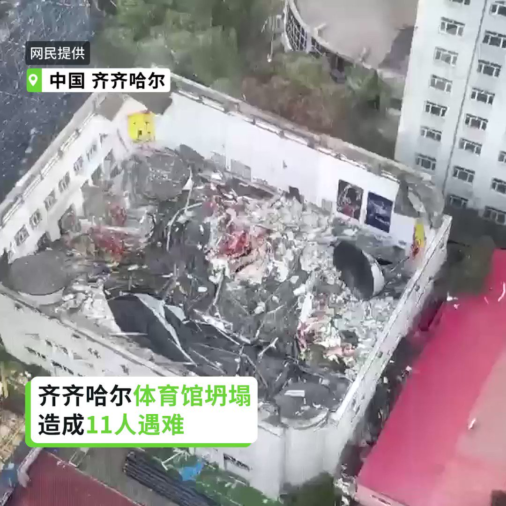

自由亚洲电台 北京时间 2023-07-24T23:49:59Z 1683504812175032320 国民党全代会上，国民党的总统参选人 #侯友宜 和上次拿到500多万票的 #韩国瑜 同框，展现了大和解气氛。有学者研判，蓝营整合七、八成了，只剩 #郭台铭 这个“未爆弹”。

  https://t.co/83PERMcsmH   自由亚洲电台 北京时间 2023-07-24T12:57:32Z 1683340614396694530 【#齐齐哈尔 体育馆坍塌11人死亡】
【家长怒:来了的全是警察防闹事 没人沟通】
央视网报道，黑龙江省齐齐哈尔市第34中学体育馆屋顶坍塌事故，据救援指挥部表示，至24日上午10时，最后一名被困学生已搜救到，已无生命体征。此次事故共造成11人死亡，事故调查工作正全面推进。
网上视频显示，有心急的家长怒斥，只看到警察来维稳，政府和医院都没有及时通报抢救孩子的情况。家长说：“没有一个沟通，现在已经明确第一个孩子没了，我着急了，我跟警察说，我说你跟医生跟我们沟通一下，没人沟通，警察来是执勤的，防止有人闹事。”   自由亚洲电台 北京时间 2023-07-24T10:41:19Z 1683306337382330369 RT @RFA_Chinese: 黑龙江省齐齐哈尔市第三十四中学体育馆屋顶，23日下午突然发生全面坍塌，现场据报有10余人被困。至下午5时30分已有8人被救出，现场救援仍在进行。

 https://t.co/RFjDuEABhY   自由亚洲电台 北京时间 2023-07-24T10:41:44Z 1683306442286157825 RT @RFA_Chinese: 美国学者根据中国 #解放军火箭部队 基地公开的卫星图像，发布报告说中国在台湾附近广泛部署 #东风17中程弹道导弹，部分导弹距台更仅约400公里。此举可能是企图在冲突发生时，将台湾获得预警的时间减到最少。

 https://t.co/n5kWn…   自由亚洲电台 北京时间 2023-07-24T03:37:33Z 1683199693122158592 RT @RFA_Chinese: 【欢迎加入自由亚洲电台电报群】https://t.co/UkKZmFSRkG https://t.co/Qid2LNZxJn   自由亚洲电台 北京时间 2023-07-24T01:22:31Z 1683165710426738690 黑龙江省齐齐哈尔市第三十四中学体育馆屋顶，23日下午突然发生全面坍塌，现场据报有10余人被困。至下午5时30分已有8人被救出，现场救援仍在进行。

 https://t.co/RFjDuEABhY   自由亚洲电台 北京时间 2023-07-24T01:48:19Z 1683172202387046402 RT @RFA_Chinese: 秦刚消失，墙内网民有兴趣吗？路透社近日的一篇报道中指出，平台数据显示，过去一周，百度搜索引擎上“秦刚”的搜索量增长了28倍，达到每天超过38万次。

路透社说，一些外交官甚至开始猜测谁可能取代秦刚，其中三人告诉路透社，7月21日参加了金砖国家外…   自由亚洲电台 北京时间 2023-07-24T01:49:12Z 1683172423997218818 RT @RFA_Chinese: 世界大学生运动会7月28日将于四川成都揭幕。海内外网传“成都大运会白纸革命活动召集帖”，号召民众在赛事期间进行快闪抗议活动，“抗议习近平的倒行逆施，腐败独裁”，网上称之为“白纸2.0运动”。
您认为这样的行动有意义吗？预测会有什么效果？ htt…   自由亚洲电台 北京时间 2023-07-24T01:49:38Z 1683172534055829510 RT @RFA_Chinese: 原定7月10日上线的励志网剧《我的中国芯》出师未捷，上映前夕被临时叫停。… https://t.co/8FR14Bzvdw   自由亚洲电台 北京时间 2023-07-24T01:50:13Z 1683172681774952449 RT @RFA_Chinese: 【谁说我是 #独裁者？｜“#动物庄园”动画剧场】
⻰家宪法第一章写得明明白白,⻰家的政体是“#人⺠⺠主专政 ”——people's democratic dictatorship。
问题来了，既然是广大人⺠的无产阶级独裁, 为什么又变成大红龙一…   自由亚洲电台 北京时间 2023-07-24T01:50:27Z 1683172738448367616 RT @RFA_Chinese: 近日，中国共产党发布统计公报，宣布党员人数达9804.1万名。其中，2022年30岁以下党员数量和2021年相比减少15%。
您有分析，中国青年的入党人数为什么减少了？ https://t.co/b1G3sDIg3P   自由亚洲电台 北京时间 2023-07-24T00:03:47Z 1683145897075695616 美国学者根据中国 #解放军火箭部队 基地公开的卫星图像，发布报告说中国在台湾附近广泛部署 #东风17中程弹道导弹，部分导弹距台更仅约400公里。此举可能是企图在冲突发生时，将台湾获得预警的时间减到最少。

 https://t.co/n5kWnC9ckf   