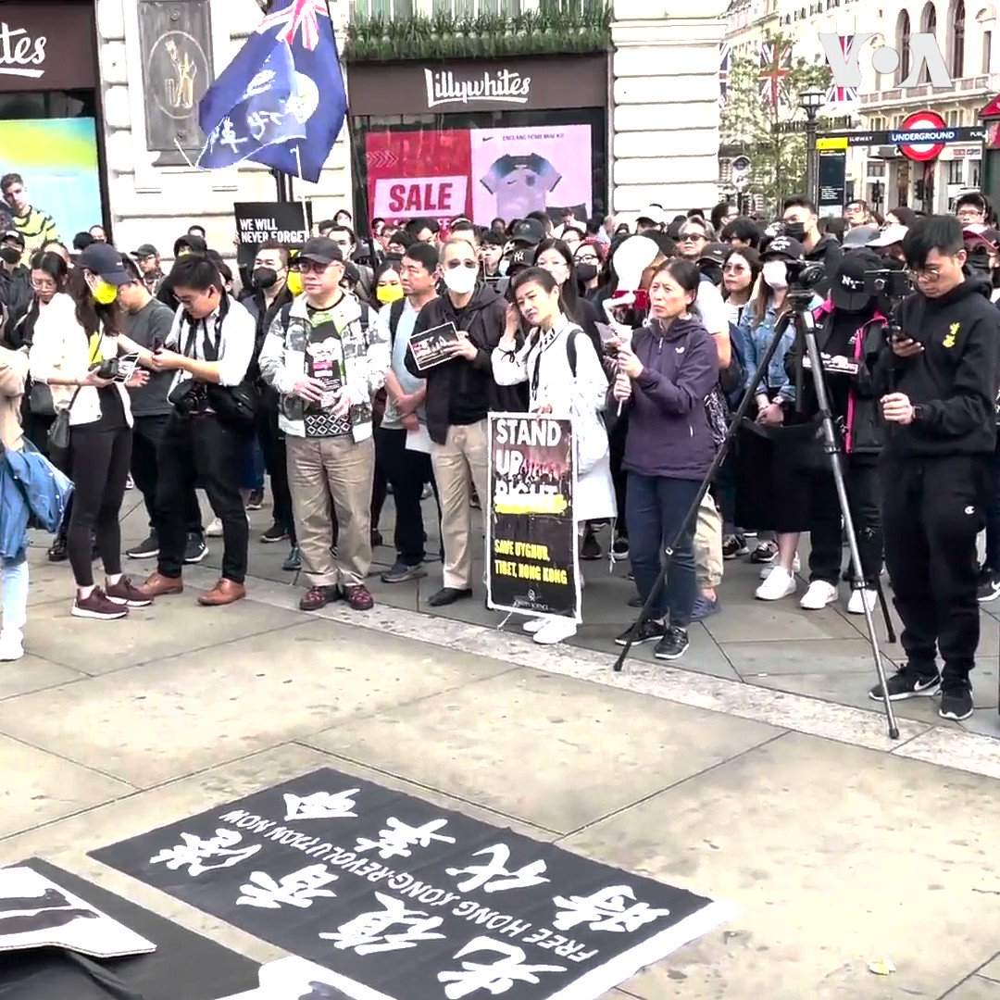

美国之音中文网 北京时间 2023-07-23T20:13:24Z 1683087919802662912 台湾在野党国民党23日召开全国代表大会，提名新北市长侯友宜2024年参选总统。侯友宜誓言要捍卫台湾的民主与自由，让台湾远离战争。目前多数民调显示侯友宜落后于民进党候选人赖清德和民众党候选人柯文哲。 https://t.co/3Cpg69WWHY   美国之音中文网 北京时间 2023-07-23T17:23:04Z 1683045053986664450 经济增长与能源安全困境下 中国“双碳”目标面临挑战 https://t.co/gEHu3fIx59   美国之音中文网 北京时间 2023-07-23T17:38:07Z 1683048841300549633 共同社：王毅提议中日韩举行高层会谈 https://t.co/u3jtzsh2FO   美国之音中文网 北京时间 2023-07-23T18:11:06Z 1683057138774712328 台湾国民党召开全代会 总统候选人侯友宜高喊“让台湾远离战争” https://t.co/l3FntChM47   美国之音中文网 北京时间 2023-07-23T15:31:36Z 1683016999646138371 压制反对派和批评人士 柬埔寨首相洪森笃定在大选中以压倒性优势获胜 https://t.co/745Om2Cfgq   美国之音中文网 北京时间 2023-07-23T10:08:03Z 1682935577174499328 在莫斯科警告勿侵略盟友白俄罗斯后 普京在莫斯科会晤卢卡申科 https://t.co/M4ZL5gYn1c   美国之音中文网 北京时间 2023-07-23T07:24:04Z 1682894310545723392 国事光析：吃瓜奏鸣曲-“秦刚在哪里” https://t.co/fS05d7SCRC   美国之音中文网 北京时间 2023-07-23T07:54:06Z 1682901867196739585 泽连斯基同北约秘书长讨论恢复粮食运输的方法 https://t.co/J8zTyYb6kA   美国之音中文网 北京时间 2023-07-23T09:00:01Z 1682918454242713600 “我们是一个独立的商会，怎么能搞成一个中共在美国的党支部一样呢？”现居纽约的前律师钟锦化因为发表批评共产党的言论，被当地华人商会踢出了领导层。他说，很多华人社团为了利益，必须表现得很亲共、很爱国，唯统战部马首是瞻。 #原声带 视频完整版：https://t.co/oyubnKfYJ8 https://t.co/krGxPjbAEN   美国之音中文网 北京时间 2023-07-23T09:39:25Z 1682928370080964608 #美中对标 中国热点对标美国论据，用一杯咖啡的时间聊聊中国热点的美国冷思考。中国外交部长失踪接近4周，国际舆论普遍关注他的下落。本期视频对比美中两国公务信息透明度：为何在美国《信息自由法》可以保障公民对政府公务的知情权，避免无意义的猜猜猜。 https://t.co/TNTh74X3u5   美国之音中文网 北京时间 2023-07-23T05:10:06Z 1682860594175840256 以色列人大规模游行，要求政府停止司法改革 https://t.co/wcY4NM5vFq   美国之音中文网 北京时间 2023-07-23T05:23:34Z 1682863985287372803 外交无突破，美中之间只能走向“零和”？ https://t.co/p5yYmakhDi   美国之音中文网 北京时间 2023-07-23T03:00:00Z 1682827855942627329 跟毛时代相比，习的个人崇拜一直不温不火，比如颂扬习近平的歌曲一直没有推广，“领袖”的封号也不见完全落实。为什么习近平的个人崇拜无法到达毛泽东的地步？是习近平谦虚，不提倡推广他自己的威望和功绩？美国汉学家林培瑞教授说，肯定不是。#纵深视角完整版：https://t.co/LCJyALNvFI https://t.co/E9GCopELzS   美国之音中文网 北京时间 2023-07-23T03:27:03Z 1682834659581784067 泽连斯基：克里米亚大桥是合法目标 https://t.co/OWCJ3QR43P   美国之音中文网 北京时间 2023-07-23T04:11:40Z 1682845889281540096 示威人士试图冲进巴格达绿区，抗议丹麦焚烧古兰经 https://t.co/NLvUD4ccVf   美国之音中文网 北京时间 2023-07-23T01:08:25Z 1682799773416300546 印尼当局21日宣布将终止在苏拉威西岛的一个市场买卖猫狗肉。这是当地和世界活动人士多年来努力的结果。致力于动物保护的国际人道组织HSI说托莫洪极端市场The Tomohon Extreme Market 将成为印尼这类市场中第一个禁止买卖猫狗肉的市场。国际人道组织将把幸免于被屠宰的猫狗送到庇护机构。 https://t.co/Ai9EN9CiFF   美国之音中文网 北京时间 2023-07-23T01:24:24Z 1682803796026482688 在英国伦敦，民众在市中心皮卡地利广场纪念2019年7月21日香港元朗港铁站发生的白衣人无差别袭击抗议者和市民的事件。他们高呼抗议口号，并且播放香港电台在2020年制作的相关调查报道。示威者摆出数个人型展板，包括与白衣人握手的立法会议员何君尧、时任及现任保安局局长李家超及邓炳强。 https://t.co/VUjgcZwC6s   美国之音中文网 北京时间 2023-07-23T01:55:06Z 1682811522202959872 2023女足世界杯中国迎战丹麦，此时中国足协又传出令人沮丧消息 https://t.co/efJXJ6HfIZ   美国之音中文网 北京时间 2023-07-23T02:09:06Z 1682815044705488896 721元朗袭击事件四周年 民众在伦敦举行纪念活动 https://t.co/k6tQ8q5mQ1   美国之音中文网 北京时间 2023-07-23T00:15:04Z 1682786345905958913 堪比“五毛洗地、水军漫灌” 推特中文圈诈骗黄推成灾降低用户参与政治讨论积极性 https://t.co/POddWZZW35   