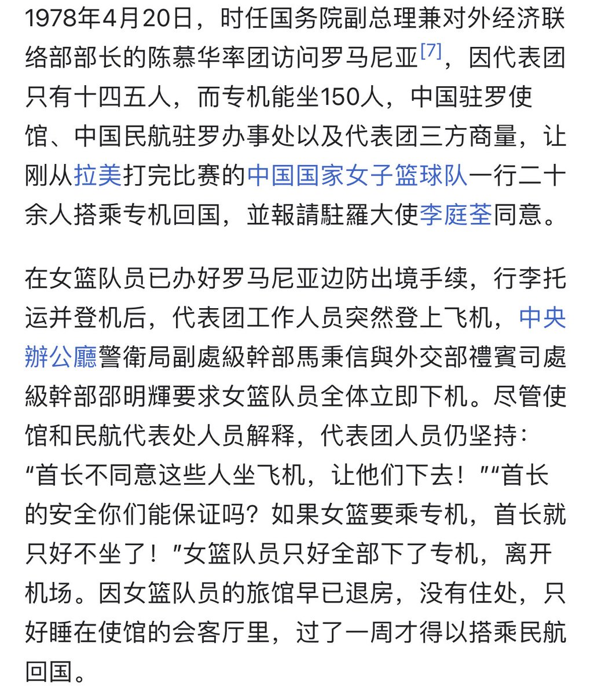
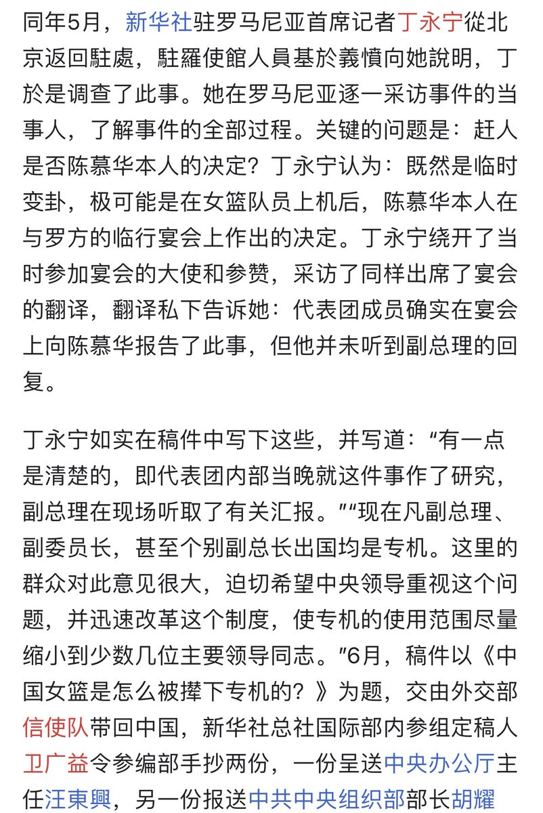
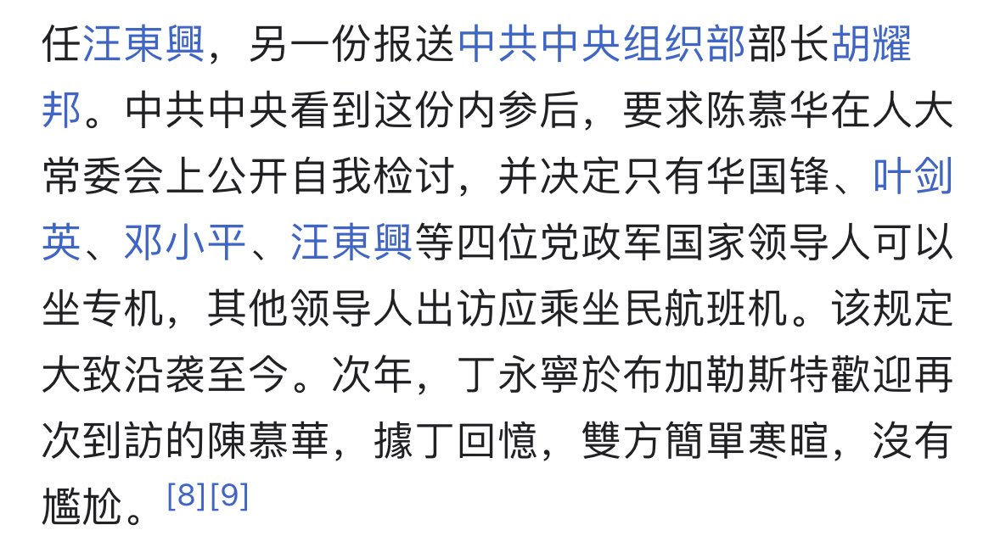
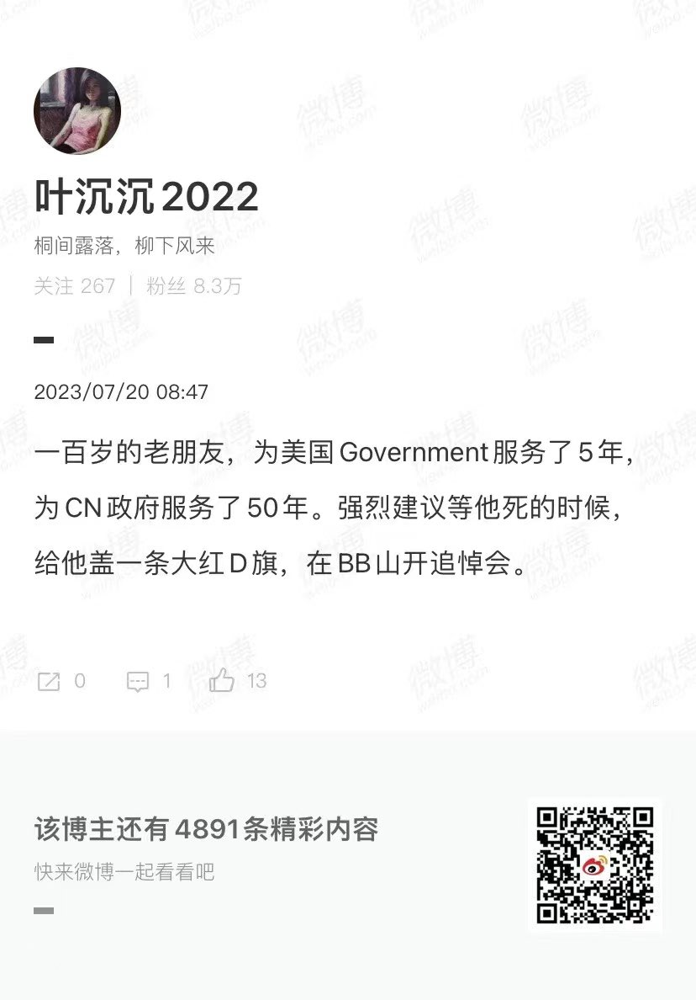
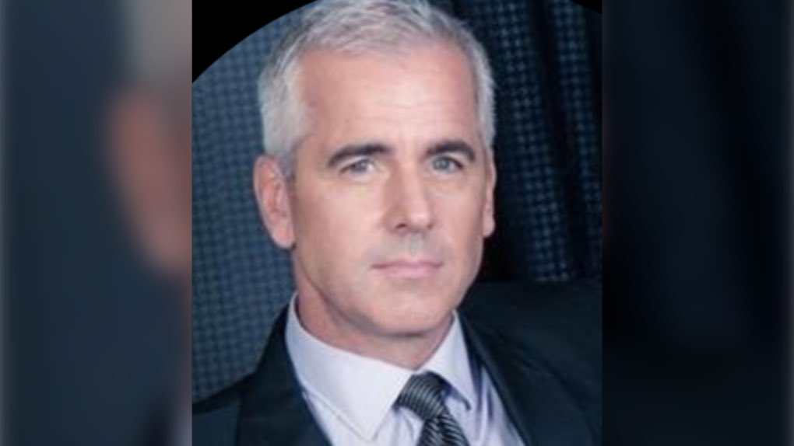

Petrichor 北京时间 2023-07-22T10:16:41Z 1682575362176188416 陈慕华做副总理的1978年，出现专机风波，她被迫在人大常委会上做检查。是新华社一名叫丁永宁的普通女记者，写了稿子“捅了天”：中央由此开会决定：严格控制专机的使用人数，取消副总理级的专机。 https://t.co/kfLYKctJNh   Petrichor 北京时间 2023-07-22T08:52:12Z 1682554099923918848 “中国人啊，请善待自己的同胞”。 https://t.co/mjqOKb2mjt   Petrichor 北京时间 2023-07-22T05:52:11Z 1682508798076895232 基辛格一百岁坐十几个小时的飞机，冒着生命危险是为了什么？可能这是他最后一次去中国了。虽然要“力挽狂澜”，但包含了诸多不祥之兆。指望一个美国人去站在你中国的利益考量问题，指望一个没有公职没影响力的人力挽狂澜，是不现实的。解铃还须系铃人，破坏中美关系的罪魁祸首没了，关系会自然改善。 https://t.co/CumRh2bRI9   Petrichor 北京时间 2023-07-22T03:27:10Z 1682472302145949696 William Majcher是加拿大一名退休皇家骑警探员，今年60岁，最近被捕，被指控充当外国代理人，帮助中国政府“识别并恐吓”一些人。加拿大皇家骑警的新闻稿称：“马伊彻被控利用他的知识和在加拿大的广泛联系网络，在法律容许范畴外为中国获取情报或服务。” https://t.co/YgOgkQWJAD   