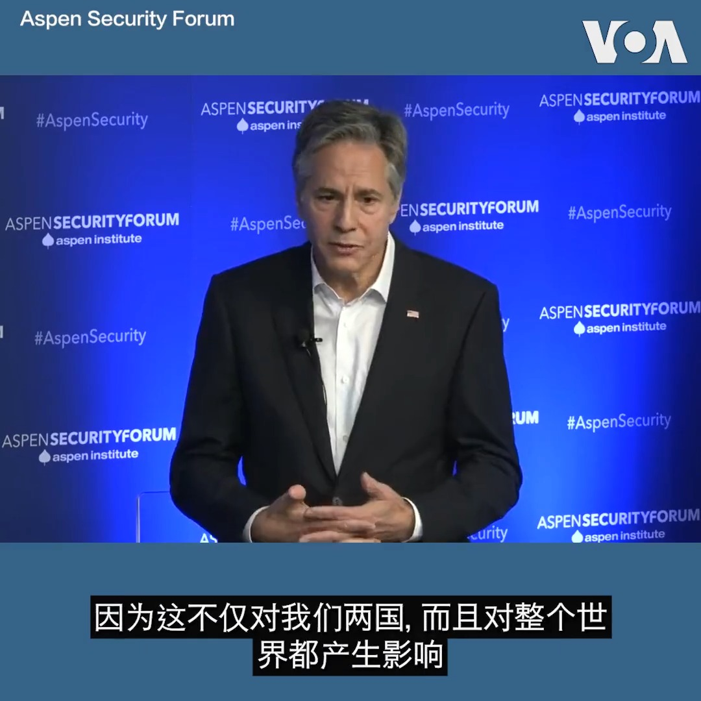
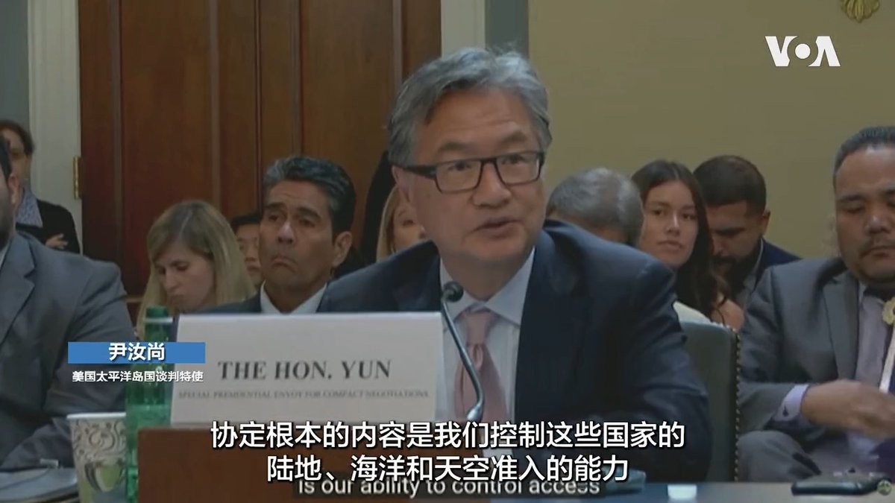

美国之音中文网 北京时间 2023-07-22T08:12:12Z 1682544034995408896 英国警方就袭击香港人事件起诉中国学生“种族主义严重袭击” https://t.co/DHiHmqcTvl   美国之音中文网 北京时间 2023-07-22T08:27:34Z 1682547899794874370 韩国军方：朝鲜发射数枚巡航导弹 https://t.co/8GFvFxDHyQ   美国之音中文网 北京时间 2023-07-22T08:55:34Z 1682554948075270145 连续攻击黑海港口后，俄罗斯袭击乌克兰粮食储存设施 https://t.co/PhdutmrmJZ   美国之音中文网 北京时间 2023-07-22T08:55:38Z 1682554962549825536 沙利文：中国认为两国关系“不绑安全带”可能更安全 https://t.co/HY1toBoCOT   美国之音中文网 北京时间 2023-07-22T09:00:01Z 1682556065995534338 一键解锁#美国热搜 榜：1、谢峰、毛宁被问及秦刚在哪，笑容诡异含深意2、习近平收起獠牙释善意，私企老板记吃还是记打？3、中共救经济就是封禁财经言论4、皮尤调查：为什么华人多是恨国党？5、中国经济新三驾马车：统计局、网信办、新华社6、成都大运会变态安防7、李毅骂中共大撒币不要脸 https://t.co/J9cBuSkPD3   美国之音中文网 北京时间 2023-07-22T09:02:49Z 1682556772115181568 美国国务卿布林肯周五在阿斯彭安全论坛上说，前国务卿基辛格在去中国访问前与他进行了详谈。他还为拜登政府与中国的最近接触进行了辩护。他说，接触是为了其建立一个底线，以确保竞争不会陷入冲突。在美国，包括国会议员在内的一些人认为拜登政府与中国的接触是“僵尸”外交。https://t.co/Z5v44p8su9 https://t.co/yzl4Uvmmly   美国之音中文网 北京时间 2023-07-22T09:29:03Z 1682563373161136128 反普京的俄民族主义者吉尔金被当局指控煽动极端主义 https://t.co/eMVjWa6ZpV   美国之音中文网 北京时间 2023-07-22T03:10:40Z 1682468152297308164 泰国从7月至9月与中国举行三项包含陆、海、空的联合军演，引发各界关注。观察人士表示，这显示中国正积极拉拢泰国，而泰国军方也试图趁新政府上台前定调泰中军事关系以巩固自身势力，但预料未来曼谷与华府的安全关系并不会因此受到影响，之后与北京的防卫合作也可能受限。报道https://t.co/XLq9W74WOR https://t.co/OTV6cArYWY   美国之音中文网 北京时间 2023-07-22T04:28:06Z 1682487637104529408 美中科技战若升级，中国誓言“我必犯人”，但手中好牌有限 https://t.co/SywUJCbpWF   美国之音中文网 北京时间 2023-07-22T04:41:34Z 1682491026009907201 拜登选择一位女将军执掌海军,若获批准将写下历史 https://t.co/tHLy8hKuhu   美国之音中文网 北京时间 2023-07-22T04:46:27Z 1682492256740073473 美国国会正在讨论拜登行政当局的一项提案，延续与三个太平洋岛国过去20年的协定。这些协定的目的是应对中国在这一地区的影响。不过国会批准协定所需的时间已所剩不多。 
报道: https://t.co/lJfIUz6dmC https://t.co/d2As9uqeow   美国之音中文网 北京时间 2023-07-22T04:57:06Z 1682494935214469120 中国与老挝的“铁杆”情谊是否正在改变？ https://t.co/b48hv2Xt7d   美国之音中文网 北京时间 2023-07-22T05:14:05Z 1682499208807604224 中美都担忧人才外流，专家：中国是制度性问题 https://t.co/e7kAJ6ykzX   美国之音中文网 北京时间 2023-07-22T05:27:34Z 1682502600799969282 原声带·钟锦化：都跑到美国了，怎么共产党还跟在屁股后面？ https://t.co/TZzS1uGENB   美国之音中文网 北京时间 2023-07-22T05:27:38Z 1682502619259101185 中国新能源汽车抢滩登陆欧洲，欧洲传统车企面临变局 https://t.co/SndEdQQLHD   美国之音中文网 北京时间 2023-07-22T05:59:55Z 1682510742157950977 新加坡智库发表的一份最新调查报告显示，经常被外界视为亲中的老挝对中国看法有所转变，当地愈来愈多的民众忧心中国影响力，而其实际效益也在下降。学者分析，这显示老挝不愿只依赖中国，正努力在国际关系上走向独立自主的路线，美国应借此机会深化与老挝的合作，扩展双边关系https://t.co/naGtvVE8Fg https://t.co/R5QBiIt24V   美国之音中文网 北京时间 2023-07-22T02:57:03Z 1682464722472300549 美议员审议拨款应对中国在太平洋岛国的影响力 https://t.co/WiwQDXKDWC   美国之音中文网 北京时间 2023-07-22T03:11:02Z 1682468243162779649 过去一年，中国多个省市发生烂尾楼停供潮，许多相关房地产项目至今无法复工，未能如期交付。在东南沿海的宁波市，两位当地居民最近在接受法新社采访时讲述了他们的经历。 https://t.co/uX79pSwc8m   美国之音中文网 北京时间 2023-07-22T03:14:05Z 1682469012117282818 白宫设立应对新疫情办公室，由一名退役军医将军领导 https://t.co/k6tp3LTbNC   美国之音中文网 北京时间 2023-07-22T03:28:08Z 1682472544497205248 特朗普机密文件案将于明年5月20日开庭 https://t.co/f84Zaf0FhJ   美国之音中文网 北京时间 2023-07-22T04:16:36Z 1682484742107848705 美国国务院亚太助卿康达和国防部助理部长拉特纳周五对国务卿布林肯和国防部长奥斯汀下周对印太地区的访问进行说明。布林肯将访问汤加，他将是第一位访问汤加的美国国务卿。奥斯汀将于下周二飞往巴布亚新几内亚，他将是第一位访问该国的美国国防部长。两人随后将在澳大利亚共同参加澳美部长级磋商会议。 https://t.co/wayv2EQ9hP   美国之音中文网 北京时间 2023-07-22T00:26:05Z 1682426731054141441 联合国秘书长：“后冷战时期已告结束”，但世界进入大国竞争最激烈“新时期” https://t.co/PAL22nzbV5   美国之音中文网 北京时间 2023-07-22T00:26:09Z 1682426750427602944 香港法庭将在下周就是否禁止播放一抗议歌曲作出裁决 https://t.co/iUoOuZ4vr8   美国之音中文网 北京时间 2023-07-22T01:10:03Z 1682437796047491074 美国国会调查对华科技投资 观察人士:美中AI差距恐扩大 https://t.co/eFWbw1AeqK   美国之音中文网 北京时间 2023-07-22T01:42:04Z 1682445853578121217 反间谍让外商风声鹤唳，中国当局为稳外资急召商会做政策解释 https://t.co/rEaY7SLlBA   美国之音中文网 北京时间 2023-07-22T01:42:49Z 1682446041382113282 美澳十三国举行联合军演 向北京展示力量与团结https://t.co/2VuIC1v8eN   美国之音中文网 北京时间 2023-07-22T01:56:59Z 1682449605928075264 美国常驻联合国代表琳达·托马斯-格林菲尔德7月21日谴责俄罗斯在黑海航道埋设水雷，并称此举将破坏全球粮食供应。她还说，俄罗斯没有理由中断执行黑海谷物倡议，俄方关于制裁影响其粮食出口的说法只是一种借口。 https://t.co/OVqmfYMMGK   美国之音中文网 北京时间 2023-07-22T01:59:05Z 1682450135882825728 美议员提议对维吾尔强迫劳动支持者实行严厉制裁 https://t.co/ZFInbCVuzy   美国之音中文网 北京时间 2023-07-22T02:13:02Z 1682453647421227008 美议员提议对维吾尔强迫劳动支持者实行严厉制裁 https://t.co/csHoC3muu8   