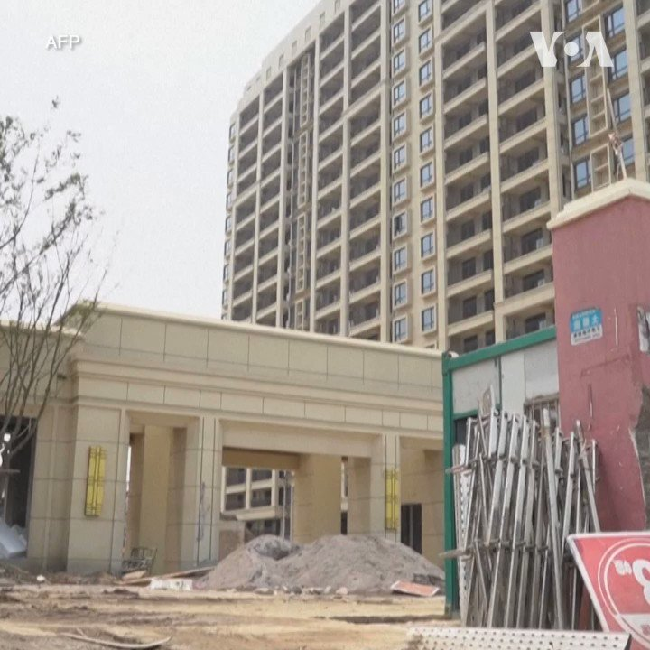
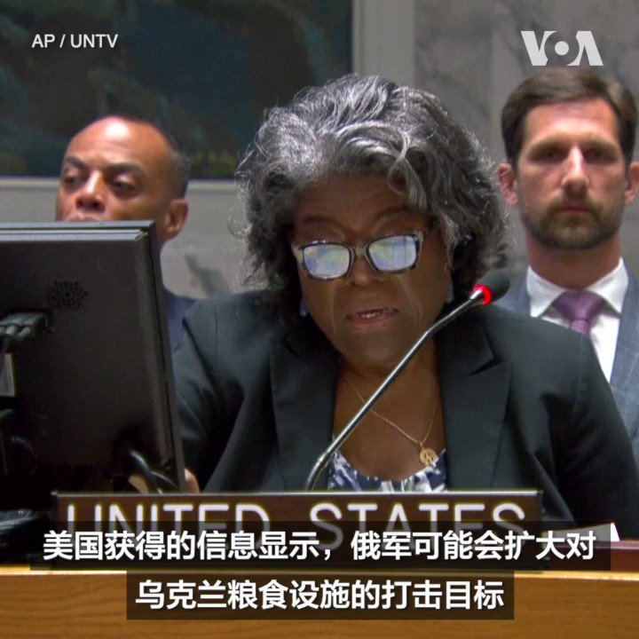

美国之音中文网 北京时间 2023-07-22T02:57:03Z 1682464722472300549 美议员审议拨款应对中国在太平洋岛国的影响力 https://t.co/WiwQDXKDWC   美国之音中文网 北京时间 2023-07-22T03:11:02Z 1682468243162779649 过去一年，中国多个省市发生烂尾楼停供潮，许多相关房地产项目至今无法复工，未能如期交付。在东南沿海的宁波市，两位当地居民最近在接受法新社采访时讲述了他们的经历。 https://t.co/uX79pSwc8m   美国之音中文网 北京时间 2023-07-22T03:14:05Z 1682469012117282818 白宫设立应对新疫情办公室，由一名退役军医将军领导 https://t.co/k6tp3LTbNC   美国之音中文网 北京时间 2023-07-22T03:28:08Z 1682472544497205248 特朗普机密文件案将于明年5月20日开庭 https://t.co/f84Zaf0FhJ   美国之音中文网 北京时间 2023-07-22T04:16:36Z 1682484742107848705 美国国务院亚太助卿康达和国防部助理部长拉特纳周五对国务卿布林肯和国防部长奥斯汀下周对印太地区的访问进行说明。布林肯将访问汤加，他将是第一位访问汤加的美国国务卿。奥斯汀将于下周二飞往巴布亚新几内亚，他将是第一位访问该国的美国国防部长。两人随后将在澳大利亚共同参加澳美部长级磋商会议。 https://t.co/wayv2EQ9hP   美国之音中文网 北京时间 2023-07-22T00:26:05Z 1682426731054141441 联合国秘书长：“后冷战时期已告结束”，但世界进入大国竞争最激烈“新时期” https://t.co/PAL22nzbV5   美国之音中文网 北京时间 2023-07-22T00:26:09Z 1682426750427602944 香港法庭将在下周就是否禁止播放一抗议歌曲作出裁决 https://t.co/iUoOuZ4vr8   美国之音中文网 北京时间 2023-07-22T01:10:03Z 1682437796047491074 美国国会调查对华科技投资 观察人士:美中AI差距恐扩大 https://t.co/eFWbw1AeqK   美国之音中文网 北京时间 2023-07-22T01:42:04Z 1682445853578121217 反间谍让外商风声鹤唳，中国当局为稳外资急召商会做政策解释 https://t.co/rEaY7SLlBA   美国之音中文网 北京时间 2023-07-22T01:42:49Z 1682446041382113282 美澳十三国举行联合军演 向北京展示力量与团结https://t.co/2VuIC1v8eN   美国之音中文网 北京时间 2023-07-22T01:56:59Z 1682449605928075264 美国常驻联合国代表琳达·托马斯-格林菲尔德7月21日谴责俄罗斯在黑海航道埋设水雷，并称此举将破坏全球粮食供应。她还说，俄罗斯没有理由中断执行黑海谷物倡议，俄方关于制裁影响其粮食出口的说法只是一种借口。 https://t.co/OVqmfYMMGK   美国之音中文网 北京时间 2023-07-22T01:59:05Z 1682450135882825728 美议员提议对维吾尔强迫劳动支持者实行严厉制裁 https://t.co/ZFInbCVuzy   美国之音中文网 北京时间 2023-07-22T02:13:02Z 1682453647421227008 美议员提议对维吾尔强迫劳动支持者实行严厉制裁 https://t.co/csHoC3muu8   