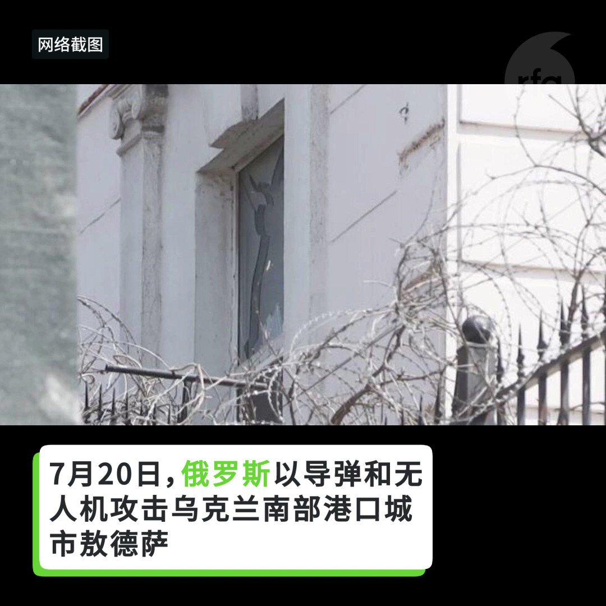
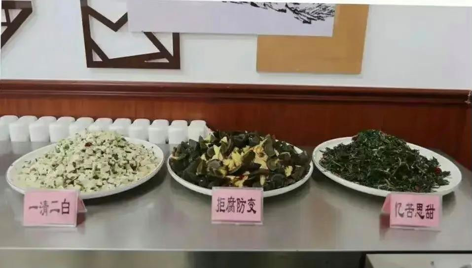

自由亚洲电台 北京时间 2023-07-22T02:33:57Z 1682458909049782273 美国国务院主管东亚和太平洋事务的助理国务卿康达（Daniel Kritenbrink）、美国国防部印太事务助理部长拉特纳（Ely Ratner）周五在华盛顿智库布鲁金斯学会（Brookings Institute）的研讨会上重申，美国会继续坚定地在印太地区推进和平、稳定和繁荣的共同区域愿景。

 https://t.co/r6u86fV7NY   自由亚洲电台 北京时间 2023-07-22T04:27:07Z 1682487389544144896 评论 | #陈破空：满世界都在议论 #秦刚，习近平如何善后？
 https://t.co/EkAeWMVgup   自由亚洲电台 北京时间 2023-07-22T04:57:28Z 1682495026415423488 7月20日，中国驻 #敖德萨领事馆 建筑在 #俄罗斯空袭敖德萨 时受损。
中国如何回应？
外交部发言人 #毛宁并未谴责俄罗斯，连俄罗斯的名字都没提。
这并非是中国大使馆首次在军事行动中受损。1999年美国“误炸”#中国驻南联盟大使馆 事件，曾引发大规模中国反美示威。
如果再遇类似事件，将何以自处？ https://t.co/Lp4B758Emk   自由亚洲电台 北京时间 2023-07-22T04:57:35Z 1682495055410372610 秦刚消失，墙内网民有兴趣吗？路透社近日的一篇报道中指出，平台数据显示，过去一周，百度搜索引擎上“秦刚”的搜索量增长了28倍，达到每天超过38万次。

路透社说，一些外交官甚至开始猜测谁可能取代秦刚，其中三人告诉路透社，7月21日参加了金砖国家外长会议的外交部副部长马朝旭可能是候选人。

您认为，如果秦刚真的被取代，谁是最佳候选人？   自由亚洲电台 北京时间 2023-07-22T05:13:40Z 1682499102985076738 专栏 | #周末茶馆：为何惊险 #走线（3) 80后秋风悲电扇
 https://t.co/ueSuHRLAlC   自由亚洲电台 北京时间 2023-07-22T06:00:01Z 1682510766858199042 专栏 | #周嘉有话说：“#四不青年”
#周孝正
 https://t.co/MhgDL6yxhK   自由亚洲电台 北京时间 2023-07-22T02:50:27Z 1682463064543870976 【#中国学生学者联合会 (#CSSA)和中国 #统战部 是什么关系？】
中国驻悉尼总领馆前政治领事陈用林向本台指出，CSSA是接受中国驻外使、领馆直接指挥，是中共的统战工具；他解释，在1989年天安门事件后，中共为了加大控制留学生的力度，在世界各地扶植多个CSSA。 https://t.co/IroMUWOyxd   自由亚洲电台 北京时间 2023-07-22T03:20:57Z 1682470738404728833 【党校 #清廉餐 翻车，副校长被免职】 详见 https://t.co/ggZCJ3uVou

“黑白分明”山药炒木耳
“清清白白”素炒白菜
“清廉本色”清拌莲藕
“拒腐防变”皮蛋拌腐竹
“忆苦思甜”苦瓜拌甜菜

打开脑洞，你还能开发些什么菜品？ https://t.co/Bq9GBzAkKy   自由亚洲电台 北京时间 2023-07-22T03:22:04Z 1682471020396187648 深圳天价房价之下，普通打工族选择住进房车 https://t.co/PmZz5mQINm   自由亚洲电台 北京时间 2023-07-22T04:03:40Z 1682481490331066368 【#变态辣椒：中国矿工狂潮】
#中国矿工 来到老挝中部的钾矿，老挝矿工面临解雇。
他们抱怨说，三千名中国矿工与一百名当地矿工的比例违反了矿主的雇用当地工人必须多于中国工人的协定。
中国采矿队把钾大部分运回中国，中国经济规模远超出老挝。
中国矿主称，雇用中国矿工是因为当地矿工缺乏技能。 https://t.co/gs92ZwndTA   自由亚洲电台 北京时间 2023-07-22T04:08:52Z 1682482796709724160 【美国高官访中 是去划红线非示软】⁣
完整视频 https://t.co/d3wwzkUnNE⁣
台大政治系荣誉教授 #明居正 在 #亚洲很想聊 节目中表示，台海现状为何？不由中国或台湾决定，而是 #美国 说了算，这是政治现实决定，因为美国国力可以投射到此区域并使其目标改变行为。⁣
⁣
⁣ https://t.co/5QGO1qomPR   自由亚洲电台 北京时间 2023-07-22T00:46:02Z 1682431752298700801 随着美中竞争以及中国对台武力威胁日趋升温，维护台湾海峡的和平稳定成为各方关注的焦点。那么，#台湾 能从 #俄乌战争 中学到什么样的防卫和作战技巧呢？

 https://t.co/cTogvNU4NX   自由亚洲电台 北京时间 2023-07-22T01:14:49Z 1682438993907159040 有中国背景的 #黑客 7月份入侵了至少数十万份美国政府官员的的个人电子邮件，其中涉及的最高级别官员包括美国驻中国大使 #伯恩斯 和美国国务院东亚助理国务卿康达（Daniel Kritenbrink）等人。此前美国商务部长雷蒙多的电子邮件也受到了黑客攻击。 https://t.co/96RNLpZEof   自由亚洲电台 北京时间 2023-07-22T01:41:24Z 1682445686279921664 【好莱坞为什么在中国不香了？】
好莱坞电影为了争夺中国市场，曾经优先考虑能吸引中国观众的电影，并考虑如何能通过中国的审查部门。但现在中国市场的情况让好莱坞高管们开始警觉，这个曾经热爱美国电影的国家正渐行渐远。

 https://t.co/F2eNrXjsFL   自由亚洲电台 北京时间 2023-07-22T02:01:23Z 1682450716114436101 #事实查核｜美国国务院估算每年有十万人被贩运到美国？
 https://t.co/aJUDmEWg0M   