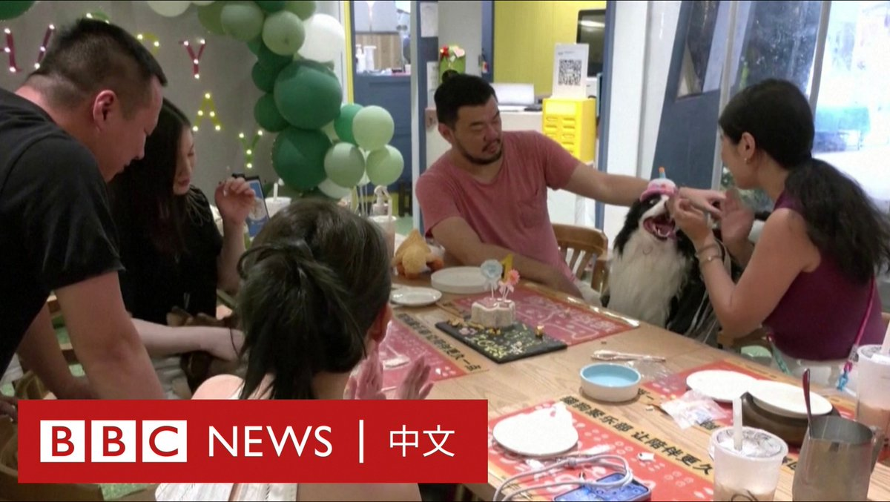
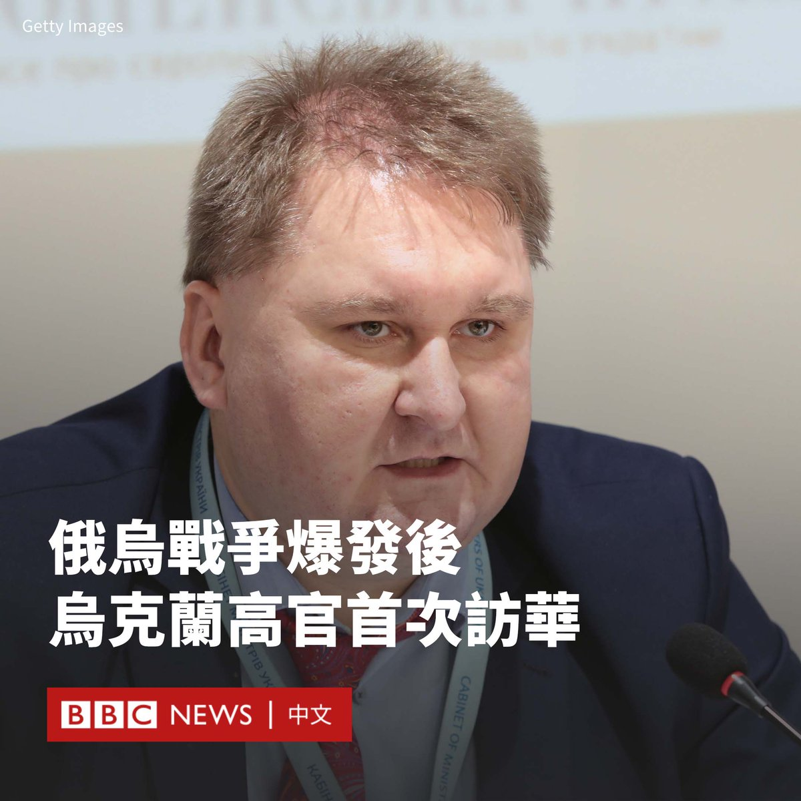
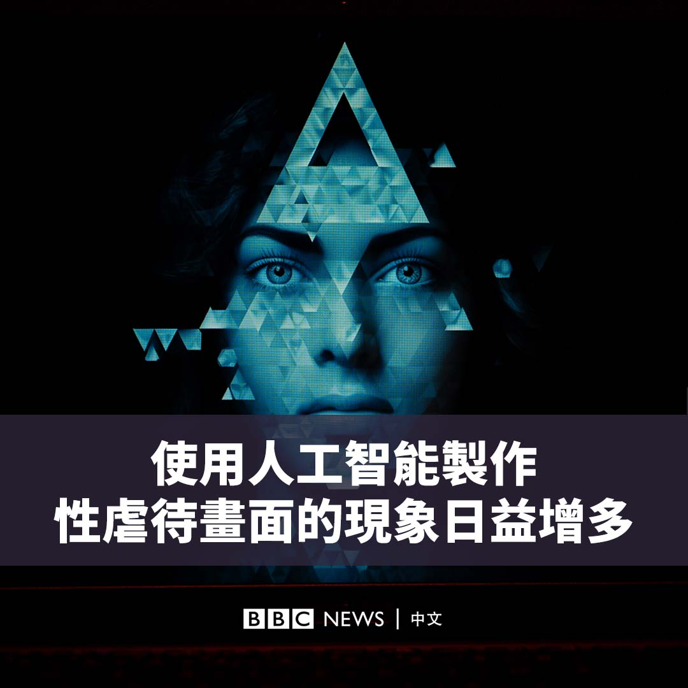

D英国广播公司BBC 北京时间 2023-07-21T19:10:08Z 1682347218324557825 在这家餐厅里，人类只能看，但不能吃。

随着宠物正成为越来越多中国家庭的重要一员，一家只招待宠物的餐厅在上海诞生，这让一些“毛孩子”也可以下馆子过生日了。 https://t.co/PTSI5QbWao   D英国广播公司BBC 北京时间 2023-07-21T20:26:35Z 1682366460495003649 对西方的深深怀疑，令塞尔维亚这个巴尔干国家对于普京和他入侵乌克兰的战争持支持的态度。https://t.co/gxsWhYZ4nZ   D英国广播公司BBC 北京时间 2023-07-21T17:02:59Z 1682315221673684994 自五月以来，台湾社交媒体上，几乎每天都有新的有关性暴力或骚扰的指控涌现。迄今已有超过百件点名政治人物、活动人士、知识分子或娱乐圈名人的性压迫指控。
https://t.co/vsyUDZ6KKp   D英国广播公司BBC 北京时间 2023-07-21T15:23:05Z 1682290082605301760 乌克兰经济部副部长塔拉斯·卡奇卡（Taras Kachka）正在中国访问，他在周四（7月20日）与中国商务部副部长凌激进行会晤。

这是自俄罗斯入侵乌克兰以来，首次有乌克兰高级官员访华。路透社报道称，卡奇卡周三抵达北京，将于周五离开。

中国商务部在一份声明中称，中国愿扩大自乌克兰进口优质产品，并与乌方不断拓展贸易和投资合作空间。

“中方愿与乌方一道，积极发展互利互惠的双边经贸合作，推动两国战略伙伴关系向前发展。”声明写道。

与此同时，乌克兰官员周四表示，俄罗斯对乌克兰南部重镇敖德萨和尼古拉耶夫连续三天发动空袭，造成三人死亡。中国驻敖德萨领事馆的一栋建筑受损。

乌克兰敖德萨州州长基佩尔（Oleh Kiper）发布一张照片，显示中国领事馆至少有一扇窗户破损，但没有其他损坏迹象。

中国外交部当日晚些时候证实了该说法，指爆炸的冲击波“震落了总领馆部分墙面和窗户玻璃”。外交部发言人在一份书面声明中表示，“总领馆人员早已撤离，没有造成人员伤亡”。

中国外交部表示，正在“同有关方面保持沟通”，将采取必要措施维护中国在乌机构及人员安全。

此外，乌克兰总统泽连斯基（Volodymyr Zelensky）表示，有6万吨运往中国的农产品在俄罗斯的空袭中被毁，但北京尚未对此作出回应。

在克里米亚大桥遭到袭击后，莫斯科表示将对幕后黑手基辅实施“报复性打击”，其还退出了一项允许乌克兰从黑海港口出口粮食的协议。   D英国广播公司BBC 北京时间 2023-07-21T12:59:13Z 1682253876421070850 在网络世界中，一些儿童性虐待的影片和画面隐藏在各个角落。位于剑桥的网路观察基金会（IWF）获准主动搜寻这些材料并移除它们。

该组织对BBC网络事务记者乔·泰迪（Joe Tidy）表示，使用人工智能制作性虐待画面的现象日益增多。 https://t.co/eFjswqbtqB   D英国广播公司BBC 北京时间 2023-07-21T13:46:05Z 1682265672468889601 日本政府与运营核电站的东京电力公司准备排放积存的核废水，引发中国官方与韩国民间团体的强烈抗议，排放是否安全的争论纠缠在科学与政治之间。https://t.co/Kr0ZARqoOz   D英国广播公司BBC 北京时间 2023-07-21T10:51:15Z 1682221672211058690 马拉维一家法院裁定涉嫌参与制作种族歧视影片和剥削儿童的中国人卢克多项罪名成立，他被判处12个月有期徒刑并驱逐出境。

2022年6月，BBC《非洲之眼》（Africa Eye）节目曝光他曾使用非洲当地儿童拍摄个性化问候视频，其中一些带有种族主义内容，而这些视频被在中国网络上出售。若儿童不遵照他的意思，他甚至会施以暴力。

他于当月在邻国赞比亚被捕，后来被引渡回马拉维逮捕。

他面临14项指控，包括贩卖儿童、非法使用互联网和危害社会行为等，最终判囚12个月附加驱逐出境。

由于他已在狱中度过一年，他被勒令七天内离开该国，并不得再次入境。

BBC看到的其中一段视频中，一群年幼的儿童被教导用汉语重复喊出“我是黑鬼，智商低”的句子，而他们显然没有意识到自己被要求说的话是什么意思。

一名卧底记者假装成潜在买家，秘密拍摄了与卢克的见面过程，后者当时承认自己制作了该视频，随后又立即否认。他表示，他制作这些视频是为了向当地社区传播中国文化。

中国外交部非洲司司长吴鹏在去年6月回应称，已经和马拉维外交部长滕博（Nancy Tembo）讨论过该事件，中国对种族主义“零容忍”。

“在过去几年里，中国一直在打击这些非法的网络行为，”他在推特（Twitter）上写道，“我们在未来将继续打击这种种族歧视的视频。”   D英国广播公司BBC 北京时间 2023-07-21T10:09:18Z 1682211115294683136 香港一名男子因将东京奥运金牌得主张家朗的得奖片段，配上反修例运动歌曲《愿荣光归香港》并发布至YouTube，周四（7月20日）被法庭以“侮辱国歌罪”判囚三个月。

这名27岁的男子被指在2021年7月，对香港击剑选手张家朗于东京奥运得奖片段进行修改，把原本的中国国歌背景音乐，换成《愿荣光归香港》，并将此片段发布到网络上。

截至去年7月12日，该影片观看次数为9.7万次，留言数为950余个；被告在同月21日被拘捕。

在2019年香港爆发“反送中”抗议后，《愿荣光归香港》在示威者中广为传唱，但当局指责该歌曲煽动“港独”。

此前，在多个国际比赛场合发生了《愿荣光归香港》被当作中国国歌播放的情况，引发香港政府愤怒，在今年6月要求禁播该歌曲。

据香港媒体报道，裁判官指，被告所上载的片段有9万人浏览，属广泛流传，且认为被告并无悔意，因此判他入狱三个月。

裁判官称，颁奖仪式代表着运动员及其所属国家的尊严和荣耀，必须庄严地进行，而被告刻意挑选播放国歌的部分进行修改，却保留奏国歌后的掌声等行为，损害了国歌的尊严。

同样是在张家朗夺得奥运金牌当天，还有一名香港记者在香港观塘一家商场观看颁奖仪式时，挥动一面殖民时期的港英旗，他也在去年被判监三个月。   D英国广播公司BBC 北京时间 2023-07-21T00:00:32Z 1682057914541051904 【最新消息】中国外交部证实，位于乌克兰敖德萨的中国总领馆建筑在俄军空袭行动中受损，指爆炸的冲击波“震落了总领馆部分墙面和窗户玻璃”。

中国外交部发言人在一份书面声明中表示，“总领馆人员早已撤离，没有造成人员伤亡”。

北京在该声明中未直接提及俄罗斯，但表示正在“同有关方面保持沟通”，将采取必要措施维护中国在乌机构及人员安全。   