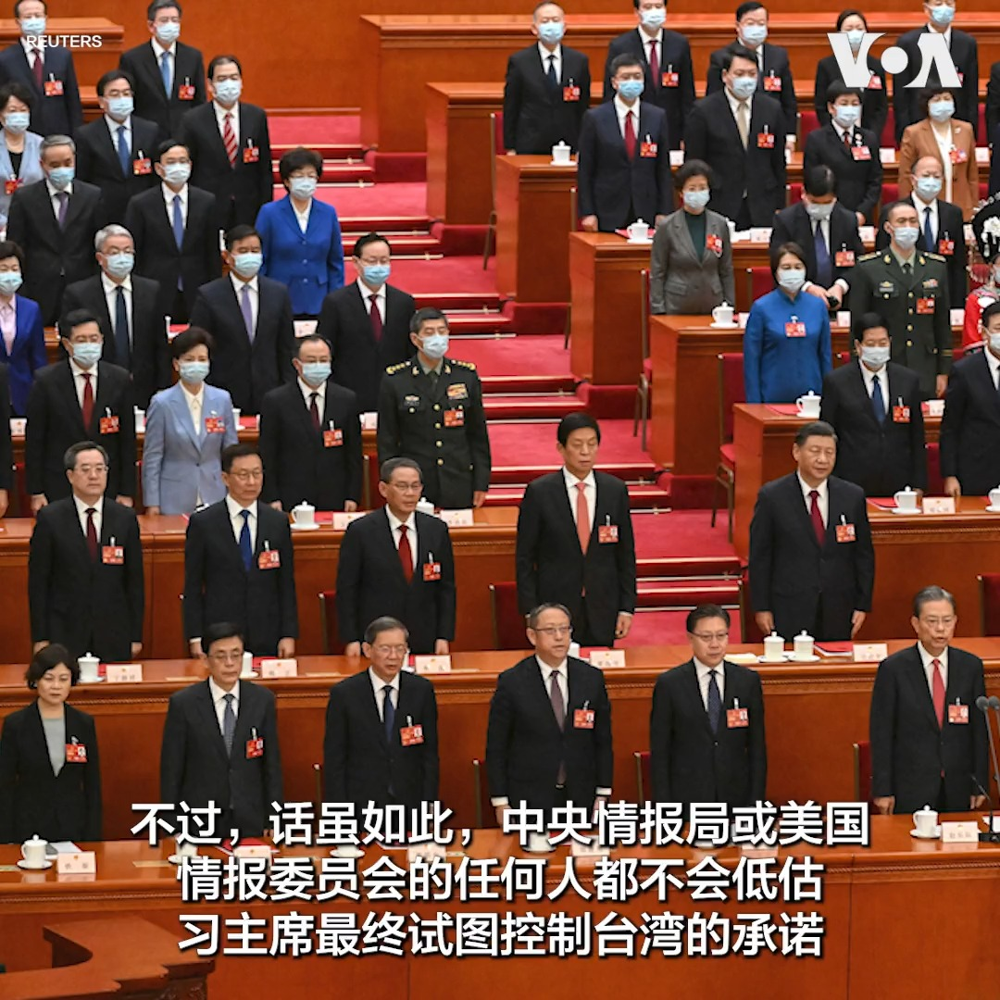
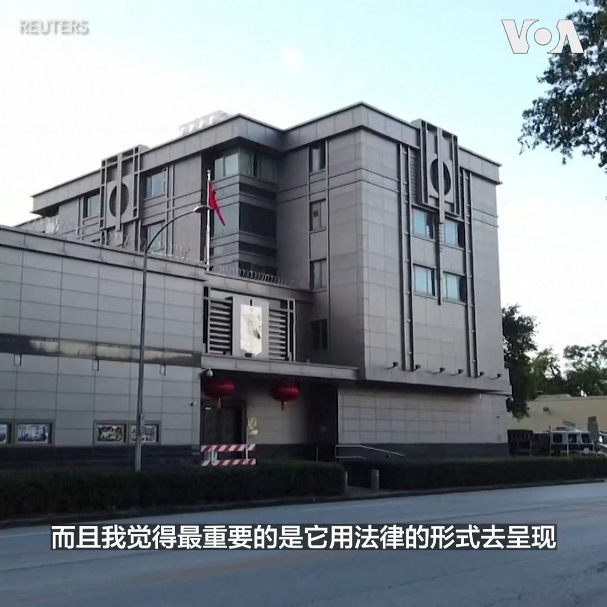
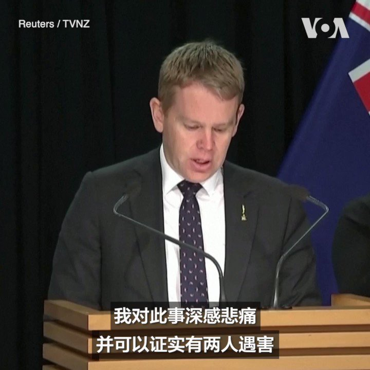
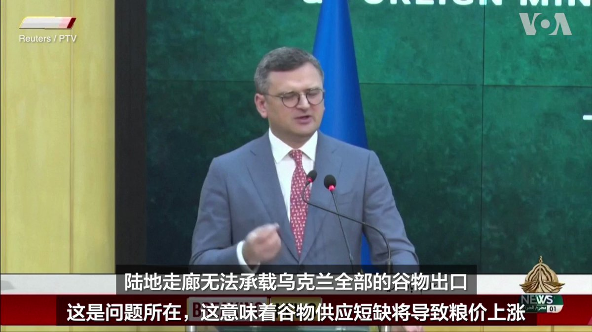
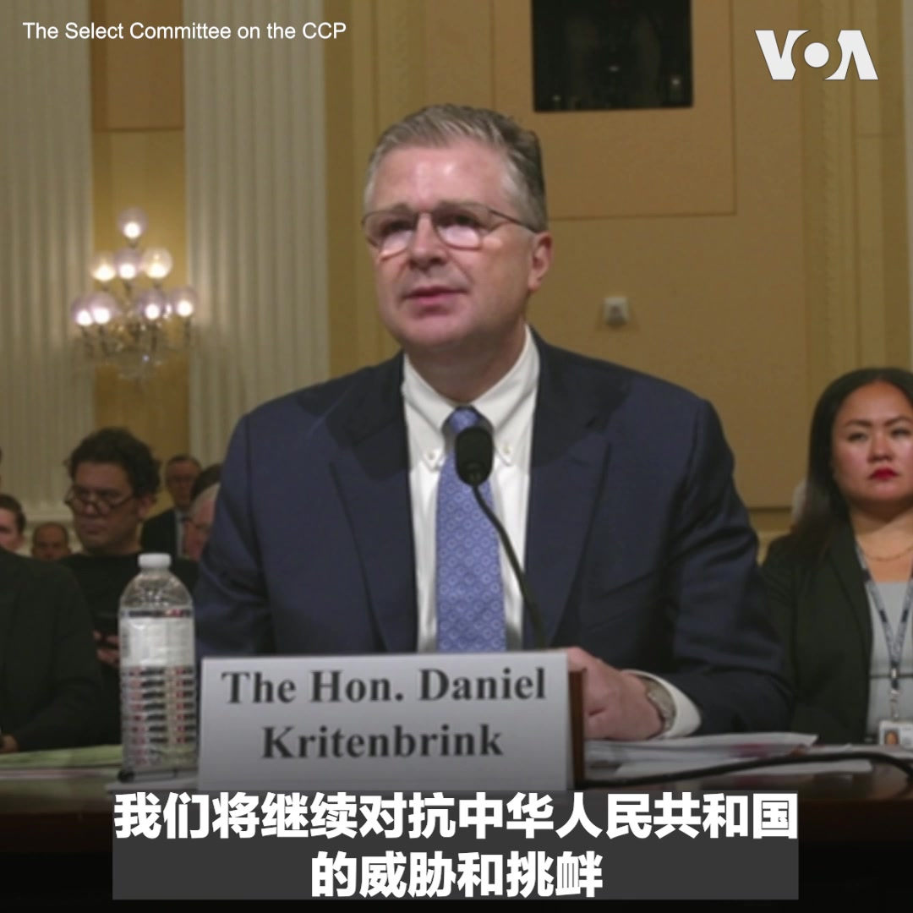
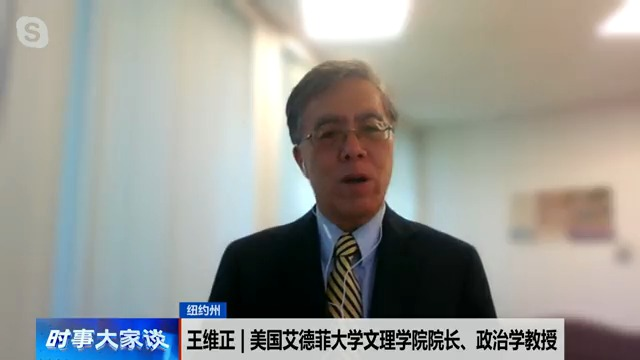

美国之音中文网 北京时间 2023-07-21T20:11:04Z 1682362554465787904 印度西部发生山体滑坡 至少16人死亡 https://t.co/Kar3bz3PQm   美国之音中文网 北京时间 2023-07-21T16:03:03Z 1682300140563083264 澳大利亚阻止一家与中国有关的公司收购其锂矿公司 https://t.co/I9FdA9w1D0   美国之音中文网 北京时间 2023-07-21T13:10:06Z 1682256613657432065 日美韩官员谴责朝鲜武器计划 但敦促双方展开对话 https://t.co/0hzdNnhS3c   美国之音中文网 北京时间 2023-07-21T14:00:34Z 1682269316035772418 中国黑客入侵活动扩大 美驻华大使电邮也传遭骇 https://t.co/pJQJA4u6zB   美国之音中文网 北京时间 2023-07-21T10:45:09Z 1682220135338196993 美国中情局局长伯恩斯星期四说，虽然中国领导人习近平已指示解放军“在 2027 年之前做好准备”攻台，但习本人和解放军对是否有能力这么做依然心存疑虑。伯恩斯还表示，几年来，中情局在重建在中国的情报能力方面取得了进展。报道内容：https://t.co/QanGEIXlY1 https://t.co/9OA0sopCks   美国之音中文网 北京时间 2023-07-21T11:40:37Z 1682234093881425921 国会共和党人批评拜登政府与中国接触政策为“僵尸”；民主党议员支持本着实力与北京对话 https://t.co/xBFNGYwAqf   美国之音中文网 北京时间 2023-07-21T12:08:06Z 1682241010330660867 著名法律人士郝劲松在被羁押超过3年半后被判刑9年 https://t.co/oHAsUhYnei   美国之音中文网 北京时间 2023-07-21T12:18:06Z 1682243528594980865 中国加强检测日本进口水产品 中日关系更趋于紧张 https://t.co/ADrrmg4g1t   美国之音中文网 北京时间 2023-07-21T09:45:04Z 1682205015254130688 美国中情局长：习近平和解放军对是否有能力攻打台湾仍有疑虑 https://t.co/qVL4cva6OZ   美国之音中文网 北京时间 2023-07-21T10:10:05Z 1682211313785909249 美中官员本周都对两国紧张关系表示遗憾，但几乎没有迹象表明双方会解决无数分歧 https://t.co/qACkd0hu6e   美国之音中文网 北京时间 2023-07-21T10:16:35Z 1682212946989178880 美参议院通过禁止向中国出售战略石油储备的《国防授权法》修正案 https://t.co/hTWXGQnQdR   美国之音中文网 北京时间 2023-07-21T04:43:23Z 1682129093767184392 美众院中国特设委员会召开听证会审视拜登政府对华战略，委员会成员不断质问美方高层最近接连走访北京都是由美方这边主动提出，如同向中共示弱的“殭尸外交”。艾德菲大学文理学院院长王维正教授认为拜登政府错失机会。完整节目：https://t.co/1giIJianqK https://t.co/SY0LWlCOyI   美国之音中文网 北京时间 2023-07-21T05:00:01Z 1682133280542392320 在朝鲜被拘留的美国军人特拉维斯·金(Travis King)的母亲克劳丁·盖茨20日在威斯康辛州的居所外简短回应了 WISN-TV 电视台的询问,她说希望自己的儿子能早日回来。特拉维斯·金本星期在非军事区和旅游团参观时冲入朝鲜一侧，他本来应该飞往美国德克萨斯州的一处军事基地。 https://t.co/Z9pfos9wVN   美国之音中文网 北京时间 2023-07-21T05:10:05Z 1682135815248551937 泰中接连举办陆海空军演 是否将撼动泰美防卫关系？ https://t.co/g9j2UJv0Lf   美国之音中文网 北京时间 2023-07-21T05:26:32Z 1682139956620435458 白宫：正“尽我们所能”寻求有关越境进入朝鲜美国军人的信息 https://t.co/2in63PY6Ca   美国之音中文网 北京时间 2023-07-21T05:29:05Z 1682140596285362176 中国影响力不断扩大之际，布林肯下周访汤加、新西兰与澳大利亚，加速推进印太战略 https://t.co/kqTDjXRyAl   美国之音中文网 北京时间 2023-07-21T05:30:34Z 1682140968756166658 提到“坦克人”，人们想到的是89年6月在天安门广场阻挡坦克前进的那位中国勇士。在立陶宛因宣布独立而在91年1月遭苏联坦克镇压时，同样出现了一位阻挡坦克前进的人，他就是立陶宛妇产科医生道诺拉维修斯。他在维尔纽斯向美国之音讲述了这段至今仍令很多立陶宛人热泪盈眶的经历。https://t.co/vQJNODK7SI https://t.co/TT478XPpUH   美国之音中文网 北京时间 2023-07-21T06:02:36Z 1682149029256531969 乌克兰战争成为俄罗斯-非洲峰会的焦点 https://t.co/t5kd2okLs9   美国之音中文网 北京时间 2023-07-21T07:00:00Z 1682163476951896064 中国最年轻党和国家领导人、外长秦刚突然消失。秦刚真病了？ “习近平亲密助手”不见了，习会难堪吗？秦刚失踪预警中共官场凶险，君慎入？中国防长李尚福高调会见突访北京的美国前国务卿基辛格。解放军一再拒绝跟美军对话，为何其它动作连续不断？请收看美国之音7月21日上午9点《时事大家谈》。 https://t.co/xsDHA6XJaI   美国之音中文网 北京时间 2023-07-21T07:22:09Z 1682169049135079424 谁在“篡改”美国的一中政策？美议员：中国试图重新定义三公报承诺对美“心理操纵” https://t.co/UXAdiESa3p   美国之音中文网 北京时间 2023-07-21T07:34:28Z 1682172150646464513 意大利参议院7月19日就俄罗斯与中国在意大利的影响和战略召开听证会，公民力量发起人杨建利在听证会上向意大利议员们介绍了“经济北约”理念，指民主国家有必要团结应对中国的经济胁迫。意大利《页报》中国事务记者彭皮利介绍了中国当局渗透意大利媒体推行“战狼外交”的情况。 https://t.co/hxNbqTYCEb https://t.co/LXlSgTtSGX   美国之音中文网 北京时间 2023-07-21T07:48:35Z 1682175702467244032 美共和党籍参议员致函布林肯：勿让中国参与调解俄罗斯对乌战争 https://t.co/h8IwEpIPho   美国之音中文网 北京时间 2023-07-21T08:02:34Z 1682179219902844928 俄罗斯反对派领袖纳瓦尔尼面临额外20年监禁 https://t.co/XolEJS0cPA   美国之音中文网 北京时间 2023-07-21T08:45:06Z 1682189924215439360 VOA专访国安会发言人：美中两军沟通仍然关闭，“这是不幸的” https://t.co/GQvm2tC3XV   美国之音中文网 北京时间 2023-07-21T08:45:10Z 1682189941852483585 中国男子因种族主义视频在马拉维被定罪 https://t.co/KDxhSdPMzz   美国之音中文网 北京时间 2023-07-21T08:59:00Z 1682193422474461188 分析人士表示，中国透过新设立的《领事保护与协助条例》来彰显国家主权，实际上就是中国国力向外延伸的展现，并正当化与扩大对中国公民的监控。北京正运用法律战的形式在国际社会建构新一轮的话语权，这将会比战狼外交口水战还要难招架。报道： https://t.co/aDjrUT2HuR https://t.co/nX0jlJjLOc   美国之音中文网 北京时间 2023-07-21T01:50:57Z 1682085703432151057 美国财政部长耶伦20日参观了河内的一个电动滑板车制造厂。耶伦强调了提高供应链韧性的重要性，她说美国并不是要与中国切断贸易关系但希望与更多的国家，包括越南成为合作伙伴。 https://t.co/JeucH0TIye   美国之音中文网 北京时间 2023-07-21T02:30:00Z 1682095528761253888 民主党议员肯纳在美众院中国特设委员会的听证会中提及高龄百岁的基辛格突然进行事先未宣布的访中之行并与习近平会面，纽约城市大学政治学教授夏明告诉美国之音，虽然基辛格此行见到习近平与国防部长李尚福，但他根本就不是中国人民的老朋友，大家不要被中共的大外宣给骗了。https://t.co/1giIJianqK https://t.co/U57NuoTwn9   美国之音中文网 北京时间 2023-07-21T02:52:36Z 1682101217630076930 共和党议员穆罗尔(John Moolenaar)在美众院中国特设委员会的听证会上频频追问国防部印太事务助理部长拉特纳有关美台军事交流的细节，西密歇根大学政治系教授王元纲告诉美国之音，美议员关切对台延迟交付武器，担心乌战影响台海安全。完整访谈请看7/20【时事大家谈】：  https://t.co/jMC74i9w7X https://t.co/8CH4klFIww   美国之音中文网 北京时间 2023-07-21T02:54:39Z 1682101731189030914 新西兰总理克里斯·希普金斯7月20日向在当天枪击事件的遇难者致以哀悼。他还说，这起事件还造成包括警察在内的多人受伤。据警方通报，枪击发生在奥克兰市中心的一个建筑工地。希普金斯说，当晚的2023年女足世界杯开幕式将照常举行。 https://t.co/cFYSpu397d   美国之音中文网 北京时间 2023-07-21T03:03:05Z 1682103852626219008 中国政治经济双管齐下影响意大利，“战狼外交”引发关注 https://t.co/D5JzjLAw0Z   美国之音中文网 北京时间 2023-07-21T03:03:09Z 1682103870204551170 调查：四分之三英国人不信任中国 不接受在科技和基建领域合作 https://t.co/AXRrNNMC9V   美国之音中文网 北京时间 2023-07-21T03:27:49Z 1682110077828825093 正在巴基斯坦访问的乌克兰外长德米特洛·库列巴7月20日呼吁恢复黑海谷物倡议。他说，该倡议的中止将导致粮食价格上涨。俄乌两国政府代表去年7月在土耳其签署黑海谷物倡议。该协议确保乌克兰可以通过黑海出口粮食。俄罗斯不久前宣布中止执行协议。 https://t.co/44nv7krQR2   美国之音中文网 北京时间 2023-07-21T04:08:26Z 1682120300446597125 "中华人民共和国在国内更加压制，在国外更加咄咄逼人，挑战美国及合作伙伴盟友的利益和价值观"，国务院亚太助卿康达7月20号在众院中国特设委员会表示。商务部助理部长肯德勒说，拜登政府正采取包括出口管制等来对抗“中共政府体制下的军民融合战略”。国防部助理部长拉特纳说明美军如何因应中国挑战。 https://t.co/bryIQP5LHl   美国之音中文网 北京时间 2023-07-21T01:12:35Z 1682076045208596480 伊拉克暴民冲击并焚烧瑞典驻伊大使馆 伊政府驱逐瑞典大使 https://t.co/bfrfFBm3fg   美国之音中文网 北京时间 2023-07-21T02:18:02Z 1682092516030423047 美众院中国特设委员会召开听证会审视拜登政府对华战略，委员会成员不断质问美方高层最近接连走访北京都是由美方这边主动提出，如同向中共示弱的“殭尸外交”。艾德菲大学文理学院院长王维正教授认为拜登政府错失机会。完整节目：https://t.co/1giIJianqK https://t.co/GDoAAss0SK   美国之音中文网 北京时间 2023-07-21T00:17:03Z 1682062072044204033 俄罗斯空袭乌克兰港口城市尼古拉耶夫 https://t.co/m7eJ0vbqaa   美国之音中文网 北京时间 2023-07-21T00:22:58Z 1682063557767180288 欧盟成员国外长7月20日在布鲁塞尔召开会议，谴责俄军最近轰炸乌克兰南部地区，并破坏那里的粮食出口基础设施。外长们还讨论了协助保障乌克兰粮食出口的计划。 https://t.co/0BLNgcdNlm   