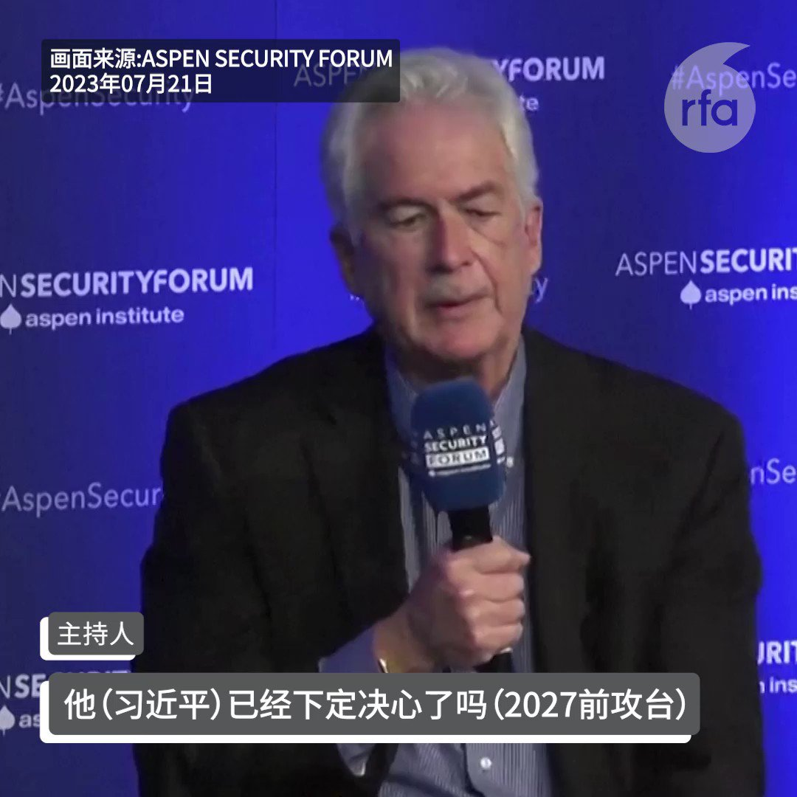
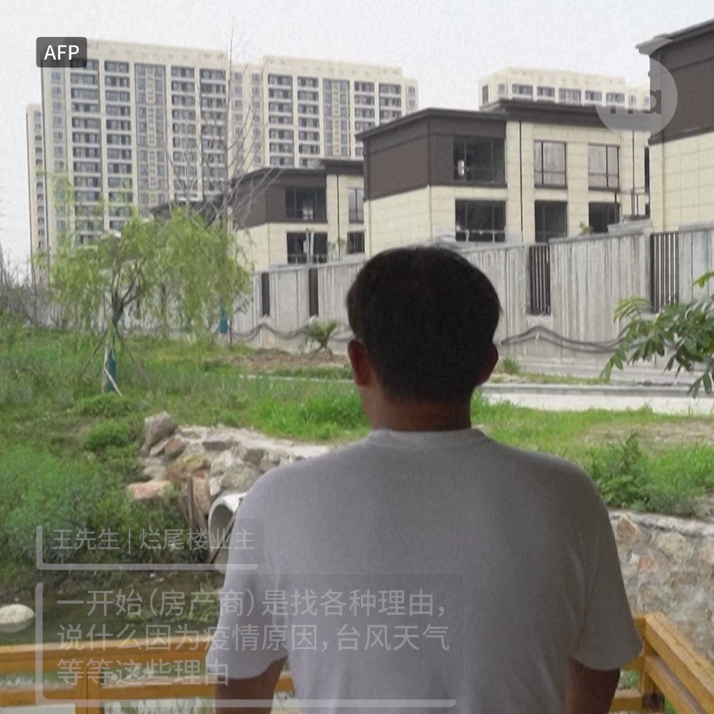

自由亚洲电台 北京时间 2023-07-21T23:40:35Z 1682415282239995905 吴建忠质疑：“透过引渡其实不到100人，缉捕却有800多人，这不印证外界怀疑中共在海外设置 #秘密警察？这缉捕究竟是外国警察，外国司法单位执行，还是中国在海外的秘密警察去进行的行为？中方在海外没有任何执法权，只有和相关国家签订司法互助协议、引渡条例等。”
#海外追逃 
 https://t.co/pc2QPEsrSi   自由亚洲电台 北京时间 2023-07-21T21:20:55Z 1682380132177027072 RT @RFA_Chinese: 在美国呆的时间越长，对中国的看法就越差，对台湾的看法就越好？

皮尤研究中心7月19日公布的一个最新调查报告中说：大多数亚裔美国人对自己的祖籍国有好感，但华裔美国人是一个例外。在美国居住时间较长的华裔美国人对中国的好感度较低，而对台湾的好感度较…   自由亚洲电台 北京时间 2023-07-21T21:54:59Z 1682388705238024200 英国宣布对 #洪都拉斯 等5国取消免签证入境优惠。英国情报机关曾表示，#中国间谍 可透过购买这个国家的国籍，免签入境并在英国合法停留最长达6个月。

据台湾中央社报道，这五个国家分别是洪都拉斯、#多米尼加、#瓦努阿图，#纳米比亚 以及 #东帝汶。

英国内政大臣布雷弗曼19号向英国国会发布书面声明表示，洪都拉斯等五国国民不论是入境还是过境英国，都必须办理签证。

报道称，该措施自伦敦19日下午三点起生效，但有四周的过渡期。   自由亚洲电台 北京时间 2023-07-21T18:33:59Z 1682338121185382400 【江苏无锡5年来首次发布暴雨红色预警】
【火车站淹水出现“瀑布”】

江苏无锡20日降下暴雨，火车站淹水出现“瀑布”景象。无锡市气象台发布暴雨红色预警信号，启动了全市防汛Ⅲ级应急响应，是无锡5年来首次发布暴雨红色预警。

#无锡暴雨 https://t.co/jGxS9zeRYB   自由亚洲电台 北京时间 2023-07-21T19:02:41Z 1682345345152618498 【习近平谈粮食安全倡盐碱地利用】
【评论：为"#退林还耕"画句号】
在中国经济陷入低迷之际，中共中央财经委员会会议重点却放在 #粮食安全，研究 #盐碱地 改造，力保 #18亿亩耕地 红线。评论表示，重视 #粮食安全 与中国不放弃对台威胁，怕中美再交恶，影响粮食供应稳定有关。又说，会议将开发土地限于盐碱地，为过去半年的"退林还耕"画上句号。
详细报道：https://t.co/aMCa64urzb   自由亚洲电台 北京时间 2023-07-21T17:54:59Z 1682328306656632833 【台湾扯铃冠军涉间谍案 4退役士官遭押】
【学者：渗透基层新样态】
台湾知名扯铃教练 #鲁纪贤 被控遭中国吸收在台发展 #间谍 组织，以利诱手法吸收“想多赚零用钱”的退役士官，向现役军人刺探搜集军情。
https://t.co/AA4zX9yUaO https://t.co/IcOdgYZyqq   自由亚洲电台 北京时间 2023-07-21T15:49:13Z 1682296657575288832 【美国中情局长：乌俄战争使习近平对攻台产生犹豫】

美国中央情报局局长威廉· #伯恩斯(William Burns)20日表示，#乌俄战争 的经验使得 #习近平 和解放军对能否在可接受的成本上入侵台湾，产生疑虑。

伯恩斯是在 #阿斯彭安全论坛(Aspen Security Forum)上被问到，中国国家主席习近平是否已经下定决心在2027 年前攻打台湾。他表示，虽然中国领导人习近平已指示他的军队“在2027年之前做好准备”入侵台湾，但这并不代表解放军攻台是“迫在眉睫”或是“不可避免的”。

伯恩斯说，#乌克兰 军队以小敌大，#俄罗斯 武器系统的缺陷，习近平低估了美国总统 #拜登 迅速组建强大同盟以及西方的团结，都使得中国犹豫不决。

但他也表示，中央情报局或美国情报委员会的任何人都不会低估习近平最终试图控制台湾的承诺。   自由亚洲电台 北京时间 2023-07-21T10:41:20Z 1682219176537083905 RT @RFA_Chinese: 【#亚太报道（2023-7-20）】
欢迎收听和订阅播客【亚太报道】 https://t.co/MjLNSvVMqc
中国公布支持 #民营经济 #31条 意见 / 北大学者 #张丹丹 披露 #青年失业率 远高官方统计 / 法律学者 #郝劲松 遭…   自由亚洲电台 北京时间 2023-07-21T10:41:32Z 1682219229016121344 RT @RFA_Chinese: #张丹丹 的文章说，中国青年高 #失业率 首先要归因于2020年以来的三年新冠疫情导致的经济增速下降；
2021年以来教培、房地产、互联网平台等行业的规制政策密集出台，尤其冲击高学历；
人工智能的快速发展...
面对完美风暴，青年何以自救？…   自由亚洲电台 北京时间 2023-07-21T11:58:08Z 1682238506012401666 #404共和国 | #杨炼：中国，没有幸存者
 https://t.co/OcYD49iZgW   自由亚洲电台 北京时间 2023-07-21T11:59:13Z 1682238775706140674 评论 | #程晓农：#习近平 的执政恐惧
 https://t.co/nKntDR0hpe   自由亚洲电台 北京时间 2023-07-21T04:26:34Z 1682124864268951553 根据 #法轮功 组织的统计，自“#720镇压”事件至今，已有多达5,000名法轮功信徒遭迫害死亡，受害者年龄横跨17岁至82岁。而近年来，中国当局更加大打击力度，仅在2023年，法轮功信众受迫害或骚扰事件就多达3000余起，比去年同期增加了15%。

 https://t.co/JEhrqjqvDu   自由亚洲电台 北京时间 2023-07-21T04:19:24Z 1682123057983549440 专栏 | #军事无禁区：围棋战略－从 #毛泽东 到 #习近平
 https://t.co/BEzJuwerTG   自由亚洲电台 北京时间 2023-07-21T04:26:32Z 1682124856853233665 在美国呆的时间越长，对中国的看法就越差，对台湾的看法就越好？

皮尤研究中心7月19日公布的一个最新调查报告中说：大多数亚裔美国人对自己的祖籍国有好感，但华裔美国人是一个例外。在美国居住时间较长的华裔美国人对中国的好感度较低，而对台湾的好感度较高。25% 的美国出生华裔成年人对中国有好感，而在美国居住 10 年或以下的中国移民中，这一比例为 56%。 对于台湾的看法，70% 的美国出生的华裔美国人持赞成态度，而中国移民的这一比例为 53%。

您赞同这一结论吗？   自由亚洲电台 北京时间 2023-07-21T04:46:31Z 1682129885136035841 香港国安处早上在港九多处带走两男两女进行调查，他们分别为被通缉的香港前立法会议员 #郭荣铿 的父母及其兄长郭荣臻夫妇。他们在录取口供后被获准离开，未有被捕。
目前被通缉的8名海外港人中，已有3人的在港家人被带走问话，涉及至少10人。

 https://t.co/iVobdlYa4o   自由亚洲电台 北京时间 2023-07-21T05:20:47Z 1682138509543612417 近日，曾对美中关系有过重要历史性影响的美国前国务卿 #基辛格 突然访问北京，并与中国最高领导人 #习近平 会面。虽然基辛格在美国政界的影响力早已不如往昔，但他此行对美中关系传达了什么信号？
本台记者王允 @Jeff23Wang 报道。

 https://t.co/V4jD0qojyR   自由亚洲电台 北京时间 2023-07-21T05:32:07Z 1682141361733246977 【投诉无门的中国烂尾楼业主】
王先生于 2021 年在宁波购买了一套房屋，但由于开发商资金耗尽变成 #烂尾楼。 
崔海生六年前在郑州市买了一套房子，也面临同样的问题。
与许多其他受害者一样，对于政府的敏感点，他们几乎没有法律追索权。 https://t.co/FOfinKbEVn   自由亚洲电台 北京时间 2023-07-21T05:35:12Z 1682142134751698946 2023年亨利护照指数排名出炉！看看你的护照排第几？ https://t.co/9i8JZFIaXb   自由亚洲电台 北京时间 2023-07-21T05:39:43Z 1682143274017112064 #张丹丹 的文章说，中国青年高 #失业率 首先要归因于2020年以来的三年新冠疫情导致的经济增速下降；
2021年以来教培、房地产、互联网平台等行业的规制政策密集出台，尤其冲击高学历；
人工智能的快速发展...
面对完美风暴，青年何以自救？
 https://t.co/cJ5nycamLg   自由亚洲电台 北京时间 2023-07-21T06:00:07Z 1682148404850466817 【#亚太报道（2023-7-20）】
欢迎收听和订阅播客【亚太报道】 https://t.co/MjLNSvVMqc
中国公布支持 #民营经济 #31条 意见 / 北大学者 #张丹丹 披露 #青年失业率 远高官方统计 / 法律学者 #郝劲松 遭重判 / 香港警方针对更多被通缉民主人士家属展开调查 / #习近平 高调会晤 #基辛格 https://t.co/OxFFrUha8X   自由亚洲电台 北京时间 2023-07-21T02:39:56Z 1682098028247752704 【法轮功人士计划举行反迫害24周年华府大游行】
7月20日是中国政府宣布镇压 #法轮功 24周年的日子。来自世界各地的法轮功学员聚集在美国首都华盛顿，呼吁美国和全球政府和各界支持。
据法轮功团体介绍，他们计划中午12点集会，下午1点半开始游行活动。据了解，每年的7月20日，世界各地法轮功学员都会举行不同规模的游行集会和烛光悼念活动。
美国国会与行政当局中国委员会发表推文表示，“过去24年法轮功学员遭受了最令人发指的人权迫害，而这些迫害仍在继续“。中国委员会呼吁中国政府释放被关押的法轮功学员，并追究有关官员的责任。   自由亚洲电台 北京时间 2023-07-21T03:08:59Z 1682105340991774722 随着美中竞争持续升级，中国当局的对美政策也更咄咄逼人。为了应对这场大国竞争，美国国会本周四举行听证，敦促行政部门加快推进落实强硬 #对华政策。

 https://t.co/zqlu1YOjZU   自由亚洲电台 北京时间 2023-07-21T03:29:52Z 1682110594315595776 #事实查核｜媒体披露的"会议纪录"证明了美国要求 #台湾 发展 #生化武器 吗？
 https://t.co/NPnyPyBDKX   自由亚洲电台 北京时间 2023-07-21T03:53:16Z 1682116485022621696 #传播观察｜真伪未知的"#南海工作会议纪录"是如何经中文媒体传播开的？ https://t.co/4udwxcY6tg   自由亚洲电台 北京时间 2023-07-21T01:23:10Z 1682078709279502336 美国印太司令阿奎利诺18日在科罗拉多州“#阿斯彭安全论坛”上指出，俄乌战争之后，美国可能是唯一的全球大国，“可以边走路边嚼口香糖”，而如果对中国的威慑无果，他有信心“领导美军战斗并取得胜利”。他预言，以美军当前的实力，若今天侵略 #台湾 会失败。

 https://t.co/swS7q4QjQt   自由亚洲电台 北京时间 2023-07-21T02:03:59Z 1682088981893382144 专栏 | #绿色情报员：#台海危机 浪头下的盔甲武士
 https://t.co/9bmEomAG7D   自由亚洲电台 北京时间 2023-07-21T00:21:18Z 1682063139259686912 针对台湾的副总统 #赖清德 预计下月 #过境美国，中国驻美大使 #谢锋 形容这是冲向中方的“#灰犀牛”事件。就此，台湾的外交部在本周四作出回应。

 https://t.co/qAvD5nGdKU   