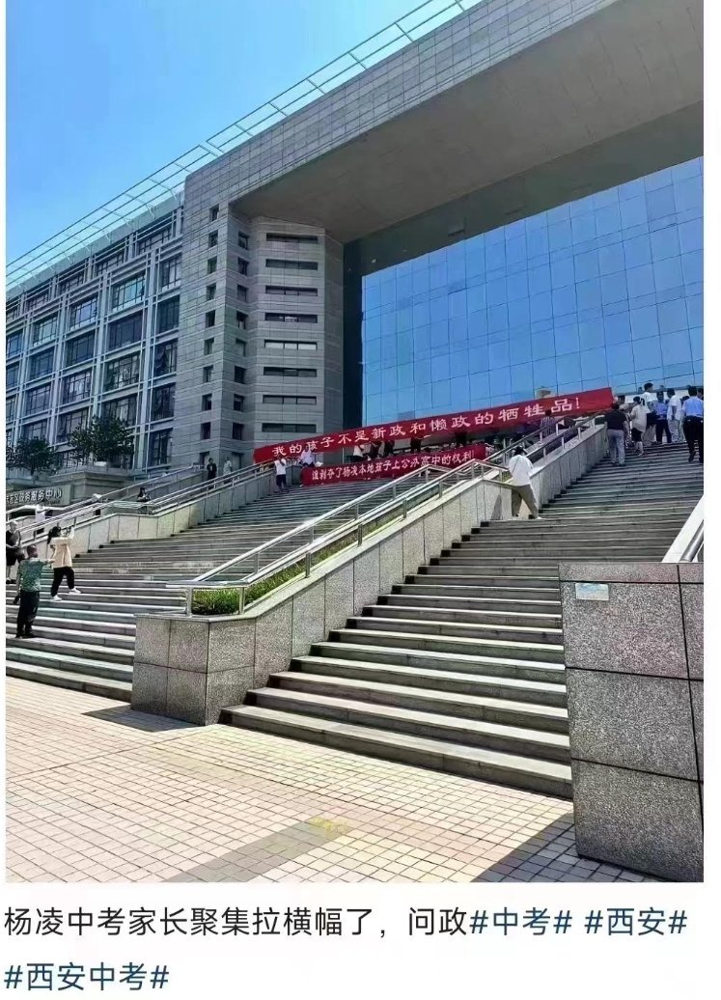
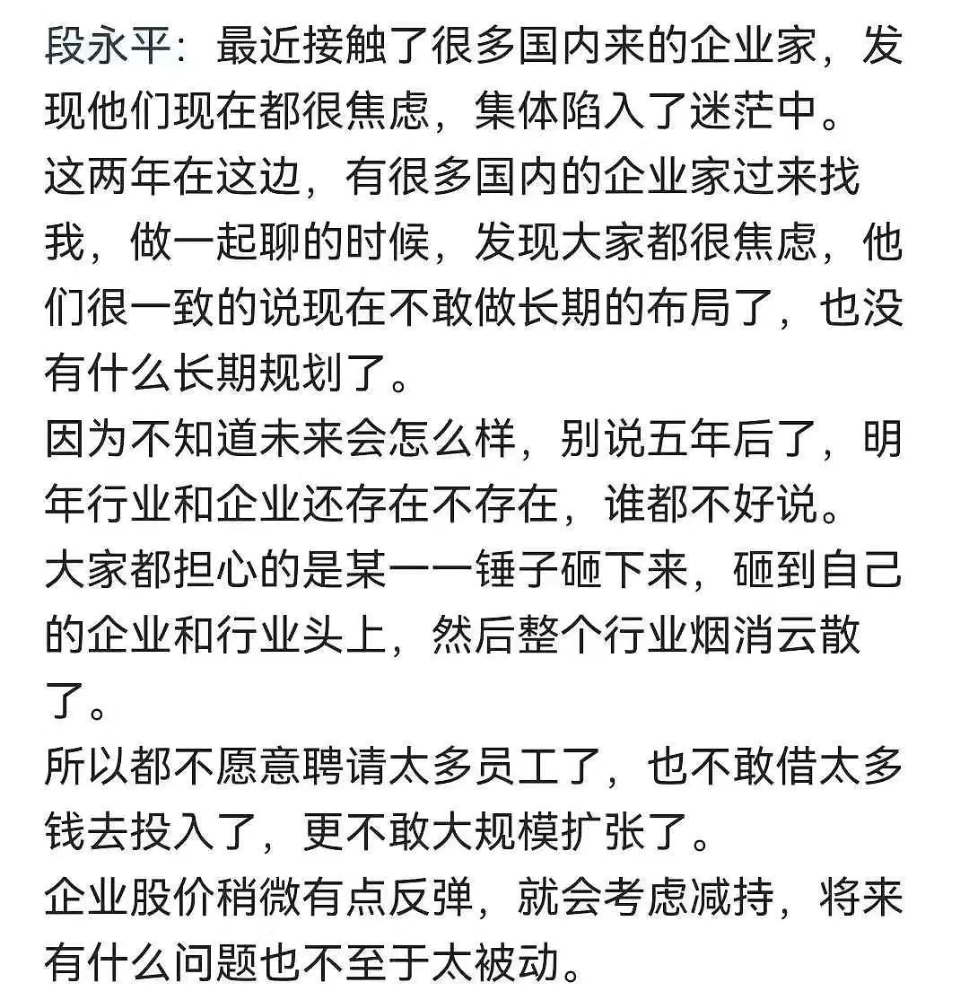

谁将十万横扫三江 北京时间 2023-07-21T19:51:44Z 1682357687466737664 7月20日成都，烂尾楼业主维权，遭到警察拦截维稳 https://t.co/qS8LExO8Rk   谁将十万横扫三江 北京时间 2023-07-21T19:53:48Z 1682358208487378944 7月21日重庆暴雨，轻轨3号线因设备故障导致全线运营受阻。今天的重庆北站也被淹了，全部晚点堪比春运 https://t.co/48IMxlaBxB   谁将十万横扫三江 北京时间 2023-07-21T17:02:00Z 1682314975640195072 RT @whyyoutouzhele: 杨凌区政府大楼前，家长拉起横幅
“我的孩子不是新政和懒政的牺牲品” https://t.co/ixnC17Lu0g   谁将十万横扫三江 北京时间 2023-07-21T17:02:17Z 1682315044246405120 政治风险阻碍了资本价值投资 https://t.co/TM5REF9plo   谁将十万横扫三江 北京时间 2023-07-21T17:15:57Z 1682318486901764096 RT @whyyoutouzhele: 网友投稿
7月21日，贵州从江县
一辆私家车因为车胎有泥，被从江县城管局当场锁住。须到办公室接受处理和处罚。 https://t.co/eI4fJRot6L   谁将十万横扫三江 北京时间 2023-07-21T17:16:38Z 1682318658390089728 RT @whyyoutouzhele: 7月21日，西安市盐店街信访接待中心
现场家长集体高唱国歌 https://t.co/QZbE8D116k   谁将十万横扫三江 北京时间 2023-07-21T17:58:38Z 1682329226991771648 世界上从未有一个国家像大清一样如此重视文明，经历几千年连绵不绝又饱经沧桑的国家才会深刻的懂得，在快速变革的时代，一旦道德失范将带来多么沉重的灾难
电报是载体，电报规范不会无中生有的，不会凭空而来的，它必然伴随着优秀的传统文化与创新 https://t.co/s0mLWYaNmh   谁将十万横扫三江 北京时间 2023-07-21T10:43:00Z 1682219594868723714 7月20日江苏南通，祥生云境再出通告延期收楼。早已经停工了，假开工 https://t.co/sXE5k1RW6K   谁将十万横扫三江 北京时间 2023-07-21T09:22:51Z 1682199424444010496 RT @catorfox: 香港反送中运动不是一个简单的“黑暴”就能概括的，这是一场几乎席卷了整个香港社会的大规模示威潮，从2019年3月份开始直到2020年中还有陆陆续续的抗争，参与人数最多时高达百万人，参与群体有学生、普通市民、工人、政治组织和社会团体等，它的出现有香港自身…   谁将十万横扫三江 北京时间 2023-07-21T09:26:45Z 1682200405621755905 RT @whyyoutouzhele: 网友投稿 
7月20日，重庆九龙坡区金科阳光小镇
居民因不同意扩路和安保人员发生冲突
甚至还有老人被捕 https://t.co/AMHO0U5lI7   谁将十万横扫三江 北京时间 2023-07-21T09:26:49Z 1682200425125281793 RT @whyyoutouzhele: 网友投稿
7月20日晚，山西太原发生一起持刀砍人事件。 https://t.co/lce8s0FmG1   