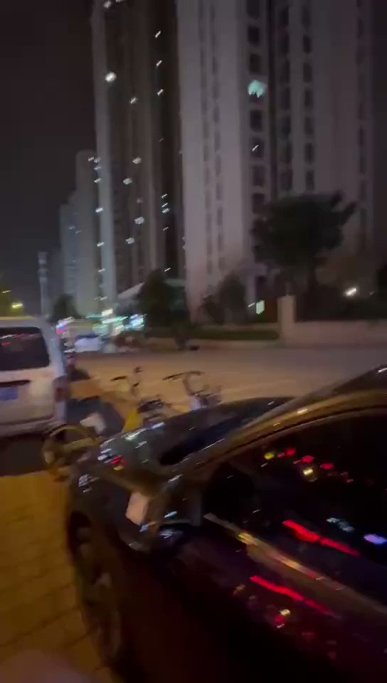

谁将十万横扫三江 北京时间 2023-07-21T09:22:51Z 1682199424444010496 RT @catorfox: 香港反送中运动不是一个简单的“黑暴”就能概括的，这是一场几乎席卷了整个香港社会的大规模示威潮，从2019年3月份开始直到2020年中还有陆陆续续的抗争，参与人数最多时高达百万人，参与群体有学生、普通市民、工人、政治组织和社会团体等，它的出现有香港自身…   谁将十万横扫三江 北京时间 2023-07-21T09:26:45Z 1682200405621755905 RT @whyyoutouzhele: 网友投稿 
7月20日，重庆九龙坡区金科阳光小镇
居民因不同意扩路和安保人员发生冲突
甚至还有老人被捕 https://t.co/AMHO0U5lI7   谁将十万横扫三江 北京时间 2023-07-21T09:26:49Z 1682200425125281793 RT @whyyoutouzhele: 网友投稿
7月20日晚，山西太原发生一起持刀砍人事件。 https://t.co/lce8s0FmG1   