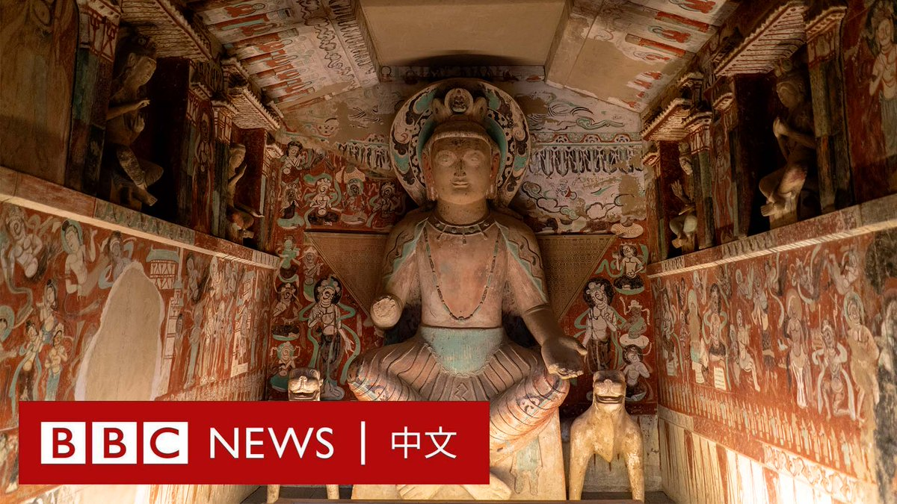
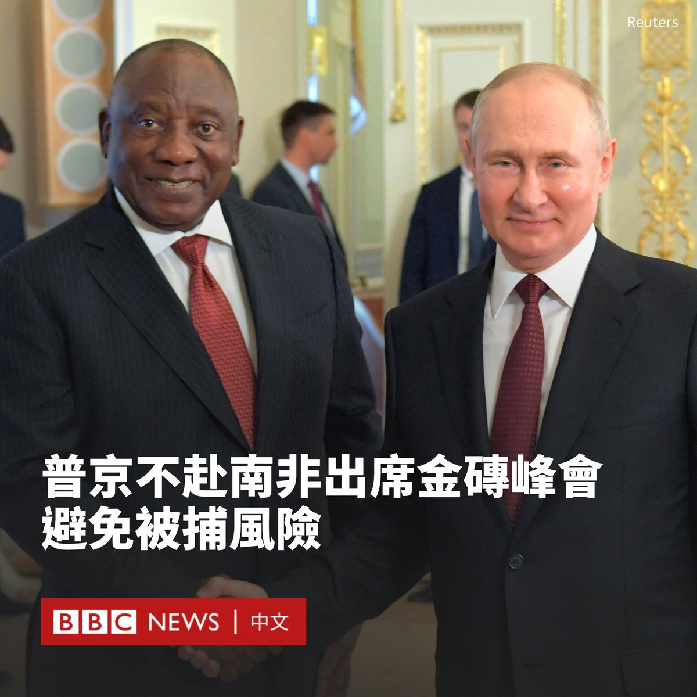
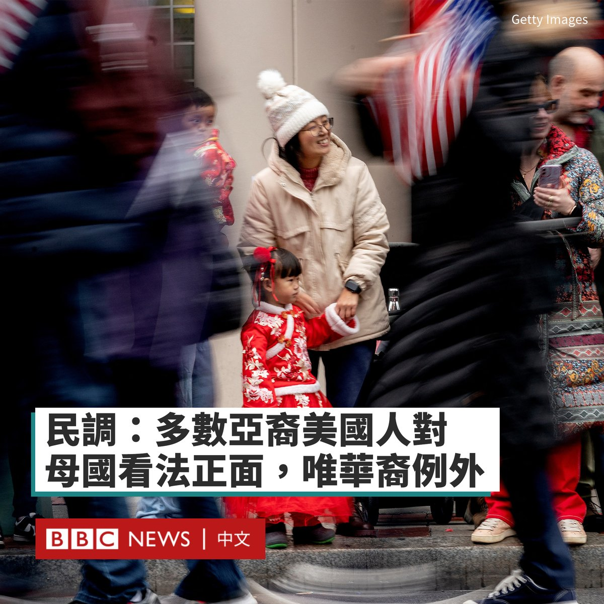
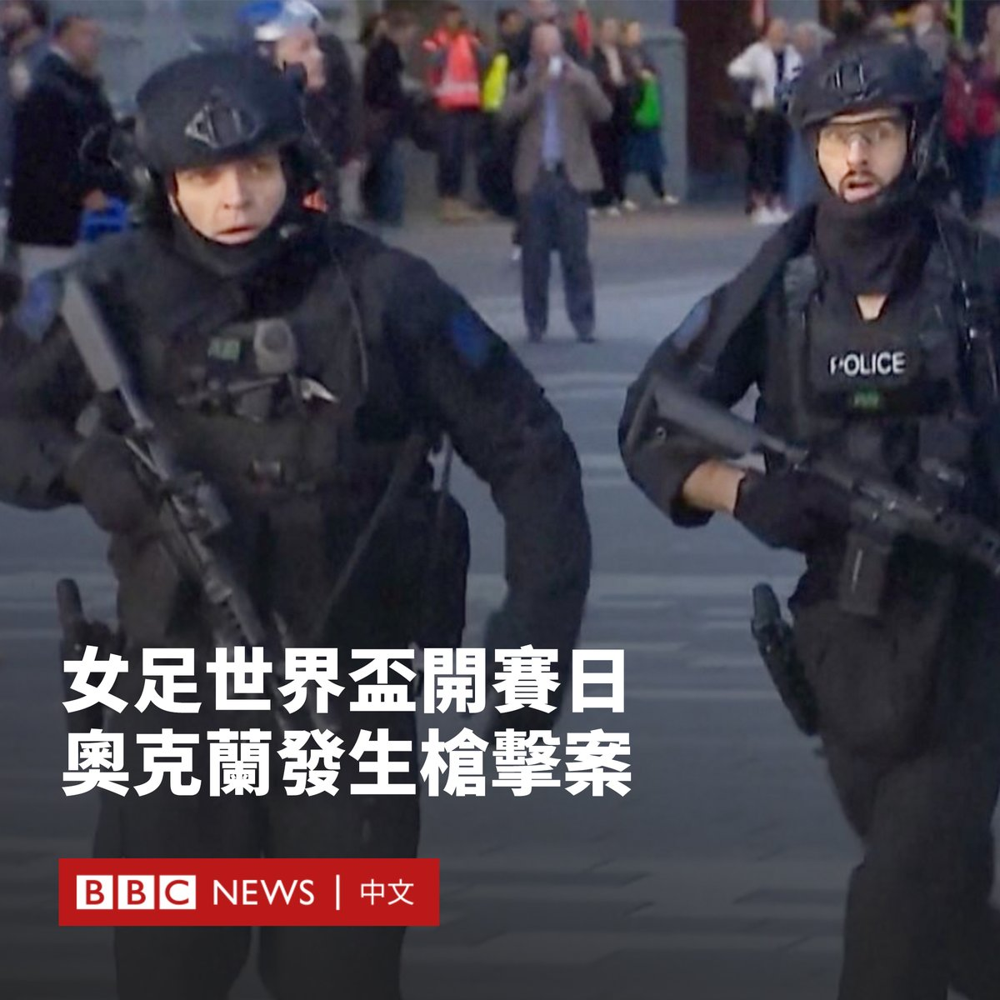
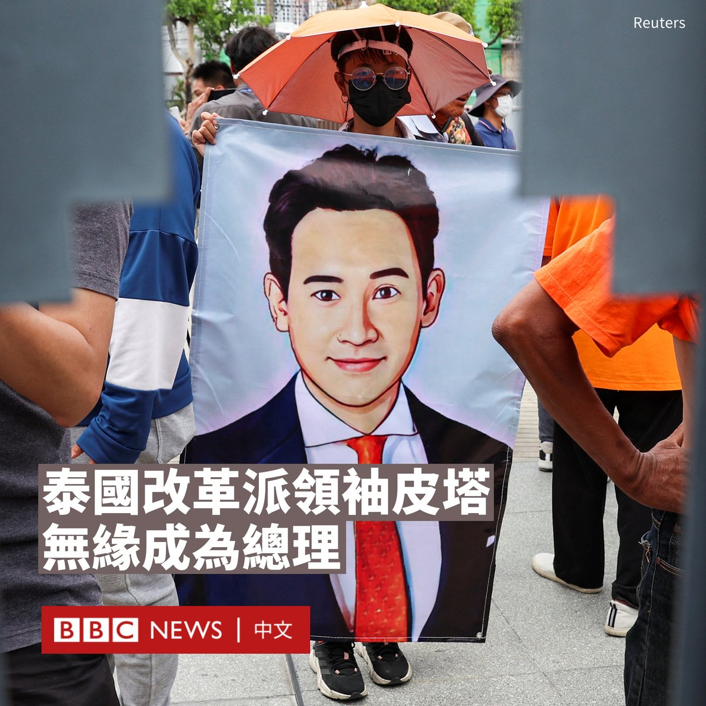

D英国广播公司BBC 北京时间 2023-07-20T17:10:59Z 1681954848936280064 研究人员发现，气候变化正令中国古丝绸之路上的宝贵文物面临威胁。环保人士认为，在中国西北部的甘肃省，增多的强降雨使得敦煌洞窟内湿度变大，给石窟内壁画和雕塑带来更大的伤害。 https://t.co/PRRSF4RbBh   D英国广播公司BBC 北京时间 2023-07-20T14:27:58Z 1681913824415293441 第九届女足世界杯将于7月20日至8月20日在澳大利亚和新西兰举行，这次世界杯有什么值得关注呢？ https://t.co/Y95zv8XHKn   D英国广播公司BBC 北京时间 2023-07-20T16:05:03Z 1681938253493174273 南非周三（7月19日）宣布，俄罗斯总统普京（Vladimir Putin）将不会出席下个月在该国举办的金砖五国（BRICS）峰会，这为东道国南非解决了一个争论已久的难题，即南非是否有义务根据国际逮捕令逮捕普京。

由巴西、印度、中国、俄罗斯和南非组成的金砖国家将于8月22日至24日在约翰内斯堡举行峰会。南非总统府星期三表示，普京已决定由俄外长拉夫罗夫（Sergei Lavrov）代为出席。

普京不出席峰会的决定将让南非政府松一口气，因为国际刑事法院（ICC）今年3月因俄军在乌克兰占领区的行为，签发了针对普京的逮捕令。

若普京前往南非，作为国际刑事法院成员国的南非有义务逮捕他。

南非此前就绕开执行逮捕令的潜在解决办法争论多时。该国反对党要求政府在普京抵达时进行抓捕。

一份周二披露的法庭文件显示，南非总统拉马福萨（Cyril Ramaphosa）表示，俄罗斯已明确表明，任何逮捕其总统的行为都等同于宣战。 “承担与俄罗斯开战的风险是不符合我国宪法的。”他在书面证词中写道。

不过，克里姆林宫发言人佩斯科夫（Dmitry Peskov）否认莫斯科发出过这样的威胁。   D英国广播公司BBC 北京时间 2023-07-20T12:44:53Z 1681887882435514368 皮尤研究中心（Pew Research Center）周三（7月19日）发布的一项民调显示，大多数亚裔美国人对自己的祖籍国有好感，但华裔美国人是一个例外。

该调查对华裔与台湾裔美国人进行区分，华裔不包括那些明确自我认同为台湾裔的人。

这份民调还显示，在亚裔美国人中，多数人对美国、日本、韩国和台湾看法积极，但是大多数对中国的看法负面。

皮尤中心指，该调查于2022年7月至2023年1月进行，访问了7006名居住在美国各地的亚裔成年人，其涵盖了华裔、菲律宾裔、印度裔、韩国裔和越南裔这五个最主要亚裔群体，以及来自日本和台湾的人群。

根据这份调查，绝大多数台湾裔（95%）、日本裔（92%）、韩国裔（86%）都对其祖籍地持积极看法，而超过一半的印度裔（76%）、菲律宾裔（72%）越南裔（59%）同样对其祖籍地看法正面。

不过，华裔美国人对中国的看法与众不同。只有41%的人表示对中国看法正面。但这个比例远大于其他亚裔美国人对中国看法正面的比例。

调查还显示，华裔美国人对美国、日本和韩国持有正面看法的比例高于对中国持正面看法的比例。

在中国大陆与台湾的紧张关系不断升级之际，这份调查显示，华裔美国人对台湾的正面看法比例高于对中国的正面看法比例。

62%的华裔美国人对台湾看法正面，对中国看法正面的占41%。   D英国广播公司BBC 北京时间 2023-07-20T11:14:05Z 1681865028545437698 在女足世界杯开幕的几个小时前，举办地新西兰奥克兰的市中心发生枪击案，造成两人死亡。

枪击案发生在当地时间周四（7月20日）7时22分（19:22 GMT）该市中心商业区皇后街一处建筑工地。

除了两名死者，事件还造成包括警察在内的六人受伤，枪手自己也已身亡。

新西兰总理希普金斯（Chris Hipkins）表示，这次袭击没有被视为恐怖主义行为。他称，世界杯比赛将按计划进行。

他表示，枪手当时手持一支泵动式霰弹枪作案。袭击者的政治或意识形态动机尚未确定。

希普金斯称赞警察的救援行动是“英雄之举”，称他们“为了拯救他人生命，冲入枪林弹雨”。

事发后，奥克兰市长一度呼吁居民待在家中，避免出行，并表示这在该市是一件“可怕事件”。

警方表示，他们听到有人在建筑工地内开枪的报告。这名枪手穿过大楼继续开枪，随后进入电梯井。警方称，该男子又进行了多次射击，不久后被发现死亡。

第九届女足世界杯由新西兰和澳大利亚联合主办，首场比赛将在奥克兰的伊甸公园（Eden Park）举行。

体育部长格兰特·罗伯逊（Grant Robertson）表示，当局将在该地区增派警察，加强安保。   D英国广播公司BBC 北京时间 2023-07-20T09:16:53Z 1681835534954659841 赢得泰国大选的改革派领袖皮塔·林家伦拉（Pita Limjaroenrat）确定无缘成为泰国总理。

这名42岁的远进党党魁周三（7月19日）被宪法法院戏剧性地暂停议员职务，议员们随后投票否决了第二次提名皮塔担任总理的提案。

今年5月，皮塔率领远进党在众议院选举中大获全胜，赢得最多席位，标志着对泰国自2014年以来保守派军事统治的逆转。

但是，他在上周未能获得国会过半数支持以当选总理，尽管他是唯一的候选人。

一个重要原因是拥有249个席位的参议院由与军方有联系的议员控制。许多参议员表示不会投票给皮塔，因为其政党曾提出修订冒犯君主罪。

泰国严厉的冒犯君主罪规定，任何人诽谤、侮辱或威胁国王、王后、王储或摄政王，最高可判处15年有期徒刑。

泰国国会周三再度开会进行第二次投票，皮塔依旧是唯一人选，但有议员提出根据议事规则，同一个议案若表决未通过，在同一个会期就不能再提出；也有人提出选总理并非一般议案，所以不适用这样的规则。

国会就此经过一整天的辩论，议员在傍晚投票决定到底皮塔是否可以被二度提名为总理候选人，最终多数议员决定皮塔无法被二度提名。

同日，泰国宪法法院还裁定，暂停皮塔的众议员职务，因为泰国选举委员会声称他持有一家媒体公司的股份，违反选举法规定。

在被迫离开国会之前，皮塔表示：“我觉得，泰国自5月14日以来，已经永远变得不一样了。”他指的是自己赢得大选的日期。

“人民已经赢了一半，另一半仍未实现。”他说道。

据报道，预计泰国国会将于7月27日进行下一次总理投票，届时为泰党预计将推出候选人，但执政联盟的组成可能会发生变化。   