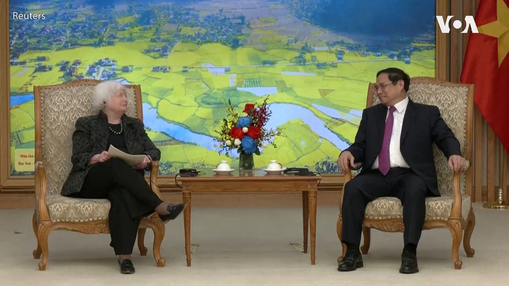
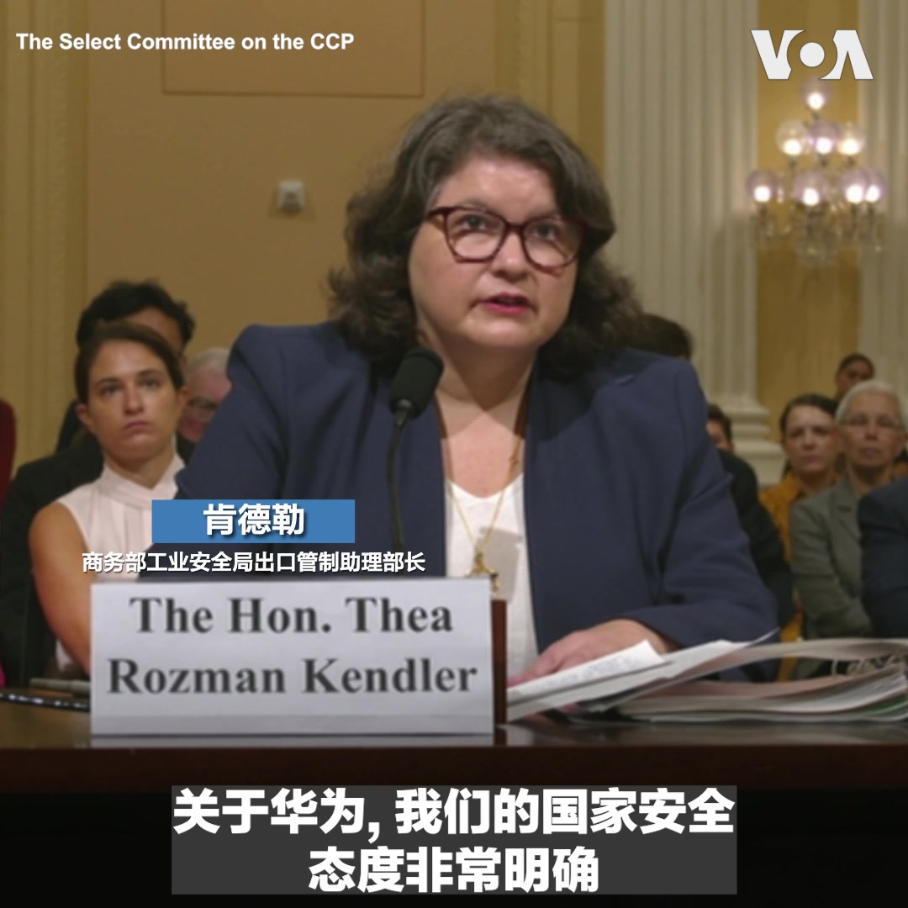
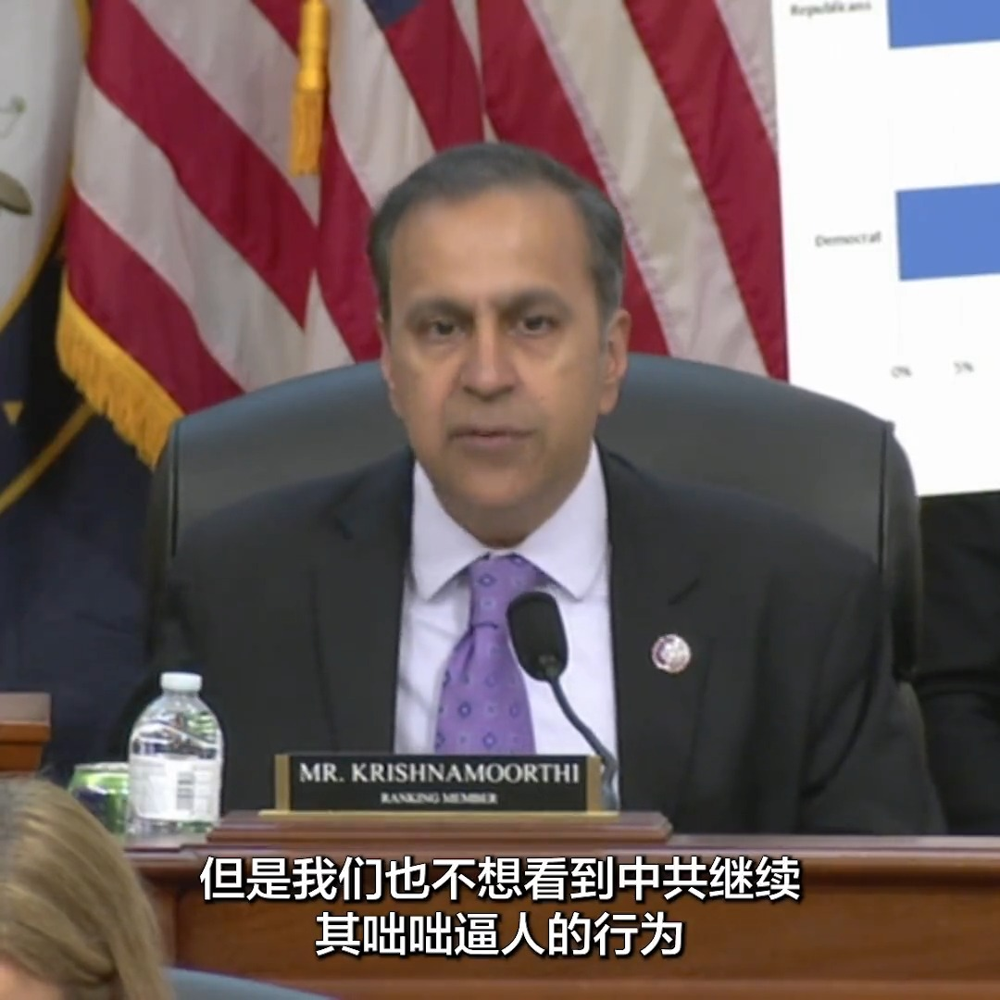
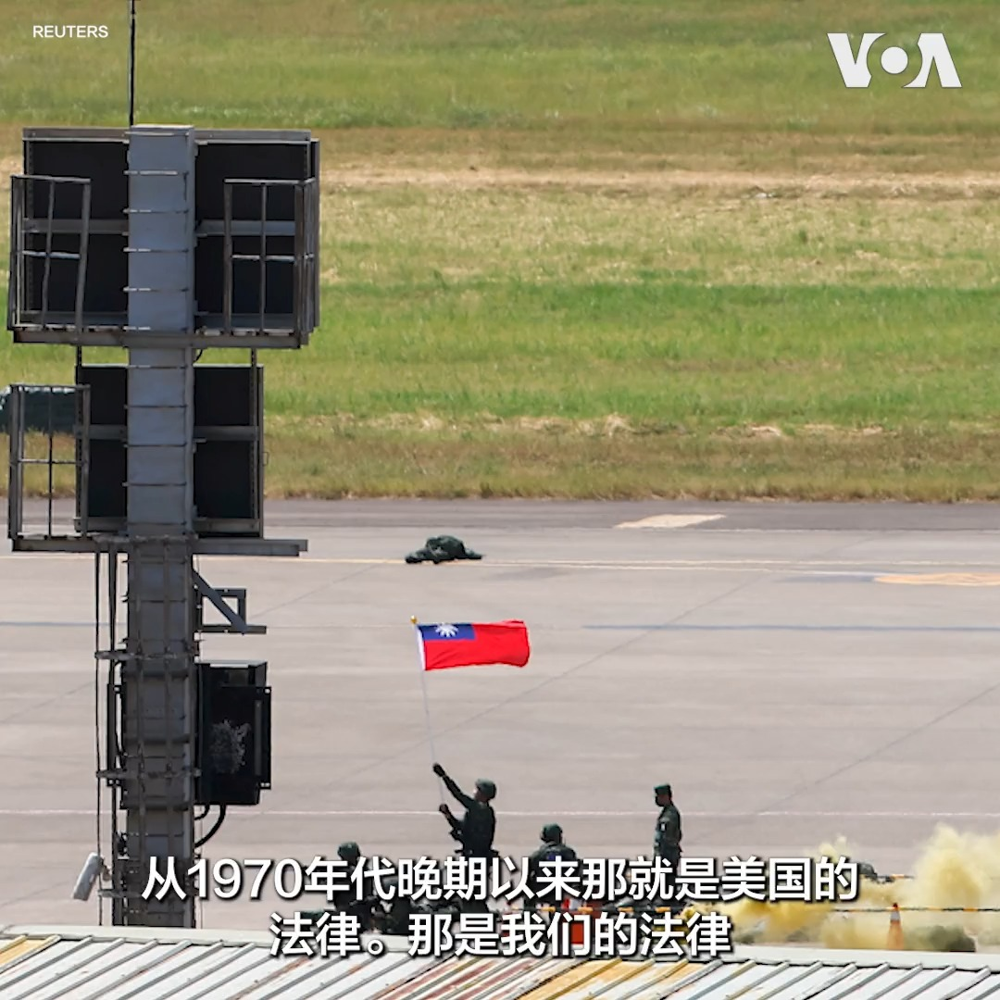
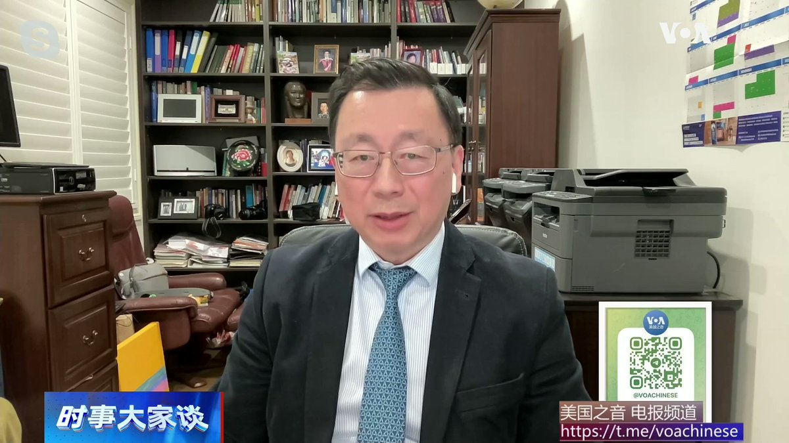
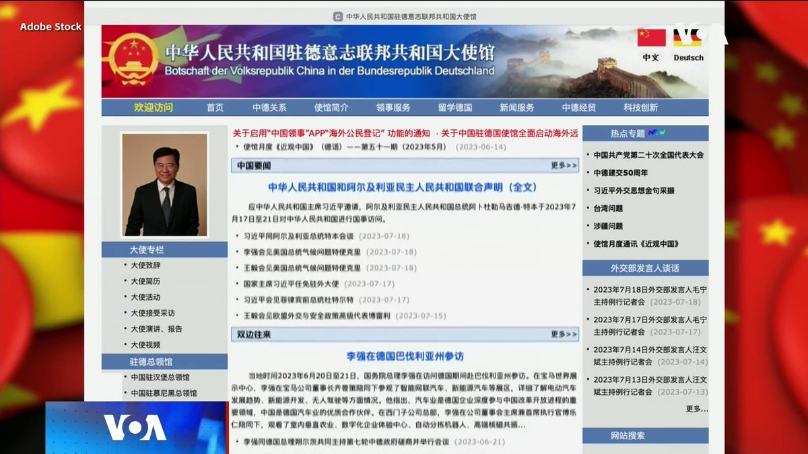
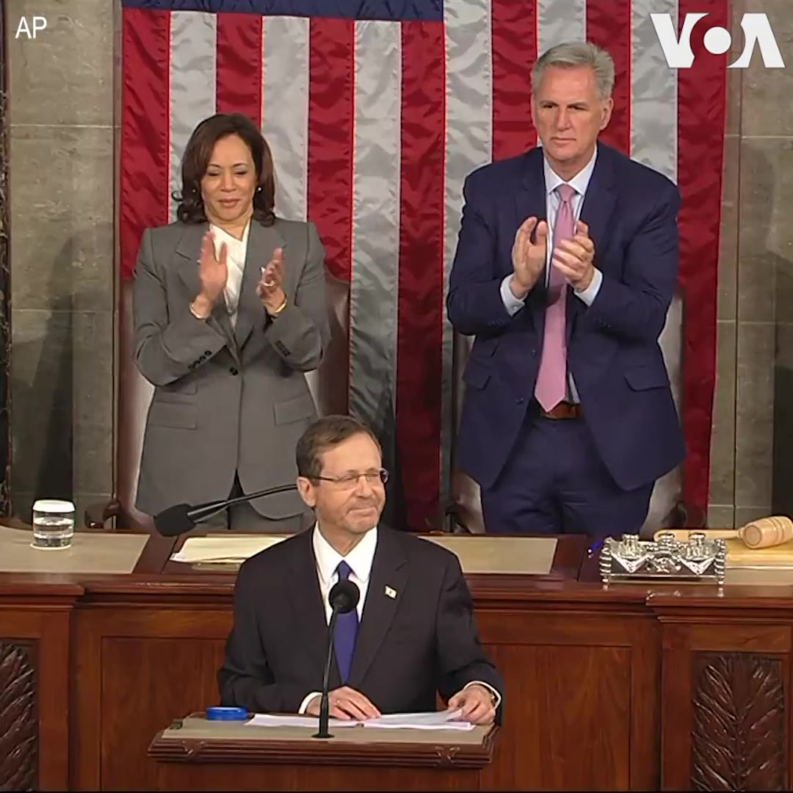
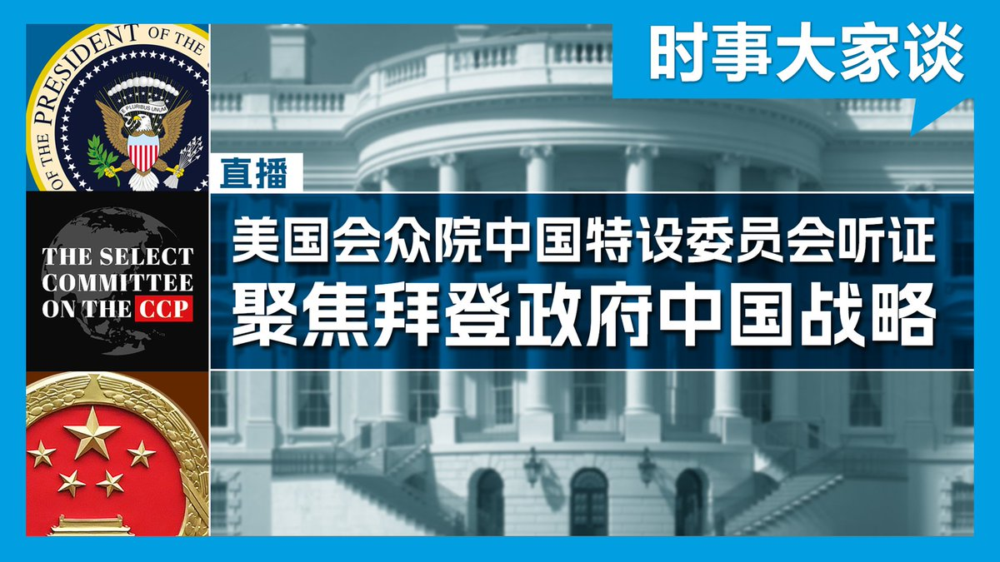
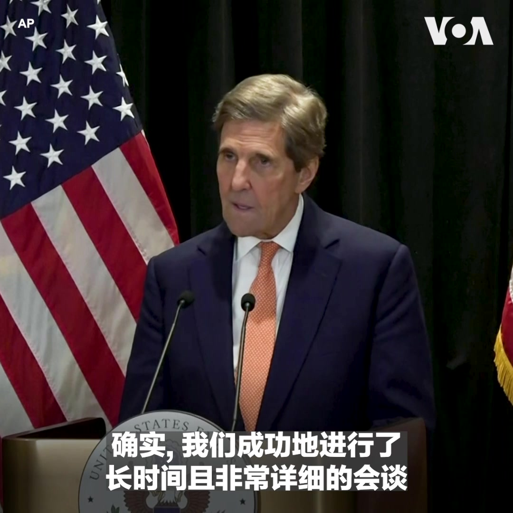
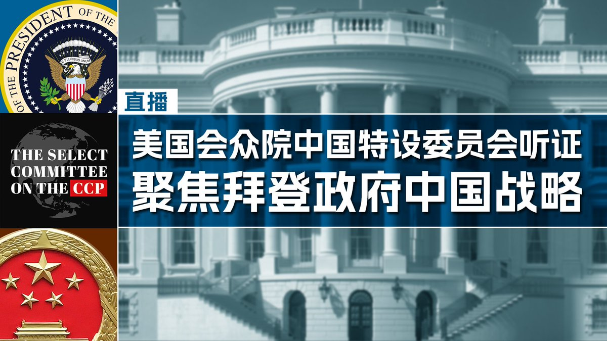

美国之音中文网 北京时间 2023-07-20T23:10:06Z 1682045220400279553 制裁俄罗斯中国占尽便宜，海量进口俄廉价原油同时加强精炼产品出口 https://t.co/3hDtDzS2jj   美国之音中文网 北京时间 2023-07-20T20:38:54Z 1682007172824047617 美国财政部长耶伦20日在河内会晤了越南总理范明正 。此次访问是两国庆祝建立正式全面伙伴关系10周年的系列交流活动之一。 https://t.co/wRQ7eoXxF4   美国之音中文网 北京时间 2023-07-20T21:12:04Z 1682015518075527173 即时报道：众院美中战略竞争特设委员会拜登政府中国战略听证会 https://t.co/Pw44vQeDW4   美国之音中文网 北京时间 2023-07-20T22:49:57Z 1682040150308839424 “不应该”，美国国防部、国务院与商务部高官7月20号在众院中国特设委员会听证会异口同声表示，不该将美国技术给像华为这样的公司。国务院亚太助卿康达说，这攸关国安，拜登政府已采取必要步骤。商务部负责出口管制的肯德勒强调，不只针对华为限制出口，更适用各中国公司，或比列入实体清单更有效。 https://t.co/1XGRQQlHW9   美国之音中文网 北京时间 2023-07-20T23:00:08Z 1682042715847135233 “大多数的美国人把中国看作是竞争者，但是他们担心这个竞争会演变成战争” ，众议院美国与中国共产党战略竞争特设委员会首席民主党人拉贾·克里希纳莫提20日在听证上说选民常常提到的一个问题是美国如何避免与中国的公开冲突。这次听证会是有关拜登政府对中国的战略。 
更多:https://t.co/TMbjgRo85n https://t.co/1uvflmz6kL   美国之音中文网 北京时间 2023-07-20T23:16:47Z 1682046902651572224 数百名以色列人7月20日沿着从特拉维夫通往耶路撒冷的一条主要公路上行进。他们举着以色列国旗，高呼“民主”等口号。这些抗议者计划徒步前往以色列议会大厦，并在那里举行集会，抗议内塔尼亚胡领导的联合政府准备将旨在减少最高法院对政府控制的法案提交议会审议。 https://t.co/5FO5FIbWOj   美国之音中文网 北京时间 2023-07-20T16:49:05Z 1681949338120126465 台湾副总统赖清德过境美国再生波 中国驻美大使称阻止“窜美”为当务之急 https://t.co/5kNnCQUCaS   美国之音中文网 北京时间 2023-07-20T19:46:20Z 1681993940545699841 7/20 【#时事大家谈】特别节目：美国会众院中国特设委员会听证 讨论拜登政府中国战略

嘉宾：纽约城市大学政治学教授夏明；美国艾德菲大学文理学院院长、政治学教授王维正；西密歇根大学政治系教授王元纲
主持人：樊冬宁  

YouTube： https://t.co/vWPK7z9p20 https://t.co/AuZKmhvDoG   美国之音中文网 北京时间 2023-07-20T17:03:05Z 1681952861419352066 中国拒绝派专家审视福岛核处理水排海计划 并对日本海产品祭出更严格限制 https://t.co/kryUHwCEqZ   美国之音中文网 北京时间 2023-07-20T17:33:08Z 1681960420867981312 中国问题专家：中国与中东欧“16+1”合作机制奄奄一息 https://t.co/F4alH8MfvG   美国之音中文网 北京时间 2023-07-20T17:47:05Z 1681963934184787968 外国游客纷纷涌入日本 中国赴日人数持续低迷 https://t.co/ichwDSe8vH   美国之音中文网 北京时间 2023-07-20T18:14:06Z 1681970732082028544 菲律宾防长称持续监测台湾可能遭入侵的情势 https://t.co/xZgLeFvqEu   美国之音中文网 北京时间 2023-07-20T15:50:32Z 1681934602229911552 习近平拉拢菲前总统杜特尔特 现任总统小马科斯盼两人谈及南中国海问题 https://t.co/ob8wVcNFWC   美国之音中文网 北京时间 2023-07-20T13:17:06Z 1681895989857361922 美日韩领导人8月再会晤 预计重点讨论朝鲜威胁和中国挑战 https://t.co/YEjjMiauEJ   美国之音中文网 北京时间 2023-07-20T13:50:36Z 1681904419703771138 美投资中国高科技引担忧 众院中国特设委员会启动调查 https://t.co/1w3YVnGxR8   美国之音中文网 北京时间 2023-07-20T10:09:40Z 1681848817724035072 美日台携手相助，“印度制造”能否挑战中国“芯片梦” https://t.co/UFTgRveKWv   美国之音中文网 北京时间 2023-07-20T10:47:55Z 1681858446805671936 美国参议院军事委员会成员、阿拉斯加州共和党籍联邦参议员丹·沙利文(Dan Sullivan)18日在华盛顿胡佛研究所发表“台湾为何重要”讲话后，就参议院正在辩论的2024财年《国防授权法》涉台条文接受美国之音采访。他表示，“要确保台湾有能力保卫自己。” 相关报道：https://t.co/DCRRLbuNeS https://t.co/3gznbVwmD0   美国之音中文网 北京时间 2023-07-20T06:40:06Z 1681796078482649088 阿富汗妇女抗议美容店禁令，遭塔利班暴力驱散 https://t.co/xVJIvYAqCu   美国之音中文网 北京时间 2023-07-20T07:14:39Z 1681804774256128003 美中重启气候对话，在减排问题上争论激烈。事实上，中国一面抱怨减排是美国给中国套上的枷锁，一面从别国的减排努力中看到商机。澳大利亚蒙纳士大学教授史鹤凌认为，中国曾想把绿色产业作为弯道超车的抓手，但其在新能源供应链上的优势来自获取别国技术，如今这一招不灵了。https://t.co/HUX66rsXlz https://t.co/tvmpIK0V31   美国之音中文网 北京时间 2023-07-20T08:30:00Z 1681823737086107648 德国公布其历史上首份“中国战略”，强调去风险和降低对华依赖。有德国媒体认为，北京虽表示反对，但言辞较为克制。中国民主党全国委员会主席王军涛认为，北京只是表面克制，因为它现在只想集中精力对付美国。https://t.co/HUX66rsXlz https://t.co/V67oGvghmO   美国之音中文网 北京时间 2023-07-20T09:54:07Z 1681844905377931264 视频似乎显示瓦格纳首领及其部队已在白俄罗斯 https://t.co/6H0myDXmPU   美国之音中文网 北京时间 2023-07-20T10:09:36Z 1681848801051680769 美国众议员推出跨党派《台湾税收协定法》 https://t.co/z2thlInLS8   美国之音中文网 北京时间 2023-07-20T04:39:04Z 1681765621787160578 “美国对以色列来说是不可替代的，以色列对美国来说也是不可替代的，” 以色列总统赫尔佐格7月19日对美国国会发表演说时说。他强调美国和以色列拥有相同的价值观，并面对包括乌克兰战争、气候变化、破坏民主稳定的企图等共同挑战。 https://t.co/8djhS6WSnY   美国之音中文网 北京时间 2023-07-20T05:07:10Z 1681772694021472256 以色列总统：与美国的关系“绝对牢不可破” https://t.co/mZ8hnHmhOQ   美国之音中文网 北京时间 2023-07-20T07:00:01Z 1681801094643716097 美众院中国特设委员会将于美东时间7月20日周四上午8时举行听证，审视拜登政府的中国战略。由国务院亚太助卿康达、国防部印太事务助理部长拉特纳及商务部负责出口管制的助理部长肯德勒三位官员作证。【时事大家谈】全程直播（中文同声传译）并请专家即时分析，敬请准时收看并事先留言参与讨论。 https://t.co/j952RJFfnK   美国之音中文网 北京时间 2023-07-20T07:06:37Z 1681802753184788480 为什么有些人得了新冠而无症状？基因提供了线索 https://t.co/OghXmGZ0ig   美国之音中文网 北京时间 2023-07-20T07:49:04Z 1681813437477974016 美国特使克里：中美气候关系有“更多工作”要做 https://t.co/eQ6263pgGj   美国之音中文网 北京时间 2023-07-20T08:00:00Z 1681816187695448065 世界媒体看中国--金哲报道：为何经济萎靡不振、通货紧缩？民众没信心！https://t.co/hgmIMH3MCX https://t.co/lRM2NmjTIR   美国之音中文网 北京时间 2023-07-20T08:59:11Z 1681831081018814465 一键解锁#美国热搜 榜1、听厌了油管说书，看外媒如何吃秦刚 傅晓田的瓜2、中共倡导失业青年做“全职儿女”3、习近平最怕的一组数字漏出冰山一角4、在中国准点下班成了罪过5、社区工作者半年没有工资6、毛泽东自己封自己的官7、安全套还是鸭眼球膜？8、华春莹经典语录9、经济下行，银行直播卖贷款 https://t.co/X88g9kNehn   美国之音中文网 北京时间 2023-07-20T09:10:35Z 1681833950082367488 中国直播主将TikTok销售目光投向美国和欧洲买家 https://t.co/YTcqwxDU70   美国之音中文网 北京时间 2023-07-20T09:32:04Z 1681839358918397953 美国暂停资助中国武汉病毒所实验室 https://t.co/7LD3i8jy1y   美国之音中文网 北京时间 2023-07-20T09:32:08Z 1681839374919684097 研究：美中台受“硅三角”制约，须应对断链风险,维护台湾民主并阻遏军事冲突 https://t.co/L1hHRSxjKP   美国之音中文网 北京时间 2023-07-20T04:57:06Z 1681770160137572352 新疆高级党务官员加强外事活动 人权组织呼吁国际社会保持谨慎 https://t.co/k9WES8B3y5   美国之音中文网 北京时间 2023-07-20T05:22:10Z 1681776466831507457 中俄联合海军演习集结完毕，显示中国继续对俄罗斯提供支持 https://t.co/mrBT1ZoU2g   美国之音中文网 北京时间 2023-07-20T05:43:36Z 1681781862631632896 俄取消对驶往乌黑海港口船只的安全保证，美宣布13亿美元对乌新军援 https://t.co/fOFwTq6VG5   美国之音中文网 北京时间 2023-07-20T06:04:56Z 1681787230291996673 中国驻美大使谢锋7月19日参加阿斯彭安全论坛，主持人借着他的到场以及前美国国务卿基辛格在北京会晤中国领导人之际，又问道中国外长秦刚在哪儿的问题。谢锋含笑回答。报道：https://t.co/nNNqOttRxr https://t.co/5V6cdUW79n   美国之音中文网 北京时间 2023-07-20T06:08:04Z 1681788019467247616 朝鲜对拘留冲过边境的美国士兵保持沉默 https://t.co/sgj9Qdzmph   美国之音中文网 北京时间 2023-07-20T02:28:05Z 1681732660144795648 世界媒体看中国: 秦刚失踪报道 https://t.co/YysuECuseG   美国之音中文网 北京时间 2023-07-20T03:47:34Z 1681752662050750464 英军情六处首长: 最关注中国 担心北京“数据陷阱”及人工智能应用 https://t.co/CMR7zC6N6n   美国之音中文网 北京时间 2023-07-20T01:10:18Z 1681713083540963348 韩国总统尹锡悦7月19日视察了停靠在釜山港的美军“肯塔基号”战略核潜艇。尹锡悦说，此次“肯塔基号”潜艇停靠韩国，体现出韩美两国共同应对朝鲜核威胁的决心。尹锡悦在视察期间还与潜艇美军官兵进行了交流。 https://t.co/q13RoVEXrW   美国之音中文网 北京时间 2023-07-20T01:21:05Z 1681715799348908033 皮尤：多数亚裔美国人对母国看法正面，唯华裔例外 https://t.co/Gi8hMP7EAc   美国之音中文网 北京时间 2023-07-20T01:31:32Z 1681718428317667328 众议院美中战略竞争特设委员会周四举行听证会，美国之音将全程实况播出 https://t.co/rWYQaoOTxU   美国之音中文网 北京时间 2023-07-20T01:44:50Z 1681721773979516941 新任世界银行行长阿贾伊· 班加7月19日说，印度应该在未来几年抓住全球供应链重组的机遇，吸引那些考虑将生产线扩展至中国以外（“中国加1”）的投资者进入印度。班加是在新德里访问时说这番话的。班加是印度裔美国人。他在出任世行行长前曾担任泛大西洋投资集团董事会副主席。 https://t.co/vi6bxO7HiY   美国之音中文网 北京时间 2023-07-20T01:50:33Z 1681723212156276736 以色列总统将向美国国会发表讲话 https://t.co/TEFqZrcGo9   美国之音中文网 北京时间 2023-07-20T01:50:36Z 1681723226853081089 泰国最高法院暂停反对党领袖的众议员身份 https://t.co/IOlDGNQGwF   美国之音中文网 北京时间 2023-07-20T02:03:40Z 1681726514017062912 美国总统气候问题特使约翰.克里7月19日在北京表示，他此次访问和中方进行了“长时间且非常详细”的会谈。他说，美中都同意继续进行双边接触以应对气候危机。克里周日抵达北京，在为期三天的访问期间和中国国家副主席韩正、国务院总理李强、中央外事办主任王毅及气候变化事务特使谢振华等人举行了会谈。 https://t.co/PYLdx62dM9   美国之音中文网 北京时间 2023-07-20T02:05:52Z 1681727068780806149 美国会众院中国特设委员会将于美东时间7月20日早上8时召开听证会，聚焦讨论和检视拜登政府的中国战略。国务院亚太助卿康达、国防部亚洲事务助理部长伊莱·拉特纳，以及商务部负责出口管制的助理部长西娅·罗兹曼·肯德勒将列席作证。美国之音将在官网、YouTube频道和推特平台进行同传直播，敬请收看。 https://t.co/UIcJGstW8D   美国之音中文网 北京时间 2023-07-20T00:23:12Z 1681701231704829952 中国领事保护新规 加强海外长臂镇压？ https://t.co/iXehWAaVsQ   