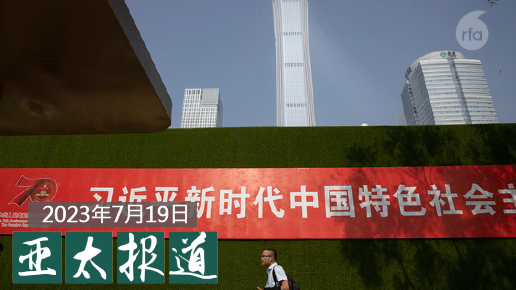
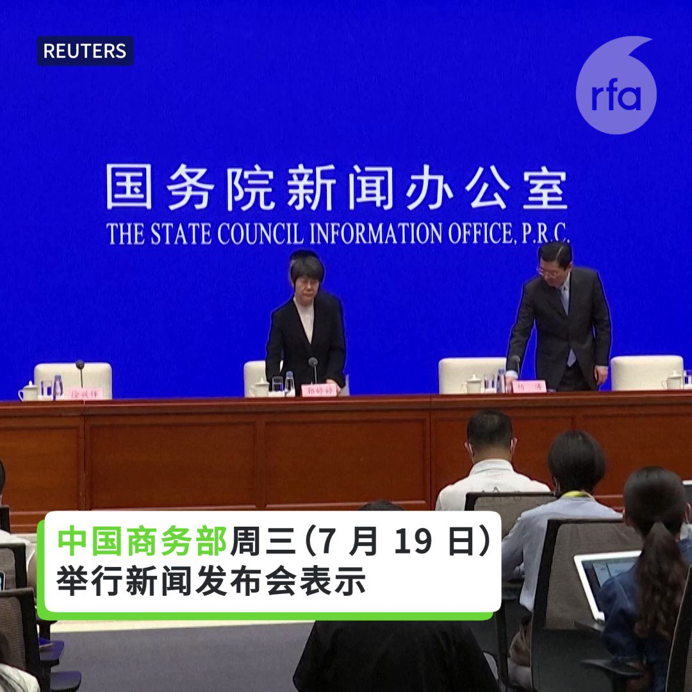
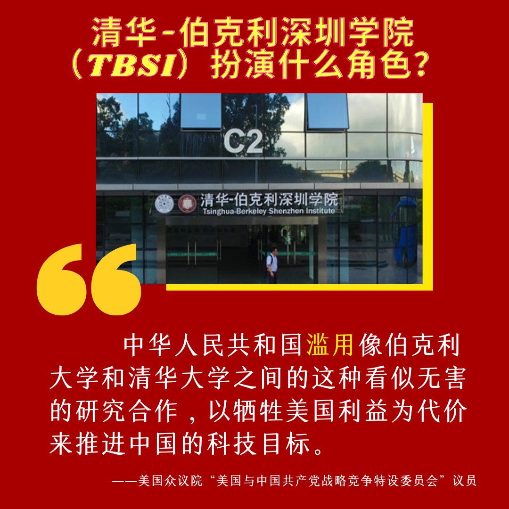
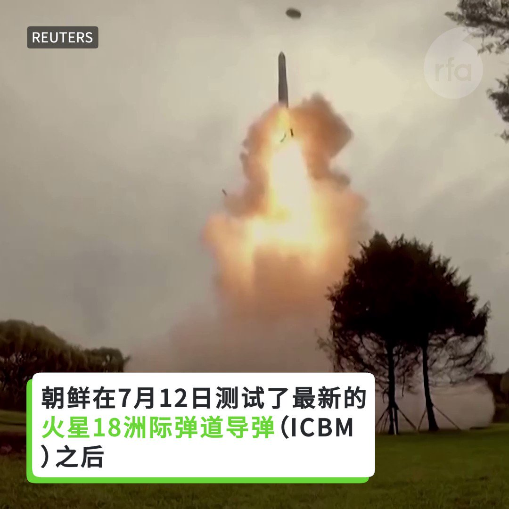

自由亚洲电台 北京时间 2023-07-20T08:07:47Z 1681818146557296640 【#亚太报道（2023-7-19）】
欢迎收听和订阅播客【亚太报道】 https://t.co/MjLNSvVMqc
中国政府连发文件加大对 #民营经济 的政策支持/美国计划扩大对华 #高端芯片出口限制/习近平提出“#中国式环保”/#美台21世纪倡议协议 将提交拜登签署/美国在台协会不会在 #台湾总统大选 中选边 https://t.co/Zyk1KrJMBD   自由亚洲电台 北京时间 2023-07-20T04:37:53Z 1681765324428046336 【中国外贸下半年形势更严峻】
中国商务部周三（7 月 19 日）举行新闻发布会表示，下半年中国外贸面临“极其严峻”的形势。 https://t.co/FRMlnByLDK   自由亚洲电台 北京时间 2023-07-20T05:15:02Z 1681774671283515392 美国智库胡佛研究所与亚洲协会美中关系中心的报告《＃硅三角：美国，台湾，中国及全球半导体安全》指出，美中台被 ＃半导体 产业束缚在一个“硅三角”里，为降低半导体供应链中断的风险，美国需要加强与可靠贸易伙伴合作，加大投资，以恢复美国本土从设计到制造的半导体能力。

 https://t.co/5oSkGLTkey   自由亚洲电台 北京时间 2023-07-20T05:27:54Z 1681777909143306241 【清华-伯克利深圳学院（TBSI）被调查】
7月17日，美国众议院“美国与中国共产党战略竞争特设委员会”致信伯克利分校及加州大学系统官员，索要清华-伯克利深圳学院（TBSI）详细信息。
TBSI是伯克利分校在2014年与中国清华大学和深圳市开展的合作项目。其研究重点与中国科技战略惊人相似，甚至逐字复制中国第十三个五年计划，引发安全担忧：美国纳税人的钱是否用于助中国实现军事和技术目标？
委员会说，TBSI研究了民间及军方的一些“两用技术”，比如用于测绘地形或自动汽车驾驶的先进半导体和成像技术。TBSI还与近年来受美国制裁的中国大学及企业的合作，如国防科技大学、电信公司华为和中国无人机制造商大疆。委员会还质疑伯克利是否正确披露了该学院获得的中方资助等研究计划署的资助和美国为军事应用技术研发所提供的其他资金，这引发了关于中国与这些专家接触有多深的担忧。   自由亚洲电台 北京时间 2023-07-20T05:30:01Z 1681778443028172800 外界普遍认为，＃克里 此行希望能摒弃美中在台海、人权等众多议题的分歧，并促成两国在气候问题上的合作。与此同时，中国国家主席 ＃习近平 在 ＃全国生态环境保护大会 上指出，中国的环境保护政策需要有"中国特色"、"决不受他人左右"。习近平此时的声明背后有什么意涵呢？ https://t.co/LRoJLydMkx   自由亚洲电台 北京时间 2023-07-20T02:39:19Z 1681735485461508098 #事实查核｜中国在美“#猎狐行动”没有违反美国的法律吗？
 https://t.co/2a869wsIyN   自由亚洲电台 北京时间 2023-07-20T02:41:17Z 1681735981437779969 中国颁布《#数据安全法》后，在中跨国企业被迫重新评估其在中国的营运方式。据彭博社报道，#摩根士丹利 正将200多名技术研发人员撤出中国大陆。一位匿名人士表示，这些员工占摩根士丹利在大陆技术人员的三分之一以上，他们主要转移到香港和新加坡。据该人士透露，大部分搬迁工作已经完成。
您预测， 在中外企以后的日子还好过吗？   自由亚洲电台 北京时间 2023-07-20T03:29:39Z 1681748152125370369 【朝鲜频繁发导弹】
7月12日 #朝鲜 测试了最新的 #火星18洲际弹道导弹（ICBM), 7月17日再次向海上发射两枚弹道导弹。
7月18日，一艘美国弹道导弹潜艇四十年来首次抵达韩国港口。
7月19日，中国外交部表示，半岛局势紧张令人担忧，敦促进行“有意义的对话”。 https://t.co/AQEvdCJvpo   自由亚洲电台 北京时间 2023-07-20T03:56:19Z 1681754864609800193 中国政府周三（7月19日）连出十一道文件，要加大对 #民营经济 的政策支持力度。在今年民营经济普遍萎靡的情况下，文件的用意似乎不难理解。但民营企业家到底如何看待这些新文件？
本台记者王允 @Jeff23Wang 报道
 https://t.co/6qZqjbayPE   自由亚洲电台 北京时间 2023-07-20T01:05:52Z 1681711967348588546 日本前首相 #安倍晋三 遗孀安倍昭惠访台，吊唁台湾已故的前总统 #李登辉，完成安倍遗愿。#安倍昭惠 表示，此行感到台日之间患难见真情的情谊，她会秉持安倍遗志促进台日关系发展。
https://t.co/rzzYPBAPGr   自由亚洲电台 北京时间 2023-07-20T01:15:51Z 1681714479254626305 美国联邦参议院以"一致同意"通过《#美台21世纪贸易倡议首批协定执行法案》，将提交美国总统签署。美国在台协会表示，这为全球树立了楷模，展示了推动双边贸易时的互动标准。台湾方面指出，这是台美断交以来双边最具代表性的贸易法案。中国外交部坚决反对。 https://t.co/XmG4dA1zZW   自由亚洲电台 北京时间 2023-07-20T02:14:51Z 1681729326025424896 【惊悚！中国青年实际失业率可能高达46.5%！】
中国六月份 #青年失业率 继续攀升达21.3%创历史新高。但北大副教授张丹丹指出，若将1600万"躺平”、“啃老”不工作的也计算进去，中国3月份青年实际失业率可能就已最高上看46.5%，远高于官方公布的19.7%。
 https://t.co/9psMJW14K0   